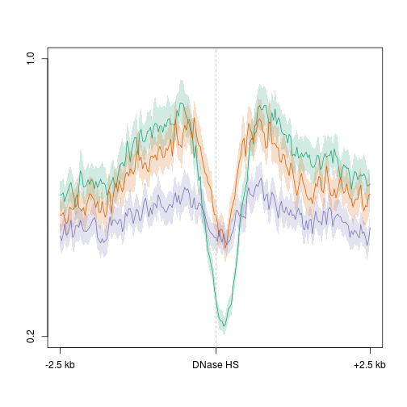
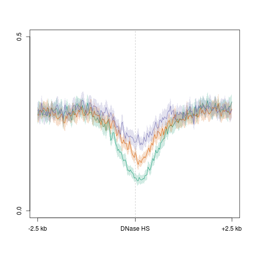
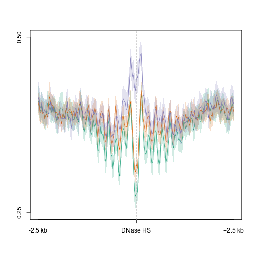

Title
========================================================

```r
suppressPackageStartupMessages(source("~/src/seqAnalysis/R/profiles2.R"))
```


```r

makeProfile2.allSamp("d3a_het_dnase_sort_q30_dnase_sub_igenome_ensembl_genes_extend5kb_nosex.bed_W25F200_both_chr", 
    data_type = "rpkm/mean", rm.outliers = 0.01)
```


```r
plot2.several("d3a_het_dnase_sort_q30_dnase_sub_igenome_ensembl_genes_extend5kb_nosex.bed_W25F200_both_chr", 
    "cells_hmc", data_type = "rpkm/mean", group2 = "trim0.01", cols = col3, 
    y.vals = c(0.2, 1), range = c(101, 300), lab = "DNase HS")
```

```
## [1] "omp_hmc_120424_rpkm_trim0.01"
## [1] "omp_hmc_120424_rpkm_trim0.01_mean"
## [1] "ngn_hmc_rpkm_trim0.01"
## [1] "ngn_hmc_rpkm_trim0.01_mean"
## [1] "icam_hmc_rpkm_trim0.01"
## [1] "icam_hmc_rpkm_trim0.01_mean"
```

 

```
## [1] 0.2 1.0
```


```r
plot2.several("d3a_het_dnase_sort_q30_dnase_sub_igenome_ensembl_genes_extend5kb_nosex.bed_W25F200_both_chr", 
    "cells_mc", data_type = "rpkm/mean", group2 = "trim0.01", cols = col3, y.vals = c(0, 
        0.5), range = c(101, 300), lab = "DNase HS")
```

```
## [1] "omp_mc_rpkm_trim0.01"
## [1] "omp_mc_rpkm_trim0.01_mean"
## [1] "ngn_mc_rpkm_trim0.01"
## [1] "ngn_mc_rpkm_trim0.01_mean"
## [1] "icam_mc_rpkm_trim0.01"
## [1] "icam_mc_rpkm_trim0.01_mean"
```

 

```
## [1] 0.0 0.5
```


```r
plot2.several("d3a_het_dnase_sort_q30_dnase_sub_igenome_ensembl_genes_extend5kb_nosex.bed_W25F200_both_chr", 
    "cells_nuc", data_type = "rpkm/mean", group2 = "trim0.01", cols = col3, 
    range = c(101, 300), y.vals = c(0.25, 0.5), lab = "DNase HS")
```

```
## [1] "omp_nuc_0123_trim0.01"
## [1] "omp_nuc_0123_trim0.01_mean"
## [1] "ngn_nuc_456_trim0.01"
## [1] "ngn_nuc_456_trim0.01_mean"
## [1] "icam_nuc_01234_trim0.01"
## [1] "icam_nuc_01234_trim0.01_mean"
```

 

```
## [1] 0.25 0.50
```

