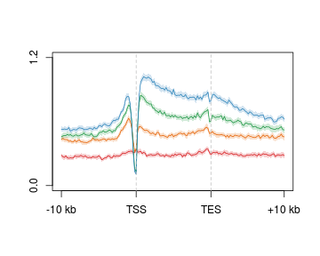
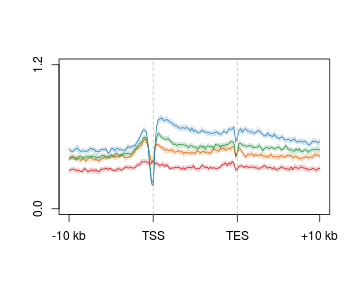
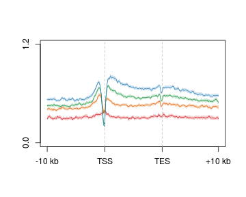

Developmental 5hmC -- genes
========================================================


```r
suppressPackageStartupMessages(source("~/src/seqAnalysis/R/profiles2.R"))
```


```
makeProfile2("gene_whole_W200N50F50_chr", "omp_hmc_rep1_q30_rmdup_extend300_mean_omp_hmc_rep2_q30_rmdup", data_type="rpkm/mean", group2="omp_noBias_quartiles", rm.outliers=0.01)
makeProfile2("gene_whole_W200N50F50_chr", "ngn_hmc_rep1_q30_rmdup_extend300_mean_ngn_hmc_rep2_q30_rmdup", data_type="rpkm/mean", group2="ngn_noBias_quartiles", rm.outliers=0.01)
makeProfile2("gene_whole_W200N50F50_chr", "icam_hmc_rep1_q30_rmdup_extend300_mean_icam_hmc_rep2_q30_rmdup", data_type="rpkm/mean", group2="icam_noBias_quartiles", rm.outliers=0.01)
```


```r
plot2("gene_whole_W200N50F50_chr", "omp_hmc_rep1_q30_rmdup_extend300_mean_omp_hmc_rep2_q30_rmdup", 
    data_type = "rpkm/mean", group2 = "omp_noBias_quartiles_trim0.01", cols = col4_mod, 
    y.vals = c(0, 1.2), wsize = 200, lab = c("TSS", "TES"))
```

```
## [1] "omp_hmc_rep1_q30_rmdup_extend300_mean_omp_hmc_rep2_q30_rmdup_omp_noBias_quartiles_trim0.01"
## [1] "omp_hmc_rep1_q30_rmdup_extend300_mean_omp_hmc_rep2_q30_rmdup_omp_noBias_quartiles_trim0.01_mean"
```

 

```
## [1] 0.0 1.2
```


```r
plot2("gene_whole_W200N50F50_chr", "ngn_hmc_rep1_q30_rmdup_extend300_mean_ngn_hmc_rep2_q30_rmdup", 
    data_type = "rpkm/mean", group2 = "ngn_noBias_quartiles_trim0.01", cols = col4_mod, 
    y.vals = c(0, 1.2), wsize = 200, lab = c("TSS", "TES"))
```

```
## [1] "ngn_hmc_rep1_q30_rmdup_extend300_mean_ngn_hmc_rep2_q30_rmdup_ngn_noBias_quartiles_trim0.01"
## [1] "ngn_hmc_rep1_q30_rmdup_extend300_mean_ngn_hmc_rep2_q30_rmdup_ngn_noBias_quartiles_trim0.01_mean"
```

 

```
## [1] 0.0 1.2
```


```r
plot2("gene_whole_W200N50F50_chr", "icam_hmc_rep1_q30_rmdup_extend300_mean_icam_hmc_rep2_q30_rmdup", 
    data_type = "rpkm/mean", group2 = "icam_noBias_quartiles_trim0.01", cols = col4_mod, 
    y.vals = c(0, 1.2), wsize = 200, lab = c("TSS", "TES"))
```

```
## [1] "icam_hmc_rep1_q30_rmdup_extend300_mean_icam_hmc_rep2_q30_rmdup_icam_noBias_quartiles_trim0.01"
## [1] "icam_hmc_rep1_q30_rmdup_extend300_mean_icam_hmc_rep2_q30_rmdup_icam_noBias_quartiles_trim0.01_mean"
```

 

```
## [1] 0.0 1.2
```

