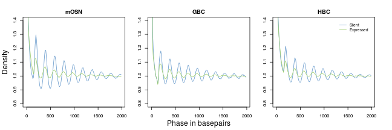
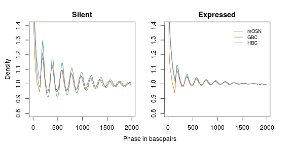
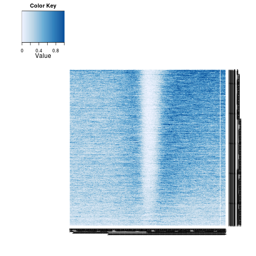
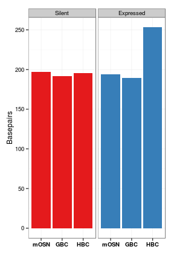
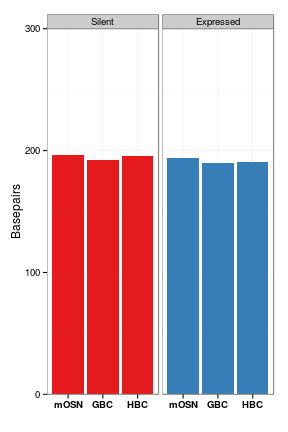

Developmental nucleosome positioning
========================================================

Classify silent (FPKM = 0) or expressed (top third of non-zero FPKM genes). Essentially groups 1 and 4 of 'range4' partitions.

Compute phasogram using Will's Phasogram. 'nuc_pileup_01234.trk' contains omp,ngn, mash1,icam nucleosome read starts. 'rna_range4' contains range4 data for omp, ngn, and icam FPKM data.

```
phase_batch.py -t nuc_pileup_01234.trk -b rna_range4 -n 2 -l 2000
```


```r
suppressPackageStartupMessages(source("~/src/seqAnalysis/R/profiles2.R"))
suppressPackageStartupMessages(source("~/src/seqAnalysis/R/phase.R"))
```


Load phasogram output

```r
filters <- c("omp_nuc_0123_omp", "ngn_nuc_456_ngn", "icam_nuc_01234_icam")
pd <- lapply(filters, function(x) loadPhaseData("~/s2/analysis/nuc/phasogram/rna_range4", 
    filter = x))
```

```
## [1] "omp_nuc_0123_omp_range4_1_N2_L2000"
## [2] "omp_nuc_0123_omp_range4_2_N2_L2000"
## [3] "omp_nuc_0123_omp_range4_3_N2_L2000"
## [4] "omp_nuc_0123_omp_range4_4_N2_L2000"
## [1] "ngn_nuc_456_ngn_range4_1_N2_L2000" "ngn_nuc_456_ngn_range4_2_N2_L2000"
## [3] "ngn_nuc_456_ngn_range4_3_N2_L2000" "ngn_nuc_456_ngn_range4_4_N2_L2000"
## [1] "icam_nuc_01234_icam_range4_1_N2_L2000"
## [2] "icam_nuc_01234_icam_range4_2_N2_L2000"
## [3] "icam_nuc_01234_icam_range4_3_N2_L2000"
## [4] "icam_nuc_01234_icam_range4_4_N2_L2000"
```

```r
names(pd) <- c("mOSN", "GBC", "HBC")
```


Normalize by total number of reads and end of phase plot

```r
pd.norm <- lapply(pd, normPhaseData)
```

```
## [1] 0.003739
## [1] 0.003958
## [1] 0.003728
## [1] 0.003149
## [1] 0.003658
## [1] 0.003843
## [1] 0.003863
## [1] 0.003274
## [1] 0.003659
## [1] 0.003639
## [1] 0.003096
## [1] 0.003744
```


Plot 1 and 4 groups 

```r
paper_colors <- c("#99CC66", "#6095C9")
par(mfrow = c(1, 3), mar = c(2, 2, 2, 2), oma = c(2, 2, 1, 1))
a <- lapply(names(pd.norm), function(x) plotPhase.pair(pd.norm[[x]][c(1, 4)], 
    phase_ind = ind16, step = 1, cols = paper_colors[2:1], main = x, ylim = c(0.8, 
        1.4), ylab = "", xlab = ""))
mtext("Density", side = 2, outer = T, line = 0.5)
mtext("Phase in basepairs", side = 1, outer = T, line = 0.5)
legend(x = 1250, y = 1.4, legend = c("Silent", "Expressed"), col = paper_colors[2:1], 
    lty = 1, cex = 0.8, bty = "n")
```

 


```r
pd.norm.cells <- ldply(pd.norm, ldply)
pd.norm.cells.silent <- lapply(c(1, 5, 9), function(x) pd.norm.cells[x, 2:2001])
pd.norm.cells.expr <- lapply(c(4, 8, 12), function(x) pd.norm.cells[x, 2:2001])
```


```r
par(mfrow = c(1, 2), mar = c(2, 2, 2, 2), oma = c(2, 2, 1, 1))
plotPhase.triple(pd.norm.cells.silent, phase_ind = ind16, step = 1, cols = col3, 
    ylim = c(0.8, 1.4), main = "Silent")
plotPhase.triple(pd.norm.cells.expr, phase_ind = ind16, step = 1, cols = col3, 
    ylim = c(0.8, 1.4), main = "Expressed")
mtext("Density", side = 2, outer = T, line = 0.5)
mtext("Phase in basepairs", side = 1, outer = T, line = 0.5)
legend(x = 1250, y = 1.4, legend = c("mOSN", "GBC", "HBC"), col = col3, lty = 1, 
    cex = 0.8, bty = "n")
```

 


mOSN, 
  silent : N = 2786
  expressed : N = 5452

GBC,
  silent : N = 1694
  expressed : N = 5487
  
HBC,
  silent : N = 5760
  expressed : N = 5062
  
  
### Compute phase score

```r
fft.mag <- lapply(pd.norm, function(x) lapply(x, phase.fft, ind16, 5))
```


```r
par(mfrow = c(3, 4))
a <- lapply(fft.mag, function(x) lapply(x, phase.plot.fft, 5, ylim = c(0, 1000)))
```

 


```r
fft.mag.max <- lapply(fft.mag, phase.fftMax, c(5, 100))
fft.mag.max.silent.expressed <- lapply(fft.mag.max, function(x) x[c(1, 4)])
fft.mag.max.silent.expressed <- ldply(fft.mag.max.silent.expressed)
colnames(fft.mag.max.silent.expressed) <- c("celltype", "silent", "expressed")
fft.mag.max.silent.expressed
```

```
##   celltype silent expressed
## 1     mOSN 682.96     7.729
## 2      GBC 408.93    43.302
## 3      HBC  28.85     5.997
```


### Compute inter-nuc distances

```r
peaks <- lapply(pd.norm, function(x) lapply(x, reportPhasePeaks, phase_ind = ind16))
nuc_dist <- lapply(peaks, function(x) lapply(x, slopeFromPeaks))
```


Reformat

```r
library(plyr)
nuc_dist.df <- ldply(nuc_dist, function(d) ldply(d))
nuc_dist.df$group <- factor(1:4, labels = c("Silent", "G2", "G3", "Expressed"))
nuc_dist.df$celltype <- rep(factor(1:3, labels = c("mOSN", "GBC", "HBC")), each = 4)
nuc_dist.df
```

```
##                                      .id index     group celltype
## 1     omp_nuc_0123_omp_range4_1_N2_L2000 196.8    Silent     mOSN
## 2     omp_nuc_0123_omp_range4_2_N2_L2000 195.9        G2     mOSN
## 3     omp_nuc_0123_omp_range4_3_N2_L2000 196.4        G3     mOSN
## 4     omp_nuc_0123_omp_range4_4_N2_L2000 193.7 Expressed     mOSN
## 5      ngn_nuc_456_ngn_range4_1_N2_L2000 192.0    Silent      GBC
## 6      ngn_nuc_456_ngn_range4_2_N2_L2000 192.0        G2      GBC
## 7      ngn_nuc_456_ngn_range4_3_N2_L2000 190.3        G3      GBC
## 8      ngn_nuc_456_ngn_range4_4_N2_L2000 189.7 Expressed      GBC
## 9  icam_nuc_01234_icam_range4_1_N2_L2000 195.6    Silent      HBC
## 10 icam_nuc_01234_icam_range4_2_N2_L2000 193.4        G2      HBC
## 11 icam_nuc_01234_icam_range4_3_N2_L2000 192.7        G3      HBC
## 12 icam_nuc_01234_icam_range4_4_N2_L2000 253.1 Expressed      HBC
```


Plot as bar

```r
library(ggplot2)
theme_set(theme_bw())
gg <- ggplot(nuc_dist.df[nuc_dist.df$group == "Silent" | nuc_dist.df$group == 
    "Expressed", ], aes(celltype, index, fill = group))
gg <- gg + geom_bar(stat = "identity", position = "dodge") + facet_grid(. ~ 
    group)
gg <- gg + theme(legend.position = "none", axis.text.x = element_text(face = "bold", 
    color = "black")) + labs(x = "", y = "Basepairs")
gg <- gg + scale_fill_manual(values = col2[2:1])
gg
```

 


Appears that an outlier is affected expressed HBC model fit

```r
# Break down slopeFromPeaks
nuc_dist <- lapply(peaks, function(x) lapply(x, function(y) data.frame(peaks = y, 
    index = 1:length(y))))
model <- lapply(nuc_dist, function(x) lapply(x, function(y) lm(peaks ~ index, 
    data = y)))

# Replace HBC, expressed with model lacking outlier
model[[3]][[4]] <- lm(peaks ~ index, data = nuc_dist[[3]][[4]][1:6, ])
slopes <- lapply(model, function(x) lapply(x, function(y) coef(y)[2]))


# Format
nuc_dist.df <- ldply(slopes, ldply)
nuc_dist.df$group <- factor(1:4, labels = c("Silent", "G2", "G3", "Expressed"))
nuc_dist.df$celltype <- rep(factor(1:3, labels = c("mOSN", "GBC", "HBC")), each = 4)
nuc_dist.df
```

```
##                                      .id index     group celltype
## 1     omp_nuc_0123_omp_range4_1_N2_L2000 196.8    Silent     mOSN
## 2     omp_nuc_0123_omp_range4_2_N2_L2000 195.9        G2     mOSN
## 3     omp_nuc_0123_omp_range4_3_N2_L2000 196.4        G3     mOSN
## 4     omp_nuc_0123_omp_range4_4_N2_L2000 193.7 Expressed     mOSN
## 5      ngn_nuc_456_ngn_range4_1_N2_L2000 192.0    Silent      GBC
## 6      ngn_nuc_456_ngn_range4_2_N2_L2000 192.0        G2      GBC
## 7      ngn_nuc_456_ngn_range4_3_N2_L2000 190.3        G3      GBC
## 8      ngn_nuc_456_ngn_range4_4_N2_L2000 189.7 Expressed      GBC
## 9  icam_nuc_01234_icam_range4_1_N2_L2000 195.6    Silent      HBC
## 10 icam_nuc_01234_icam_range4_2_N2_L2000 193.4        G2      HBC
## 11 icam_nuc_01234_icam_range4_3_N2_L2000 192.7        G3      HBC
## 12 icam_nuc_01234_icam_range4_4_N2_L2000 190.6 Expressed      HBC
```


```r
library(ggplot2)
theme_set(theme_bw())
gg <- ggplot(nuc_dist.df[nuc_dist.df$group == "Silent" | nuc_dist.df$group == 
    "Expressed", ], aes(celltype, index, fill = group))
gg <- gg + geom_bar(stat = "identity", position = "dodge") + facet_grid(. ~ 
    group)
gg <- gg + theme(legend.position = "none", axis.text.x = element_text(face = "bold", 
    color = "black")) + labs(x = "", y = "Basepairs")
gg <- gg + scale_fill_manual(values = col2[2:1]) + coord_cartesian(ylim = c(0, 
    300))
gg
```

 

