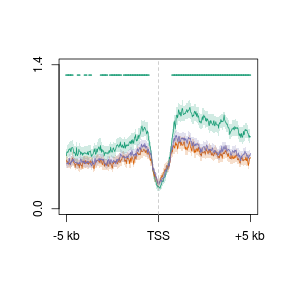
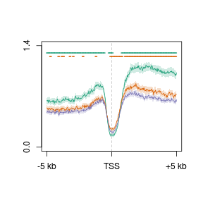
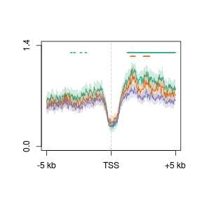
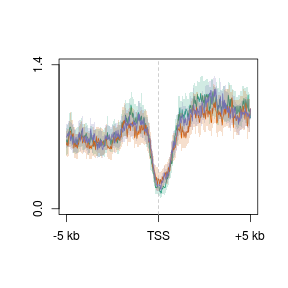
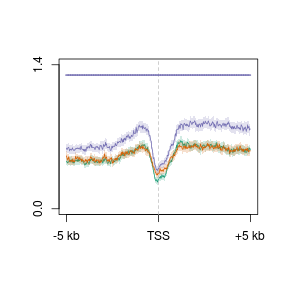

Developmental cells -- replicates, TSS
========================================================


```r
suppressPackageStartupMessages(source("~/src/seqAnalysis/R/profiles2.R"))
suppressPackageStartupMessages(source("~/src/seqAnalysis/R/image.R"))
suppressPackageStartupMessages(source("~/src/seqAnalysis/R/modeling.R"))
```


```r
positionMatrix.all("refGene_noRandom_order_outsides2_tss_W25F200_omp_ngn_icam_mrna_ucsc_fpkm_1log2_mclust_omp_vs_ngn_icam_chr", 
    data_type = "rpkm/mean")
positionMatrix.all("refGene_noRandom_order_outsides2_tss_W25F200_omp_ngn_icam_mrna_ucsc_fpkm_1log2_mclust_omp_ngn_vs_icam_chr", 
    data_type = "rpkm/mean")
positionMatrix.all("refGene_noRandom_order_outsides2_tss_W25F200_omp_ngn_icam_mrna_ucsc_fpkm_1log2_mclust_ngn_vs_omp_icam_chr", 
    data_type = "rpkm/mean")
positionMatrix.all("refGene_noRandom_order_outsides2_tss_W25F200_omp_ngn_icam_mrna_ucsc_fpkm_1log2_mclust_ngn_icam_vs_omp_chr", 
    data_type = "rpkm/mean")
positionMatrix.all("refGene_noRandom_order_outsides2_tss_W25F200_omp_ngn_icam_mrna_ucsc_fpkm_1log2_mclust_icam_vs_omp_ngn_chr", 
    data_type = "rpkm/mean")
```


```r
samples <- c("omp_hmc_rep1_q30_rmdup_extend300_mean_omp_hmc_rep2_q30_rmdup", 
    "ngn_hmc_rep1_q30_rmdup_extend300_mean_ngn_hmc_rep2_q30_rmdup", "icam_hmc_rep1_q30_rmdup_extend300_mean_icam_hmc_rep2_q30_rmdup")
o.ni <- lapply(samples, function(x) makeImage(x, "refGene_noRandom_order_outsides2_tss_W25F200_omp_ngn_icam_mrna_ucsc_fpkm_1log2_mclust_omp_vs_ngn_icam_chr", 
    data_type = "rpkm/mean", image = F))
```

```
## [1] "/media/storage2/analysis/profiles/norm/rpkm/mean/refGene_noRandom_order_outsides2_tss_W25F200_omp_ngn_icam_mrna_ucsc_fpkm_1log2_mclust_omp_vs_ngn_icam_chr/images/omp_hmc_rep1_q30_rmdup_extend300_mean_omp_hmc_rep2_q30_rmdup"
## [1] "/media/storage2/analysis/profiles/norm/rpkm/mean/refGene_noRandom_order_outsides2_tss_W25F200_omp_ngn_icam_mrna_ucsc_fpkm_1log2_mclust_omp_vs_ngn_icam_chr/images/ngn_hmc_rep1_q30_rmdup_extend300_mean_ngn_hmc_rep2_q30_rmdup"
## [1] "/media/storage2/analysis/profiles/norm/rpkm/mean/refGene_noRandom_order_outsides2_tss_W25F200_omp_ngn_icam_mrna_ucsc_fpkm_1log2_mclust_omp_vs_ngn_icam_chr/images/icam_hmc_rep1_q30_rmdup_extend300_mean_icam_hmc_rep2_q30_rmdup"
```

```r
on.i <- lapply(samples, function(x) makeImage(x, "refGene_noRandom_order_outsides2_tss_W25F200_omp_ngn_icam_mrna_ucsc_fpkm_1log2_mclust_omp_ngn_vs_icam_chr", 
    data_type = "rpkm/mean", image = F))
```

```
## [1] "/media/storage2/analysis/profiles/norm/rpkm/mean/refGene_noRandom_order_outsides2_tss_W25F200_omp_ngn_icam_mrna_ucsc_fpkm_1log2_mclust_omp_ngn_vs_icam_chr/images/omp_hmc_rep1_q30_rmdup_extend300_mean_omp_hmc_rep2_q30_rmdup"
## [1] "/media/storage2/analysis/profiles/norm/rpkm/mean/refGene_noRandom_order_outsides2_tss_W25F200_omp_ngn_icam_mrna_ucsc_fpkm_1log2_mclust_omp_ngn_vs_icam_chr/images/ngn_hmc_rep1_q30_rmdup_extend300_mean_ngn_hmc_rep2_q30_rmdup"
## [1] "/media/storage2/analysis/profiles/norm/rpkm/mean/refGene_noRandom_order_outsides2_tss_W25F200_omp_ngn_icam_mrna_ucsc_fpkm_1log2_mclust_omp_ngn_vs_icam_chr/images/icam_hmc_rep1_q30_rmdup_extend300_mean_icam_hmc_rep2_q30_rmdup"
```

```r
n.oi <- lapply(samples, function(x) makeImage(x, "refGene_noRandom_order_outsides2_tss_W25F200_omp_ngn_icam_mrna_ucsc_fpkm_1log2_mclust_ngn_vs_omp_icam_chr", 
    data_type = "rpkm/mean", image = F))
```

```
## [1] "/media/storage2/analysis/profiles/norm/rpkm/mean/refGene_noRandom_order_outsides2_tss_W25F200_omp_ngn_icam_mrna_ucsc_fpkm_1log2_mclust_ngn_vs_omp_icam_chr/images/omp_hmc_rep1_q30_rmdup_extend300_mean_omp_hmc_rep2_q30_rmdup"
## [1] "/media/storage2/analysis/profiles/norm/rpkm/mean/refGene_noRandom_order_outsides2_tss_W25F200_omp_ngn_icam_mrna_ucsc_fpkm_1log2_mclust_ngn_vs_omp_icam_chr/images/ngn_hmc_rep1_q30_rmdup_extend300_mean_ngn_hmc_rep2_q30_rmdup"
## [1] "/media/storage2/analysis/profiles/norm/rpkm/mean/refGene_noRandom_order_outsides2_tss_W25F200_omp_ngn_icam_mrna_ucsc_fpkm_1log2_mclust_ngn_vs_omp_icam_chr/images/icam_hmc_rep1_q30_rmdup_extend300_mean_icam_hmc_rep2_q30_rmdup"
```

```r
ni.o <- lapply(samples, function(x) makeImage(x, "refGene_noRandom_order_outsides2_tss_W25F200_omp_ngn_icam_mrna_ucsc_fpkm_1log2_mclust_ngn_icam_vs_omp_chr", 
    data_type = "rpkm/mean", image = F))
```

```
## [1] "/media/storage2/analysis/profiles/norm/rpkm/mean/refGene_noRandom_order_outsides2_tss_W25F200_omp_ngn_icam_mrna_ucsc_fpkm_1log2_mclust_ngn_icam_vs_omp_chr/images/omp_hmc_rep1_q30_rmdup_extend300_mean_omp_hmc_rep2_q30_rmdup"
## [1] "/media/storage2/analysis/profiles/norm/rpkm/mean/refGene_noRandom_order_outsides2_tss_W25F200_omp_ngn_icam_mrna_ucsc_fpkm_1log2_mclust_ngn_icam_vs_omp_chr/images/ngn_hmc_rep1_q30_rmdup_extend300_mean_ngn_hmc_rep2_q30_rmdup"
## [1] "/media/storage2/analysis/profiles/norm/rpkm/mean/refGene_noRandom_order_outsides2_tss_W25F200_omp_ngn_icam_mrna_ucsc_fpkm_1log2_mclust_ngn_icam_vs_omp_chr/images/icam_hmc_rep1_q30_rmdup_extend300_mean_icam_hmc_rep2_q30_rmdup"
```

```r
i.on <- lapply(samples, function(x) makeImage(x, "refGene_noRandom_order_outsides2_tss_W25F200_omp_ngn_icam_mrna_ucsc_fpkm_1log2_mclust_icam_vs_omp_ngn_chr", 
    data_type = "rpkm/mean", image = F))
```

```
## [1] "/media/storage2/analysis/profiles/norm/rpkm/mean/refGene_noRandom_order_outsides2_tss_W25F200_omp_ngn_icam_mrna_ucsc_fpkm_1log2_mclust_icam_vs_omp_ngn_chr/images/omp_hmc_rep1_q30_rmdup_extend300_mean_omp_hmc_rep2_q30_rmdup"
## [1] "/media/storage2/analysis/profiles/norm/rpkm/mean/refGene_noRandom_order_outsides2_tss_W25F200_omp_ngn_icam_mrna_ucsc_fpkm_1log2_mclust_icam_vs_omp_ngn_chr/images/ngn_hmc_rep1_q30_rmdup_extend300_mean_ngn_hmc_rep2_q30_rmdup"
## [1] "/media/storage2/analysis/profiles/norm/rpkm/mean/refGene_noRandom_order_outsides2_tss_W25F200_omp_ngn_icam_mrna_ucsc_fpkm_1log2_mclust_icam_vs_omp_ngn_chr/images/icam_hmc_rep1_q30_rmdup_extend300_mean_icam_hmc_rep2_q30_rmdup"
```

```r

comb <- list(o.ni, on.i, n.oi, ni.o, i.on)
for (i in 1:length(comb)) names(comb[[i]]) <- c("omp", "ngn", "icam")
```


Significance testing

```r
perm <- lapply(comb, permutationTest.matList)
```

```
## [1] "omp" "ngn"
## [1] "omp"  "icam"
## [1] "ngn"  "icam"
## [1] "omp" "ngn"
## [1] "omp"  "icam"
## [1] "ngn"  "icam"
## [1] "omp" "ngn"
## [1] "omp"  "icam"
## [1] "ngn"  "icam"
## [1] "omp" "ngn"
## [1] "omp"  "icam"
## [1] "ngn"  "icam"
## [1] "omp" "ngn"
## [1] "omp"  "icam"
## [1] "ngn"  "icam"
```


```r
plot2.several("refGene_noRandom_order_outsides2_tss_W25F200_omp_ngn_icam_mrna_ucsc_fpkm_1log2_mclust_omp_vs_ngn_icam_chr", 
    "cells_hmc_rep", data_type = "rpkm/mean", group2 = "trim0.01", cols = col3, 
    lab = "TSS", y.vals = c(0, 1.4))
```

```
## [1] "omp_hmc_rep1_q30_rmdup_extend300_mean_omp_hmc_rep2_q30_rmdup_trim0.01"
## [1] "omp_hmc_rep1_q30_rmdup_extend300_mean_omp_hmc_rep2_q30_rmdup_trim0.01_mean"
## [1] "ngn_hmc_rep1_q30_rmdup_extend300_mean_ngn_hmc_rep2_q30_rmdup_trim0.01"
## [1] "ngn_hmc_rep1_q30_rmdup_extend300_mean_ngn_hmc_rep2_q30_rmdup_trim0.01_mean"
## [1] "icam_hmc_rep1_q30_rmdup_extend300_mean_icam_hmc_rep2_q30_rmdup_trim0.01"
## [1] "icam_hmc_rep1_q30_rmdup_extend300_mean_icam_hmc_rep2_q30_rmdup_trim0.01_mean"
```

```
## [1] 0.0 1.4
```

```r
plotSigLine(perm[[1]][, 2], step = 5, yval = 1.3, col = col3[1])
```

 


```r
plot2.several("refGene_noRandom_order_outsides2_tss_W25F200_omp_ngn_icam_mrna_ucsc_fpkm_1log2_mclust_omp_ngn_vs_icam_chr", 
    "cells_hmc_rep", data_type = "rpkm/mean", group2 = "trim0.01", cols = col3, 
    lab = "TSS", y.vals = c(0, 1.4))
```

```
## [1] "omp_hmc_rep1_q30_rmdup_extend300_mean_omp_hmc_rep2_q30_rmdup_trim0.01"
## [1] "omp_hmc_rep1_q30_rmdup_extend300_mean_omp_hmc_rep2_q30_rmdup_trim0.01_mean"
## [1] "ngn_hmc_rep1_q30_rmdup_extend300_mean_ngn_hmc_rep2_q30_rmdup_trim0.01"
## [1] "ngn_hmc_rep1_q30_rmdup_extend300_mean_ngn_hmc_rep2_q30_rmdup_trim0.01_mean"
## [1] "icam_hmc_rep1_q30_rmdup_extend300_mean_icam_hmc_rep2_q30_rmdup_trim0.01"
## [1] "icam_hmc_rep1_q30_rmdup_extend300_mean_icam_hmc_rep2_q30_rmdup_trim0.01_mean"
```

```
## [1] 0.0 1.4
```

```r
plotSigLine(perm[[2]][, 2], step = 5, yval = 1.3, col = col3[1])
plotSigLine(perm[[2]][, 3], step = 5, yval = 1.25, col = col3[2])
```

 


```r
plot2.several("refGene_noRandom_order_outsides2_tss_W25F200_omp_ngn_icam_mrna_ucsc_fpkm_1log2_mclust_ngn_vs_omp_icam_chr", 
    "cells_hmc_rep", data_type = "rpkm/mean", group2 = "trim0.01", cols = col3, 
    lab = "TSS", y.vals = c(0, 1.4))
```

```
## [1] "omp_hmc_rep1_q30_rmdup_extend300_mean_omp_hmc_rep2_q30_rmdup_trim0.01"
## [1] "omp_hmc_rep1_q30_rmdup_extend300_mean_omp_hmc_rep2_q30_rmdup_trim0.01_mean"
## [1] "ngn_hmc_rep1_q30_rmdup_extend300_mean_ngn_hmc_rep2_q30_rmdup_trim0.01"
## [1] "ngn_hmc_rep1_q30_rmdup_extend300_mean_ngn_hmc_rep2_q30_rmdup_trim0.01_mean"
## [1] "icam_hmc_rep1_q30_rmdup_extend300_mean_icam_hmc_rep2_q30_rmdup_trim0.01"
## [1] "icam_hmc_rep1_q30_rmdup_extend300_mean_icam_hmc_rep2_q30_rmdup_trim0.01_mean"
```

```
## [1] 0.0 1.4
```

```r
plotSigLine(perm[[3]][, 2], step = 5, yval = 1.3, col = col3[1])
plotSigLine(perm[[3]][, 3], step = 5, yval = 1.25, col = col3[2])
```

 


```r
plot2.several("refGene_noRandom_order_outsides2_tss_W25F200_omp_ngn_icam_mrna_ucsc_fpkm_1log2_mclust_ngn_icam_vs_omp_chr", 
    "cells_hmc_rep", data_type = "rpkm/mean", group2 = "trim0.01", cols = col3, 
    lab = "TSS", y.vals = c(0, 1.4))
```

```
## [1] "omp_hmc_rep1_q30_rmdup_extend300_mean_omp_hmc_rep2_q30_rmdup_trim0.01"
## [1] "omp_hmc_rep1_q30_rmdup_extend300_mean_omp_hmc_rep2_q30_rmdup_trim0.01_mean"
## [1] "ngn_hmc_rep1_q30_rmdup_extend300_mean_ngn_hmc_rep2_q30_rmdup_trim0.01"
## [1] "ngn_hmc_rep1_q30_rmdup_extend300_mean_ngn_hmc_rep2_q30_rmdup_trim0.01_mean"
## [1] "icam_hmc_rep1_q30_rmdup_extend300_mean_icam_hmc_rep2_q30_rmdup_trim0.01"
## [1] "icam_hmc_rep1_q30_rmdup_extend300_mean_icam_hmc_rep2_q30_rmdup_trim0.01_mean"
```

 

```
## [1] 0.0 1.4
```


```r
plot2.several("refGene_noRandom_order_outsides2_tss_W25F200_omp_ngn_icam_mrna_ucsc_fpkm_1log2_mclust_icam_vs_omp_ngn_chr", 
    "cells_hmc_rep", data_type = "rpkm/mean", group2 = "trim0.01", cols = col3, 
    lab = "TSS", y.vals = c(0, 1.4))
```

```
## [1] "omp_hmc_rep1_q30_rmdup_extend300_mean_omp_hmc_rep2_q30_rmdup_trim0.01"
## [1] "omp_hmc_rep1_q30_rmdup_extend300_mean_omp_hmc_rep2_q30_rmdup_trim0.01_mean"
## [1] "ngn_hmc_rep1_q30_rmdup_extend300_mean_ngn_hmc_rep2_q30_rmdup_trim0.01"
## [1] "ngn_hmc_rep1_q30_rmdup_extend300_mean_ngn_hmc_rep2_q30_rmdup_trim0.01_mean"
## [1] "icam_hmc_rep1_q30_rmdup_extend300_mean_icam_hmc_rep2_q30_rmdup_trim0.01"
## [1] "icam_hmc_rep1_q30_rmdup_extend300_mean_icam_hmc_rep2_q30_rmdup_trim0.01_mean"
```

```
## [1] 0.0 1.4
```

```r
plotSigLine(perm[[5]][, 2], step = 5, yval = 1.3, col = col3[3])
```

 

