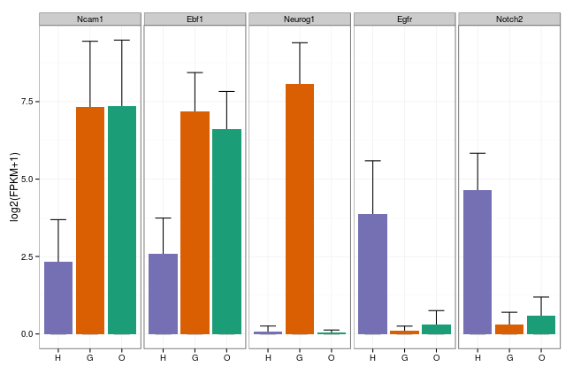

Cells FPKM bar
========================================================


```r
suppressPackageStartupMessages(source("~/src/seqAnalysis/R/profiles2.R"))
suppressPackageStartupMessages(source("~/src/seqAnalysis/R/features.R"))
```


```r
d <- read.delim("~/s2/data/rna/cuffdiff/omp_ngn_icam_mrna_ucsc/genes.fpkm_tracking")
ex <- c("Ncam1", "Ebf1", "Neurog1", "Egfr", "Notch2")
d.ex <- d[d$gene_short_name %in% ex, ]
d.ex1 <- d.ex[, c("gene_id", "omp_mrna_FPKM", "omp_mrna_conf_lo", "omp_mrna_conf_hi", 
    "ngn_mrna_FPKM", "ngn_mrna_conf_lo", "ngn_mrna_conf_hi", "icam_mrna_FPKM", 
    "icam_mrna_conf_lo", "icam_mrna_conf_hi")]
d.ex2 <- numcolwise(onelog2)(d.ex1)
d.ex2$id <- d.ex1[, 1]
d.ex3 <- rbind(as.matrix(d.ex2[, 1:3]), as.matrix(d.ex2[, 4:6]), as.matrix(d.ex2[, 
    7:9]), deparse.level = T)
d.ex3 <- as.data.frame(d.ex3)
d.ex3$id <- d.ex2$id
colnames(d.ex3)[1:3] <- c("FPKM", "lo", "hi")
d.ex3$ct <- rep(c("O", "G", "H"), each = 5)
d.ex3$ct <- factor(d.ex3$ct, levels = c("H", "G", "O"))
d.ex3$id <- factor(d.ex3$id, levels = c("Ncam1", "Ebf1", "Neurog1", "Egfr", 
    "Notch2"))
```


```r
theme_set(theme_bw())
gg <- ggplot(d.ex3, aes(ct, FPKM, fill = ct, ymax = hi, ymin = lo))
gg + geom_errorbar(stat = "identity", width = 0.5) + geom_bar(stat = "identity") + 
    facet_grid(. ~ id) + theme(legend.position = "none") + labs(y = "log2(FPKM+1)", 
    x = "") + scale_fill_manual(values = rev(col3))
```

 

