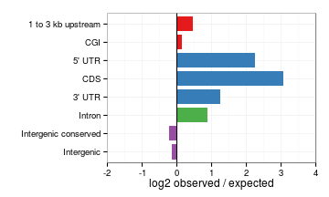
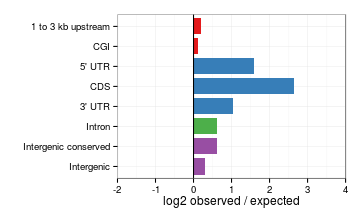

Developmental peaks
========================================================


```r
suppressPackageStartupMessages(source("~/src/seqAnalysis/R/features.R"))
library(gridExtra)
```


```r
omp.ngn <- processIntersectSummary("~/s2/data/homer/peaks/intersections/cells/omp_hmc_gc_input_ngn_hmc_gc_F3.bed/summary")
omp.icam <- processIntersectSummary("~/s2/data/homer/peaks/intersections/cells/omp_hmc_gc_input_icam_hmc_gc_F3.bed/summary")
ngn.omp <- processIntersectSummary("~/s2/data/homer/peaks/intersections/cells/ngn_hmc_gc_input_omp_hmc_gc_F3.bed/summary")
ngn.icam <- processIntersectSummary("~/s2/data/homer/peaks/intersections/cells/ngn_hmc_gc_input_icam_hmc_gc_F3.bed/summary")
icam.omp <- processIntersectSummary("~/s2/data/homer/peaks/intersections/cells/icam_hmc_gc_input_omp_hmc_gc_F3.bed/summary")
icam.ngn <- processIntersectSummary("~/s2/data/homer/peaks/intersections/cells/icam_hmc_gc_input_ngn_hmc_gc_F3.bed/summary")
comb <- list(omp.ngn, omp.icam, ngn.omp, ngn.icam, icam.omp, icam.ngn)
names(comb) <- c("omp.ngn", "omp.icam", "ngn.omp", "ngn.icam", "icam.omp", "icam.ngn")
```


```r
for (i in 1:length(comb)) {
    comb[[i]]$feature.pretty <- factor(comb[[i]]$feature.pretty, levels = levels(comb[[i]]$feature.pretty)[length(levels(comb[[i]]$feature.pretty)):1])
    comb[[i]] <- comb[[i]][-grep("mOSN enhancer", comb[[i]]$feature.pretty), 
        ]
}
```


```r
gg.list <- list()
for (i in 1:length(comb)) {
    gg <- ggplot(comb[[i]], aes(feature.pretty, log2.obs.exp, fill = class))
    gg.list[[i]] <- gg + geom_bar(width = 0.8, stat = "identity", position = "dodge") + 
        scale_fill_brewer(palette = "Set1") + theme(legend.position = "none") + 
        labs(title = names(comb)[i]) + xlab("") + coord_flip(ylim = c(-8, 8)) + 
        ylab("log2 observed / expected") + geom_hline(yintercept = 0)
}
```


```r
args <- c(gg.list, 3, 2)
names(args) <- c("omp.ngn", "omp.icam", "ngn.omp", "ngn.icam", "icam.omp", "icam.ngn", 
    "ncol", "nrow")
do.call(grid.arrange, args)
```

 


```r
theme_set(theme_bw())
gg <- ggplot(comb[["omp.icam"]], aes(feature.pretty, log2.obs.exp, fill = class))
gg + geom_bar(width = 0.8, stat = "identity", position = "dodge") + scale_fill_brewer(palette = "Set1") + 
    theme(legend.position = "none") + xlab("") + coord_flip(ylim = c(-2, 4)) + 
    ylab("log2 observed / expected") + geom_hline(yintercept = 0)
```

 


```r
gg <- ggplot(comb[["ngn.icam"]], aes(feature.pretty, log2.obs.exp, fill = class))
gg + geom_bar(width = 0.8, stat = "identity", position = "dodge") + scale_fill_brewer(palette = "Set1") + 
    theme(legend.position = "none") + xlab("") + coord_flip(ylim = c(-2, 4)) + 
    ylab("log2 observed / expected") + geom_hline(yintercept = 0)
```

 

