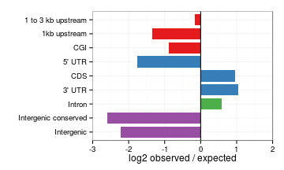

Developmental peaks
========================================================


```r
suppressPackageStartupMessages(source("~/src/seqAnalysis/R/features.R"))
library(gridExtra)
```


```r

omp.icam <- processIntersectSummary("~/s2/data/homer/peaks/intersections/cells/omp_hmc_rep1_q30_rmdup_gc_input_icam_hmc_rep1_q30_rmdup_gc_size1kb_F3_inter50_omp_hmc_rep2_q30_rmdup_r1_gc_input_icam_hmc_rep2_q30_rmdup_r1_gc_size1kb_F3.bed/summary")

ngn.icam <- processIntersectSummary("~/s2/data/homer/peaks/intersections/cells/ngn_hmc_rep1_q30_rmdup_gc_input_icam_hmc_rep1_q30_rmdup_gc_size1kb_F3_inter50_ngn_hmc_rep2_q30_rmdup_r1_gc_input_icam_hmc_rep2_q30_rmdup_r1_gc_size1kb_F3.bed/summary")
```


```r
omp.icam$feature.pretty <- factor(omp.icam$feature.pretty, levels = levels(omp.icam$feature.pretty)[length(levels(omp.icam$feature.pretty)):1])
omp.icam <- omp.icam[-grep("mOSN enhancer", omp.icam$feature.pretty), ]
omp.icam
```

```
##                                                feature reference_num
## 1  phastCons30way_intergenic_merge500_thresh500_merged          6746
## 3                                   Refgene_CDS_merged          6746
## 4                                 Refgene_5_UTR_merged          6746
## 5                                 Refgene_3_UTR_merged          6746
## 6                                Refgene_intron_merged          6746
## 7                             refgene_1to3kb_up_merged          6746
## 8                           intergenic_sub_rmsk_merged          6746
## 9                                Refgene_1kb_up_merged          6746
## 10                                          cgi_merged          6746
##    feature_num feature_span count  fraction fraction_norm internal_norm
## 1        58869     64778958    36 0.0053365    0.00008238       0.01710
## 3       189961     33521649   220 0.0326119    0.00097286       0.20189
## 4        31208      5041097     5 0.0007412    0.00014703       0.03051
## 5        21921     22959114   160 0.0237178    0.00103304       0.21438
## 6       177062    881598741  4483 0.6645420    0.00075379       0.15643
## 7        21900     44931696   136 0.0201601    0.00044868       0.09311
## 8      2437128    905159578   660 0.0978358    0.00010809       0.02243
## 9        21334     22385987    30 0.0044471    0.00019865       0.04122
## 10       16026     10496250    19 0.0028165    0.00026833       0.05568
##    expected log2.obs.exp
## 1       219      -2.6049
## 3       113       0.9612
## 4        17      -1.7655
## 5        78       1.0365
## 6      2981       0.5887
## 7       152      -0.1605
## 8      3060      -2.2130
## 9        76      -1.3410
## 10       35      -0.8814
##                                              fisher.p
## 1  1.000000000000000000000000000000000000000000000000
## 3  0.000000003581541757286261536567809673223608535331
## 4  0.997815431470279512460308524168794974684715270996
## 5  0.000000073992372371238253151175170291287130908131
## 6  0.000000000000000000000000000000000000000000007171
## 7  0.839511159440779919371777850756188854575157165527
## 8  1.000000000000000000000000000000000000000000000000
## 9  0.999998127620039811702667975623626261949539184570
## 10 0.989974998783902493393327404191950336098670959473
##                                           fisher.fdr
## 1  1.00000000000000000000000000000000000000000000000
## 3  0.00000001790770878643130685565843581309036780524
## 4  1.00000000000000000000000000000000000000000000000
## 5  0.00000024664124123746086148377030210221416695049
## 6  0.00000000000000000000000000000000000000000007171
## 7  1.00000000000000000000000000000000000000000000000
## 8  1.00000000000000000000000000000000000000000000000
## 9  1.00000000000000000000000000000000000000000000000
## 10 1.00000000000000000000000000000000000000000000000
##                                         feature.factor
## 1  phastCons30way_intergenic_merge500_thresh500_merged
## 3                                   Refgene_CDS_merged
## 4                                 Refgene_5_UTR_merged
## 5                                 Refgene_3_UTR_merged
## 6                                Refgene_intron_merged
## 7                             refgene_1to3kb_up_merged
## 8                           intergenic_sub_rmsk_merged
## 9                                Refgene_1kb_up_merged
## 10                                          cgi_merged
##          feature.pretty      class
## 1  Intergenic conserved Intergenic
## 3                   CDS      Exons
## 4                5' UTR      Exons
## 5                3' UTR      Exons
## 6                Intron Transcript
## 7    1 to 3 kb upstream   Upstream
## 8            Intergenic Intergenic
## 9          1kb upstream   Upstream
## 10                  CGI   Upstream
```


```r
ngn.icam$feature.pretty <- factor(ngn.icam$feature.pretty, levels = levels(ngn.icam$feature.pretty)[length(levels(ngn.icam$feature.pretty)):1])
ngn.icam <- ngn.icam[-grep("mOSN enhancer", ngn.icam$feature.pretty), ]
ngn.icam
```

```
##                                                feature reference_num
## 1  phastCons30way_intergenic_merge500_thresh500_merged          2145
## 3                                   Refgene_CDS_merged          2145
## 4                                 Refgene_5_UTR_merged          2145
## 5                                 Refgene_3_UTR_merged          2145
## 6                                Refgene_intron_merged          2145
## 7                             refgene_1to3kb_up_merged          2145
## 8                           intergenic_sub_rmsk_merged          2145
## 9                                Refgene_1kb_up_merged          2145
## 10                                          cgi_merged          2145
##    feature_num feature_span count fraction fraction_norm internal_norm
## 1        58869     64778958    30  0.01399     0.0002159       0.03974
## 3       189961     33521649    84  0.03916     0.0011682       0.21501
## 4        31208      5041097     0  0.00000     0.0000000       0.00000
## 5        21921     22959114    43  0.02005     0.0008731       0.16070
## 6       177062    881598741  1255  0.58508     0.0006637       0.12215
## 7        21900     44931696    33  0.01538     0.0003424       0.06302
## 8      2437128    905159578   329  0.15338     0.0001695       0.03119
## 9        21334     22385987     8  0.00373     0.0001666       0.03066
## 10       16026     10496250     8  0.00373     0.0003553       0.06540
##    expected log2.obs.exp      fisher.p   fisher.fdr
## 1        70      -1.2224 0.99998051484 1.0000000000
## 3        36       1.2224 0.00000914122 0.0000457061
## 4         5         -Inf 1.00000000000 1.0000000000
## 5        25       0.7824 0.02008988284 0.0669662761
## 6       948       0.4047 0.00000005706 0.0000005706
## 7        48      -0.5406 0.96141067306 1.0000000000
## 8       973      -1.5644 1.00000000000 1.0000000000
## 9        24      -1.5850 0.99891424538 1.0000000000
## 10       11      -0.4594 0.82009056830 1.0000000000
##                                         feature.factor
## 1  phastCons30way_intergenic_merge500_thresh500_merged
## 3                                   Refgene_CDS_merged
## 4                                 Refgene_5_UTR_merged
## 5                                 Refgene_3_UTR_merged
## 6                                Refgene_intron_merged
## 7                             refgene_1to3kb_up_merged
## 8                           intergenic_sub_rmsk_merged
## 9                                Refgene_1kb_up_merged
## 10                                          cgi_merged
##          feature.pretty      class
## 1  Intergenic conserved Intergenic
## 3                   CDS      Exons
## 4                5' UTR      Exons
## 5                3' UTR      Exons
## 6                Intron Transcript
## 7    1 to 3 kb upstream   Upstream
## 8            Intergenic Intergenic
## 9          1kb upstream   Upstream
## 10                  CGI   Upstream
```


```r
theme_set(theme_bw())
gg <- ggplot(omp.icam, aes(feature.pretty, log2.obs.exp, fill = class))
gg + geom_bar(width = 0.8, stat = "identity", position = "dodge") + scale_fill_brewer(palette = "Set1") + 
    theme(legend.position = "none") + xlab("") + coord_flip(ylim = c(-3, 2)) + 
    ylab("log2 observed / expected") + geom_hline(yintercept = 0)
```

 


```r
gg <- ggplot(ngn.icam, aes(feature.pretty, log2.obs.exp, fill = class))
gg + geom_bar(width = 0.8, stat = "identity", position = "dodge") + scale_fill_brewer(palette = "Set1") + 
    theme(legend.position = "none") + xlab("") + coord_flip(ylim = c(-2, 2)) + 
    ylab("log2 observed / expected") + geom_hline(yintercept = 0)
```

 

