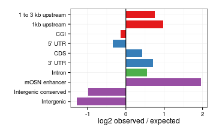
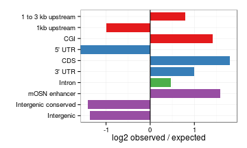
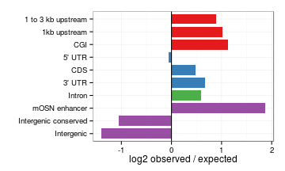
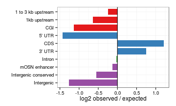

D3a 5hmC 5mC peak analysis
========================================================

Peak intersections
-------------------


```r
suppressPackageStartupMessages(source("~/src/seqAnalysis/R/features.R"))
opts_knit$set(progress = TRUE, verbose = TRUE)
```


```r

hmc.wt.ko.feat <- processIntersectSummary("~/s2/data/homer/peaks/intersections/d3a/omp_hmc_rep2_gc_input_d3xog_ko_hmc_gc_size500_F3.bed/summary")
hmc.wt.het.feat <- processIntersectSummary("~/s2/data/homer/peaks/intersections/d3a/omp_hmc_rep2_gc_input_d3xog_het_hmc_gc_size500_F3.bed/summary")
hmc.het.ko.feat <- processIntersectSummary("~/s2/data/homer/peaks/intersections/d3a/d3xog_het_hmc_gc_input_d3xog_ko_hmc_gc_size500_F3.bed/summary")
# mc.wt.ko.feat <-
# processIntersectSummary('~/s2/data/homer/peaks/intersections/d3a/moe_d3a_wt_mc_gc_input_moe_d3a_wt_in_gc_size1kb_F2_inter_moe_d3a_wt_mc_gc_input_moe_d3a_ko_mc_gc_size1kb_F2.bed/summary')
# hmc.wt.ko.feat <- omp.ott3.feat[-grep('mOSN enhancer',
# omp.ott3.feat$feature.pretty),]
hmc.wt.ko.feat
```

```
##                                                                                     feature
## 1                                       phastCons30way_intergenic_merge500_thresh500_merged
## 2  phastCons30way_intergenic_sorted_merge500_thresh500_inter_omp_h3k4me1_default.bed_merged
## 3                                                                        Refgene_CDS_merged
## 4                                                                      Refgene_5_UTR_merged
## 5                                                                      Refgene_3_UTR_merged
## 6                                                                     Refgene_intron_merged
## 7                                                                  refgene_1to3kb_up_merged
## 8                                                                intergenic_sub_rmsk_merged
## 9                                                                     Refgene_1kb_up_merged
## 10                                                                               cgi_merged
##    reference_num feature_num feature_span count fraction fraction_norm
## 1          22266       58869     64778958   365 0.016393     0.0002531
## 2          22266        4094      4414009   191 0.008578     0.0019434
## 3          22266      189961     33521649   500 0.022456     0.0006699
## 4          22266       31208      5041097    44 0.001976     0.0003920
## 5          22266       21921     22959114   417 0.018728     0.0008157
## 6          22266      177062    881598741 14353 0.644615     0.0007312
## 7          22266       21900     44931696   844 0.037905     0.0008436
## 8          22266     2437128    905159578  4154 0.186562     0.0002061
## 9          22266       21334     22385987   491 0.022052     0.0009851
## 10         22266       16026     10496250   106 0.004761     0.0004536
##    internal_norm expected log2.obs.exp   fisher.p fisher.fdr
## 1        0.03470      723      -0.9861  1.000e+00  1.000e+00
## 2        0.26645       49       1.9627  3.442e-21  1.721e-20
## 3        0.09185      374       0.4189  1.373e-05  2.288e-05
## 4        0.05375       56      -0.3479  9.031e-01  1.000e+00
## 5        0.11184      256       0.7039  3.875e-10  7.750e-10
## 6        0.10025     9838       0.5449 5.112e-122 5.112e-121
## 7        0.11567      501       0.7524  1.251e-20  4.169e-20
## 8        0.02826    10101      -1.2819  1.000e+00  1.000e+00
## 9        0.13506      250       0.9738  5.556e-19  1.389e-18
## 10       0.06219      117      -0.1424  7.887e-01  1.000e+00
##                                                                              feature.factor
## 1                                       phastCons30way_intergenic_merge500_thresh500_merged
## 2  phastCons30way_intergenic_sorted_merge500_thresh500_inter_omp_h3k4me1_default.bed_merged
## 3                                                                        Refgene_CDS_merged
## 4                                                                      Refgene_5_UTR_merged
## 5                                                                      Refgene_3_UTR_merged
## 6                                                                     Refgene_intron_merged
## 7                                                                  refgene_1to3kb_up_merged
## 8                                                                intergenic_sub_rmsk_merged
## 9                                                                     Refgene_1kb_up_merged
## 10                                                                               cgi_merged
##          feature.pretty      class
## 1  Intergenic conserved Intergenic
## 2         mOSN enhancer Intergenic
## 3                   CDS      Exons
## 4                5' UTR      Exons
## 5                3' UTR      Exons
## 6                Intron Transcript
## 7    1 to 3 kb upstream   Upstream
## 8            Intergenic Intergenic
## 9          1kb upstream   Upstream
## 10                  CGI   Upstream
```

```r

mc.wt.ko.feat
```

```
## Error: object 'mc.wt.ko.feat' not found
```


```r
hmc.wt.ko.feat$feature.pretty <- factor(hmc.wt.ko.feat$feature.pretty, levels = levels(hmc.wt.ko.feat$feature.pretty)[length(levels(hmc.wt.ko.feat$feature.pretty)):1])
hmc.wt.het.feat$feature.pretty <- factor(hmc.wt.het.feat$feature.pretty, levels = levels(hmc.wt.het.feat$feature.pretty)[length(levels(hmc.wt.het.feat$feature.pretty)):1])
hmc.het.ko.feat$feature.pretty <- factor(hmc.het.ko.feat$feature.pretty, levels = levels(hmc.het.ko.feat$feature.pretty)[length(levels(hmc.het.ko.feat$feature.pretty)):1])
# mc.wt.ko.feat$feature.pretty <- factor(mc.wt.ko.feat$feature.pretty,
# levels=levels(mc.wt.ko.feat$feature.pretty)[length(levels(mc.wt.ko.feat$feature.pretty)):1])
```


```r
theme_set(theme_bw())

gg <- ggplot(hmc.wt.ko.feat, aes(feature.pretty, log2.obs.exp, fill = class))
gg + geom_bar(width = 0.8) + scale_fill_brewer(palette = "Set1") + theme(legend.position = "none") + 
    xlab("") + coord_flip() + ylab("log2 observed / expected") + geom_hline(yintercept = 0)
```

```
## Mapping a variable to y and also using stat="bin".  With stat="bin", it
## will attempt to set the y value to the count of cases in each group.  This
## can result in unexpected behavior and will not be allowed in a future
## version of ggplot2.  If you want y to represent counts of cases, use
## stat="bin" and don't map a variable to y.  If you want y to represent
## values in the data, use stat="identity".  See ?geom_bar for examples.
## (Deprecated; last used in version 0.9.2)
```

```
## Warning: Stacking not well defined when ymin != 0
```

 


```r
theme_set(theme_bw())

gg <- ggplot(hmc.het.ko.feat, aes(feature.pretty, log2.obs.exp, fill = class))
gg + geom_bar(width = 0.8) + scale_fill_brewer(palette = "Set1") + theme(legend.position = "none") + 
    xlab("") + coord_flip() + ylab("log2 observed / expected") + geom_hline(yintercept = 0)
```

```
## Mapping a variable to y and also using stat="bin".  With stat="bin", it
## will attempt to set the y value to the count of cases in each group.  This
## can result in unexpected behavior and will not be allowed in a future
## version of ggplot2.  If you want y to represent counts of cases, use
## stat="bin" and don't map a variable to y.  If you want y to represent
## values in the data, use stat="identity".  See ?geom_bar for examples.
## (Deprecated; last used in version 0.9.2)
```

```
## Warning: Stacking not well defined when ymin != 0
```

 


```r
theme_set(theme_bw())

gg <- ggplot(hmc.wt.het.feat, aes(feature.pretty, log2.obs.exp, fill = class))
gg + geom_bar(width = 0.8) + scale_fill_brewer(palette = "Set1") + theme(legend.position = "none") + 
    xlab("") + coord_flip() + ylab("log2 observed / expected") + geom_hline(yintercept = 0)
```

```
## Mapping a variable to y and also using stat="bin".  With stat="bin", it
## will attempt to set the y value to the count of cases in each group.  This
## can result in unexpected behavior and will not be allowed in a future
## version of ggplot2.  If you want y to represent counts of cases, use
## stat="bin" and don't map a variable to y.  If you want y to represent
## values in the data, use stat="identity".  See ?geom_bar for examples.
## (Deprecated; last used in version 0.9.2)
```

```
## Warning: Stacking not well defined when ymin != 0
```

 


```r
theme_set(theme_bw())

gg <- ggplot(mc.wt.ko.feat, aes(feature.pretty, log2.obs.exp, fill = class))
```

```
## Error: object 'mc.wt.ko.feat' not found
```

```r
gg + geom_bar(width = 0.8) + scale_fill_brewer(palette = "Set1") + theme(legend.position = "none") + 
    xlab("") + coord_flip() + ylab("log2 observed / expected") + geom_hline(yintercept = 0)
```

```
## Mapping a variable to y and also using stat="bin".  With stat="bin", it
## will attempt to set the y value to the count of cases in each group.  This
## can result in unexpected behavior and will not be allowed in a future
## version of ggplot2.  If you want y to represent counts of cases, use
## stat="bin" and don't map a variable to y.  If you want y to represent
## values in the data, use stat="identity".  See ?geom_bar for examples.
## (Deprecated; last used in version 0.9.2)
```

```
## Warning: Stacking not well defined when ymin != 0
```

 

