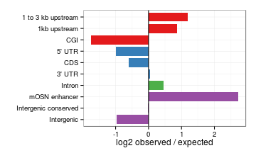

D3a 5hmC 5mC peak analysis
========================================================

Peak intersections
-------------------


```r
suppressPackageStartupMessages(source("~/src/seqAnalysis/R/features.R"))
opts_knit$set(progress = TRUE, verbose = TRUE)
```


```r

hmc.wt.ko.feat <- processIntersectSummary("~/s2/data/homer/peaks/intersections/d3a/moe_d3a_wt_hmc_gc_input_moe_d3a_wt_in_gc_size1kb_F2_inter_moe_d3a_wt_hmc_gc_input_moe_d3a_ko_hmc_gc_size1kb_F2.bed/summary")
mc.wt.ko.feat <- processIntersectSummary("~/s2/data/homer/peaks/intersections/d3a/moe_d3a_wt_mc_gc_input_moe_d3a_wt_in_gc_size1kb_F2_inter_moe_d3a_wt_mc_gc_input_moe_d3a_ko_mc_gc_size1kb_F2.bed/summary")
# hmc.wt.ko.feat <- omp.ott3.feat[-grep('mOSN enhancer',
# omp.ott3.feat$feature.pretty),]
```


```r
hmc.wt.ko.feat$feature.pretty <- factor(hmc.wt.ko.feat$feature.pretty, levels = levels(hmc.wt.ko.feat$feature.pretty)[length(levels(hmc.wt.ko.feat$feature.pretty)):1])
mc.wt.ko.feat$feature.pretty <- factor(mc.wt.ko.feat$feature.pretty, levels = levels(mc.wt.ko.feat$feature.pretty)[length(levels(mc.wt.ko.feat$feature.pretty)):1])
```


```r
theme_set(theme_bw())

gg <- ggplot(hmc.wt.ko.feat, aes(feature.pretty, log2.obs.exp, fill = class))
gg + geom_bar(width = 0.8) + scale_fill_brewer(palette = "Set1") + theme(legend.position = "none") + 
    xlab("") + coord_flip() + ylab("log2 observed / expected") + geom_hline(yintercept = 0)
```

```
## Mapping a variable to y and also using stat="bin".  With stat="bin", it
## will attempt to set the y value to the count of cases in each group.  This
## can result in unexpected behavior and will not be allowed in a future
## version of ggplot2.  If you want y to represent counts of cases, use
## stat="bin" and don't map a variable to y.  If you want y to represent
## values in the data, use stat="identity".  See ?geom_bar for examples.
## (Deprecated; last used in version 0.9.2)
```

```
## Warning: Stacking not well defined when ymin != 0
```

 


```r
theme_set(theme_bw())

gg <- ggplot(mc.wt.ko.feat, aes(feature.pretty, log2.obs.exp, fill = class))
gg + geom_bar(width = 0.8) + scale_fill_brewer(palette = "Set1") + theme(legend.position = "none") + 
    xlab("") + coord_flip() + ylab("log2 observed / expected") + geom_hline(yintercept = 0)
```

```
## Mapping a variable to y and also using stat="bin".  With stat="bin", it
## will attempt to set the y value to the count of cases in each group.  This
## can result in unexpected behavior and will not be allowed in a future
## version of ggplot2.  If you want y to represent counts of cases, use
## stat="bin" and don't map a variable to y.  If you want y to represent
## values in the data, use stat="identity".  See ?geom_bar for examples.
## (Deprecated; last used in version 0.9.2)
```

```
## Warning: Stacking not well defined when ymin != 0
```

 

