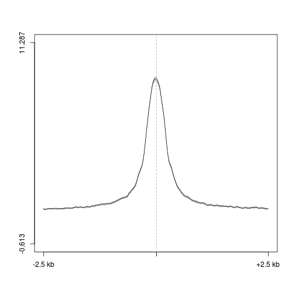

D3a DNase
========================================================

Intergenic DNase peaks in Dnmt3a het
--------------------------------------

```r
suppressPackageStartupMessages(source("~/src/seqAnalysis/R/profiles2.R"))
```


### DNase

```r
plot2("d3a_het_dnase_sort_q30_F3_size500_sub_igenome_ensembl_genes_extend5kb.bed_W25F200_both_chr", 
    "d3a_het_dnase_sort_q30_rmdup", data_type = "bam/mean", group2 = "trim0.01", 
    fname = "manual", range = c(101, 300))
```

```
## [1] "d3a_het_dnase_sort_q30_rmdup_trim0.01"
## [1] "d3a_het_dnase_sort_q30_rmdup_trim0.01_mean"
```

 

```
## [1] -0.613 11.287
```


### 5hmC

```r
plot2.several("d3a_het_dnase_sort_q30_F3_size500_sub_igenome_ensembl_genes_extend5kb.bed_W25F200_both_chr", 
    "d3a_hmc", data_type = "rpkm/mean", cols = col2, group2 = "trim0.01", fname = "manual", 
    range = c(101, 300))
```

```
## [1] "moe_d3a_wt_hmc_rpkm_trim0.01"
## [1] "moe_d3a_wt_hmc_rpkm_trim0.01_mean"
## [1] "moe_d3a_ko_hmc_rpkm_trim0.01"
## [1] "moe_d3a_ko_hmc_rpkm_trim0.01_mean"
```

 

```
## [1] 0.046 1.358
```


### 5mC

```r
plot2.several("d3a_het_dnase_sort_q30_F3_size500_sub_igenome_ensembl_genes_extend5kb.bed_W25F200_both_chr", 
    "d3a_mc", data_type = "rpkm/mean", cols = col2, group2 = "trim0.01", fname = "manual", 
    range = c(101, 300))
```

```
## [1] "moe_d3a_wt_mc_rpkm_trim0.01"
## [1] "moe_d3a_wt_mc_rpkm_trim0.01_mean"
## [1] "moe_d3a_ko_mc_rpkm_trim0.01"
## [1] "moe_d3a_ko_mc_rpkm_trim0.01_mean"
```

 

```
## [1] 0.003 0.651
```


### Nuc -- extended

```r
plot2.several("d3a_het_dnase_sort_q30_F3_size500_sub_igenome_ensembl_genes_extend5kb.bed_W25F200_both_chr", 
    "d3a_nuc_extend", data_type = "bam_extend/mean", cols = col2, group2 = "trim0.01", 
    fname = "manual")
```

```
## [1] "d3xog_wt_nuc_478_rmdup_q30_extend_trim0.01"
## [1] "d3xog_wt_nuc_478_rmdup_q30_extend_trim0.01_mean"
## [1] "d3xog_ko_nuc_256_rmdup_q30_extend_trim0.01"
## [1] "d3xog_ko_nuc_256_rmdup_q30_extend_trim0.01_mean"
```

 

```
## [1] 2.131 3.682
```


### Nuc -- dyad

```r
plot2.several("d3a_het_dnase_sort_q30_F3_size500_sub_igenome_ensembl_genes_extend5kb.bed_W25F200_both_chr", 
    "d3a_nuc_dyad", data_type = "bam_dyad/mean", cols = col2, group2 = "trim0.01", 
    fname = "manual", range = c(101, 300))
```

```
## [1] "d3xog_wt_nuc_478_rmdup_q30_dyad_trim0.01"
## [1] "d3xog_wt_nuc_478_rmdup_q30_dyad_trim0.01_mean"
## [1] "d3xog_ko_nuc_256_rmdup_q30_dyad_trim0.01"
## [1] "d3xog_ko_nuc_256_rmdup_q30_dyad_trim0.01_mean"
```

 

```
## [1] 0.669 1.313
```


### Nuc -- midpoint

```r
plot2.several("d3a_het_dnase_sort_q30_F3_size500_sub_igenome_ensembl_genes_extend5kb.bed_W25F200_both_chr", 
    "d3a_nuc2", data_type = "rpkm/mean", cols = col2, group2 = "trim0.01", fname = "manual", 
    range = c(101, 300))
```

```
## [1] "d3xog_wt_nuc_478_rmdup_trim0.01"
## [1] "d3xog_wt_nuc_478_rmdup_trim0.01_mean"
## [1] "d3xog_ko_nuc_256_rmdup_trim0.01"
## [1] "d3xog_ko_nuc_256_rmdup_trim0.01_mean"
```

 

```
## [1] 0.249 0.458
```


All DNase peaks in Dnmt3a het
--------------------------------------

```r
suppressPackageStartupMessages(source("~/src/seqAnalysis/R/profiles2.R"))
```


### DNase

```r
makeProfile2.allSamp("d3a_het_dnase_sort_q30_F3_size500.bed_W25F200_both_chr", 
    data_type = "bam/mean", rm.outliers = 0.01)
```

```
## [1] "/media/storage2/analysis/profiles/norm/bam/mean/d3a_het_dnase_sort_q30_F3_size500.bed_W25F200_both_chr"
## Note: next may be used in wrong context: no loop is visible 
## [1] "Skipping"
```

```
## Error: task 1 failed - "no loop for break/next, jumping to top level"
```

```r
makeProfile2.allSamp("d3a_het_dnase_sort_q30_F3_size500.bed_W25F200_both_chr", 
    data_type = "rpkm/mean", rm.outliers = 0.01)
```

```
## [1] "/media/storage2/analysis/profiles/norm/rpkm/mean/d3a_het_dnase_sort_q30_F3_size500.bed_W25F200_both_chr"
## Note: next may be used in wrong context: no loop is visible
```

```
## Error: task 1 failed - "no loop for break/next, jumping to top level"
```

```r
makeProfile2.allSamp("d3a_het_dnase_sort_q30_F3_size500.bed_W25F200_both_chr", 
    data_type = "bam_extend/mean", rm.outliers = 0.01)
```

```
## [1] "/media/storage2/analysis/profiles/norm/bam_extend/mean/d3a_het_dnase_sort_q30_F3_size500.bed_W25F200_both_chr"
## Note: next may be used in wrong context: no loop is visible
```

```
## Error: task 1 failed - "no loop for break/next, jumping to top level"
```

```r
makeProfile2.allSamp("d3a_het_dnase_sort_q30_F3_size500.bed_W25F200_both_chr", 
    data_type = "bam_dyad/mean", rm.outliers = 0.01)
```

```
## [1] "/media/storage2/analysis/profiles/norm/bam_dyad/mean/d3a_het_dnase_sort_q30_F3_size500.bed_W25F200_both_chr"
## Note: next may be used in wrong context: no loop is visible
```


```r
plot2("d3a_het_dnase_sort_q30_F3_size500.bed_W25F200_both_chr", "d3a_het_dnase_sort_q30_rmdup", 
    data_type = "bam/mean", group2 = "trim0.01", fname = "manual")
```

```
## [1] "d3a_het_dnase_sort_q30_rmdup_trim0.01"
## [1] "d3a_het_dnase_sort_q30_rmdup_trim0.01_mean"
```

 

```
## [1] -0.959 13.086
```


### 5hmC

```r
plot2.several("d3a_het_dnase_sort_q30_F3_size500.bed_W25F200_both_chr", "d3a_hmc", 
    data_type = "rpkm/mean", cols = col2, group2 = "trim0.01", fname = "manual")
```

```
## [1] "moe_d3a_wt_hmc_rpkm_trim0.01"
## [1] "moe_d3a_wt_hmc_rpkm_trim0.01_mean"
## [1] "moe_d3a_ko_hmc_rpkm_trim0.01"
## [1] "moe_d3a_ko_hmc_rpkm_trim0.01_mean"
```

 

```
## [1] -0.112  1.039
```


### 5mC

```r
plot2.several("d3a_het_dnase_sort_q30_F3_size500.bed_W25F200_both_chr", "d3a_mc", 
    data_type = "rpkm/mean", cols = col2, group2 = "trim0.01", fname = "manual")
```

```
## [1] "moe_d3a_wt_mc_rpkm_trim0.01"
## [1] "moe_d3a_wt_mc_rpkm_trim0.01_mean"
## [1] "moe_d3a_ko_mc_rpkm_trim0.01"
## [1] "moe_d3a_ko_mc_rpkm_trim0.01_mean"
```

 

```
## [1] -0.059  0.590
```


### Nuc -- extended

```r
plot2.several("d3a_het_dnase_sort_q30_F3_size500.bed_W25F200_both_chr", "d3a_nuc_extend", 
    data_type = "bam_extend/mean", cols = col2, group2 = "trim0.01", fname = "manual")
```

```
## [1] "d3xog_wt_nuc_478_rmdup_q30_extend_trim0.01"
## [1] "d3xog_wt_nuc_478_rmdup_q30_extend_trim0.01_mean"
## [1] "d3xog_ko_nuc_256_rmdup_q30_extend_trim0.01"
## [1] "d3xog_ko_nuc_256_rmdup_q30_extend_trim0.01_mean"
```

 

```
## [1] 1.601 3.651
```


### Nuc -- dyad

```r
plot2.several("d3a_het_dnase_sort_q30_F3_size500.bed_W25F200_both_chr", "d3a_nuc_dyad", 
    data_type = "bam_dyad/mean", cols = col2, group2 = "trim0.01", fname = "manual", 
    range = c(101, 300))
```

```
## Error: Annotation file not found
```


### Nuc -- midpoint

```r
plot2.several("d3a_het_dnase_sort_q30_F3_size500.bed_W25F200_both_chr", "d3a_nuc2", 
    data_type = "rpkm/mean", cols = col2, group2 = "trim0.01", fname = "manual", 
    baseline = T)
```

```
## [1] "d3xog_wt_nuc_478_rmdup_trim0.01"
## [1] "d3xog_wt_nuc_478_rmdup_trim0.01_mean"
## [1] "d3xog_ko_nuc_256_rmdup_trim0.01"
## [1] "d3xog_ko_nuc_256_rmdup_trim0.01_mean"
```

 

```
## [1] 0.170 0.461
```

