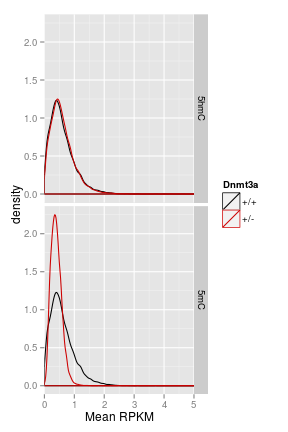

D3xOG 5hmC 5mC gene body - features
========================================================


```r
opts_chunk$set(warning = FALSE, message = FALSE, error = TRUE)
library(plyr)
```

```
## Attaching package: 'plyr'
```

```
## The following object(s) are masked from '.env':
## 
## unrowname
```

```r
library(reshape2)
library(gridExtra)
```

```
## Loading required package: grid
```

```r
suppressPackageStartupMessages(source("~/src/seqAnalysis/R/profiles2.R"))
suppressPackageStartupMessages(source("~/src/seqAnalysis/R/image.R"))
suppressPackageStartupMessages(source("~/src/seqAnalysis/R/features.R"))
source("~/src/seqAnalysis/R/ggplot2.R")
```


```r
positionMatrix.all("gene_whole_W200N50F50_chr", data_type = "rpkm/mean")
```


```r
samples <- c("moe_d3a_wt_hmc_bt2_rpkm", "moe_d3a_ko_hmc_bt2_rpkm", "moe_d3a_wt_mc_bt2_rpkm", 
    "moe_d3a_ko_mc_bt2_rpkm")
data <- lapply(samples, function(x) makeImage(x, "gene_whole_W200N50F50_chr", 
    data_type = "rpkm/mean"))
```

```
## [1] "/media/storage2/analysis/profiles/norm/rpkm/mean/gene_whole_W200N50F50_chr/images/moe_d3a_wt_hmc_bt2_rpkm"
## [1] "/media/storage2/analysis/profiles/norm/rpkm/mean/gene_whole_W200N50F50_chr/images/moe_d3a_ko_hmc_bt2_rpkm"
## [1] "/media/storage2/analysis/profiles/norm/rpkm/mean/gene_whole_W200N50F50_chr/images/moe_d3a_wt_mc_bt2_rpkm"
## [1] "/media/storage2/analysis/profiles/norm/rpkm/mean/gene_whole_W200N50F50_chr/images/moe_d3a_ko_mc_bt2_rpkm"
```


```r
data.mid <- lapply(data, function(x) apply(x[, 51:100], 1, mean))
data.mid <- as.data.frame(do.call("cbind", data.mid))
colnames(data.mid) <- c("wt_hmc", "ko_hmc", "wt_mc", "ko_mc")
data.mid <- namerows(data.mid)
```


```r
data.mid.m <- melt(data.mid)
s <- str_split(data.mid.m$variable, "_")
data.mid.m$geno <- factor(unlist(lapply(s, function(x) x[1])), levels = c("wt", 
    "ko"))
levels(data.mid.m$geno) <- c("+/+", "+/-", "-/-")
data.mid.m$mod <- factor(unlist(lapply(s, function(x) x[2])), levels = c("hmc", 
    "mc"))
levels(data.mid.m$mod) <- c("5hmC", "5mC")
```


```r
gg <- ggplot(data.mid.m, aes(value, color = geno))
gg <- gg + geom_density() + facet_grid(mod ~ .) + coord_cartesian(xlim = c(0, 
    5)) + scale_color_manual(name = "Dnmt3a", values = c("black", "red3"))
gg <- gg + labs(x = "Mean RPKM")
gg
```

 


```r
cor(data.mid)
```

```
## Error: 'x' must be numeric
```


```r
theme_set(theme_bw())
wt.ko <- gg_scatter(as.data.frame(data.mid), "wt_omp_hmc", "ko_omp_hmc", 10) + 
    coord_cartesian(x = c(0, 3), y = c(0, 3)) + labs(x = "mOSN Dnmt3a +/+", 
    y = "mOSN Dnmt3a -/-")
```

```
## Error: undefined columns selected
```

```r
ngn.ko <- gg_scatter(as.data.frame(data.mid), "wt_ngn_hmc", "ko_omp_hmc", 10) + 
    coord_cartesian(x = c(0, 3), y = c(0, 3)) + labs(x = "GBC Dnmt3a +/+", y = "mOSN Dnmt3a -/-")
```

```
## Error: undefined columns selected
```

```r
icam.ko <- gg_scatter(as.data.frame(data.mid), "wt_icam_hmc", "ko_omp_hmc", 
    10) + coord_cartesian(x = c(0, 3), y = c(0, 3)) + labs(x = "HBC Dnmt3a +/+", 
    y = "mOSN Dnmt3a -/-")
```

```
## Error: undefined columns selected
```

```r
wt.ko.mc <- gg_scatter(as.data.frame(data.mid), "wt_omp_mc", "ko_omp_mc", 10) + 
    coord_cartesian(x = c(0, 3), y = c(0, 3)) + labs(x = "mOSN Dnmt3a +/+", 
    y = "mOSN Dnmt3a -/-")
```

```
## Error: undefined columns selected
```

```r
ngn.ko.mc <- gg_scatter(as.data.frame(data.mid), "wt_ngn_mc", "ko_omp_mc", 10) + 
    coord_cartesian(x = c(0, 3), y = c(0, 3)) + labs(x = "GBC Dnmt3a +/+", y = "mOSN Dnmt3a -/-")
```

```
## Error: undefined columns selected
```

```r
icam.ko.mc <- gg_scatter(as.data.frame(data.mid), "wt_icam_mc", "ko_omp_mc", 
    10) + coord_cartesian(x = c(0, 3), y = c(0, 3)) + labs(x = "HBC Dnmt3a +/+", 
    y = "mOSN Dnmt3a -/-")
```

```
## Error: undefined columns selected
```

```r
grid.arrange(wt.ko, ngn.ko, icam.ko, wt.ko.mc, ngn.ko.mc, icam.ko.mc, ncol = 3, 
    nrow = 2)
```

```
## Error: object 'wt.ko' not found
```

