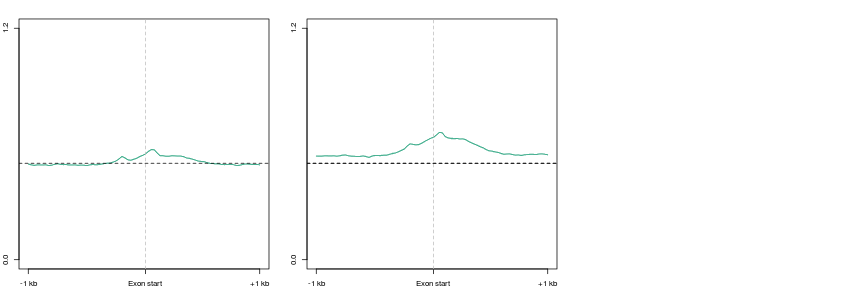

D3xOG Exons
========================================================


```r
opts_chunk$set(warning = FALSE, message = FALSE, error = FALSE)
suppressPackageStartupMessages(source("~/src/seqAnalysis/R/features.R"))
suppressPackageStartupMessages(source("~/src/seqAnalysis/R/profiles2.R"))
library(reshape2)
```

```
## Attaching package: 'reshape2'
```

```
## The following object(s) are masked from 'package:reshape':
## 
## colsplit, melt, recast
```

```r
library(ggplot2)
```


```r
makeProfile2.allSamp("Refgene_exons_split2_start_midExons_W25F40_both_chr", 
    data_type = "rpkm/mean", rm.outliers = 0.01)
```

```
## [1] "/media/storage2/analysis/profiles/norm/rpkm/mean/Refgene_exons_split2_start_midExons_W25F40_both_chr"
## Note: next may be used in wrong context: no loop is visible
```


```r
par(mfrow = c(1, 3), mar = c(2, 2, 2, 2))
plot2("Refgene_exons_split2_start_midExons_W25F40_both_chr", "icam_hmc_rpkm", 
    data_type = "rpkm/mean", group2 = "trim0.01", cols = col3[1], y.vals = c(0, 
        1.2), lab = "Exon start", wsize = 25)
```

```
## [1] "icam_hmc_rpkm_trim0.01"
## [1] "icam_hmc_rpkm_trim0.01_mean"
```

```
## [1] 0.0 1.2
```

```r
abline(h = 0.5, lty = 2)
plot2("Refgene_exons_split2_start_midExons_W25F40_both_chr", "ngn_hmc_rpkm", 
    data_type = "rpkm/mean", group2 = "trim0.01", cols = col3[1], y.vals = c(0, 
        1.2), lab = "Exon start", wsize = 25)
```

```
## [1] "ngn_hmc_rpkm_trim0.01"
## [1] "ngn_hmc_rpkm_trim0.01_mean"
```

```
## [1] 0.0 1.2
```

```r
abline(h = 0.5, lty = 2)
plot2.several("Refgene_exons_split2_start_midExons_W25F40_both_chr", "d3xog_hmc", 
    data_type = "rpkm/mean", group2 = "trim0.01", cols = col3, y.vals = c(0, 
        1.2), lab = "Exon start", wsize = 25)
abline(h = 0.5, lty = 2)
```

 


```r
par(mfrow = c(1, 1))
plot2.several("Refgene_exons_split2_start_midExons_W25F40_both_chr", "d3xog_rmrna", 
    data_type = "rpkm/mean", group2 = "trim0.01", cols = 1:6, lab = "Exon start", 
    wsize = 25, legend = F)
```

```
## [1] "omp_rmrna_rep1_protein_trim0.01"
## [1] "omp_rmrna_rep1_protein_trim0.01_mean"
## [1] "omp_rmrna_rep2_protein_trim0.01"
## [1] "omp_rmrna_rep2_protein_trim0.01_mean"
## [1] "d3xog_wt_rmrna_blank_protein_trim0.01"
## [1] "d3xog_wt_rmrna_blank_protein_trim0.01_mean"
## [1] "d3xog_het_rmrna_blank_protein_trim0.01"
## [1] "d3xog_het_rmrna_blank_protein_trim0.01_mean"
## [1] "d3xog_ko_rmrna_blank_protein_trim0.01"
## [1] "d3xog_ko_rmrna_blank_protein_trim0.01_mean"
## [1] "d3xog_ko_rmrna_rep2_blank_protein_trim0.01"
## [1] "d3xog_ko_rmrna_rep2_blank_protein_trim0.01_mean"
```

 

```
## [1] -3.106 16.246
```


### Features

```r
hmc <- makeFeatureMatrix2("Refgene_exons_split_noFirstLast.bed_chr", "d3xog_tt3_hmc", 
    data_type = "rpkm/mean")
```

```
## [1] "omp_hmc_rep1_mean_omp_hmc_rep2"   "d3xog_het_hmc_paired_q30"        
## [3] "d3xog_ko_hmc_paired_q30"          "ott3_hmc_rep1_mean_ott3_hmc_rep2"
```

```r
rna <- makeFeatureMatrix2("Refgene_exons_split_noFirstLast.bed_chr", "d3xog_rmrna_protein", 
    data_type = "rpkm/mean")
```

```
## [1] "omp_rmrna_rep1_protein"            "omp_rmrna_rep2_protein"           
## [3] "d3xog_wt_rmrna_blank_protein"      "d3xog_het_rmrna_blank_protein"    
## [5] "d3xog_ko_rmrna_blank_protein"      "d3xog_ko_rmrna_rep2_blank_protein"
```

```r
rna.1log2 <- numcolwise(onelog2)(rna)
rna.1log2$id <- rownames(rna)
```


```r
rna.1log2.nz <- rna.1log2[as.logical(apply(rna.1log2, 1, prod)), ]
rna.1log2.nz.m <- melt(rna.1log2.nz)
levels(rna.1log2.nz.m$variable) <- c("WT 1", "WT 2", "WT 3", "Het", "KO 1", 
    "KO 2")
median_wt <- median(rna.1log2.nz.m$value[grep("WT", rna.1log2.nz.m$variable)])
```


```r
theme_set(theme_bw())
gg <- ggplot(rna.1log2.nz.m, aes(value, fill = variable))
gg <- gg + geom_density() + facet_grid(variable ~ .) + scale_fill_manual(values = c(brewer.pal(3, 
    "Greens"), "lightblue", brewer.pal(2, "Reds"))) + geom_vline(xintercept = median_wt)
gg <- gg + theme(strip.text.y = element_text(angle = 0), legend.position = "none") + 
    labs(x = "log2(RPKM + 1)", y = "Density")
gg
```


```r
hmc <- namerows(hmc)
comb <- cbind(hmc, rna.1log2)
colnames(comb) <- c("hmc.wt.1", "hmc.het.1", "hmc.ko.1", "hmc.tt3.1", "id", 
    "rna.wt.1", "rna.wt.2", "rna.wt.3", "rna.het.1", "rna.ko.1", "rna.ko.2")
```


```r
comb <- comb[order(comb[, 1]), ]
comb.c100 <- chunkMatrix(comb, chunks = 100, FUN = median)
comb.c100.m <- melt(comb.c100, id.vars = "index")
gg <- ggplot(comb.c100.m, aes(index, value))
gg + geom_point() + facet_wrap(~variable)
```

 


```r
comb.rna.nz <- comb[as.logical(apply(comb[, grep("rna", colnames(comb))], 1, 
    prod)), ]
```


```r
# gg <- ggplot(comb.rna.nz, aes(rna.wt, rna.ko1)) gg +
# geom_point(alpha=I(1/10)) + geom_density2d(breaks=seq(0, .5,.025)) +
# geom_abline(slope=1, intercept=0, col=2)

```


```r
comb.rna.nz.m <- melt(comb.rna.nz)
comb.rna.nz.m$mod <- rep(c(rep("hmc", times = 4), rep("rna", times = 6)), each = nrow(comb.rna.nz))
comb.rna.nz.m$genotype <- rep(c("wt", "het", "ko", "tt3", "wt", "wt", "wt", 
    "het", "ko", "ko"), each = nrow(comb.rna.nz))
comb.rna.nz.m$rep <- rep(c("1", "1", "1", "1", "1", "2", "3", "1", "1", "2"), 
    each = nrow(comb.rna.nz))
# var_split <- str_split(comb.rna.nz.m$variable, '\\.')
```


```r
sample_1E4 <- sample(comb.rna.nz.m$id, 10000)
comb.rna.nz.m.1E4 <- comb.rna.nz.m[comb.rna.nz.m$id %in% sample_1E4, ]
hmc.rati <- ddply(comb.rna.nz.m[comb.rna.nz.m$mod == "hmc", ], .(id), function(d) d$value/d$value[d$genotype == 
    "wt"], .progress = "text")
```


### Median normalized

```r
library(DESeq)
rna.unnorm <- makeFeatureMatrix2("Refgene_exons_split_noFirstLast.bed_chr", 
    "d3xog_rmrna_protein2", data_type = "bam/sum")
```

```
## [1] "omp_rmrna_rep1_blank_protein"      "omp_rmrna_rep2_blank_protein"     
## [3] "d3xog_wt_rmrna_blank_protein"      "d3xog_het_rmrna_blank_protein"    
## [5] "d3xog_ko_rmrna_blank_protein"      "d3xog_ko_rmrna_rep2_blank_protein"
```

```r
rna.unnorm <- rna.unnorm[!duplicated(rownames(rna.unnorm)), ]
conditions <- data.frame(row.names = colnames(rna.unnorm[, -4]), condition = c("wt", 
    "wt", "wt", "ko", "ko"))
rna.cds <- newCountDataSet(rna.unnorm[, -4], factor(conditions$condition))
rna.cds <- estimateSizeFactors(rna.cds)
rna.norm <- counts(rna.cds, normalized = T)
rna.norm.1log2 <- numcolwise(onelog2)(as.data.frame(rna.norm))
```


```r
boxplot(rna.norm.1log2)
```

 


```r
rna.cds <- estimateDispersions(rna.cds)
```


