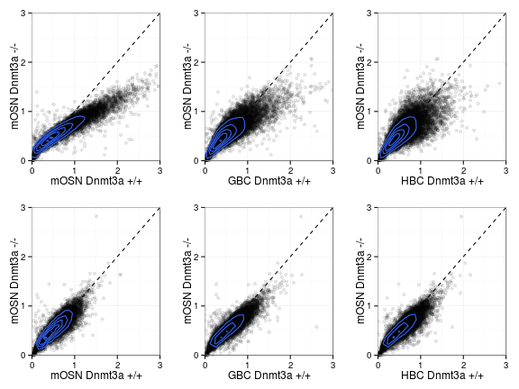
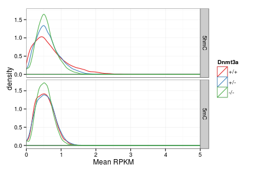
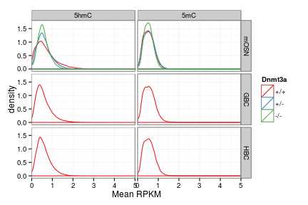
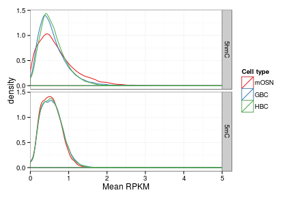

D3xOG 5hmC 5mC gene body - features
========================================================


```r
opts_chunk$set(warning = FALSE, message = FALSE, error = TRUE)
library(plyr)
```

```
## Attaching package: 'plyr'
```

```
## The following object(s) are masked from '.env':
## 
## unrowname
```

```r
library(reshape2)
library(gridExtra)
```

```
## Loading required package: grid
```

```r
suppressPackageStartupMessages(source("~/src/seqAnalysis/R/profiles2.R"))
suppressPackageStartupMessages(source("~/src/seqAnalysis/R/image.R"))
suppressPackageStartupMessages(source("~/src/seqAnalysis/R/features.R"))
source("~/src/seqAnalysis/R/ggplot2.R")
```


```r
positionMatrix.all("gene_whole_W200N50F50_chr", data_type = "rpkm/mean")
```


```r
samples <- c("omp_hmc_rep1_q30_rmdup_extend300_mean_omp_hmc_rep2_q30_rmdup", 
    "d3xog_het_hmc_sort_q30_rmdup", "d3xog_ko_hmc_sort_q30_rmdup", "omp_mc_rep1_q30_rmdup_extend300", 
    "d3xog_het_mc_sort_q30_rmdup", "d3xog_ko_mc_sort_q30_rmdup", "ngn_hmc_rep1_q30_rmdup_extend300_mean_ngn_hmc_rep2_q30_rmdup", 
    "icam_hmc_rep1_q30_rmdup_extend300_mean_icam_hmc_rep2_q30_rmdup", "ngn_mc_rep1_q30_rmdup_extend300_mean_ngn_mc_rep2_q30_rmdup", 
    "icam_mc_rep1_q30_rmdup_extend300_mean_icam_mc_rep2_q30_rmdup")
data <- lapply(samples, function(x) makeImage(x, "gene_whole_W200N50F50_chr", 
    data_type = "rpkm/mean"))
```

```
## [1] "/media/storage2/analysis/profiles/norm/rpkm/mean/gene_whole_W200N50F50_chr/images/omp_hmc_rep1_q30_rmdup_extend300_mean_omp_hmc_rep2_q30_rmdup"
## [1] "/media/storage2/analysis/profiles/norm/rpkm/mean/gene_whole_W200N50F50_chr/images/d3xog_het_hmc_sort_q30_rmdup"
## [1] "/media/storage2/analysis/profiles/norm/rpkm/mean/gene_whole_W200N50F50_chr/images/d3xog_ko_hmc_sort_q30_rmdup"
## [1] "/media/storage2/analysis/profiles/norm/rpkm/mean/gene_whole_W200N50F50_chr/images/omp_mc_rep1_q30_rmdup_extend300"
## [1] "/media/storage2/analysis/profiles/norm/rpkm/mean/gene_whole_W200N50F50_chr/images/d3xog_het_mc_sort_q30_rmdup"
## [1] "/media/storage2/analysis/profiles/norm/rpkm/mean/gene_whole_W200N50F50_chr/images/d3xog_ko_mc_sort_q30_rmdup"
## [1] "/media/storage2/analysis/profiles/norm/rpkm/mean/gene_whole_W200N50F50_chr/images/ngn_hmc_rep1_q30_rmdup_extend300_mean_ngn_hmc_rep2_q30_rmdup"
## [1] "/media/storage2/analysis/profiles/norm/rpkm/mean/gene_whole_W200N50F50_chr/images/icam_hmc_rep1_q30_rmdup_extend300_mean_icam_hmc_rep2_q30_rmdup"
## [1] "/media/storage2/analysis/profiles/norm/rpkm/mean/gene_whole_W200N50F50_chr/images/ngn_mc_rep1_q30_rmdup_extend300_mean_ngn_mc_rep2_q30_rmdup"
## [1] "/media/storage2/analysis/profiles/norm/rpkm/mean/gene_whole_W200N50F50_chr/images/icam_mc_rep1_q30_rmdup_extend300_mean_icam_mc_rep2_q30_rmdup"
```


```r
data.mid <- lapply(data, function(x) apply(x[, 51:100], 1, mean))
data.mid <- data.frame(do.call("cbind", data.mid))
colnames(data.mid) <- c("wt_omp_hmc", "het_omp_hmc", "ko_omp_hmc", "wt_omp_mc", 
    "het_omp_mc", "ko_omp_mc", "wt_ngn_hmc", "wt_icam_hmc", "wt_ngn_mc", "wt_icam_mc")
```


```r
cor(data.mid)
```

```
##             wt_omp_hmc het_omp_hmc ko_omp_hmc wt_omp_mc het_omp_mc
## wt_omp_hmc      1.0000      0.9524     0.9269    0.4531     0.4551
## het_omp_hmc     0.9524      1.0000     0.9517    0.4998     0.5324
## ko_omp_hmc      0.9269      0.9517     1.0000    0.4815     0.5193
## wt_omp_mc       0.4531      0.4998     0.4815    1.0000     0.9167
## het_omp_mc      0.4551      0.5324     0.5193    0.9167     1.0000
## ko_omp_mc       0.4051      0.4878     0.5042    0.8698     0.9251
## wt_ngn_hmc      0.8869      0.8777     0.8352    0.5515     0.5380
## wt_icam_hmc     0.8017      0.7999     0.7645    0.5698     0.5560
## wt_ngn_mc       0.5493      0.6103     0.5980    0.9082     0.9426
## wt_icam_mc      0.5733      0.6292     0.6229    0.8926     0.9230
##             ko_omp_mc wt_ngn_hmc wt_icam_hmc wt_ngn_mc wt_icam_mc
## wt_omp_hmc     0.4051     0.8869      0.8017    0.5493     0.5733
## het_omp_hmc    0.4878     0.8777      0.7999    0.6103     0.6292
## ko_omp_hmc     0.5042     0.8352      0.7645    0.5980     0.6229
## wt_omp_mc      0.8698     0.5515      0.5698    0.9082     0.8926
## het_omp_mc     0.9251     0.5380      0.5560    0.9426     0.9230
## ko_omp_mc      1.0000     0.4613      0.4756    0.9138     0.9030
## wt_ngn_hmc     0.4613     1.0000      0.8432    0.6151     0.6454
## wt_icam_hmc    0.4756     0.8432      1.0000    0.6160     0.6069
## wt_ngn_mc      0.9138     0.6151      0.6160    1.0000     0.9642
## wt_icam_mc     0.9030     0.6454      0.6069    0.9642     1.0000
```


```r
theme_set(theme_bw())
wt.ko <- gg_scatter(as.data.frame(data.mid), "wt_omp_hmc", "ko_omp_hmc", 10) + 
    coord_cartesian(x = c(0, 3), y = c(0, 3)) + labs(x = "mOSN Dnmt3a +/+", 
    y = "mOSN Dnmt3a -/-")
ngn.ko <- gg_scatter(as.data.frame(data.mid), "wt_ngn_hmc", "ko_omp_hmc", 10) + 
    coord_cartesian(x = c(0, 3), y = c(0, 3)) + labs(x = "GBC Dnmt3a +/+", y = "mOSN Dnmt3a -/-")
icam.ko <- gg_scatter(as.data.frame(data.mid), "wt_icam_hmc", "ko_omp_hmc", 
    10) + coord_cartesian(x = c(0, 3), y = c(0, 3)) + labs(x = "HBC Dnmt3a +/+", 
    y = "mOSN Dnmt3a -/-")
wt.ko.mc <- gg_scatter(as.data.frame(data.mid), "wt_omp_mc", "ko_omp_mc", 10) + 
    coord_cartesian(x = c(0, 3), y = c(0, 3)) + labs(x = "mOSN Dnmt3a +/+", 
    y = "mOSN Dnmt3a -/-")
ngn.ko.mc <- gg_scatter(as.data.frame(data.mid), "wt_ngn_mc", "ko_omp_mc", 10) + 
    coord_cartesian(x = c(0, 3), y = c(0, 3)) + labs(x = "GBC Dnmt3a +/+", y = "mOSN Dnmt3a -/-")
icam.ko.mc <- gg_scatter(as.data.frame(data.mid), "wt_icam_mc", "ko_omp_mc", 
    10) + coord_cartesian(x = c(0, 3), y = c(0, 3)) + labs(x = "HBC Dnmt3a +/+", 
    y = "mOSN Dnmt3a -/-")
grid.arrange(wt.ko, ngn.ko, icam.ko, wt.ko.mc, ngn.ko.mc, icam.ko.mc, ncol = 3, 
    nrow = 2)
```

 


```r
data.mid$id <- rownames(data.mid)
data.mid.m <- melt(data.mid)
s <- str_split(data.mid.m$variable, "_")
data.mid.m$geno <- factor(unlist(lapply(s, function(x) x[1])), levels = c("wt", 
    "het", "ko"))
levels(data.mid.m$geno) <- c("+/+", "+/-", "-/-")
data.mid.m$celltype <- factor(unlist(lapply(s, function(x) x[2])), levels = c("omp", 
    "ngn", "icam"))
levels(data.mid.m$celltype) <- c("mOSN", "GBC", "HBC")
data.mid.m$mod <- factor(unlist(lapply(s, function(x) x[3])), levels = c("hmc", 
    "mc"))
levels(data.mid.m$mod) <- c("5hmC", "5mC")
```


```r
theme_set(theme_bw())
gg <- ggplot(data.mid.m[data.mid.m$celltype == "mOSN", ], aes(value, color = geno))
gg + geom_density() + facet_grid(mod ~ .) + coord_cartesian(xlim = c(0, 5)) + 
    scale_color_brewer(name = "Dnmt3a", palette = "Set1") + labs(x = "Mean RPKM")
```

 


```r
theme_set(theme_bw())
gg <- ggplot(data.mid.m, aes(value, color = geno))
gg + geom_density() + facet_grid(celltype ~ mod) + coord_cartesian(xlim = c(0, 
    5)) + scale_color_brewer(name = "Dnmt3a", palette = "Set1") + labs(x = "Mean RPKM")
```

 


```r
theme_set(theme_bw())
gg <- ggplot(data.mid.m[data.mid.m$geno == "+/+", ], aes(value, color = celltype))
gg + geom_density() + facet_grid(mod ~ .) + coord_cartesian(xlim = c(0, 5)) + 
    scale_color_brewer(name = "Cell type", palette = "Set1") + labs(x = "Mean RPKM")
```

 


```r
data.mid.ratio <- ddply(data.mid.m[data.mid.m$celltype == "mOSN", ], .(mod, 
    id), summarize, ko.wt = log2((value[geno == "-/-"] + 0.01)/(value[geno == 
    "+/+"] + 0.01)))
```


