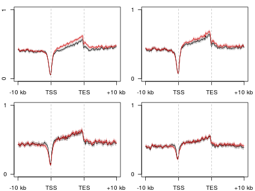
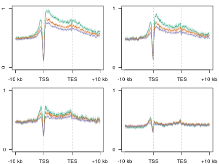
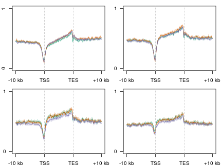

D3xOG 5hmC/5mC TSS
========================================================


```r
opts_chunk$set(warning = FALSE, message = FALSE, error = FALSE)
library(plyr)
```

```
## Attaching package: 'plyr'
```

```
## The following object(s) are masked from '.env':
## 
## unrowname
```

```r
library(reshape2)
library(ggplot2)
library(gridExtra)
```

```
## Loading required package: grid
```

```r
suppressPackageStartupMessages(source("~/src/seqAnalysis/R/profiles2.R"))
suppressPackageStartupMessages(source("~/src/seqAnalysis/R/image.R"))
suppressPackageStartupMessages(source("~/src/seqAnalysis/R/features.R"))
```


```
makeProfile2.allSamp("refGene_noRandom_order_outsides2_tss_W25F200_chr", data_type="rpkm/mean", rm.outliers=0.01)
```


```r
plot2.several("refGene_noRandom_order_outsides2_tss_W25F200_chr", "d3xog_hmc", 
    data_type = "rpkm/mean", cols = col3, group2 = "trim0.01")
```

```
## [1] "omp_hmc_rep1_q30_rmdup_extend300_mean_omp_hmc_rep2_q30_rmdup_trim0.01"
## [1] "omp_hmc_rep1_q30_rmdup_extend300_mean_omp_hmc_rep2_q30_rmdup_trim0.01_mean"
```


```r
plot2.several("refGene_noRandom_order_outsides2_tss_W25F200_chr", "d3xog_mc", 
    data_type = "rpkm/mean", cols = col3, group2 = "trim0.01")
```


### All genes
```
makeProfile2.allSamp("gene_whole_W200N50F50_chr", data_type="rpkm/mean", rm.outliers=0.01)
makeProfile2.allSamp("gene_whole_W200N50F50_chr", data_type="rpkm/mean", rm.outliers=0.01, group2="omp_rmrna_quartiles")
```


```r
plot2.several("gene_whole_W200N50F50_chr", "d3a_hmc", data_type = "rpkm/mean", 
    cols = col3[c(1, 3)], group2 = "trim0.01", y.vals = c(0, 0.8), wsize = 200, 
    lab = c("TSS", "TES"))
```

```
## [1] "moe_d3a_wt_hmc_rpkm_trim0.01"
## [1] "moe_d3a_wt_hmc_rpkm_trim0.01_mean"
## [1] "moe_d3a_ko_hmc_rpkm_trim0.01"
## [1] "moe_d3a_ko_hmc_rpkm_trim0.01_mean"
```

 

```
## [1] 0.0 0.8
```


```r
plot2.several("gene_whole_W200N50F50_chr", "d3a_mc", data_type = "rpkm/mean", 
    cols = col3[c(1, 3)], group2 = "trim0.01", y.vals = c(0, 0.8), wsize = 200, 
    lab = c("TSS", "TES"))
```

```
## [1] "moe_d3a_wt_mc_rpkm_trim0.01"
## [1] "moe_d3a_wt_mc_rpkm_trim0.01_mean"
## [1] "moe_d3a_ko_mc_rpkm_trim0.01"
## [1] "moe_d3a_ko_mc_rpkm_trim0.01_mean"
```

 

```
## [1] 0.0 0.8
```


```r
plot2.several("gene_whole_W200N50F50_chr", "d3xog_hmc", data_type = "rpkm/mean", 
    cols = col3, group2 = "trim0.01", y.vals = c(0, 0.8), wsize = 200, lab = c("TSS", 
        "TES"))
```

```
## [1] "omp_hmc_rep1_q30_rmdup_extend300_mean_omp_hmc_rep2_q30_rmdup_trim0.01"
## [1] "omp_hmc_rep1_q30_rmdup_extend300_mean_omp_hmc_rep2_q30_rmdup_trim0.01_mean"
## [1] "d3xog_het_hmc_sort_q30_rmdup_trim0.01"
## [1] "d3xog_het_hmc_sort_q30_rmdup_trim0.01_mean"
## [1] "d3xog_ko_hmc_sort_q30_rmdup_trim0.01"
## [1] "d3xog_ko_hmc_sort_q30_rmdup_trim0.01_mean"
```

 

```
## [1] 0.0 0.8
```


```r
plot2.several("gene_whole_W200N50F50_chr", "d3xog_mc", data_type = "rpkm/mean", 
    cols = col3, group2 = "trim0.01", y.vals = c(0, 0.8), wsize = 200, lab = c("TSS", 
        "TES"))
```

```
## [1] "omp_mc_rep1_q30_rmdup_extend300_trim0.01"
## [1] "omp_mc_rep1_q30_rmdup_extend300_trim0.01_mean"
## [1] "d3xog_het_mc_sort_q30_rmdup_trim0.01"
## [1] "d3xog_het_mc_sort_q30_rmdup_trim0.01_mean"
## [1] "d3xog_ko_mc_sort_q30_rmdup_trim0.01"
## [1] "d3xog_ko_mc_sort_q30_rmdup_trim0.01_mean"
```

 

```
## [1] 0.0 0.8
```


### mOSN upper quartile


```r
par(mfrow = c(2, 2), mar = c(2, 2, 1, 1))
for (i in 4:1) {
    plot2.several("gene_whole_W200N50F50_chr", "d3a_hmc", data_type = "rpkm/mean", 
        cols = c("black", "red3"), group2 = "omp_rmrna_quartiles_trim0.01", 
        y.vals = c(0, 1), wsize = 200, lab = c("TSS", "TES"), group2_col = i)
}
```

```
## [1] "moe_d3a_wt_hmc_rpkm_omp_rmrna_quartiles_trim0.01"
## [1] "moe_d3a_wt_hmc_rpkm_omp_rmrna_quartiles_trim0.01_mean"
## [1] "moe_d3a_ko_hmc_rpkm_omp_rmrna_quartiles_trim0.01"
## [1] "moe_d3a_ko_hmc_rpkm_omp_rmrna_quartiles_trim0.01_mean"
```

```
## [1] 0 1
## [1] "moe_d3a_wt_hmc_rpkm_omp_rmrna_quartiles_trim0.01"
## [1] "moe_d3a_wt_hmc_rpkm_omp_rmrna_quartiles_trim0.01_mean"
## [1] "moe_d3a_ko_hmc_rpkm_omp_rmrna_quartiles_trim0.01"
## [1] "moe_d3a_ko_hmc_rpkm_omp_rmrna_quartiles_trim0.01_mean"
```

```
## [1] 0 1
## [1] "moe_d3a_wt_hmc_rpkm_omp_rmrna_quartiles_trim0.01"
## [1] "moe_d3a_wt_hmc_rpkm_omp_rmrna_quartiles_trim0.01_mean"
## [1] "moe_d3a_ko_hmc_rpkm_omp_rmrna_quartiles_trim0.01"
## [1] "moe_d3a_ko_hmc_rpkm_omp_rmrna_quartiles_trim0.01_mean"
```

```
## [1] 0 1
## [1] "moe_d3a_wt_hmc_rpkm_omp_rmrna_quartiles_trim0.01"
## [1] "moe_d3a_wt_hmc_rpkm_omp_rmrna_quartiles_trim0.01_mean"
## [1] "moe_d3a_ko_hmc_rpkm_omp_rmrna_quartiles_trim0.01"
## [1] "moe_d3a_ko_hmc_rpkm_omp_rmrna_quartiles_trim0.01_mean"
```

 

```
## [1] 0 1
```


```r
par(mfrow = c(2, 2), mar = c(2, 2, 1, 1))
for (i in 4:1) {
    plot2.several("gene_whole_W200N50F50_chr", "d3a_mc", data_type = "rpkm/mean", 
        cols = c("black", "red3"), group2 = "omp_rmrna_quartiles_trim0.01", 
        y.vals = c(0, 1), wsize = 200, lab = c("TSS", "TES"), group2_col = i)
}
```

```
## [1] "moe_d3a_wt_mc_rpkm_omp_rmrna_quartiles_trim0.01"
## [1] "moe_d3a_wt_mc_rpkm_omp_rmrna_quartiles_trim0.01_mean"
## [1] "moe_d3a_ko_mc_rpkm_omp_rmrna_quartiles_trim0.01"
## [1] "moe_d3a_ko_mc_rpkm_omp_rmrna_quartiles_trim0.01_mean"
```

```
## [1] 0 1
## [1] "moe_d3a_wt_mc_rpkm_omp_rmrna_quartiles_trim0.01"
## [1] "moe_d3a_wt_mc_rpkm_omp_rmrna_quartiles_trim0.01_mean"
## [1] "moe_d3a_ko_mc_rpkm_omp_rmrna_quartiles_trim0.01"
## [1] "moe_d3a_ko_mc_rpkm_omp_rmrna_quartiles_trim0.01_mean"
```

```
## [1] 0 1
## [1] "moe_d3a_wt_mc_rpkm_omp_rmrna_quartiles_trim0.01"
## [1] "moe_d3a_wt_mc_rpkm_omp_rmrna_quartiles_trim0.01_mean"
## [1] "moe_d3a_ko_mc_rpkm_omp_rmrna_quartiles_trim0.01"
## [1] "moe_d3a_ko_mc_rpkm_omp_rmrna_quartiles_trim0.01_mean"
```

```
## [1] 0 1
## [1] "moe_d3a_wt_mc_rpkm_omp_rmrna_quartiles_trim0.01"
## [1] "moe_d3a_wt_mc_rpkm_omp_rmrna_quartiles_trim0.01_mean"
## [1] "moe_d3a_ko_mc_rpkm_omp_rmrna_quartiles_trim0.01"
## [1] "moe_d3a_ko_mc_rpkm_omp_rmrna_quartiles_trim0.01_mean"
```

 

```
## [1] 0 1
```


```r
par(mfrow = c(2, 2), mar = c(2, 2, 1, 1))
for (i in 4:1) {
    plot2.several("gene_whole_W200N50F50_chr", "d3xog_hmc", data_type = "rpkm/mean", 
        cols = col3, group2 = "omp_rmrna_quartiles_trim0.01", y.vals = c(0, 
            1), wsize = 200, lab = c("TSS", "TES"), group2_col = i)
}
```

```
## [1] "omp_hmc_rep1_q30_rmdup_extend300_mean_omp_hmc_rep2_q30_rmdup_omp_rmrna_quartiles_trim0.01"
## [1] "omp_hmc_rep1_q30_rmdup_extend300_mean_omp_hmc_rep2_q30_rmdup_omp_rmrna_quartiles_trim0.01_mean"
## [1] "d3xog_het_hmc_sort_q30_rmdup_omp_rmrna_quartiles_trim0.01"
## [1] "d3xog_het_hmc_sort_q30_rmdup_omp_rmrna_quartiles_trim0.01_mean"
## [1] "d3xog_ko_hmc_sort_q30_rmdup_omp_rmrna_quartiles_trim0.01"
## [1] "d3xog_ko_hmc_sort_q30_rmdup_omp_rmrna_quartiles_trim0.01_mean"
```

```
## [1] 0 1
## [1] "omp_hmc_rep1_q30_rmdup_extend300_mean_omp_hmc_rep2_q30_rmdup_omp_rmrna_quartiles_trim0.01"
## [1] "omp_hmc_rep1_q30_rmdup_extend300_mean_omp_hmc_rep2_q30_rmdup_omp_rmrna_quartiles_trim0.01_mean"
## [1] "d3xog_het_hmc_sort_q30_rmdup_omp_rmrna_quartiles_trim0.01"
## [1] "d3xog_het_hmc_sort_q30_rmdup_omp_rmrna_quartiles_trim0.01_mean"
## [1] "d3xog_ko_hmc_sort_q30_rmdup_omp_rmrna_quartiles_trim0.01"
## [1] "d3xog_ko_hmc_sort_q30_rmdup_omp_rmrna_quartiles_trim0.01_mean"
```

```
## [1] 0 1
## [1] "omp_hmc_rep1_q30_rmdup_extend300_mean_omp_hmc_rep2_q30_rmdup_omp_rmrna_quartiles_trim0.01"
## [1] "omp_hmc_rep1_q30_rmdup_extend300_mean_omp_hmc_rep2_q30_rmdup_omp_rmrna_quartiles_trim0.01_mean"
## [1] "d3xog_het_hmc_sort_q30_rmdup_omp_rmrna_quartiles_trim0.01"
## [1] "d3xog_het_hmc_sort_q30_rmdup_omp_rmrna_quartiles_trim0.01_mean"
## [1] "d3xog_ko_hmc_sort_q30_rmdup_omp_rmrna_quartiles_trim0.01"
## [1] "d3xog_ko_hmc_sort_q30_rmdup_omp_rmrna_quartiles_trim0.01_mean"
```

```
## [1] 0 1
## [1] "omp_hmc_rep1_q30_rmdup_extend300_mean_omp_hmc_rep2_q30_rmdup_omp_rmrna_quartiles_trim0.01"
## [1] "omp_hmc_rep1_q30_rmdup_extend300_mean_omp_hmc_rep2_q30_rmdup_omp_rmrna_quartiles_trim0.01_mean"
## [1] "d3xog_het_hmc_sort_q30_rmdup_omp_rmrna_quartiles_trim0.01"
## [1] "d3xog_het_hmc_sort_q30_rmdup_omp_rmrna_quartiles_trim0.01_mean"
## [1] "d3xog_ko_hmc_sort_q30_rmdup_omp_rmrna_quartiles_trim0.01"
## [1] "d3xog_ko_hmc_sort_q30_rmdup_omp_rmrna_quartiles_trim0.01_mean"
```

 

```
## [1] 0 1
```


```r
par(mfrow = c(2, 2), mar = c(2, 2, 1, 1))
for (i in 4:1) {
    plot2.several("gene_whole_W200N50F50_chr", "d3xog_mc", data_type = "rpkm/mean", 
        cols = col3, group2 = "omp_rmrna_quartiles_trim0.01", y.vals = c(0, 
            1), wsize = 200, lab = c("TSS", "TES"), group2_col = i)
}
```

```
## [1] "omp_mc_rep1_q30_rmdup_extend300_omp_rmrna_quartiles_trim0.01"
## [1] "omp_mc_rep1_q30_rmdup_extend300_omp_rmrna_quartiles_trim0.01_mean"
## [1] "d3xog_het_mc_sort_q30_rmdup_omp_rmrna_quartiles_trim0.01"
## [1] "d3xog_het_mc_sort_q30_rmdup_omp_rmrna_quartiles_trim0.01_mean"
## [1] "d3xog_ko_mc_sort_q30_rmdup_omp_rmrna_quartiles_trim0.01"
## [1] "d3xog_ko_mc_sort_q30_rmdup_omp_rmrna_quartiles_trim0.01_mean"
```

```
## [1] 0 1
## [1] "omp_mc_rep1_q30_rmdup_extend300_omp_rmrna_quartiles_trim0.01"
## [1] "omp_mc_rep1_q30_rmdup_extend300_omp_rmrna_quartiles_trim0.01_mean"
## [1] "d3xog_het_mc_sort_q30_rmdup_omp_rmrna_quartiles_trim0.01"
## [1] "d3xog_het_mc_sort_q30_rmdup_omp_rmrna_quartiles_trim0.01_mean"
## [1] "d3xog_ko_mc_sort_q30_rmdup_omp_rmrna_quartiles_trim0.01"
## [1] "d3xog_ko_mc_sort_q30_rmdup_omp_rmrna_quartiles_trim0.01_mean"
```

```
## [1] 0 1
## [1] "omp_mc_rep1_q30_rmdup_extend300_omp_rmrna_quartiles_trim0.01"
## [1] "omp_mc_rep1_q30_rmdup_extend300_omp_rmrna_quartiles_trim0.01_mean"
## [1] "d3xog_het_mc_sort_q30_rmdup_omp_rmrna_quartiles_trim0.01"
## [1] "d3xog_het_mc_sort_q30_rmdup_omp_rmrna_quartiles_trim0.01_mean"
## [1] "d3xog_ko_mc_sort_q30_rmdup_omp_rmrna_quartiles_trim0.01"
## [1] "d3xog_ko_mc_sort_q30_rmdup_omp_rmrna_quartiles_trim0.01_mean"
```

```
## [1] 0 1
## [1] "omp_mc_rep1_q30_rmdup_extend300_omp_rmrna_quartiles_trim0.01"
## [1] "omp_mc_rep1_q30_rmdup_extend300_omp_rmrna_quartiles_trim0.01_mean"
## [1] "d3xog_het_mc_sort_q30_rmdup_omp_rmrna_quartiles_trim0.01"
## [1] "d3xog_het_mc_sort_q30_rmdup_omp_rmrna_quartiles_trim0.01_mean"
## [1] "d3xog_ko_mc_sort_q30_rmdup_omp_rmrna_quartiles_trim0.01"
## [1] "d3xog_ko_mc_sort_q30_rmdup_omp_rmrna_quartiles_trim0.01_mean"
```

 

```
## [1] 0 1
```


### OSN activated genes
```
makeProfile2.allSamp("gene_whole_W200N50F50_omp_ngn_icam_mrna_ucsc_fc1_fpkm1_omp_vs_ngn_icam.bed_chr", data_type="rpkm/mean", rm.outliers=0.01)
```


```r
plot2.several("gene_whole_W200N50F50_omp_ngn_icam_mrna_ucsc_fc1_fpkm1_omp_vs_ngn_icam.bed_chr", 
    "d3a_hmc", data_type = "rpkm/mean", cols = col3[c(1, 3)], group2 = "trim0.01", 
    y.vals = c(0, 1), wsize = 200, lab = c("TSS", "TES"))
```

```
## [1] "moe_d3a_wt_hmc_rpkm_trim0.01"
## [1] "moe_d3a_wt_hmc_rpkm_trim0.01_mean"
## [1] "moe_d3a_ko_hmc_rpkm_trim0.01"
## [1] "moe_d3a_ko_hmc_rpkm_trim0.01_mean"
```

 

```
## [1] 0 1
```


```r
plot2.several("gene_whole_W200N50F50_omp_ngn_icam_mrna_ucsc_fc1_fpkm1_omp_vs_ngn_icam.bed_chr", 
    "d3a_mc", data_type = "rpkm/mean", cols = col3[c(1, 3)], group2 = "trim0.01", 
    y.vals = c(0, 1), wsize = 200, lab = c("TSS", "TES"))
```

```
## [1] "moe_d3a_wt_mc_rpkm_trim0.01"
## [1] "moe_d3a_wt_mc_rpkm_trim0.01_mean"
## [1] "moe_d3a_ko_mc_rpkm_trim0.01"
## [1] "moe_d3a_ko_mc_rpkm_trim0.01_mean"
```

 

```
## [1] 0 1
```


```r
plot2.several("gene_whole_W200N50F50_omp_ngn_icam_mrna_ucsc_fc1_fpkm1_omp_vs_ngn_icam.bed_chr", 
    "d3xog_hmc", data_type = "rpkm/mean", cols = col3, group2 = "trim0.01", 
    y.vals = c(0, 1), wsize = 200, lab = c("TSS", "TES"))
```


```r
plot2.several("gene_whole_W200N50F50_omp_ngn_icam_mrna_ucsc_fc1_fpkm1_omp_vs_ngn_icam.bed_chr", 
    "d3xog_mc", data_type = "rpkm/mean", cols = col3, group2 = "trim0.01", y.vals = c(0, 
        1), wsize = 200, lab = c("TSS", "TES"))
```


### NGN activated genes
```
makeProfile2.allSamp("gene_whole_W200N50F50_omp_ngn_icam_mrna_ucsc_fc1_fpkm1_ngn_vs_omp_icam.bed_chr", data_type="rpkm/mean", rm.outliers=0.01)
```


```r
plot2.several("gene_whole_W200N50F50_omp_ngn_icam_mrna_ucsc_fc1_fpkm1_ngn_vs_omp_icam.bed_chr", 
    "d3a_hmc", data_type = "rpkm/mean", cols = col3[c(1, 3)], group2 = "trim0.01", 
    y.vals = c(0, 1), wsize = 200, lab = c("TSS", "TES"))
```

```
## [1] "moe_d3a_wt_hmc_rpkm_trim0.01"
## [1] "moe_d3a_wt_hmc_rpkm_trim0.01_mean"
## [1] "moe_d3a_ko_hmc_rpkm_trim0.01"
## [1] "moe_d3a_ko_hmc_rpkm_trim0.01_mean"
```

 

```
## [1] 0 1
```


```r
plot2.several("gene_whole_W200N50F50_omp_ngn_icam_mrna_ucsc_fc1_fpkm1_ngn_vs_omp_icam.bed_chr", 
    "d3a_mc", data_type = "rpkm/mean", cols = col3[c(1, 3)], group2 = "trim0.01", 
    y.vals = c(0, 1), wsize = 200, lab = c("TSS", "TES"))
```

```
## [1] "moe_d3a_wt_mc_rpkm_trim0.01"
## [1] "moe_d3a_wt_mc_rpkm_trim0.01_mean"
## [1] "moe_d3a_ko_mc_rpkm_trim0.01"
## [1] "moe_d3a_ko_mc_rpkm_trim0.01_mean"
```

 

```
## [1] 0 1
```


```r
plot2.several("gene_whole_W200N50F50_omp_ngn_icam_mrna_ucsc_fc1_fpkm1_ngn_vs_omp_icam.bed_chr", 
    "d3xog_hmc", data_type = "rpkm/mean", cols = col3, group2 = "trim0.01", 
    y.vals = c(0, 1), wsize = 200, lab = c("TSS", "TES"))
```


```r
plot2.several("gene_whole_W200N50F50_omp_ngn_icam_mrna_ucsc_fc1_fpkm1_ngn_vs_omp_icam.bed_chr", 
    "d3xog_mc", data_type = "rpkm/mean", cols = col3, group2 = "trim0.01", y.vals = c(0, 
        1), wsize = 200, lab = c("TSS", "TES"))
```


### Developmental comparison

```r
par(mfrow = c(1, 3), mar = c(2, 2, 2, 2))
plot2("gene_whole_W200N50F50_chr", "icam_hmc_rpkm", data_type = "rpkm/mean", 
    group2 = "trim0.01", cols = col3[1], y.vals = c(0, 0.8), lab = c("TSS", 
        "TES"), wsize = 200)
```

```
## [1] "icam_hmc_rpkm_trim0.01"
## [1] "icam_hmc_rpkm_trim0.01_mean"
```

```
## [1] 0.0 0.8
```

```r
abline(h = 0.45, lty = 2)
plot2("gene_whole_W200N50F50_chr", "ngn_hmc_rpkm", data_type = "rpkm/mean", 
    group2 = "trim0.01", cols = col3[1], y.vals = c(0, 0.8), lab = c("TSS", 
        "TES"), wsize = 200)
```

```
## [1] "ngn_hmc_rpkm_trim0.01"
## [1] "ngn_hmc_rpkm_trim0.01_mean"
```

```
## [1] 0.0 0.8
```

```r
abline(h = 0.45, lty = 2)
plot2.several("gene_whole_W200N50F50_chr", "d3xog_hmc", data_type = "rpkm/mean", 
    group2 = "trim0.01", cols = col3, y.vals = c(0, 0.8), lab = c("TSS", "TES"), 
    wsize = 200)
```

```
## [1] "omp_hmc_rep1_q30_rmdup_extend300_mean_omp_hmc_rep2_q30_rmdup_trim0.01"
## [1] "omp_hmc_rep1_q30_rmdup_extend300_mean_omp_hmc_rep2_q30_rmdup_trim0.01_mean"
## [1] "d3xog_het_hmc_sort_q30_rmdup_trim0.01"
## [1] "d3xog_het_hmc_sort_q30_rmdup_trim0.01_mean"
## [1] "d3xog_ko_hmc_sort_q30_rmdup_trim0.01"
## [1] "d3xog_ko_hmc_sort_q30_rmdup_trim0.01_mean"
```

```
## [1] 0.0 0.8
```

```r
abline(h = 0.45, lty = 2)
```

 


```r
par(mfrow = c(1, 3), mar = c(2, 2, 2, 2))
plot2("gene_whole_W200N50F50_chr", "icam_hmc_rpkm", data_type = "rpkm/mean", 
    group2 = "trim0.01", cols = col3[1], y.vals = c(0, 0.8), lab = c("TSS", 
        "TES"), wsize = 200)
```

```
## [1] "icam_hmc_rpkm_trim0.01"
## [1] "icam_hmc_rpkm_trim0.01_mean"
```

```
## [1] 0.0 0.8
```

```r
abline(h = 0.45, lty = 2)
plot2("gene_whole_W200N50F50_chr", "ngn_hmc_rpkm", data_type = "rpkm/mean", 
    group2 = "trim0.01", cols = col3[1], y.vals = c(0, 0.8), lab = c("TSS", 
        "TES"), wsize = 200)
```

```
## [1] "ngn_hmc_rpkm_trim0.01"
## [1] "ngn_hmc_rpkm_trim0.01_mean"
```

```
## [1] 0.0 0.8
```

```r
abline(h = 0.45, lty = 2)
plot2.several("gene_whole_W200N50F50_chr", "d3xog_hmc", data_type = "rpkm/mean", 
    group2 = "trim0.01", cols = col3[1], y.vals = c(0, 0.8), lab = c("TSS", 
        "TES"), wsize = 200)
```

```
## [1] "omp_hmc_rep1_q30_rmdup_extend300_mean_omp_hmc_rep2_q30_rmdup_trim0.01"
## [1] "omp_hmc_rep1_q30_rmdup_extend300_mean_omp_hmc_rep2_q30_rmdup_trim0.01_mean"
## [1] "d3xog_het_hmc_sort_q30_rmdup_trim0.01"
## [1] "d3xog_het_hmc_sort_q30_rmdup_trim0.01_mean"
## [1] "d3xog_ko_hmc_sort_q30_rmdup_trim0.01"
## [1] "d3xog_ko_hmc_sort_q30_rmdup_trim0.01_mean"
```

```
## [1] 0.0 0.8
```

```r
abline(h = 0.45, lty = 2)
```

 


```r
par(mfrow = c(1, 3), mar = c(2, 2, 2, 2))
plot2("gene_whole_W200N50F50_chr", "icam_mc_rmdup", data_type = "rpkm/mean", 
    group2 = "trim0.01", cols = col3[1], y.vals = c(0, 0.8), lab = c("TSS", 
        "TES"), wsize = 200)
```

```
## [1] "icam_mc_rmdup_trim0.01"
## [1] "icam_mc_rmdup_trim0.01_mean"
```

```
## [1] 0.0 0.8
```

```r
abline(h = 0.45, lty = 2)
plot2("gene_whole_W200N50F50_chr", "ngn_mc_rmdup", data_type = "rpkm/mean", 
    group2 = "trim0.01", cols = col3[1], y.vals = c(0, 0.8), lab = c("TSS", 
        "TES"), wsize = 200)
```

```
## [1] "ngn_mc_rmdup_trim0.01"
## [1] "ngn_mc_rmdup_trim0.01_mean"
```

```
## [1] 0.0 0.8
```

```r
abline(h = 0.45, lty = 2)
plot2.several("gene_whole_W200N50F50_chr", "d3xog_mc", data_type = "rpkm/mean", 
    group2 = "trim0.01", cols = col3, y.vals = c(0, 0.8), lab = c("TSS", "TES"), 
    wsize = 200)
```

```
## [1] "omp_mc_rep1_q30_rmdup_extend300_trim0.01"
## [1] "omp_mc_rep1_q30_rmdup_extend300_trim0.01_mean"
## [1] "d3xog_het_mc_sort_q30_rmdup_trim0.01"
## [1] "d3xog_het_mc_sort_q30_rmdup_trim0.01_mean"
## [1] "d3xog_ko_mc_sort_q30_rmdup_trim0.01"
## [1] "d3xog_ko_mc_sort_q30_rmdup_trim0.01_mean"
```

```
## [1] 0.0 0.8
```

```r
abline(h = 0.45, lty = 2)
```

 


```r
par(mfrow = c(1, 3), mar = c(2, 2, 2, 2))
plot2("gene_whole_W200N50F50_chr", "icam_mc_rmdup", data_type = "rpkm/mean", 
    group2 = "trim0.01", cols = col3[1], y.vals = c(0, 0.8), lab = c("TSS", 
        "TES"), wsize = 200)
```

```
## [1] "icam_mc_rmdup_trim0.01"
## [1] "icam_mc_rmdup_trim0.01_mean"
```

```
## [1] 0.0 0.8
```

```r
abline(h = 0.45, lty = 2)
plot2("gene_whole_W200N50F50_chr", "ngn_mc_rmdup", data_type = "rpkm/mean", 
    group2 = "trim0.01", cols = col3[1], y.vals = c(0, 0.8), lab = c("TSS", 
        "TES"), wsize = 200)
```

```
## [1] "ngn_mc_rmdup_trim0.01"
## [1] "ngn_mc_rmdup_trim0.01_mean"
```

```
## [1] 0.0 0.8
```

```r
abline(h = 0.45, lty = 2)
plot2.several("gene_whole_W200N50F50_chr", "d3xog_mc", data_type = "rpkm/mean", 
    group2 = "trim0.01", cols = col3[1], y.vals = c(0, 0.8), lab = c("TSS", 
        "TES"), wsize = 200)
```

```
## [1] "omp_mc_rep1_q30_rmdup_extend300_trim0.01"
## [1] "omp_mc_rep1_q30_rmdup_extend300_trim0.01_mean"
## [1] "d3xog_het_mc_sort_q30_rmdup_trim0.01"
## [1] "d3xog_het_mc_sort_q30_rmdup_trim0.01_mean"
## [1] "d3xog_ko_mc_sort_q30_rmdup_trim0.01"
## [1] "d3xog_ko_mc_sort_q30_rmdup_trim0.01_mean"
```

```
## [1] 0.0 0.8
```

```r
abline(h = 0.45, lty = 2)
```

 


#### MOE 5hmC depleted genes

```
makeProfile2.allSamp("gene_whole_W200N50F50_moe_d3a_wt_ko_hmc_bf_gt10_chr", data_type="rpkm/mean", rm.outliers=0.01)
```


```r
par(mfrow = c(1, 3), mar = c(2, 2, 2, 2))
plot2("gene_whole_W200N50F50_moe_d3a_wt_ko_hmc_bf_gt10_chr", "icam_hmc_rpkm", 
    data_type = "rpkm/mean", group2 = "trim0.01", cols = col3[1], y.vals = c(0, 
        1.5), lab = c("TSS", "TES"), wsize = 200)
```

```
## [1] "icam_hmc_rpkm_trim0.01"
## [1] "icam_hmc_rpkm_trim0.01_mean"
```

```
## [1] 0.0 1.5
```

```r
abline(h = 0.45, lty = 2)
plot2("gene_whole_W200N50F50_moe_d3a_wt_ko_hmc_bf_gt10_chr", "ngn_hmc_rpkm", 
    data_type = "rpkm/mean", group2 = "trim0.01", cols = col3[1], y.vals = c(0, 
        1.5), lab = c("TSS", "TES"), wsize = 200)
```

```
## [1] "ngn_hmc_rpkm_trim0.01"
## [1] "ngn_hmc_rpkm_trim0.01_mean"
```

```
## [1] 0.0 1.5
```

```r
abline(h = 0.45, lty = 2)
plot2.several("gene_whole_W200N50F50_moe_d3a_wt_ko_hmc_bf_gt10_chr", "d3xog_hmc", 
    data_type = "rpkm/mean", group2 = "trim0.01", cols = col3, y.vals = c(0, 
        1.5), lab = c("TSS", "TES"), wsize = 200)
abline(h = 0.45, lty = 2)
```

 


```r
par(mfrow = c(1, 3), mar = c(2, 2, 2, 2))
# plot2('gene_whole_W200N50F50_moe_d3a_wt_ko_hmc_bf_gt10_chr',
# 'icam_mc_rmdup', data_type='rpkm/mean', group2='trim0.01', cols=col3[1],
# y.vals=c(0, .8), lab=c('TSS', 'TES'), wsize=200)
abline(h = 0.45, lty = 2)
plot2("gene_whole_W200N50F50_moe_d3a_wt_ko_hmc_bf_gt10_chr", "ngn_mc_rmdup", 
    data_type = "rpkm/mean", group2 = "trim0.01", cols = col3[1], y.vals = c(0, 
        0.8), lab = c("TSS", "TES"), wsize = 200)
```

```
## [1] "ngn_mc_rmdup_trim0.01"
## [1] "ngn_mc_rmdup_trim0.01_mean"
```

```
## [1] 0.0 0.8
```

```r
abline(h = 0.45, lty = 2)
plot2.several("gene_whole_W200N50F50_moe_d3a_wt_ko_hmc_bf_gt10_chr", "d3xog_mc", 
    data_type = "rpkm/mean", group2 = "trim0.01", cols = col3, y.vals = c(0, 
        0.8), lab = c("TSS", "TES"), wsize = 200)
abline(h = 0.45, lty = 2)
```

 


