D3xOG 5hmC/5mC TSS
========================================================


```r
opts_chunk$set(warning = FALSE, message = FALSE, error = FALSE)
library(plyr)
```

```
## Attaching package: 'plyr'
```

```
## The following object(s) are masked from '.env':
## 
## unrowname
```

```r
library(reshape2)
library(ggplot2)
library(gridExtra)
```

```
## Loading required package: grid
```

```r
suppressPackageStartupMessages(source("~/src/seqAnalysis/R/profiles2.R"))
suppressPackageStartupMessages(source("~/src/seqAnalysis/R/image.R"))
suppressPackageStartupMessages(source("~/src/seqAnalysis/R/features.R"))
```


```
makeProfile2.allSamp("refGene_noRandom_order_outsides2_tss_W25F200_chr", data_type="rpkm/mean", rm.outliers=0.01)
```


```r
plot2.several("refGene_noRandom_order_outsides2_tss_W25F200_chr", "d3xog_hmc", 
    data_type = "rpkm/mean", cols = col3, group2 = "trim0.01")
```

```
## [1] "omp_hmc_rep1_q30_rmdup_extend300_mean_omp_hmc_rep2_q30_rmdup_trim0.01"
## [1] "omp_hmc_rep1_q30_rmdup_extend300_mean_omp_hmc_rep2_q30_rmdup_trim0.01_mean"
```


```r
plot2.several("refGene_noRandom_order_outsides2_tss_W25F200_chr", "d3xog_mc", 
    data_type = "rpkm/mean", cols = col3, group2 = "trim0.01")
```


### All genes
```
makeProfile2.allSamp("gene_whole_W200N50F50_chr", data_type="rpkm/mean", rm.outliers=0.01)
makeProfile2.allSamp("gene_whole_W200N50F50_chr", data_type="rpkm/mean", rm.outliers=0.01, group2="omp_rmrna_quartiles")
```


```r
plot2.several("gene_whole_W200N50F50_chr", "d3a_hmc", data_type = "rpkm/mean", 
    cols = col3[c(1, 3)], group2 = "trim0.01", y.vals = c(0, 0.8), wsize = 200, 
    lab = c("TSS", "TES"))
```

```
## [1] "moe_d3a_wt_hmc_rpkm_trim0.01"
## [1] "moe_d3a_wt_hmc_rpkm_trim0.01_mean"
## [1] "moe_d3a_ko_hmc_rpkm_trim0.01"
## [1] "moe_d3a_ko_hmc_rpkm_trim0.01_mean"
```

 

```
## [1] 0.0 0.8
```


```r
plot2.several("gene_whole_W200N50F50_chr", "d3a_mc", data_type = "rpkm/mean", 
    cols = col3[c(1, 3)], group2 = "trim0.01", y.vals = c(0, 0.8), wsize = 200, 
    lab = c("TSS", "TES"))
```

```
## [1] "moe_d3a_wt_mc_rpkm_trim0.01"
## [1] "moe_d3a_wt_mc_rpkm_trim0.01_mean"
## [1] "moe_d3a_ko_mc_rpkm_trim0.01"
## [1] "moe_d3a_ko_mc_rpkm_trim0.01_mean"
```

 

```
## [1] 0.0 0.8
```


```r
plot2.several("gene_whole_W200N50F50_chr", "d3xog_hmc", data_type = "rpkm/mean", 
    cols = col3, group2 = "trim0.01", y.vals = c(0, 0.8), wsize = 200, lab = c("TSS", 
        "TES"))
```

```
## [1] "omp_hmc_rep1_q30_rmdup_extend300_mean_omp_hmc_rep2_q30_rmdup_trim0.01"
## [1] "omp_hmc_rep1_q30_rmdup_extend300_mean_omp_hmc_rep2_q30_rmdup_trim0.01_mean"
```


```r
plot2.several("gene_whole_W200N50F50_chr", "d3xog_mc", data_type = "rpkm/mean", 
    cols = col3, group2 = "trim0.01", y.vals = c(0, 0.8), wsize = 200, lab = c("TSS", 
        "TES"))
```

```
## [1] "omp_mc_rep1_q30_rmdup_extend300_trim0.01"
## [1] "omp_mc_rep1_q30_rmdup_extend300_trim0.01_mean"
```


### mOSN upper quartile


```r
plot2.several("gene_whole_W200N50F50_chr", "d3a_hmc", data_type = "rpkm/mean", 
    cols = col3[c(1, 3)], group2 = "omp_rmrna_quartiles_trim0.01", y.vals = c(0, 
        1), wsize = 200, lab = c("TSS", "TES"), group2_col = 4)
```

```
## [1] "moe_d3a_wt_hmc_rpkm_omp_rmrna_quartiles_trim0.01"
## [1] "moe_d3a_wt_hmc_rpkm_omp_rmrna_quartiles_trim0.01_mean"
## [1] "moe_d3a_ko_hmc_rpkm_omp_rmrna_quartiles_trim0.01"
## [1] "moe_d3a_ko_hmc_rpkm_omp_rmrna_quartiles_trim0.01_mean"
```

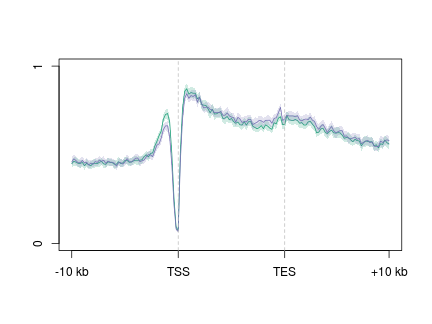 

```
## [1] 0 1
```


```r
plot2.several("gene_whole_W200N50F50_chr", "d3a_mc", data_type = "rpkm/mean", 
    cols = col3[c(1, 3)], group2 = "omp_rmrna_quartiles_trim0.01", y.vals = c(0, 
        1), wsize = 200, lab = c("TSS", "TES"), group2_col = 4)
```

```
## [1] "moe_d3a_wt_mc_rpkm_omp_rmrna_quartiles_trim0.01"
## [1] "moe_d3a_wt_mc_rpkm_omp_rmrna_quartiles_trim0.01_mean"
## [1] "moe_d3a_ko_mc_rpkm_omp_rmrna_quartiles_trim0.01"
## [1] "moe_d3a_ko_mc_rpkm_omp_rmrna_quartiles_trim0.01_mean"
```

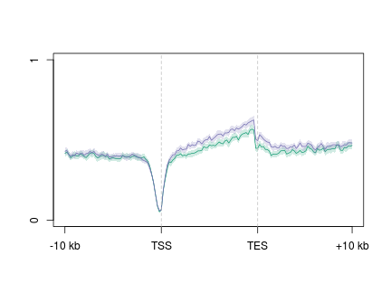 

```
## [1] 0 1
```


```r
plot2.several("gene_whole_W200N50F50_chr", "d3xog_hmc", data_type = "rpkm/mean", 
    cols = col3, group2 = "omp_rmrna_quartiles_trim0.01", y.vals = c(0, 1), 
    wsize = 200, lab = c("TSS", "TES"), group2_col = 4)
```

```
## [1] "omp_hmc_rep1_q30_rmdup_extend300_mean_omp_hmc_rep2_q30_rmdup_omp_rmrna_quartiles_trim0.01"
## [1] "omp_hmc_rep1_q30_rmdup_extend300_mean_omp_hmc_rep2_q30_rmdup_omp_rmrna_quartiles_trim0.01_mean"
```


```r
par(mfrow = c(2, 2), mar = c(2, 2, 1, 1))
for (i in 4:1) {
    plot2.several("gene_whole_W200N50F50_chr", "d3xog_hmc", data_type = "rpkm/mean", 
        cols = col3, group2 = "omp_rmrna_quartiles_trim0.01", y.vals = c(0, 
            1), wsize = 200, lab = c("TSS", "TES"), group2_col = i)
}
```

```
## [1] "omp_hmc_rep1_q30_rmdup_extend300_mean_omp_hmc_rep2_q30_rmdup_omp_rmrna_quartiles_trim0.01"
## [1] "omp_hmc_rep1_q30_rmdup_extend300_mean_omp_hmc_rep2_q30_rmdup_omp_rmrna_quartiles_trim0.01_mean"
```


```r
plot2.several("gene_whole_W200N50F50_chr", "d3xog_mc", data_type = "rpkm/mean", 
    cols = col3, group2 = "omp_rmrna_quartiles_trim0.01", y.vals = c(0, 1), 
    wsize = 200, lab = c("TSS", "TES"), group2_col = 4)
```

```
## [1] "omp_mc_rep1_q30_rmdup_extend300_omp_rmrna_quartiles_trim0.01"
## [1] "omp_mc_rep1_q30_rmdup_extend300_omp_rmrna_quartiles_trim0.01_mean"
```


```r
par(mfrow = c(2, 2), mar = c(2, 2, 1, 1))
for (i in 4:1) {
    plot2.several("gene_whole_W200N50F50_chr", "d3xog_mc", data_type = "rpkm/mean", 
        cols = col3, group2 = "omp_rmrna_quartiles_trim0.01", y.vals = c(0, 
            1), wsize = 200, lab = c("TSS", "TES"), group2_col = i)
}
```

```
## [1] "omp_mc_rep1_q30_rmdup_extend300_omp_rmrna_quartiles_trim0.01"
## [1] "omp_mc_rep1_q30_rmdup_extend300_omp_rmrna_quartiles_trim0.01_mean"
```


### OSN activated genes
```
makeProfile2.allSamp("gene_whole_W200N50F50_omp_ngn_icam_mrna_ucsc_fc1_fpkm1_omp_vs_ngn_icam.bed_chr", data_type="rpkm/mean", rm.outliers=0.01)
```


```r
plot2.several("gene_whole_W200N50F50_omp_ngn_icam_mrna_ucsc_fc1_fpkm1_omp_vs_ngn_icam.bed_chr", 
    "d3a_hmc", data_type = "rpkm/mean", cols = col3[c(1, 3)], group2 = "trim0.01", 
    y.vals = c(0, 1), wsize = 200, lab = c("TSS", "TES"))
```

```
## [1] "moe_d3a_wt_hmc_rpkm_trim0.01"
## [1] "moe_d3a_wt_hmc_rpkm_trim0.01_mean"
## [1] "moe_d3a_ko_hmc_rpkm_trim0.01"
## [1] "moe_d3a_ko_hmc_rpkm_trim0.01_mean"
```

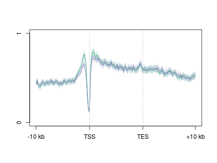 

```
## [1] 0 1
```


```r
plot2.several("gene_whole_W200N50F50_omp_ngn_icam_mrna_ucsc_fc1_fpkm1_omp_vs_ngn_icam.bed_chr", 
    "d3a_mc", data_type = "rpkm/mean", cols = col3[c(1, 3)], group2 = "trim0.01", 
    y.vals = c(0, 1), wsize = 200, lab = c("TSS", "TES"))
```

```
## [1] "moe_d3a_wt_mc_rpkm_trim0.01"
## [1] "moe_d3a_wt_mc_rpkm_trim0.01_mean"
## [1] "moe_d3a_ko_mc_rpkm_trim0.01"
## [1] "moe_d3a_ko_mc_rpkm_trim0.01_mean"
```

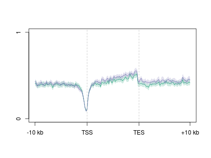 

```
## [1] 0 1
```


```r
plot2.several("gene_whole_W200N50F50_omp_ngn_icam_mrna_ucsc_fc1_fpkm1_omp_vs_ngn_icam.bed_chr", 
    "d3xog_hmc", data_type = "rpkm/mean", cols = col3, group2 = "trim0.01", 
    y.vals = c(0, 1), wsize = 200, lab = c("TSS", "TES"))
```


```r
plot2.several("gene_whole_W200N50F50_omp_ngn_icam_mrna_ucsc_fc1_fpkm1_omp_vs_ngn_icam.bed_chr", 
    "d3xog_mc", data_type = "rpkm/mean", cols = col3, group2 = "trim0.01", y.vals = c(0, 
        1), wsize = 200, lab = c("TSS", "TES"))
```


### NGN activated genes
```
makeProfile2.allSamp("gene_whole_W200N50F50_omp_ngn_icam_mrna_ucsc_fc1_fpkm1_ngn_vs_omp_icam.bed_chr", data_type="rpkm/mean", rm.outliers=0.01)
```


```r
plot2.several("gene_whole_W200N50F50_omp_ngn_icam_mrna_ucsc_fc1_fpkm1_ngn_vs_omp_icam.bed_chr", 
    "d3a_hmc", data_type = "rpkm/mean", cols = col3[c(1, 3)], group2 = "trim0.01", 
    y.vals = c(0, 1), wsize = 200, lab = c("TSS", "TES"))
```

```
## [1] "moe_d3a_wt_hmc_rpkm_trim0.01"
## [1] "moe_d3a_wt_hmc_rpkm_trim0.01_mean"
## [1] "moe_d3a_ko_hmc_rpkm_trim0.01"
## [1] "moe_d3a_ko_hmc_rpkm_trim0.01_mean"
```

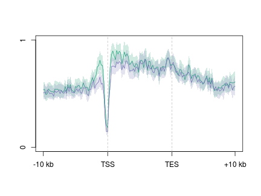 

```
## [1] 0 1
```


```r
plot2.several("gene_whole_W200N50F50_omp_ngn_icam_mrna_ucsc_fc1_fpkm1_ngn_vs_omp_icam.bed_chr", 
    "d3a_mc", data_type = "rpkm/mean", cols = col3[c(1, 3)], group2 = "trim0.01", 
    y.vals = c(0, 1), wsize = 200, lab = c("TSS", "TES"))
```

```
## [1] "moe_d3a_wt_mc_rpkm_trim0.01"
## [1] "moe_d3a_wt_mc_rpkm_trim0.01_mean"
## [1] "moe_d3a_ko_mc_rpkm_trim0.01"
## [1] "moe_d3a_ko_mc_rpkm_trim0.01_mean"
```

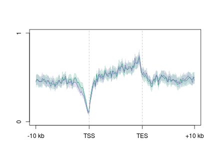 

```
## [1] 0 1
```


```r
plot2.several("gene_whole_W200N50F50_omp_ngn_icam_mrna_ucsc_fc1_fpkm1_ngn_vs_omp_icam.bed_chr", 
    "d3xog_hmc", data_type = "rpkm/mean", cols = col3, group2 = "trim0.01", 
    y.vals = c(0, 1), wsize = 200, lab = c("TSS", "TES"))
```


```r
plot2.several("gene_whole_W200N50F50_omp_ngn_icam_mrna_ucsc_fc1_fpkm1_ngn_vs_omp_icam.bed_chr", 
    "d3xog_mc", data_type = "rpkm/mean", cols = col3, group2 = "trim0.01", y.vals = c(0, 
        1), wsize = 200, lab = c("TSS", "TES"))
```


### Developmental comparison

```r
par(mfrow = c(1, 3), mar = c(2, 2, 2, 2))
plot2("gene_whole_W200N50F50_chr", "icam_hmc_rpkm", data_type = "rpkm/mean", 
    group2 = "trim0.01", cols = col3[1], y.vals = c(0, 0.8), lab = c("TSS", 
        "TES"), wsize = 200)
```

```
## [1] "icam_hmc_rpkm_trim0.01"
## [1] "icam_hmc_rpkm_trim0.01_mean"
```

```
## [1] 0.0 0.8
```

```r
abline(h = 0.45, lty = 2)
plot2("gene_whole_W200N50F50_chr", "ngn_hmc_rpkm", data_type = "rpkm/mean", 
    group2 = "trim0.01", cols = col3[1], y.vals = c(0, 0.8), lab = c("TSS", 
        "TES"), wsize = 200)
```

```
## [1] "ngn_hmc_rpkm_trim0.01"
## [1] "ngn_hmc_rpkm_trim0.01_mean"
```

```
## [1] 0.0 0.8
```

```r
abline(h = 0.45, lty = 2)
plot2.several("gene_whole_W200N50F50_chr", "d3xog_hmc", data_type = "rpkm/mean", 
    group2 = "trim0.01", cols = col3, y.vals = c(0, 0.8), lab = c("TSS", "TES"), 
    wsize = 200)
```

```
## [1] "omp_hmc_rep1_q30_rmdup_extend300_mean_omp_hmc_rep2_q30_rmdup_trim0.01"
## [1] "omp_hmc_rep1_q30_rmdup_extend300_mean_omp_hmc_rep2_q30_rmdup_trim0.01_mean"
```

```r
abline(h = 0.45, lty = 2)
```

 


```r
par(mfrow = c(1, 3), mar = c(2, 2, 2, 2))
plot2("gene_whole_W200N50F50_chr", "icam_hmc_rpkm", data_type = "rpkm/mean", 
    group2 = "trim0.01", cols = col3[1], y.vals = c(0, 0.8), lab = c("TSS", 
        "TES"), wsize = 200)
```

```
## [1] "icam_hmc_rpkm_trim0.01"
## [1] "icam_hmc_rpkm_trim0.01_mean"
```

```
## [1] 0.0 0.8
```

```r
abline(h = 0.45, lty = 2)
plot2("gene_whole_W200N50F50_chr", "ngn_hmc_rpkm", data_type = "rpkm/mean", 
    group2 = "trim0.01", cols = col3[1], y.vals = c(0, 0.8), lab = c("TSS", 
        "TES"), wsize = 200)
```

```
## [1] "ngn_hmc_rpkm_trim0.01"
## [1] "ngn_hmc_rpkm_trim0.01_mean"
```

```
## [1] 0.0 0.8
```

```r
abline(h = 0.45, lty = 2)
plot2.several("gene_whole_W200N50F50_chr", "d3xog_hmc", data_type = "rpkm/mean", 
    group2 = "trim0.01", cols = col3[1], y.vals = c(0, 0.8), lab = c("TSS", 
        "TES"), wsize = 200)
```

```
## [1] "omp_hmc_rep1_q30_rmdup_extend300_mean_omp_hmc_rep2_q30_rmdup_trim0.01"
## [1] "omp_hmc_rep1_q30_rmdup_extend300_mean_omp_hmc_rep2_q30_rmdup_trim0.01_mean"
```

```r
abline(h = 0.45, lty = 2)
```

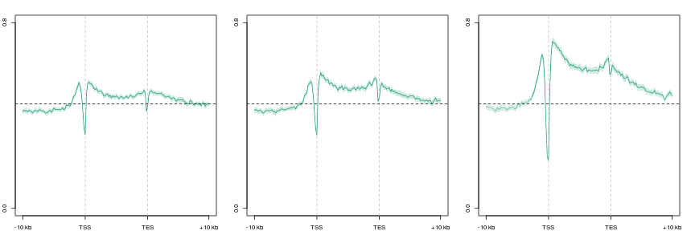 


```r
par(mfrow = c(1, 3), mar = c(2, 2, 2, 2))
plot2("gene_whole_W200N50F50_chr", "icam_mc_rmdup", data_type = "rpkm/mean", 
    group2 = "trim0.01", cols = col3[1], y.vals = c(0, 0.8), lab = c("TSS", 
        "TES"), wsize = 200)
```

```
## [1] "icam_mc_rmdup_trim0.01"
## [1] "icam_mc_rmdup_trim0.01_mean"
```

```
## [1] 0.0 0.8
```

```r
abline(h = 0.45, lty = 2)
plot2("gene_whole_W200N50F50_chr", "ngn_mc_rmdup", data_type = "rpkm/mean", 
    group2 = "trim0.01", cols = col3[1], y.vals = c(0, 0.8), lab = c("TSS", 
        "TES"), wsize = 200)
```

```
## [1] "ngn_mc_rmdup_trim0.01"
## [1] "ngn_mc_rmdup_trim0.01_mean"
```

```
## [1] 0.0 0.8
```

```r
abline(h = 0.45, lty = 2)
plot2.several("gene_whole_W200N50F50_chr", "d3xog_mc", data_type = "rpkm/mean", 
    group2 = "trim0.01", cols = col3, y.vals = c(0, 0.8), lab = c("TSS", "TES"), 
    wsize = 200)
```

```
## [1] "omp_mc_rep1_q30_rmdup_extend300_trim0.01"
## [1] "omp_mc_rep1_q30_rmdup_extend300_trim0.01_mean"
```

```r
abline(h = 0.45, lty = 2)
```

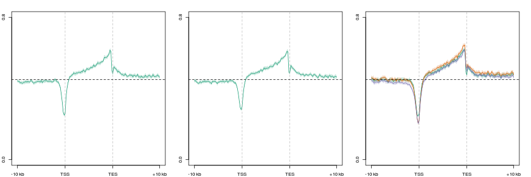 


```r
par(mfrow = c(1, 3), mar = c(2, 2, 2, 2))
plot2("gene_whole_W200N50F50_chr", "icam_mc_rmdup", data_type = "rpkm/mean", 
    group2 = "trim0.01", cols = col3[1], y.vals = c(0, 0.8), lab = c("TSS", 
        "TES"), wsize = 200)
```

```
## [1] "icam_mc_rmdup_trim0.01"
## [1] "icam_mc_rmdup_trim0.01_mean"
```

```
## [1] 0.0 0.8
```

```r
abline(h = 0.45, lty = 2)
plot2("gene_whole_W200N50F50_chr", "ngn_mc_rmdup", data_type = "rpkm/mean", 
    group2 = "trim0.01", cols = col3[1], y.vals = c(0, 0.8), lab = c("TSS", 
        "TES"), wsize = 200)
```

```
## [1] "ngn_mc_rmdup_trim0.01"
## [1] "ngn_mc_rmdup_trim0.01_mean"
```

```
## [1] 0.0 0.8
```

```r
abline(h = 0.45, lty = 2)
plot2.several("gene_whole_W200N50F50_chr", "d3xog_mc", data_type = "rpkm/mean", 
    group2 = "trim0.01", cols = col3[1], y.vals = c(0, 0.8), lab = c("TSS", 
        "TES"), wsize = 200)
```

```
## [1] "omp_mc_rep1_q30_rmdup_extend300_trim0.01"
## [1] "omp_mc_rep1_q30_rmdup_extend300_trim0.01_mean"
```

```r
abline(h = 0.45, lty = 2)
```

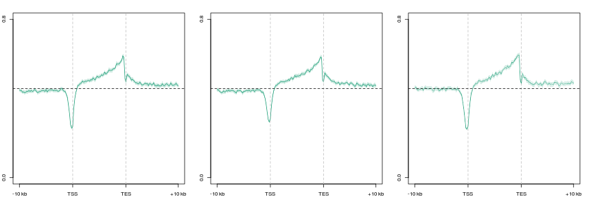 


#### MOE 5hmC depleted genes

```
makeProfile2.allSamp("gene_whole_W200N50F50_moe_d3a_wt_ko_hmc_bf_gt10_chr", data_type="rpkm/mean", rm.outliers=0.01)
```


```r
par(mfrow = c(1, 3), mar = c(2, 2, 2, 2))
plot2("gene_whole_W200N50F50_moe_d3a_wt_ko_hmc_bf_gt10_chr", "icam_hmc_rpkm", 
    data_type = "rpkm/mean", group2 = "trim0.01", cols = col3[1], y.vals = c(0, 
        1.5), lab = c("TSS", "TES"), wsize = 200)
```

```
## [1] "icam_hmc_rpkm_trim0.01"
## [1] "icam_hmc_rpkm_trim0.01_mean"
```

```
## [1] 0.0 1.5
```

```r
abline(h = 0.45, lty = 2)
plot2("gene_whole_W200N50F50_moe_d3a_wt_ko_hmc_bf_gt10_chr", "ngn_hmc_rpkm", 
    data_type = "rpkm/mean", group2 = "trim0.01", cols = col3[1], y.vals = c(0, 
        1.5), lab = c("TSS", "TES"), wsize = 200)
```

```
## [1] "ngn_hmc_rpkm_trim0.01"
## [1] "ngn_hmc_rpkm_trim0.01_mean"
```

```
## [1] 0.0 1.5
```

```r
abline(h = 0.45, lty = 2)
plot2.several("gene_whole_W200N50F50_moe_d3a_wt_ko_hmc_bf_gt10_chr", "d3xog_hmc", 
    data_type = "rpkm/mean", group2 = "trim0.01", cols = col3, y.vals = c(0, 
        1.5), lab = c("TSS", "TES"), wsize = 200)
abline(h = 0.45, lty = 2)
```

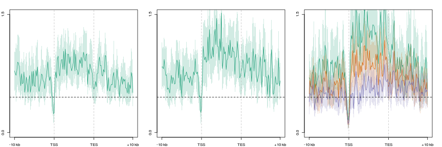 


```r
par(mfrow = c(1, 3), mar = c(2, 2, 2, 2))
plot2("gene_whole_W200N50F50_moe_d3a_wt_ko_hmc_bf_gt10_chr", "icam_mc_rmdup", 
    data_type = "rpkm/mean", group2 = "trim0.01", cols = col3[1], y.vals = c(0, 
        0.8), lab = c("TSS", "TES"), wsize = 200)
```

```
## [1] "icam_mc_rmdup_trim0.01"
## [1] "icam_mc_rmdup_trim0.01_mean"
```

```
## [1] 0.0 0.8
```

```r
abline(h = 0.45, lty = 2)
plot2("gene_whole_W200N50F50_moe_d3a_wt_ko_hmc_bf_gt10_chr", "ngn_mc_rmdup", 
    data_type = "rpkm/mean", group2 = "trim0.01", cols = col3[1], y.vals = c(0, 
        0.8), lab = c("TSS", "TES"), wsize = 200)
```

```
## [1] "ngn_mc_rmdup_trim0.01"
## [1] "ngn_mc_rmdup_trim0.01_mean"
```

```
## [1] 0.0 0.8
```

```r
abline(h = 0.45, lty = 2)
plot2.several("gene_whole_W200N50F50_moe_d3a_wt_ko_hmc_bf_gt10_chr", "d3xog_mc", 
    data_type = "rpkm/mean", group2 = "trim0.01", cols = col3, y.vals = c(0, 
        0.8), lab = c("TSS", "TES"), wsize = 200)
abline(h = 0.45, lty = 2)
```

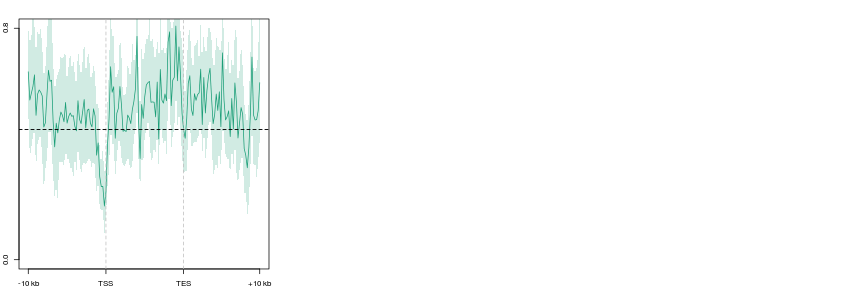 


```r
positionMatrix.all("gene_whole_W200N50F50_chr", data_type = "rpkm/mean")
```

```
## [1] "bak"
```


```r
wt.hmc <- makeImage("omp_hmc_rep1_mean_omp_hmc_rep2", "gene_whole_W200N50F50_chr", 
    data_type = "rpkm/mean", image = F)
```

```
## [1] "/media/storage2/analysis/profiles/norm/rpkm/mean/gene_whole_W200N50F50_chr/images/omp_hmc_rep1_mean_omp_hmc_rep2"
```

```r
het.hmc <- makeImage("d3xog_het_hmc_paired_q30", "gene_whole_W200N50F50_chr", 
    data_type = "rpkm/mean", image = F)
```

```
## [1] "/media/storage2/analysis/profiles/norm/rpkm/mean/gene_whole_W200N50F50_chr/images/d3xog_het_hmc_paired_q30"
```

```r
ko.hmc <- makeImage("d3xog_ko_hmc_paired_q30", "gene_whole_W200N50F50_chr", 
    data_type = "rpkm/mean", image = F)
```

```
## [1] "/media/storage2/analysis/profiles/norm/rpkm/mean/gene_whole_W200N50F50_chr/images/d3xog_ko_hmc_paired_q30"
```


```r
wt.hmc.pc <- prcomp(wt.hmc[, 51:100])
wt.hmc.pred <- predict(wt.hmc.pc, wt.hmc)
```


```r
MP.heat(wt.hmc[order(wt.hmc.pred[, 1]), ], range = c(0, 2), average = 50)
```

 


```r
MP.heat(het.hmc[order(wt.hmc.pred[, 1]), ], range = c(0, 2), average = 50)
```

 


```r
MP.heat(ko.hmc[order(wt.hmc.pred[, 1]), ], range = c(0, 2), average = 50)
```

 


### Relationship between gene body 5hmC/5mC and expression in Dnmt3a KO


```r
rna <- readRDS("~/s2/analysis/rna/rdata/d3xog_wt_het_ko_rmrna_run8_reps_fpkm_wt123_ko12_avg_1log2.rds")
rna <- rna[order(rna[, 1]), ]
rna <- cbind(rna, pairwise(rna[, 3:1], subtract))
```

```
## [1] "q3" "q2"
## [1] "q3" "q1"
## [1] "q2" "q1"
```

```r
# rna <- rna[apply(rna[,1:3], 1, prod)>0,]
```


```r
gg <- ggplot(rna, aes(q1, q3))
gg + geom_point(alpha = I(1/10)) + stat_smooth()
```

 


#### Load Data

```r
rg <- makeFeatureMatrix2("refgene_nodup.bed_chr", "d3xog_hmc", data_type = "rpkm/mean")
```

```
## [1] "omp_hmc_rep1_q30_rmdup_extend300_mean_omp_hmc_rep2_q30_rmdup"
## [2] "d3xog_het_hmc_sort_q30_rmdup"                                
## [3] "d3xog_ko_hmc_sort_q30_rmdup"
```

```r
rg$ko.wt <- with(rg, log2((ko + 0.01)/(wt + 0.01)))
rg$het.wt <- with(rg, log2((het + 0.01)/(wt + 0.01)))
rg1 <- rg[match(rna$id, rownames(rg)), ]
rg2 <- na.omit(rg1)

rg2.c100 <- chunkMatrix(rg2, chunks = 100)
rg2.c100.m <- melt(rg2.c100, id.vars = "index")
```


```r
rg.mc <- makeFeatureMatrix2("refgene_nodup.bed_chr", "d3xog_mc", data_type = "rpkm/mean")
```

```
## [1] "omp_mc_rep1_q30_rmdup_extend300" "d3xog_het_mc_sort_q30_rmdup"    
## [3] "d3xog_ko_mc_sort_q30_rmdup"
```

```r
rg.mc$ko.wt <- with(rg.mc, log2((ko + 0.01)/(wt + 0.01)))
rg.mc$het.wt <- with(rg.mc, log2((het + 0.01)/(wt + 0.01)))
rg.mc1 <- rg.mc[match(rna$id, rownames(rg.mc)), ]
rg.mc2 <- na.omit(rg.mc1)
rg.mc2.c100 <- chunkMatrix(rg.mc2, chunks = 100)
rg.mc2.c100.m <- melt(rg.mc2.c100, id.vars = "index")
```


```r
colnames(rg2) <- paste("hmc", colnames(rg2), sep = ".")
colnames(rg.mc2) <- paste("mc", colnames(rg.mc2), sep = ".")
comb <- cbind(rna[match(rownames(rg2), rna$id), ], rg2, rg.mc2)
comb <- na.omit(comb)
```


```r
gg <- ggplot(comb, aes(q1, mc.ko.wt))
gg <- gg + geom_point(alpha = I(1/10)) + stat_smooth() + geom_abline(slope = 1, 
    intercept = 0, color = 2)
gg <- gg  #+ coord_cartesian(xlim=c(0, 4), ylim=c(0,4))
gg
```

 


```r
gg.hmc <- ggplot(rg2.c100.m, aes(index, value)) + geom_point(aes(color = variable))
gg.mc <- ggplot(rg.mc2.c100.m, aes(index, value)) + geom_point(aes(color = variable))
grid.arrange(gg.mc, gg.hmc, ncol = 2)
```

 


```r
rna.c100 <- chunkMatrix(rna.pair, chunks = 100)
rna.c100.m <- melt(rna.c100, id.vars = "index")
```


```r
ratios <- data.frame(hmc = rg2$ko.wt, mc = rg.mc2$ko.wt, rna = rna.pair[match(rownames(rg2), 
    rna$id), 2], id = rownames(rg2))
ratios$index <- 1:nrow(ratios)
ratios.m <- melt(ratios[, c(1, 2, 3, 5)], id.var = "index")
ratios.m$genotype <- "KO"
ratios.c100 <- chunkMatrix(ratios[, 1:3], chunks = 100)
ratios.c100.m <- melt(ratios.c100, id.vars = "index")
levels(ratios.c100.m$variable) <- c("5hmC", "5mC", "RNA")
```


```r
theme_set(theme_bw())
gg <- ggplot(ratios.c100.m, aes(index, value, color = variable))
gg <- gg + geom_hline(yintercept = 0, linetype = 2) + scale_color_brewer(type = "qual", 
    palette = "Set1") + stat_smooth(se = TRUE) + theme(legend.position = c(0.8, 
    0.8), legend.title = element_blank(), legend.key = element_blank())
gg <- gg + labs(x = "WT mOSN Expression index", y = "log2(KO / WT)", title = "KO") + 
    coord_cartesian(ylim = c(-0.5, 0.5))
gg
```

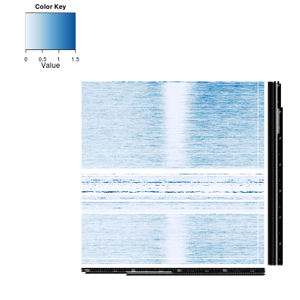 


#### Het

```r
ratios.het <- data.frame(hmc = rg2$het.wt, mc = rg.mc2$het.wt, rna = rna.pair[match(rownames(rg2), 
    rna$id), 3], id = rownames(rg2))
ratios.het$index <- 1:nrow(ratios.het)
ratios.het.m <- melt(ratios.het[, c(1, 2, 3, 5)], id.var = "index")
ratios.het.m$genotype <- "Het"
ratios.het.c100 <- chunkMatrix(ratios.het[, 1:3], chunks = 100)
ratios.het.c100.m <- melt(ratios.het.c100, id.vars = "index")
levels(ratios.het.c100.m$variable) <- c("5hmC", "5mC", "RNA")
```


```r
theme_set(theme_bw())
gg.het <- ggplot(ratios.het.c100.m, aes(index, value, color = variable))
gg.het <- gg.het + geom_hline(yintercept = 0, linetype = 2) + scale_color_brewer(type = "qual", 
    palette = "Set1") + stat_smooth(se = TRUE) + theme(legend.position = c(0.8, 
    0.8), legend.title = element_blank(), legend.key = element_blank())
gg.het <- gg.het + labs(x = "WT mOSN Expression index", y = "log2(Het / WT)", 
    title = "Het") + coord_cartesian(ylim = c(-0.5, 0.5))
gg.het
```


```r
grid.arrange(gg.het, gg, ncol = 2)
```


```r
ratios.comb <- rbind(ratios.m, ratios.het.m)
ratios.comb$genotype <- factor(ratios.comb$genotype, levels = c("Het", "KO"))
levels(ratios.comb$variable) <- c("5hmC", "5mC", "RNA")
```


