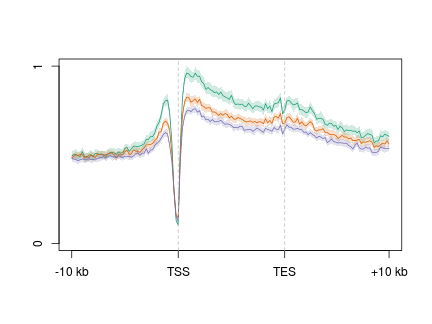
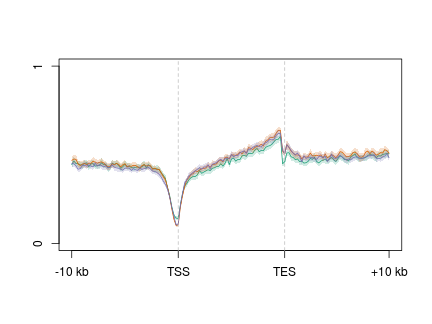
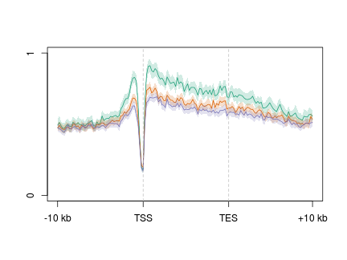
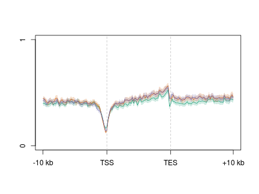
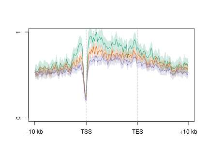
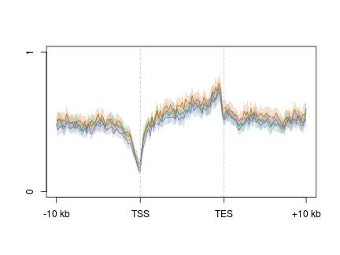

D3xOG 5hmC/5mC TSS
========================================================


```r
opts_chunk$set(warning = FALSE, message = FALSE, error = FALSE)
library(plyr)
library(reshape2)
library(ggplot2)
suppressPackageStartupMessages(source("~/src/seqAnalysis/R/profiles2.R"))
suppressPackageStartupMessages(source("~/src/seqAnalysis/R/image.R"))
```


```r
makeProfile2.allSamp("refGene_noRandom_order_outsides2_tss_W25F200_chr", data_type = "rpkm/mean", 
    rm.outliers = 0.01)
```

```
## [1] "/media/storage2/analysis/profiles/norm/rpkm/mean/refGene_noRandom_order_outsides2_tss_W25F200_chr"
## Note: next may be used in wrong context: no loop is visible
```


```r
plot2.several("refGene_noRandom_order_outsides2_tss_W25F200_chr", "d3xog_hmc", 
    data_type = "rpkm/mean", cols = col3, group2 = "trim0.01")
```

```
## [1] "omp_hmc_rep1_mean_omp_hmc_rep2_trim0.01"
## [1] "omp_hmc_rep1_mean_omp_hmc_rep2_trim0.01_mean"
## [1] "d3xog_het_hmc_paired_q30_trim0.01"
## [1] "d3xog_het_hmc_paired_q30_trim0.01_mean"
## [1] "d3xog_ko_hmc_paired_q30_trim0.01"
## [1] "d3xog_ko_hmc_paired_q30_trim0.01_mean"
```

 

```
## [1] 0.093 0.820
```


```r
plot2.several("refGene_noRandom_order_outsides2_tss_W25F200_chr", "d3xog_mc", 
    data_type = "rpkm/mean", cols = col3, group2 = "trim0.01")
```

```
## [1] "omp_mc_rmdup_trim0.01"
## [1] "omp_mc_rmdup_trim0.01_mean"
## [1] "d3xog_het_mc_paired_q30_trim0.01"
## [1] "d3xog_het_mc_paired_q30_trim0.01_mean"
## [1] "d3xog_ko_mc_paired_q30_trim0.01"
## [1] "d3xog_ko_mc_paired_q30_trim0.01_mean"
```

 

```
## [1] 0.136 0.574
```


```r
plot2.several("refGene_noRandom_order_outsides2_tss_W25F200_chr", "tt3_rep", 
    data_type = "rpkm/mean", cols = col2, group2 = "trim0.01")
```

```
## [1] "omp_hmc_rep1_mean_omp_hmc_rep2_trim0.01"
## [1] "omp_hmc_rep1_mean_omp_hmc_rep2_trim0.01_mean"
## [1] "ott3_hmc_rep1_mean_ott3_hmc_rep2_trim0.01"
## [1] "ott3_hmc_rep1_mean_ott3_hmc_rep2_trim0.01_mean"
```

 

```
## [1] 0.048 0.829
```


### All genes

```r
makeProfile2.allSamp("gene_whole_W200N50F50_chr", data_type = "rpkm/mean", rm.outliers = 0.01)
```

```
## [1] "/media/storage2/analysis/profiles/norm/rpkm/mean/gene_whole_W200N50F50_chr"
## Note: next may be used in wrong context: no loop is visible
```

```r
makeProfile2.allSamp("gene_whole_W200N50F50_chr", data_type = "rpkm/mean", rm.outliers = 0.01, 
    group2 = "omp_rmrna_quartiles")
```

```
## [1] "/media/storage2/analysis/profiles/norm/rpkm/mean/gene_whole_W200N50F50_chr"
## Note: next may be used in wrong context: no loop is visible
```


```r
plot2.several("gene_whole_W200N50F50_chr", "d3a_hmc", data_type = "rpkm/mean", 
    cols = col3[c(1, 3)], group2 = "trim0.01", y.vals = c(0, 0.8), wsize = 200, 
    lab = c("TSS", "TES"))
```

```
## [1] "moe_d3a_wt_hmc_rpkm_trim0.01"
## [1] "moe_d3a_wt_hmc_rpkm_trim0.01_mean"
## [1] "moe_d3a_ko_hmc_rpkm_trim0.01"
## [1] "moe_d3a_ko_hmc_rpkm_trim0.01_mean"
```

 

```
## [1] 0.0 0.8
```


```r
plot2.several("gene_whole_W200N50F50_chr", "d3a_mc", data_type = "rpkm/mean", 
    cols = col3[c(1, 3)], group2 = "trim0.01", y.vals = c(0, 0.8), wsize = 200, 
    lab = c("TSS", "TES"))
```

```
## [1] "moe_d3a_wt_mc_rpkm_trim0.01"
## [1] "moe_d3a_wt_mc_rpkm_trim0.01_mean"
## [1] "moe_d3a_ko_mc_rpkm_trim0.01"
## [1] "moe_d3a_ko_mc_rpkm_trim0.01_mean"
```

 

```
## [1] 0.0 0.8
```


```r
plot2.several("gene_whole_W200N50F50_chr", "d3xog_hmc", data_type = "rpkm/mean", 
    cols = col3, group2 = "trim0.01", y.vals = c(0, 0.8), wsize = 200, lab = c("TSS", 
        "TES"))
```

```
## [1] "omp_hmc_rep1_mean_omp_hmc_rep2_trim0.01"
## [1] "omp_hmc_rep1_mean_omp_hmc_rep2_trim0.01_mean"
## [1] "d3xog_het_hmc_paired_q30_trim0.01"
## [1] "d3xog_het_hmc_paired_q30_trim0.01_mean"
## [1] "d3xog_ko_hmc_paired_q30_trim0.01"
## [1] "d3xog_ko_hmc_paired_q30_trim0.01_mean"
```

 

```
## [1] 0.0 0.8
```


```r
plot2.several("gene_whole_W200N50F50_chr", "d3xog_mc", data_type = "rpkm/mean", 
    cols = col3, group2 = "trim0.01", y.vals = c(0, 0.8), wsize = 200, lab = c("TSS", 
        "TES"))
```

```
## [1] "omp_mc_rmdup_trim0.01"
## [1] "omp_mc_rmdup_trim0.01_mean"
## [1] "d3xog_het_mc_paired_q30_trim0.01"
## [1] "d3xog_het_mc_paired_q30_trim0.01_mean"
## [1] "d3xog_ko_mc_paired_q30_trim0.01"
## [1] "d3xog_ko_mc_paired_q30_trim0.01_mean"
```

 

```
## [1] 0.0 0.8
```


### mOSN upper quartile


```r
plot2.several("gene_whole_W200N50F50_chr", "d3a_hmc", data_type = "rpkm/mean", 
    cols = col3[c(1, 3)], group2 = "omp_rmrna_quartiles_trim0.01", y.vals = c(0, 
        1), wsize = 200, lab = c("TSS", "TES"), group2_col = 4)
```

```
## [1] "moe_d3a_wt_hmc_rpkm_omp_rmrna_quartiles_trim0.01"
## [1] "moe_d3a_wt_hmc_rpkm_omp_rmrna_quartiles_trim0.01_mean"
## [1] "moe_d3a_ko_hmc_rpkm_omp_rmrna_quartiles_trim0.01"
## [1] "moe_d3a_ko_hmc_rpkm_omp_rmrna_quartiles_trim0.01_mean"
```

 

```
## [1] 0 1
```


```r
plot2.several("gene_whole_W200N50F50_chr", "d3a_mc", data_type = "rpkm/mean", 
    cols = col3[c(1, 3)], group2 = "omp_rmrna_quartiles_trim0.01", y.vals = c(0, 
        1), wsize = 200, lab = c("TSS", "TES"), group2_col = 4)
```

```
## [1] "moe_d3a_wt_mc_rpkm_omp_rmrna_quartiles_trim0.01"
## [1] "moe_d3a_wt_mc_rpkm_omp_rmrna_quartiles_trim0.01_mean"
## [1] "moe_d3a_ko_mc_rpkm_omp_rmrna_quartiles_trim0.01"
## [1] "moe_d3a_ko_mc_rpkm_omp_rmrna_quartiles_trim0.01_mean"
```

 

```
## [1] 0 1
```


```r
plot2.several("gene_whole_W200N50F50_chr", "d3xog_hmc", data_type = "rpkm/mean", 
    cols = col3, group2 = "omp_rmrna_quartiles_trim0.01", y.vals = c(0, 1), 
    wsize = 200, lab = c("TSS", "TES"), group2_col = 4)
```

```
## [1] "omp_hmc_rep1_mean_omp_hmc_rep2_omp_rmrna_quartiles_trim0.01"
## [1] "omp_hmc_rep1_mean_omp_hmc_rep2_omp_rmrna_quartiles_trim0.01_mean"
## [1] "d3xog_het_hmc_paired_q30_omp_rmrna_quartiles_trim0.01"
## [1] "d3xog_het_hmc_paired_q30_omp_rmrna_quartiles_trim0.01_mean"
## [1] "d3xog_ko_hmc_paired_q30_omp_rmrna_quartiles_trim0.01"
## [1] "d3xog_ko_hmc_paired_q30_omp_rmrna_quartiles_trim0.01_mean"
```

 

```
## [1] 0 1
```


```r
plot2.several("gene_whole_W200N50F50_chr", "d3xog_mc", data_type = "rpkm/mean", 
    cols = col3, group2 = "omp_rmrna_quartiles_trim0.01", y.vals = c(0, 1), 
    wsize = 200, lab = c("TSS", "TES"), group2_col = 4)
```

```
## [1] "omp_mc_rmdup_omp_rmrna_quartiles_trim0.01"
## [1] "omp_mc_rmdup_omp_rmrna_quartiles_trim0.01_mean"
## [1] "d3xog_het_mc_paired_q30_omp_rmrna_quartiles_trim0.01"
## [1] "d3xog_het_mc_paired_q30_omp_rmrna_quartiles_trim0.01_mean"
## [1] "d3xog_ko_mc_paired_q30_omp_rmrna_quartiles_trim0.01"
## [1] "d3xog_ko_mc_paired_q30_omp_rmrna_quartiles_trim0.01_mean"
```

 

```
## [1] 0 1
```


### OSN activated genes

```r
makeProfile2.allSamp("gene_whole_W200N50F50_omp_ngn_icam_mrna_ucsc_fc1_fpkm1_omp_vs_ngn_icam.bed_chr", 
    data_type = "rpkm/mean", rm.outliers = 0.01)
```

```
## [1] "/media/storage2/analysis/profiles/norm/rpkm/mean/gene_whole_W200N50F50_omp_ngn_icam_mrna_ucsc_fc1_fpkm1_omp_vs_ngn_icam.bed_chr"
## Note: next may be used in wrong context: no loop is visible
```


```r
plot2.several("gene_whole_W200N50F50_omp_ngn_icam_mrna_ucsc_fc1_fpkm1_omp_vs_ngn_icam.bed_chr", 
    "d3a_hmc", data_type = "rpkm/mean", cols = col3[c(1, 3)], group2 = "trim0.01", 
    y.vals = c(0, 1), wsize = 200, lab = c("TSS", "TES"))
```

```
## [1] "moe_d3a_wt_hmc_rpkm_trim0.01"
## [1] "moe_d3a_wt_hmc_rpkm_trim0.01_mean"
## [1] "moe_d3a_ko_hmc_rpkm_trim0.01"
## [1] "moe_d3a_ko_hmc_rpkm_trim0.01_mean"
```

 

```
## [1] 0 1
```


```r
plot2.several("gene_whole_W200N50F50_omp_ngn_icam_mrna_ucsc_fc1_fpkm1_omp_vs_ngn_icam.bed_chr", 
    "d3a_mc", data_type = "rpkm/mean", cols = col3[c(1, 3)], group2 = "trim0.01", 
    y.vals = c(0, 1), wsize = 200, lab = c("TSS", "TES"))
```

```
## [1] "moe_d3a_wt_mc_rpkm_trim0.01"
## [1] "moe_d3a_wt_mc_rpkm_trim0.01_mean"
## [1] "moe_d3a_ko_mc_rpkm_trim0.01"
## [1] "moe_d3a_ko_mc_rpkm_trim0.01_mean"
```

 

```
## [1] 0 1
```


```r
plot2.several("gene_whole_W200N50F50_omp_ngn_icam_mrna_ucsc_fc1_fpkm1_omp_vs_ngn_icam.bed_chr", 
    "d3xog_hmc", data_type = "rpkm/mean", cols = col3, group2 = "trim0.01", 
    y.vals = c(0, 1), wsize = 200, lab = c("TSS", "TES"))
```

```
## [1] "omp_hmc_rep1_mean_omp_hmc_rep2_trim0.01"
## [1] "omp_hmc_rep1_mean_omp_hmc_rep2_trim0.01_mean"
## [1] "d3xog_het_hmc_paired_q30_trim0.01"
## [1] "d3xog_het_hmc_paired_q30_trim0.01_mean"
## [1] "d3xog_ko_hmc_paired_q30_trim0.01"
## [1] "d3xog_ko_hmc_paired_q30_trim0.01_mean"
```

 

```
## [1] 0 1
```


```r
plot2.several("gene_whole_W200N50F50_omp_ngn_icam_mrna_ucsc_fc1_fpkm1_omp_vs_ngn_icam.bed_chr", 
    "d3xog_mc", data_type = "rpkm/mean", cols = col3, group2 = "trim0.01", y.vals = c(0, 
        1), wsize = 200, lab = c("TSS", "TES"))
```

```
## [1] "omp_mc_rmdup_trim0.01"
## [1] "omp_mc_rmdup_trim0.01_mean"
## [1] "d3xog_het_mc_paired_q30_trim0.01"
## [1] "d3xog_het_mc_paired_q30_trim0.01_mean"
## [1] "d3xog_ko_mc_paired_q30_trim0.01"
## [1] "d3xog_ko_mc_paired_q30_trim0.01_mean"
```

 

```
## [1] 0 1
```


### NGN activated genes

```r
makeProfile2.allSamp("gene_whole_W200N50F50_omp_ngn_icam_mrna_ucsc_fc1_fpkm1_ngn_vs_omp_icam.bed_chr", 
    data_type = "rpkm/mean", rm.outliers = 0.01)
```

```
## [1] "/media/storage2/analysis/profiles/norm/rpkm/mean/gene_whole_W200N50F50_omp_ngn_icam_mrna_ucsc_fc1_fpkm1_ngn_vs_omp_icam.bed_chr"
## Note: next may be used in wrong context: no loop is visible
```


```r
plot2.several("gene_whole_W200N50F50_omp_ngn_icam_mrna_ucsc_fc1_fpkm1_ngn_vs_omp_icam.bed_chr", 
    "d3a_hmc", data_type = "rpkm/mean", cols = col3[c(1, 3)], group2 = "trim0.01", 
    y.vals = c(0, 1), wsize = 200, lab = c("TSS", "TES"))
```

```
## [1] "moe_d3a_wt_hmc_rpkm_trim0.01"
## [1] "moe_d3a_wt_hmc_rpkm_trim0.01_mean"
## [1] "moe_d3a_ko_hmc_rpkm_trim0.01"
## [1] "moe_d3a_ko_hmc_rpkm_trim0.01_mean"
```

 

```
## [1] 0 1
```


```r
plot2.several("gene_whole_W200N50F50_omp_ngn_icam_mrna_ucsc_fc1_fpkm1_ngn_vs_omp_icam.bed_chr", 
    "d3a_mc", data_type = "rpkm/mean", cols = col3[c(1, 3)], group2 = "trim0.01", 
    y.vals = c(0, 1), wsize = 200, lab = c("TSS", "TES"))
```

```
## [1] "moe_d3a_wt_mc_rpkm_trim0.01"
## [1] "moe_d3a_wt_mc_rpkm_trim0.01_mean"
## [1] "moe_d3a_ko_mc_rpkm_trim0.01"
## [1] "moe_d3a_ko_mc_rpkm_trim0.01_mean"
```

 

```
## [1] 0 1
```


```r
plot2.several("gene_whole_W200N50F50_omp_ngn_icam_mrna_ucsc_fc1_fpkm1_ngn_vs_omp_icam.bed_chr", 
    "d3xog_hmc", data_type = "rpkm/mean", cols = col3, group2 = "trim0.01", 
    y.vals = c(0, 1), wsize = 200, lab = c("TSS", "TES"))
```

```
## [1] "omp_hmc_rep1_mean_omp_hmc_rep2_trim0.01"
## [1] "omp_hmc_rep1_mean_omp_hmc_rep2_trim0.01_mean"
## [1] "d3xog_het_hmc_paired_q30_trim0.01"
## [1] "d3xog_het_hmc_paired_q30_trim0.01_mean"
## [1] "d3xog_ko_hmc_paired_q30_trim0.01"
## [1] "d3xog_ko_hmc_paired_q30_trim0.01_mean"
```

 

```
## [1] 0 1
```


```r
plot2.several("gene_whole_W200N50F50_omp_ngn_icam_mrna_ucsc_fc1_fpkm1_ngn_vs_omp_icam.bed_chr", 
    "d3xog_mc", data_type = "rpkm/mean", cols = col3, group2 = "trim0.01", y.vals = c(0, 
        1), wsize = 200, lab = c("TSS", "TES"))
```

```
## [1] "omp_mc_rmdup_trim0.01"
## [1] "omp_mc_rmdup_trim0.01_mean"
## [1] "d3xog_het_mc_paired_q30_trim0.01"
## [1] "d3xog_het_mc_paired_q30_trim0.01_mean"
## [1] "d3xog_ko_mc_paired_q30_trim0.01"
## [1] "d3xog_ko_mc_paired_q30_trim0.01_mean"
```

 

```
## [1] 0 1
```


### Developmental comparison

```r
par(mfrow = c(1, 3), mar = c(2, 2, 2, 2))
plot2("gene_whole_W200N50F50_chr", "icam_hmc_rpkm", data_type = "rpkm/mean", 
    group2 = "trim0.01", cols = col3[1], y.vals = c(0, 0.8), lab = c("TSS", 
        "TES"), wsize = 200)
```

```
## [1] "icam_hmc_rpkm_trim0.01"
## [1] "icam_hmc_rpkm_trim0.01_mean"
```

```
## [1] 0.0 0.8
```

```r
abline(h = 0.45, lty = 2)
plot2("gene_whole_W200N50F50_chr", "ngn_hmc_rpkm", data_type = "rpkm/mean", 
    group2 = "trim0.01", cols = col3[1], y.vals = c(0, 0.8), lab = c("TSS", 
        "TES"), wsize = 200)
```

```
## [1] "ngn_hmc_rpkm_trim0.01"
## [1] "ngn_hmc_rpkm_trim0.01_mean"
```

```
## [1] 0.0 0.8
```

```r
abline(h = 0.45, lty = 2)
plot2.several("gene_whole_W200N50F50_chr", "d3xog_hmc", data_type = "rpkm/mean", 
    group2 = "trim0.01", cols = col3, y.vals = c(0, 0.8), lab = c("TSS", "TES"), 
    wsize = 200)
```

```
## [1] "omp_hmc_rep1_mean_omp_hmc_rep2_trim0.01"
## [1] "omp_hmc_rep1_mean_omp_hmc_rep2_trim0.01_mean"
## [1] "d3xog_het_hmc_paired_q30_trim0.01"
## [1] "d3xog_het_hmc_paired_q30_trim0.01_mean"
## [1] "d3xog_ko_hmc_paired_q30_trim0.01"
## [1] "d3xog_ko_hmc_paired_q30_trim0.01_mean"
```

```
## [1] 0.0 0.8
```

```r
abline(h = 0.45, lty = 2)
```

 

```r
#
# plot2.several('d3a_het_dnase_sort_q30_dnase_sub_igenome_ensembl_genes_extend5kb_nosex.bed_W25F200_both_chr',
# 'cells_hmc', data_type='rpkm/mean', group2='trim0.01', cols=col3,
# y.vals=c(0, 1.2), lab='DNase HS')
# plot2.several('d3a_het_dnase_sort_q30_dnase_sub_igenome_ensembl_genes_extend5kb_shuffle.bed_W25F200_both_chr',
# 'd3xog_hmc', data_type='rpkm/mean', group2='trim0.01', cols=col3,
# y.vals=c(0, 1.2))
```


```r
par(mfrow = c(1, 3), mar = c(2, 2, 2, 2))
plot2("gene_whole_W200N50F50_chr", "icam_hmc_rpkm", data_type = "rpkm/mean", 
    group2 = "trim0.01", cols = col3[1], y.vals = c(0, 0.8), lab = c("TSS", 
        "TES"), wsize = 200)
```

```
## [1] "icam_hmc_rpkm_trim0.01"
## [1] "icam_hmc_rpkm_trim0.01_mean"
```

```
## [1] 0.0 0.8
```

```r
abline(h = 0.45, lty = 2)
plot2("gene_whole_W200N50F50_chr", "ngn_hmc_rpkm", data_type = "rpkm/mean", 
    group2 = "trim0.01", cols = col3[1], y.vals = c(0, 0.8), lab = c("TSS", 
        "TES"), wsize = 200)
```

```
## [1] "ngn_hmc_rpkm_trim0.01"
## [1] "ngn_hmc_rpkm_trim0.01_mean"
```

```
## [1] 0.0 0.8
```

```r
abline(h = 0.45, lty = 2)
plot2.several("gene_whole_W200N50F50_chr", "d3xog_hmc", data_type = "rpkm/mean", 
    group2 = "trim0.01", cols = col3[1], y.vals = c(0, 0.8), lab = c("TSS", 
        "TES"), wsize = 200)
```

```
## [1] "omp_hmc_rep1_mean_omp_hmc_rep2_trim0.01"
## [1] "omp_hmc_rep1_mean_omp_hmc_rep2_trim0.01_mean"
## [1] "d3xog_het_hmc_paired_q30_trim0.01"
## [1] "d3xog_het_hmc_paired_q30_trim0.01_mean"
## [1] "d3xog_ko_hmc_paired_q30_trim0.01"
## [1] "d3xog_ko_hmc_paired_q30_trim0.01_mean"
```

```
## [1] 0.0 0.8
```

```r
abline(h = 0.45, lty = 2)
```

 

```r
#
# plot2.several('d3a_het_dnase_sort_q30_dnase_sub_igenome_ensembl_genes_extend5kb_nosex.bed_W25F200_both_chr',
# 'cells_hmc', data_type='rpkm/mean', group2='trim0.01', cols=col3,
# y.vals=c(0, 1.2), lab='DNase HS')
# plot2.several('d3a_het_dnase_sort_q30_dnase_sub_igenome_ensembl_genes_extend5kb_shuffle.bed_W25F200_both_chr',
# 'd3xog_hmc', data_type='rpkm/mean', group2='trim0.01', cols=col3,
# y.vals=c(0, 1.2))
```


```r
par(mfrow = c(1, 3), mar = c(2, 2, 2, 2))
plot2("gene_whole_W200N50F50_chr", "icam_mc_rmdup", data_type = "rpkm/mean", 
    group2 = "trim0.01", cols = col3[1], y.vals = c(0, 0.8), lab = c("TSS", 
        "TES"), wsize = 200)
```

```
## [1] "icam_mc_rmdup_trim0.01"
## [1] "icam_mc_rmdup_trim0.01_mean"
```

```
## [1] 0.0 0.8
```

```r
abline(h = 0.45, lty = 2)
plot2("gene_whole_W200N50F50_chr", "ngn_mc_rmdup", data_type = "rpkm/mean", 
    group2 = "trim0.01", cols = col3[1], y.vals = c(0, 0.8), lab = c("TSS", 
        "TES"), wsize = 200)
```

```
## [1] "ngn_mc_rmdup_trim0.01"
## [1] "ngn_mc_rmdup_trim0.01_mean"
```

```
## [1] 0.0 0.8
```

```r
abline(h = 0.45, lty = 2)
plot2.several("gene_whole_W200N50F50_chr", "d3xog_mc", data_type = "rpkm/mean", 
    group2 = "trim0.01", cols = col3, y.vals = c(0, 0.8), lab = c("TSS", "TES"), 
    wsize = 200)
```

```
## [1] "omp_mc_rmdup_trim0.01"
## [1] "omp_mc_rmdup_trim0.01_mean"
## [1] "d3xog_het_mc_paired_q30_trim0.01"
## [1] "d3xog_het_mc_paired_q30_trim0.01_mean"
## [1] "d3xog_ko_mc_paired_q30_trim0.01"
## [1] "d3xog_ko_mc_paired_q30_trim0.01_mean"
```

```
## [1] 0.0 0.8
```

```r
abline(h = 0.45, lty = 2)
```

 

```r
#
# plot2.several('d3a_het_dnase_sort_q30_dnase_sub_igenome_ensembl_genes_extend5kb_nosex.bed_W25F200_both_chr',
# 'cells_hmc', data_type='rpkm/mean', group2='trim0.01', cols=col3,
# y.vals=c(0, 1.2), lab='DNase HS')
# plot2.several('d3a_het_dnase_sort_q30_dnase_sub_igenome_ensembl_genes_extend5kb_shuffle.bed_W25F200_both_chr',
# 'd3xog_hmc', data_type='rpkm/mean', group2='trim0.01', cols=col3,
# y.vals=c(0, 1.2))
```


```r
par(mfrow = c(1, 3), mar = c(2, 2, 2, 2))
plot2("gene_whole_W200N50F50_chr", "icam_mc_rmdup", data_type = "rpkm/mean", 
    group2 = "trim0.01", cols = col3[1], y.vals = c(0, 0.8), lab = c("TSS", 
        "TES"), wsize = 200)
```

```
## [1] "icam_mc_rmdup_trim0.01"
## [1] "icam_mc_rmdup_trim0.01_mean"
```

```
## [1] 0.0 0.8
```

```r
abline(h = 0.45, lty = 2)
plot2("gene_whole_W200N50F50_chr", "ngn_mc_rmdup", data_type = "rpkm/mean", 
    group2 = "trim0.01", cols = col3[1], y.vals = c(0, 0.8), lab = c("TSS", 
        "TES"), wsize = 200)
```

```
## [1] "ngn_mc_rmdup_trim0.01"
## [1] "ngn_mc_rmdup_trim0.01_mean"
```

```
## [1] 0.0 0.8
```

```r
abline(h = 0.45, lty = 2)
plot2.several("gene_whole_W200N50F50_chr", "d3xog_mc", data_type = "rpkm/mean", 
    group2 = "trim0.01", cols = col3[1], y.vals = c(0, 0.8), lab = c("TSS", 
        "TES"), wsize = 200)
```

```
## [1] "omp_mc_rmdup_trim0.01"
## [1] "omp_mc_rmdup_trim0.01_mean"
## [1] "d3xog_het_mc_paired_q30_trim0.01"
## [1] "d3xog_het_mc_paired_q30_trim0.01_mean"
## [1] "d3xog_ko_mc_paired_q30_trim0.01"
## [1] "d3xog_ko_mc_paired_q30_trim0.01_mean"
```

```
## [1] 0.0 0.8
```

```r
abline(h = 0.45, lty = 2)
```

 

```r
#
# plot2.several('d3a_het_dnase_sort_q30_dnase_sub_igenome_ensembl_genes_extend5kb_nosex.bed_W25F200_both_chr',
# 'cells_hmc', data_type='rpkm/mean', group2='trim0.01', cols=col3,
# y.vals=c(0, 1.2), lab='DNase HS')
# plot2.several('d3a_het_dnase_sort_q30_dnase_sub_igenome_ensembl_genes_extend5kb_shuffle.bed_W25F200_both_chr',
# 'd3xog_hmc', data_type='rpkm/mean', group2='trim0.01', cols=col3,
# y.vals=c(0, 1.2))
```


#### MOE 5hmC depleted genes


```r
makeProfile2.allSamp("gene_whole_W200N50F50_moe_d3a_wt_ko_hmc_bf_gt10_chr", 
    data_type = "rpkm/mean", rm.outliers = 0.01)
```

```
## [1] "/media/storage2/analysis/profiles/norm/rpkm/mean/gene_whole_W200N50F50_moe_d3a_wt_ko_hmc_bf_gt10_chr"
## Note: next may be used in wrong context: no loop is visible
```


```r
par(mfrow = c(1, 3), mar = c(2, 2, 2, 2))
plot2("gene_whole_W200N50F50_moe_d3a_wt_ko_hmc_bf_gt10_chr", "icam_hmc_rpkm", 
    data_type = "rpkm/mean", group2 = "trim0.01", cols = col3[1], y.vals = c(0, 
        1.5), lab = c("TSS", "TES"), wsize = 200)
```

```
## [1] "icam_hmc_rpkm_trim0.01"
## [1] "icam_hmc_rpkm_trim0.01_mean"
```

```
## [1] 0.0 1.5
```

```r
abline(h = 0.45, lty = 2)
plot2("gene_whole_W200N50F50_moe_d3a_wt_ko_hmc_bf_gt10_chr", "ngn_hmc_rpkm", 
    data_type = "rpkm/mean", group2 = "trim0.01", cols = col3[1], y.vals = c(0, 
        1.5), lab = c("TSS", "TES"), wsize = 200)
```

```
## [1] "ngn_hmc_rpkm_trim0.01"
## [1] "ngn_hmc_rpkm_trim0.01_mean"
```

```
## [1] 0.0 1.5
```

```r
abline(h = 0.45, lty = 2)
plot2.several("gene_whole_W200N50F50_moe_d3a_wt_ko_hmc_bf_gt10_chr", "d3xog_hmc", 
    data_type = "rpkm/mean", group2 = "trim0.01", cols = col3, y.vals = c(0, 
        1.5), lab = c("TSS", "TES"), wsize = 200)
```

```
## [1] "omp_hmc_rep1_mean_omp_hmc_rep2_trim0.01"
## [1] "omp_hmc_rep1_mean_omp_hmc_rep2_trim0.01_mean"
## [1] "d3xog_het_hmc_paired_q30_trim0.01"
## [1] "d3xog_het_hmc_paired_q30_trim0.01_mean"
## [1] "d3xog_ko_hmc_paired_q30_trim0.01"
## [1] "d3xog_ko_hmc_paired_q30_trim0.01_mean"
```

```
## [1] 0.0 1.5
```

```r
abline(h = 0.45, lty = 2)
```

 

```r
#
# plot2.several('d3a_het_dnase_sort_q30_dnase_sub_igenome_ensembl_genes_extend5kb_nosex.bed_W25F200_both_chr',
# 'cells_hmc', data_type='rpkm/mean', group2='trim0.01', cols=col3,
# y.vals=c(0, 1.2), lab='DNase HS')
# plot2.several('d3a_het_dnase_sort_q30_dnase_sub_igenome_ensembl_genes_extend5kb_shuffle.bed_W25F200_both_chr',
# 'd3xog_hmc', data_type='rpkm/mean', group2='trim0.01', cols=col3,
# y.vals=c(0, 1.2))
```


```r
par(mfrow = c(1, 3), mar = c(2, 2, 2, 2))
plot2("gene_whole_W200N50F50_moe_d3a_wt_ko_hmc_bf_gt10_chr", "icam_mc_rmdup", 
    data_type = "rpkm/mean", group2 = "trim0.01", cols = col3[1], y.vals = c(0, 
        0.8), lab = c("TSS", "TES"), wsize = 200)
```

```
## [1] "icam_mc_rmdup_trim0.01"
## [1] "icam_mc_rmdup_trim0.01_mean"
```

```
## [1] 0.0 0.8
```

```r
abline(h = 0.45, lty = 2)
plot2("gene_whole_W200N50F50_moe_d3a_wt_ko_hmc_bf_gt10_chr", "ngn_mc_rmdup", 
    data_type = "rpkm/mean", group2 = "trim0.01", cols = col3[1], y.vals = c(0, 
        0.8), lab = c("TSS", "TES"), wsize = 200)
```

```
## [1] "ngn_mc_rmdup_trim0.01"
## [1] "ngn_mc_rmdup_trim0.01_mean"
```

```
## [1] 0.0 0.8
```

```r
abline(h = 0.45, lty = 2)
plot2.several("gene_whole_W200N50F50_moe_d3a_wt_ko_hmc_bf_gt10_chr", "d3xog_mc", 
    data_type = "rpkm/mean", group2 = "trim0.01", cols = col3, y.vals = c(0, 
        0.8), lab = c("TSS", "TES"), wsize = 200)
```

```
## [1] "omp_mc_rmdup_trim0.01"
## [1] "omp_mc_rmdup_trim0.01_mean"
## [1] "d3xog_het_mc_paired_q30_trim0.01"
## [1] "d3xog_het_mc_paired_q30_trim0.01_mean"
## [1] "d3xog_ko_mc_paired_q30_trim0.01"
## [1] "d3xog_ko_mc_paired_q30_trim0.01_mean"
```

```
## [1] 0.0 0.8
```

```r
abline(h = 0.45, lty = 2)
```

 

```r
#
# plot2.several('d3a_het_dnase_sort_q30_dnase_sub_igenome_ensembl_genes_extend5kb_nosex.bed_W25F200_both_chr',
# 'cells_hmc', data_type='rpkm/mean', group2='trim0.01', cols=col3,
# y.vals=c(0, 1.2), lab='DNase HS')
# plot2.several('d3a_het_dnase_sort_q30_dnase_sub_igenome_ensembl_genes_extend5kb_shuffle.bed_W25F200_both_chr',
# 'd3xog_hmc', data_type='rpkm/mean', group2='trim0.01', cols=col3,
# y.vals=c(0, 1.2))
```


```r
positionMatrix.all("gene_whole_W200N50F50_chr", data_type = "rpkm/mean")
```


```r
wt.hmc <- makeImage("omp_hmc_rep1_mean_omp_hmc_rep2", "gene_whole_W200N50F50_chr", 
    data_type = "rpkm/mean", image = F)
```

```
## [1] "/media/storage2/analysis/profiles/norm/rpkm/mean/gene_whole_W200N50F50_chr/images/omp_hmc_rep1_mean_omp_hmc_rep2"
```

```r
het.hmc <- makeImage("d3xog_het_hmc_paired_q30", "gene_whole_W200N50F50_chr", 
    data_type = "rpkm/mean", image = F)
```

```
## [1] "/media/storage2/analysis/profiles/norm/rpkm/mean/gene_whole_W200N50F50_chr/images/d3xog_het_hmc_paired_q30"
```

```r
ko.hmc <- makeImage("d3xog_ko_hmc_paired_q30", "gene_whole_W200N50F50_chr", 
    data_type = "rpkm/mean", image = F)
```

```
## [1] "/media/storage2/analysis/profiles/norm/rpkm/mean/gene_whole_W200N50F50_chr/images/d3xog_ko_hmc_paired_q30"
```


```r
wt.hmc.pc <- prcomp(wt.hmc[, 51:100])
wt.hmc.pred <- predict(wt.hmc.pc, wt.hmc)
```


```r
MP.heat(wt.hmc[order(wt.hmc.pred[, 1]), ], range = c(0, 2), average = 50)
```

 


```r
MP.heat(het.hmc[order(wt.hmc.pred[, 1]), ], range = c(0, 2), average = 50)
```

 


```r
MP.heat(ko.hmc[order(wt.hmc.pred[, 1]), ], range = c(0, 2), average = 50)
```

 


