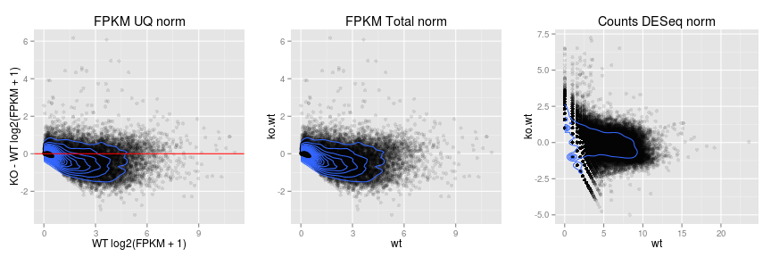
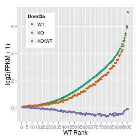
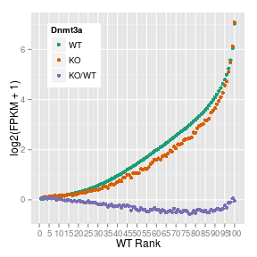
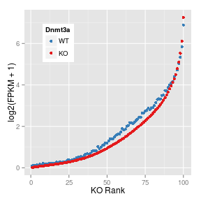
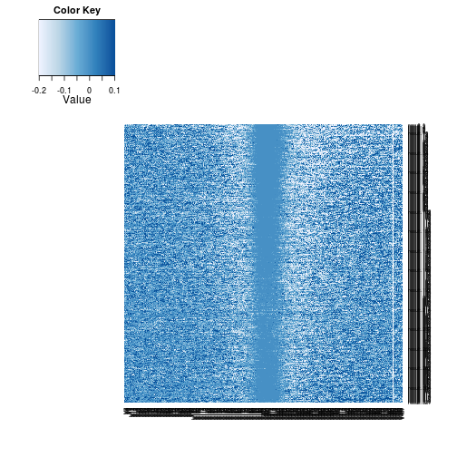
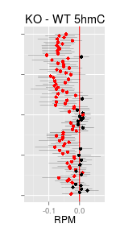
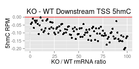
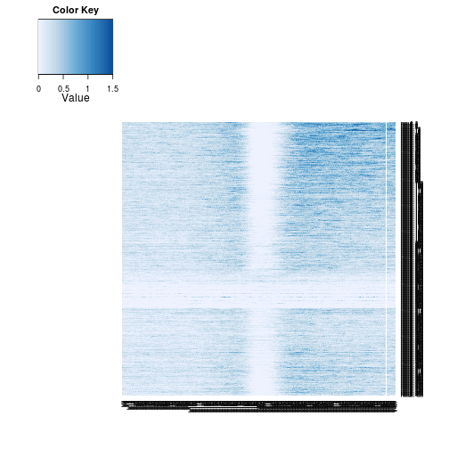
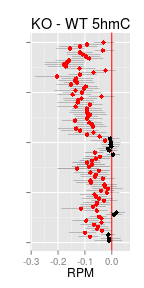

tested <- c("Ncam1", "Clgn", "Adcy3", "Slc17a6", "Cntn4")
Dnmt3a OMP-GFP rmRNA analysis
========================================================

Summary
---------------------

* Possible overall reduction of transcription with 5hmC TSS-flanking depletion.
* However KO RNA levels reduced as a whole relative to WT (see scatter and boxplots).


Average entries with common gene names
```
cd <- read.delim("~/s2/data/rna/cuffdiff/d3xog_wt_ko_rmrna_masked_uq_comp_js/gene_exp.diff")
rna <- data.frame(wt=cd$value_1, ko=cd$value_2, gene=cd$gene)
rna.s <- ddply(rna, .(gene), summarize, wt=mean(wt), ko=mean(ko), .progress="text")
rna.1log2 <- transform(rna.s, wt=log2(wt+1), ko=log2(ko+1))
saveRDS(rna.1log2, file="~/s2/analysis/rna/rdata/d3xog_wt_ko_rmrna_masked_uq_comp_1log2.rds")
```


```r
opts_knit$set(progress = TRUE, verbose = TRUE)
suppressPackageStartupMessages(source("~/src/seqAnalysis/R/profiles2.R"))
```


#### Cufflinks generated FPKM

```r
rna.1log2 <- readRDS("~/s2/analysis/rna/rdata/d3xog_wt_ko_rmrna_masked_uq_comp_1log2.rds")
rna.1log2$ko.wt <- with(rna.1log2, ko - wt)
rna.1log2.nz <- rna.1log2[apply(rna.1log2[, 2:3], 1, prod) > 0, ]
cor(rna.1log2[, 2:3])
```

```
##        wt     ko
## wt 1.0000 0.9313
## ko 0.9313 1.0000
```


```r
summary(rna.1log2[, 2:4])
```

```
##        wt              ko             ko.wt       
##  Min.   : 0.00   Min.   : 0.000   Min.   :-7.682  
##  1st Qu.: 0.00   1st Qu.: 0.000   1st Qu.:-0.315  
##  Median : 0.30   Median : 0.252   Median : 0.000  
##  Mean   : 1.07   Mean   : 0.940   Mean   :-0.129  
##  3rd Qu.: 1.73   3rd Qu.: 1.364   3rd Qu.: 0.038  
##  Max.   :11.09   Max.   :11.741   Max.   : 8.202
```

```r
boxplot(rna.1log2.nz[, 2:4])
```

 


#### Mapping, abudance estimation of protein-coding genes only

```r
rna2.1log2 <- readRDS("~/s2/analysis/rna/rdata/d3xog_wt_ko_rmrna_protein_masked_uq_comp_1log2.rds")
rna2.1log2.nz <- rna2.1log2[apply(rna2.1log2[, 2:3], 1, prod) > 0, ]
cor(rna2.1log2[, 2:3])
```

```
##        wt     ko
## wt 1.0000 0.9498
## ko 0.9498 1.0000
```


```r
summary(rna2.1log2.nz)
```

```
##             gene             wt               ko             ko.wt       
##  1500011B03Rik:    2   Min.   : 0.000   Min.   : 0.000   Min.   :-3.169  
##  2410002O22Rik:    2   1st Qu.: 0.429   1st Qu.: 0.348   1st Qu.:-0.537  
##  2810453I06Rik:    2   Median : 1.462   Median : 1.155   Median :-0.149  
##  Acer2        :    2   Mean   : 1.844   Mean   : 1.636   Mean   :-0.208  
##  Atf7         :    2   3rd Qu.: 2.880   3rd Qu.: 2.496   3rd Qu.: 0.093  
##  Atf7ip       :    2   Max.   :11.044   Max.   :11.791   Max.   : 6.170  
##  (Other)      :17446
```

```r
boxplot(rna2.1log2.nz[, 2:4])
```

 


#### Counts and normalization by DESeq

```r
suppressPackageStartupMessages(library(DESeq))
rna.cds <- readRDS("~/s2/analysis/rna/deseq/d3xog_wt_ko_rmrna_counts.rds")
rna.counts <- as.data.frame(counts(rna.cds, normalize = TRUE))

ens <- read.delim("/seq/lib/ensembl")
rna.counts$name2 <- ens[match(rownames(rna.counts), ens[, 2]), 3]

rna.counts.1log2 <- transform(rna.counts, wt = log2(wt + 1), ko = log2(ko + 
    1))
rna.counts.1log2$ko.wt <- with(rna.counts.1log2, ko - wt)
rna.counts.1log2.nz <- rna.counts.1log2[apply(rna.counts.1log2[, 1:2], 1, sum) > 
    0, ]
```


```r
summary(rna.counts.1log2.nz)
```

```
##        wt              ko            name2           ko.wt       
##  Min.   : 0.00   Min.   : 0.00   U6     :  257   Min.   :-4.985  
##  1st Qu.: 1.58   1st Qu.: 1.59   7SK    :  125   1st Qu.:-0.788  
##  Median : 3.69   Median : 3.71   SNORA17:  100   Median : 0.008  
##  Mean   : 4.11   Mean   : 4.15   U1     :   88   Mean   : 0.046  
##  3rd Qu.: 6.52   3rd Qu.: 6.40   5S_rRNA:   45   3rd Qu.: 0.850  
##  Max.   :23.58   Max.   :23.62   (Other):27210   Max.   : 7.227  
##                                  NA's   :  195
```

```r
boxplot(rna.counts.1log2.nz[, c("wt", "ko", "ko.wt")])
```

 


### Scatter plots
#### FPKM

```r
library(ggplot2)
library(gridExtra)
gg <- ggplot(rna.1log2, aes(wt, ko))
rna.gg <- gg + geom_point(alpha = I(1/5)) + geom_abline(slope = 1, intercept = 0, 
    color = "red") + labs(title = "FPKM UQ norm")
```


```r
gg <- ggplot(rna2.1log2, aes(wt, ko))
rna2.gg <- gg + geom_point(alpha = I(1/5)) + geom_abline(slope = 1, intercept = 0, 
    color = "red") + labs(title = "FPKM UQ norm, protein coding")
```


#### Counts


```r
gg <- ggplot(rna.counts.1log2, aes(wt, ko))
rna.count.gg <- gg + geom_point(alpha = I(1/5)) + geom_abline(slope = 1, intercept = 0, 
    color = "red") + labs(title = "Counts DESeq norm")
```


```r
grid.arrange(rna.gg, rna2.gg, rna.count.gg, ncol = 3)
```

 


### MAplots

```r
rna.gg <- ggplot(rna.1log2.nz, aes(wt, ko.wt)) + geom_point(alpha = I(1/10)) + 
    geom_density2d(breaks = seq(0, 0.5, 0.025)) + labs(title = "FPKM UQ norm", 
    x = "WT log2(FPKM + 1)", y = "KO - WT log2(FPKM + 1)") + geom_hline(yintercept = 0, 
    color = "red")
rna2.gg <- ggplot(rna.1log2.nz, aes(wt, ko.wt)) + geom_point(alpha = I(1/10)) + 
    geom_density2d(breaks = seq(0, 0.5, 0.025)) + labs(title = "FPKM Total norm")
rna.count.gg <- ggplot(rna.counts.1log2.nz, aes(wt, ko.wt)) + geom_point(alpha = I(1/10)) + 
    geom_density2d(breaks = seq(0, 0.5, 0.025)) + labs(title = "Counts DESeq norm")
grid.arrange(rna.gg, rna2.gg, rna.count.gg, ncol = 3)
```

 


**Appears to be greater fold difference as WT expression increases.**


```r
rna.gg <- ggplot(rna.1log2.nz, aes(ko, ko.wt)) + geom_point(alpha = I(1/10)) + 
    geom_density2d(breaks = seq(0, 0.5, 0.025)) + labs(title = "FPKM UQ norm")
rna2.gg <- ggplot(rna.1log2.nz, aes(ko, ko.wt)) + geom_point(alpha = I(1/10)) + 
    geom_density2d(breaks = seq(0, 0.5, 0.025)) + labs(title = "FPKM Total norm")
rna.count.gg <- ggplot(rna.counts.1log2.nz, aes(ko, ko.wt)) + geom_point(alpha = I(1/10)) + 
    geom_density2d(breaks = seq(0, 0.5, 0.025)) + labs(title = "Counts DESeq norm")
grid.arrange(rna.gg, rna2.gg, rna.count.gg, ncol = 3)
```

 


#### Order by wildtype levels

```r
library(foreach)
library(itertools)
library(reshape2)
rna.1log2.nz.wt <- rna.1log2.nz[order(rna.1log2.nz$wt), 2:4]
rna.1log2.wt.m <- melt(rna.1log2.nz.wt)
```

```
## Using as id variables
```

```r
rna.1log2.wt.m$index <- 1:nrow(rna.1log2.nz.wt)
```


```r
rna.1log2.wt.c100 <- as.data.frame(foreach(c = isplitRows(rna.1log2.nz.wt, chunks = 100), 
    .combine = "rbind") %do% apply(c, 2, median))
rna.1log2.wt.c100 <- melt(rna.1log2.wt.c100)
```

```
## Using as id variables
```

```r
rna.1log2.wt.c100$index <- 1:100
levels(rna.1log2.wt.c100$variable) <- c("WT", "KO", "KO/WT")
```


```r
library(ggplot2)
gg <- ggplot(rna.1log2.wt.c100, aes(index, value))
gg <- gg + geom_point(aes(color = variable)) + scale_color_manual("Dnmt3a", 
    values = col3)
gg <- gg + theme(legend.position = c(0.2, 0.8)) + labs(x = "WT Rank", y = "log2(FPKM + 1)") + 
    scale_x_continuous(breaks = seq(0, 100, 5))
gg
```

 


#### Protein-coding only

```r
rna2.1log2.nz.wt <- rna2.1log2.nz[order(rna2.1log2.nz$wt), 2:4]
rna2.1log2.wt.m <- melt(rna2.1log2.nz.wt)
```

```
## Using as id variables
```

```r
rna2.1log2.wt.m$index <- 1:nrow(rna2.1log2.nz.wt)
rna2.1log2.wt.c100 <- as.data.frame(foreach(c = isplitRows(rna2.1log2.nz.wt, 
    chunks = 100), .combine = "rbind") %do% apply(c, 2, median))
rna2.1log2.wt.c100 <- melt(rna2.1log2.wt.c100)
```

```
## Using as id variables
```

```r
rna2.1log2.wt.c100$index <- 1:100
levels(rna2.1log2.wt.c100$variable) <- c("WT", "KO", "KO/WT")
```


```r
library(ggplot2)
gg <- ggplot(rna2.1log2.wt.c100, aes(index, value))
gg <- gg + geom_point(aes(color = variable)) + scale_color_manual("Dnmt3a", 
    values = col3)
gg <- gg + theme(legend.position = c(0.2, 0.8)) + labs(x = "WT Rank", y = "log2(FPKM + 1)") + 
    scale_x_continuous(breaks = seq(0, 100, 10))
gg
```

 


#### Order by KO levels

```r
rna.1log2.nz.ko <- rna.1log2.nz[order(rna.1log2.nz$ko), ]
rna.1log2.ko.c100 <- as.data.frame(foreach(c = isplitRows(rna.1log2.nz.ko[, 
    2:3], chunks = 100), .combine = "rbind") %do% apply(c, 2, median, na.rm = T))
rna.1log2.ko.c100 <- melt(rna.1log2.ko.c100)
```

```
## Using as id variables
```

```r
rna.1log2.ko.c100$index <- 1:100
levels(rna.1log2.ko.c100$variable) <- c("WT", "KO")
```


```r

gg <- ggplot(rna.1log2.ko.c100, aes(index, value))
gg <- gg + geom_point(aes(color = variable)) + scale_color_manual("Dnmt3a", 
    values = col2)
gg <- gg + theme(legend.position = c(0.2, 0.8)) + labs(x = "KO Rank", y = "log2(FPKM + 1)")
gg
```

 


TSS Heatmaps
-----------------

```r
suppressPackageStartupMessages(source("~/src/seqAnalysis/R/profiles2.R"))
suppressPackageStartupMessages(source("~/src/seqAnalysis/R/image.R"))
hmc.wt <- makeImage("moe_d3a_wt_hmc_rpkm", "refGene_noRandom_order_outsides2_tss_W25F200_chr", 
    data_type = "rpkm/mean", image = FALSE)
```

```
## [1] "/media/storage2/analysis/profiles/norm/rpkm/mean/refGene_noRandom_order_outsides2_tss_W25F200_chr/images/moe_d3a_wt_hmc_rpkm"
```

```r
hmc.ko <- makeImage("moe_d3a_ko_hmc_rpkm", "refGene_noRandom_order_outsides2_tss_W25F200_chr", 
    data_type = "rpkm/mean", image = FALSE)
```

```
## [1] "/media/storage2/analysis/profiles/norm/rpkm/mean/refGene_noRandom_order_outsides2_tss_W25F200_chr/images/moe_d3a_ko_hmc_rpkm"
```

```r
hmc.ko.wt <- hmc.ko - hmc.wt
```


### TSS 5hmC values ordered by RNA changes

```r
hmc.wt.rna.ko.wt <- hmc.wt[match(rna.1log2$gene[order(rna.1log2$ko.wt)], rownames(hmc.wt)), 
    ]
hmc.ko.rna.ko.wt <- hmc.ko[match(rna.1log2$gene[order(rna.1log2$ko.wt)], rownames(hmc.ko)), 
    ]
hmc.ko.wt.rna.ko.wt <- hmc.ko.wt[match(rna.1log2.nz$gene[order(rna.1log2.nz$ko.wt)], 
    rownames(hmc.ko.wt)), ]
hmc.ko.wt.rna.ko.wt <- na.omit(hmc.ko.wt.rna.ko.wt)
```


```r
MP.heat(hmc.wt.rna.ko.wt, range = c(0, 1.5), average = 50)
```

 


```r
MP.heat(hmc.ko.wt.rna.ko.wt, range = c(-0.2, 0.1), average = 50)
```

 


#### Group RNA ordered 5hmC KO-WT TSS maps into 100 chunks
**Upstream**

```r
hmc.ko.wt.rna.ko.wt.up.c100 <- foreach(c = isplitRows(hmc.ko.wt.rna.ko.wt[, 
    121:160], chunks = 100), .combine = "c") %do% mean(c, na.rm = TRUE)
hmc.ko.wt.rna.ko.wt.up.c100 <- as.data.frame(hmc.ko.wt.rna.ko.wt.up.c100)
hmc.ko.wt.rna.ko.wt.up.c100$index <- 100:1
hmc.ko.wt.rna.ko.wt.up.c100.boot <- foreach(c = isplitRows(hmc.ko.wt.rna.ko.wt[, 
    121:160], chunks = 100), .combine = "rbind") %do% bootCI(apply(c, 1, mean, 
    na.rm = T))
hmc.ko.wt.rna.ko.wt.up.c100 <- cbind(hmc.ko.wt.rna.ko.wt.up.c100, hmc.ko.wt.rna.ko.wt.up.c100.boot)
colnames(hmc.ko.wt.rna.ko.wt.up.c100)[3:4] <- c("lower", "upper")
```


```r
hmc.ko.wt.rna.ko.wt.up.c100$wilcox.FDR <- p.adjust(foreach(c = isplitRows(hmc.ko.wt.rna.ko.wt[, 
    121:160], chunks = 100), .combine = "c") %do% wilcox.test(c)$p.value, method = "fdr")
hmc.ko.wt.rna.ko.wt.up.c100$wilcox.FDR.05 <- cut(hmc.ko.wt.rna.ko.wt.up.c100$wilcox.FDR, 
    breaks = c(0, 0.05, 1))
```


```r
theme_set(theme_gray())
gg <- ggplot(hmc.ko.wt.rna.ko.wt.up.c100, aes(hmc.ko.wt.rna.ko.wt.up.c100, index))
gg <- gg + geom_vline(xintercept = 0, color = "red")
gg <- gg + geom_errorbarh(aes(xmin = lower, xmax = upper), height = 0, size = 0.1) + 
    geom_point(aes(color = wilcox.FDR.05), size = 2) + xlab("RPM") + ylab("") + 
    theme(legend.position = "none", axis.text.y = element_blank()) + labs(title = c("KO - WT 5hmC")) + 
    scale_color_manual(values = c("red", "black"))
gg
```

 


#### Order by counts


```r
hmc.ko.wt.rna.count.ko.wt <- hmc.ko.wt[match(rna.counts.1log2$name2[order(rna.counts.1log2$ko.wt)], 
    rownames(hmc.ko.wt)), ]
hmc.ko.wt.rna.count.ko.wt <- na.omit(hmc.ko.wt.rna.count.ko.wt)
```


```r
hmc.ko.wt.rna.count.ko.wt.up.c100 <- foreach(c = isplitRows(hmc.ko.wt.rna.count.ko.wt[, 
    121:160], chunks = 100), .combine = "c") %do% mean(c, na.rm = TRUE)
hmc.ko.wt.rna.count.ko.wt.up.c100 <- as.data.frame(hmc.ko.wt.rna.count.ko.wt.up.c100)
hmc.ko.wt.rna.count.ko.wt.up.c100$index <- 100:1
hmc.ko.wt.rna.count.ko.wt.up.c100.boot <- foreach(c = isplitRows(hmc.ko.wt.rna.count.ko.wt[, 
    121:160], chunks = 100), .combine = "rbind") %do% bootCI(apply(c, 1, mean, 
    na.rm = T))
hmc.ko.wt.rna.count.ko.wt.up.c100 <- cbind(hmc.ko.wt.rna.count.ko.wt.up.c100, 
    hmc.ko.wt.rna.count.ko.wt.up.c100.boot)
colnames(hmc.ko.wt.rna.count.ko.wt.up.c100)[3:4] <- c("lower", "upper")
```


```r
hmc.ko.wt.rna.count.ko.wt.up.c100$wilcox.FDR <- p.adjust(foreach(c = isplitRows(hmc.ko.wt.rna.count.ko.wt[, 
    121:160], chunks = 100), .combine = "c") %do% wilcox.test(c)$p.value, method = "fdr")
hmc.ko.wt.rna.count.ko.wt.up.c100$wilcox.FDR.05 <- cut(hmc.ko.wt.rna.count.ko.wt.up.c100$wilcox.FDR, 
    breaks = c(0, 0.05, 1))
```


```r
theme_set(theme_gray())
gg <- ggplot(hmc.ko.wt.rna.count.ko.wt.up.c100, aes(hmc.ko.wt.rna.count.ko.wt.up.c100, 
    index))
gg <- gg + geom_vline(xintercept = 0, color = "red")
gg <- gg + geom_errorbarh(aes(xmin = lower, xmax = upper), height = 0, size = 0.1) + 
    geom_point(aes(color = wilcox.FDR.05), size = 2) + xlab("RPM") + ylab("") + 
    theme(legend.position = "none", axis.text.y = element_blank()) + labs(title = c("KO - WT 5hmC")) + 
    scale_color_manual(values = c("red", "black"))
gg
```

 


**Downstream**

```r
hmc.ko.wt.rna.ko.wt.down.c100 <- foreach(c = isplitRows(hmc.ko.wt.rna.ko.wt[, 
    241:280], chunks = 100), .combine = "c") %do% mean(c, na.rm = TRUE)
hmc.ko.wt.rna.ko.wt.down.c100 <- as.data.frame(hmc.ko.wt.rna.ko.wt.down.c100)
hmc.ko.wt.rna.ko.wt.down.c100$index <- 100:1
hmc.ko.wt.rna.ko.wt.down.c100.boot <- foreach(c = isplitRows(hmc.ko.wt.rna.ko.wt[, 
    241:280], chunks = 100), .combine = "rbind") %do% bootCI(apply(c, 1, mean, 
    na.rm = T))
hmc.ko.wt.rna.ko.wt.down.c100 <- cbind(hmc.ko.wt.rna.ko.wt.down.c100, hmc.ko.wt.rna.ko.wt.down.c100.boot)
colnames(hmc.ko.wt.rna.ko.wt.down.c100)[3:4] <- c("lower", "upper")
```


```r
hmc.ko.wt.rna.ko.wt.down.c100$wilcox.FDR <- p.adjust(foreach(c = isplitRows(hmc.ko.wt.rna.ko.wt[, 
    241:280], chunks = 100), .combine = "c") %do% wilcox.test(c)$p.value, method = "fdr")
hmc.ko.wt.rna.ko.wt.down.c100$wilcox.FDR.05 <- cut(hmc.ko.wt.rna.ko.wt.down.c100$wilcox.FDR, 
    breaks = c(0, 0.05, 1))
```


```r
theme_set(theme_gray())
gg <- ggplot(hmc.ko.wt.rna.ko.wt.down.c100, aes(index, hmc.ko.wt.rna.ko.wt.down.c100))
gg <- gg + geom_hline(yintercept = 0, color = "red")
gg <- gg + geom_errorbarh(aes(xmin = lower, xmax = upper), height = 0, size = 0.1) + 
    geom_point(size = 2) + ylab("5hmC RPM") + xlab("KO / WT rmRNA ratio") + 
    theme(legend.position = "none") + labs(title = c("KO - WT Downstream TSS 5hmC")) + 
    scale_color_manual(values = c("black"))
gg
```

 


#### Order by protein-coding FPKM


```r
hmc.wt.rna.ko.wt <- hmc.wt[match(rna2.1log2$gene[order(rna2.1log2$ko.wt)], rownames(hmc.wt)), 
    ]
hmc.ko.rna.ko.wt <- hmc.ko[match(rna2.1log2$gene[order(rna2.1log2$ko.wt)], rownames(hmc.ko)), 
    ]
hmc.ko.wt.rna.ko.wt <- hmc.ko.wt[match(rna2.1log2.nz$gene[order(rna2.1log2.nz$ko.wt)], 
    rownames(hmc.ko.wt)), ]
hmc.ko.wt.rna.ko.wt <- na.omit(hmc.ko.wt.rna.ko.wt)
```


```r
MP.heat(hmc.wt.rna.ko.wt, range = c(0, 1.5), average = 50)
```

 


```r
MP.heat(hmc.ko.wt.rna.ko.wt, range = c(-0.2, 0.1), average = 50)
```

 

#### Order by counts


```r
hmc.ko.wt.rna.count.ko.wt <- hmc.ko.wt[match(rna.counts.1log2$name2[order(rna.counts.1log2$ko.wt)], 
    rownames(hmc.ko.wt)), ]
hmc.ko.wt.rna.count.ko.wt <- na.omit(hmc.ko.wt.rna.count.ko.wt)
```


```r
hmc.ko.wt.rna.count.ko.wt.down.c100 <- foreach(c = isplitRows(hmc.ko.wt.rna.count.ko.wt[, 
    241:280], chunks = 100), .combine = "c") %do% mean(c, na.rm = TRUE)
hmc.ko.wt.rna.count.ko.wt.down.c100 <- as.data.frame(hmc.ko.wt.rna.count.ko.wt.down.c100)
hmc.ko.wt.rna.count.ko.wt.down.c100$index <- 100:1
hmc.ko.wt.rna.count.ko.wt.down.c100.boot <- foreach(c = isplitRows(hmc.ko.wt.rna.count.ko.wt[, 
    241:280], chunks = 100), .combine = "rbind") %do% bootCI(apply(c, 1, mean, 
    na.rm = T))
hmc.ko.wt.rna.count.ko.wt.down.c100 <- cbind(hmc.ko.wt.rna.count.ko.wt.down.c100, 
    hmc.ko.wt.rna.count.ko.wt.down.c100.boot)
colnames(hmc.ko.wt.rna.count.ko.wt.down.c100)[3:4] <- c("lower", "upper")
```


```r
hmc.ko.wt.rna.count.ko.wt.down.c100$wilcox.FDR <- p.adjust(foreach(c = isplitRows(hmc.ko.wt.rna.count.ko.wt[, 
    241:280], chunks = 100), .combine = "c") %do% wilcox.test(c)$p.value, method = "fdr")
hmc.ko.wt.rna.count.ko.wt.down.c100$wilcox.FDR.05 <- cut(hmc.ko.wt.rna.count.ko.wt.down.c100$wilcox.FDR, 
    breaks = c(0, 0.05, 1))
```


```r
theme_set(theme_gray())
gg <- ggplot(hmc.ko.wt.rna.count.ko.wt.down.c100, aes(hmc.ko.wt.rna.count.ko.wt.down.c100, 
    index))
gg <- gg + geom_vline(xintercept = 0, color = "red")
gg <- gg + geom_errorbarh(aes(xmin = lower, xmax = upper), height = 0, size = 0.1) + 
    geom_point(aes(color = wilcox.FDR.05), size = 2) + xlab("RPM") + ylab("") + 
    theme(legend.position = "none", axis.text.y = element_blank()) + labs(title = c("KO - WT 5hmC")) + 
    scale_color_manual(values = c("red", "black"))
gg
```

 

