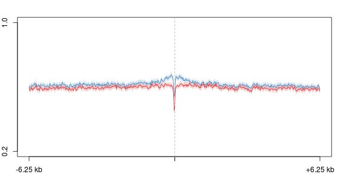

D3xOG rmRNA analysis -- Repeats
========================================================

What percentage of reads map to repeats?
What classes of repeats are transcribed?
How do the expression levels of these classes change in Dnmt3a KOs?

Associate reads with repeats using both Cuffdiff and HTSeq-count


```r
suppressPackageStartupMessages(library(DESeq))
```

```
## Warning: found methods to import for function 'as.list' but not the
## generic itself
```

```r
library(ggplot2)
```


```r
input <- data.frame(c("wt", "ko"), c("d3xog_wt_rmrna_blank_rmsk_count_nh20", 
    "d3xog_ko_rmrna_blank_rmsk_count_nh20"), c("wt", "ko"))
cds <- newCountDataSetFromHTSeqCount(input, "~/s2/data/rna/htseq/")
cds <- estimateSizeFactors(cds)
cds <- estimateDispersions(cds, method = "blind", sharingMode = "fit-only")
cds.counts <- counts(cds, normalized = T)
```


```r
cds.counts <- log2(cds.counts + 1)
cds.counts <- as.data.frame(cds.counts)
cds.counts$ko.wt <- with(cds.counts, ko - wt)
```


```r
gg <- ggplot(cds.counts, aes(wt, ko))
gg + geom_point(alpha = I(1/5)) + geom_abline(slope = 1, xintercept = 0, color = "red")
```

 


#### Annotate snRNAs and tRNA

```r
cds.counts$rna.class <- "NONE"
cds.counts$rna.class[grep("^U", rownames(cds.counts))] <- "snRNA"
cds.counts$rna.class[grep("tRNA", rownames(cds.counts))] <- "tRNA"
```


```r
gg <- ggplot(cds.counts, aes(wt, ko, color = rna.class))
gg + geom_point(alpha = I(1/5)) + geom_abline(slope = 1, xintercept = 0, color = "red") + 
    scale_color_manual(values = c("black", "red", "blue")) + theme(legend.position = c(0.75, 
    0.25))
```

 


#### Aggregate by class

```r
rmsk2 <- read.delim("~/lib/features_general/rmsk2.bed", header = FALSE, colClasses = c("character", 
    "numeric", "numeric", "character", "character", "character"))
cds.counts$class <- rmsk2[match(rownames(cds.counts), rmsk2[, 4]), 5]
cds.counts.class <- ddply(cds.counts, .(class), function(d) apply(d[, 1:3], 
    2, median))
```

```
## Error: could not find function "ddply"
```


```r
gg <- ggplot(cds.counts.class, aes(wt, ko))
```

```
## Error: object 'cds.counts.class' not found
```

```r
gg + geom_point() + geom_abline(slope = 1, xintercept = 0, color = "red")
```

 


```r
cds.counts.class$class <- factor(cds.counts.class$class, levels = cds.counts.class$class[order(cds.counts.class$ko.wt)])
```

```
## Error: object 'cds.counts.class' not found
```

```r
theme_set(theme_bw())
gg <- ggplot(cds.counts.class, aes(class, ko.wt))
```

```
## Error: object 'cds.counts.class' not found
```

```r
gg <- gg + geom_bar(stat = "identity")
gg <- gg + labs(x = "", y = "log2(KO / WT + 1) Normalized reads")
gg <- gg + theme(axis.text.x = element_text(face = "bold"))
gg
```

```
## Warning: position_stack requires constant width: output may be incorrect
```

 


*Housekeeping, or functional, repeats seem to be upregulated*


### 5mC/5hmC of snRNAs 

```
rmsk <- read.delim("~/s2/analysis/features/norm/rpkm/mean/summaries/d3a_bt2_rmsk2.bed_chr_sqrt", row.names=NULL)
rmsk2 <- read.delim("~/lib/features_general/rmsk2.bed", header=F)
m <- match(rmsk[,1], rmsk2[,4])
rmsk <- as.data.frame(rmsk)
rmsk$class <- rmsk2[m, 5]
saveRDS(rmsk, file="~/s2/analysis/features/norm/rpkm/mean/rdata/d3a_bt2_rmsk2.bed_sqrt_class.rds")
```


```r
rmsk <- readRDS("~/s2/analysis/features/norm/rpkm/mean/rdata/d3a_bt2_rmsk2.bed_sqrt_class.rds")

# Remove high-valued outliers
q <- min(apply(rmsk[, 2:5], 2, quantile, c(0.99)))

rmsk <- rmsk[apply(rmsk[, 2:5], 1, max) <= q, ]

rmsk.class <- ddply(rmsk, .(class), function(d) apply(d[, 2:5], 2, median))
```

```
## Error: could not find function "ddply"
```

```r
rmsk.class.m <- melt(rmsk.class)
```

```
## Error: could not find function "melt"
```


```r
# gg <- ggplot(rmsk.class.m, aes(variable, value)) gg +
# geom_bar(stat='identity') + facet_wrap(~class)
```


```r
rmsk.ratio <- data.frame(rmsk$row.names, rmsk$class, hmc.ko.wt = computeScoreRatios(rmsk$moe_d3a_ko_hmc_bt2_rpkm, 
    rmsk$moe_d3a_wt_hmc_bt2_rpkm), mc.ko.wt = computeScoreRatios(rmsk$moe_d3a_ko_mc_bt2_rpkm, 
    rmsk$moe_d3a_wt_mc_bt2_rpkm))
```

```
## Error: could not find function "computeScoreRatios"
```

```r
rmsk.ratio.class <- ddply(rmsk.ratio, .(rmsk.class), function(d) apply(d[, 3:4], 
    2, mean))
```

```
## Error: could not find function "ddply"
```

```r
rmsk.ratio.class.m <- melt(rmsk.ratio.class)
```

```
## Error: could not find function "melt"
```

```r
# rmsk.ratio.class.m$rmsk.class <- factor(rmsk.ratio.class.m$rmsk.class,
# levels=levels(rmsk.ratio.class.m)[order(rmsk.ratio.class.m$value[rmsk.ratio.class.m$variable=='hmc.ko.wt'])])
```


