D3xOG rmRNA -- run13
========================================================

Cuffdiff parameters:
* version 2.1.1
* -b /seq/lib/indexes/mm9.fa 
* -M /home/user/lib/rmsk/rmsk.gtf 
* --compatible-hits-norm
* -u
* --library-norm-method geometric
* --dispersion-method pooled
* genes_chr_protein.gtf

Samples
  * wt
    * 121126/d3xog_wt_rmrna_blank/d3xog_wt_rmrna_blank.bam
  * het 
    * 130326/d3xog_het_rmrna_blank/d3xog_het_rmrna_blank.bam
  * ko
    * 121126/d3xog_ko_rmrna_blank/d3xog_ko_rmrna_blank.bam
    * 130326/d3xog_ko_rmrna_rep2_blank/d3xog_ko_rmrna_rep2_blank.bam
    

```r
opts_chunk$set(warning = FALSE, message = FALSE, error = FALSE)
library(plyr)
```

```
## Attaching package: 'plyr'
```

```
## The following object(s) are masked from '.env':
## 
## unrowname
```

```r
library(reshape2)
library(ggplot2)
library(gridExtra)
```

```
## Loading required package: grid
```

```r
suppressPackageStartupMessages(source("~/src/seqAnalysis/R/features.R"))
suppressPackageStartupMessages(source("~/src/seqAnalysis/R/image.R"))
suppressPackageStartupMessages(source("~/src/seqAnalysis/R/ggplot2.R"))
```


  

```r
samples <- c("omp_hmc_rep1_q30_rmdup_extend300_mean_omp_hmc_rep2_q30_rmdup", 
    "d3xog_het_hmc_sort_q30_rmdup", "d3xog_ko_hmc_sort_q30_rmdup", "omp_mc_rep1_q30_rmdup_extend300", 
    "d3xog_het_mc_sort_q30_rmdup", "d3xog_ko_mc_sort_q30_rmdup", "ngn_hmc_rep1_q30_rmdup_extend300_mean_ngn_hmc_rep2_q30_rmdup", 
    "icam_hmc_rep1_q30_rmdup_extend300_mean_icam_hmc_rep2_q30_rmdup", "ngn_mc_rep1_q30_rmdup_extend300_mean_ngn_mc_rep2_q30_rmdup", 
    "icam_mc_rep1_q30_rmdup_extend300_mean_icam_mc_rep2_q30_rmdup")
data <- lapply(samples, function(x) makeImage(x, "gene_whole_W200N50F50_chr", 
    data_type = "rpkm/mean"))
```

```
## [1] "/media/storage2/analysis/profiles/norm/rpkm/mean/gene_whole_W200N50F50_chr/images/omp_hmc_rep1_q30_rmdup_extend300_mean_omp_hmc_rep2_q30_rmdup"
## [1] "/media/storage2/analysis/profiles/norm/rpkm/mean/gene_whole_W200N50F50_chr/images/d3xog_het_hmc_sort_q30_rmdup"
## [1] "/media/storage2/analysis/profiles/norm/rpkm/mean/gene_whole_W200N50F50_chr/images/d3xog_ko_hmc_sort_q30_rmdup"
## [1] "/media/storage2/analysis/profiles/norm/rpkm/mean/gene_whole_W200N50F50_chr/images/omp_mc_rep1_q30_rmdup_extend300"
## [1] "/media/storage2/analysis/profiles/norm/rpkm/mean/gene_whole_W200N50F50_chr/images/d3xog_het_mc_sort_q30_rmdup"
## [1] "/media/storage2/analysis/profiles/norm/rpkm/mean/gene_whole_W200N50F50_chr/images/d3xog_ko_mc_sort_q30_rmdup"
## [1] "/media/storage2/analysis/profiles/norm/rpkm/mean/gene_whole_W200N50F50_chr/images/ngn_hmc_rep1_q30_rmdup_extend300_mean_ngn_hmc_rep2_q30_rmdup"
## [1] "/media/storage2/analysis/profiles/norm/rpkm/mean/gene_whole_W200N50F50_chr/images/icam_hmc_rep1_q30_rmdup_extend300_mean_icam_hmc_rep2_q30_rmdup"
## [1] "/media/storage2/analysis/profiles/norm/rpkm/mean/gene_whole_W200N50F50_chr/images/ngn_mc_rep1_q30_rmdup_extend300_mean_ngn_mc_rep2_q30_rmdup"
## [1] "/media/storage2/analysis/profiles/norm/rpkm/mean/gene_whole_W200N50F50_chr/images/icam_mc_rep1_q30_rmdup_extend300_mean_icam_mc_rep2_q30_rmdup"
```


#### Compute means of gene body levels

```r
data.mid <- lapply(data, function(x) apply(x[, 51:100], 1, mean))
data.mid <- data.frame(do.call("cbind", data.mid))
colnames(data.mid) <- c("wt_omp_hmc", "het_omp_hmc", "ko_omp_hmc", "wt_omp_mc", 
    "het_omp_mc", "ko_omp_mc", "wt_ngn_hmc", "wt_icam_hmc", "wt_ngn_mc", "wt_icam_mc")
data.mid <- data.mid[order(data.mid[, 1]), ]
```


```r
data.mid$id <- rownames(data.mid)
data.mid.m <- melt(data.mid)
s <- str_split(data.mid.m$variable, "_")
data.mid.m$geno <- factor(unlist(lapply(s, function(x) x[1])), levels = c("wt", 
    "het", "ko"))
levels(data.mid.m$geno) <- c("+/+", "+/-", "-/-")
data.mid.m$celltype <- factor(unlist(lapply(s, function(x) x[2])), levels = c("omp", 
    "ngn", "icam"))
levels(data.mid.m$celltype) <- c("mOSN", "GBC", "HBC")
data.mid.m$mod <- factor(unlist(lapply(s, function(x) x[3])), levels = c("hmc", 
    "mc"))
levels(data.mid.m$mod) <- c("5hmC", "5mC")
```


```r
gene <- read.delim("~/s2/data/rna/cuffdiff/d3xog_wt_het_ko_rmrna_run13/gene_exp.diff")
gene.read <- read.delim("~/s2/data/rna/cuffdiff/d3xog_wt_het_ko_rmrna_run13/genes.read_group_tracking")
gene.read.fpkm <- dcast(gene.read, tracking_id ~ condition + replicate, value.var = "FPKM")
gene.read.fpkm$gene <- gene$gene[match(gene.read.fpkm$tracking_id, gene$test_id)]
gene.read.fpkm <- na.omit(gene.read.fpkm[match(rownames(data.mid), gene.read.fpkm$gene), 
    ])
gene.read.fpkm <- numcolwise(onelog2)(gene.read.fpkm)
cor(gene.read.fpkm)
```

```
##        q1_0   q2_0   q3_0   q3_1
## q1_0 1.0000 0.9606 0.9508 0.9490
## q2_0 0.9606 1.0000 0.9304 0.9683
## q3_0 0.9508 0.9304 1.0000 0.9223
## q3_1 0.9490 0.9683 0.9223 1.0000
```

```r
gene.read.fpkm.m <- melt(gene.read.fpkm)
levels(gene.read.fpkm.m$variable) <- c("+/+", "+/-", "-/- rep1", "-/- rep2")
```


```r
gg <- ggplot(gene.read.fpkm.m, aes(value, color = variable))
gg + geom_density() + facet_grid(variable ~ .) + scale_color_brewer(palette = "Set1") + 
    labs(x = "log2(FPKM+1)")
```

 


```r
gene.read.fpkm.0 <- gene.read.fpkm[, c("q3_0", "q2_0", "q1_0")]
gene.read.fpkm.0.sub <- pairwise(gene.read.fpkm.0, subtract)
```

```
## [1] "q3_0" "q2_0"
## [1] "q3_0" "q1_0"
## [1] "q2_0" "q1_0"
```


```r
gene.read.fpkm.c100 <- chunkMatrix(gene.read.fpkm, 100, median)
head(gene.read.fpkm.c100)
```

```
##             q1_0 q2_0    q3_0   q3_1 index
## result.1 0.00000    0 0.00000 0.0000     1
## result.2 0.00000    0 0.00000 0.0000     2
## result.3 0.00000    0 0.00000 0.0000     3
## result.4 0.00000    0 0.00000 0.1326     4
## result.5 0.00000    0 0.00000 0.0841     5
## result.6 0.02085    0 0.09519 0.1315     6
```

```r
gene.read.fpkm.c100.m <- melt(gene.read.fpkm.c100, id.vars = "index")
levels(gene.read.fpkm.c100.m$variable) <- c("+/+", "+/-", "-/- rep1", "-/- rep2")
```


### Replicates separate
#### Ordered by gene body 5hmC 


```r
theme_set(theme_bw())
gg.rep <- ggplot(gene.read.fpkm.c100.m[gene.read.fpkm.c100.m$variable %in% c("+/+"), 
    ], aes(index, value, color = variable))
gg.rep + geom_point() + scale_color_brewer(name = "Dnmt3a", palette = "Set1") + 
    stat_smooth(se = F) + coord_cartesian(ylim = c(0, 5)) + labs(x = "5hmC gene body index", 
    y = "log2(FPKM+1)") + theme(legend.position = c(0.8, 0.3))
```

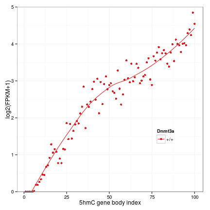 


```r
gg.rep <- ggplot(gene.read.fpkm.c100.m[gene.read.fpkm.c100.m$variable %in% c("+/+", 
    "+/-"), ], aes(index, value, color = variable))
gg.rep + geom_point() + scale_color_brewer(name = "Dnmt3a", palette = "Set1") + 
    stat_smooth(se = F) + coord_cartesian(ylim = c(0, 5)) + labs(x = "5hmC gene body index", 
    y = "log2(FPKM+1)") + theme(legend.position = c(0.8, 0.3))
```

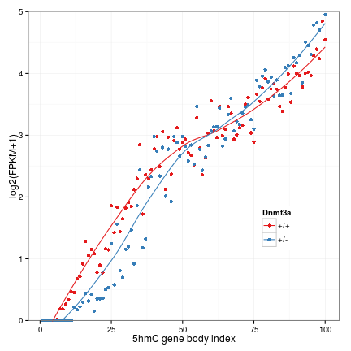 


```r
gg.rep <- ggplot(gene.read.fpkm.c100.m[gene.read.fpkm.c100.m$variable %in% c("+/+", 
    "+/-", "-/- rep1"), ], aes(index, value, color = variable))
gg.rep + geom_point() + scale_color_brewer(name = "Dnmt3a", palette = "Set1") + 
    stat_smooth(se = F) + coord_cartesian(ylim = c(0, 5)) + labs(x = "5hmC gene body index", 
    y = "log2(FPKM+1)") + theme(legend.position = c(0.8, 0.3))
```

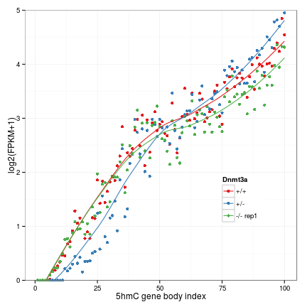 


```r
gg.rep <- ggplot(gene.read.fpkm.c100.m[gene.read.fpkm.c100.m$variable %in% c("+/+", 
    "+/-", "-/- rep2"), ], aes(index, value, color = variable))
gg.rep + geom_point() + scale_color_brewer(name = "Dnmt3a", palette = "Set1") + 
    stat_smooth(se = F) + coord_cartesian(ylim = c(0, 5)) + labs(x = "5hmC gene body index", 
    y = "log2(FPKM+1)") + theme(legend.position = c(0.8, 0.3))
```

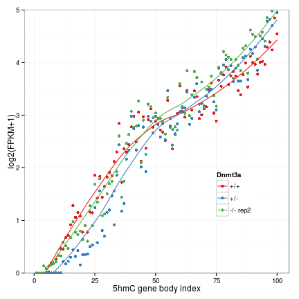 


```r
gene.read.fpkm.0.sub.c100 <- chunkMatrix(gene.read.fpkm.0.sub, 100, mean)
head(gene.read.fpkm.0.sub.c100)
```

```
##          q3_0_q2_0 q3_0_q1_0 q2_0_q1_0 index
## result.1  0.005548  -0.01405  -0.01960     1
## result.2  0.068166   0.03934  -0.02882     2
## result.3  0.136733   0.05172  -0.08501     3
## result.4  0.244569   0.09909  -0.14548     4
## result.5  0.235306   0.05214  -0.18317     5
## result.6  0.265560  -0.01623  -0.28179     6
```

```r
gene.read.fpkm.0.sub.c100.m <- melt(gene.read.fpkm.0.sub.c100, id.vars = "index")
```


FPKM densities

```r
par(mfrow = c(2, 3))
apply(gene.read.fpkm, 2, function(x) plot(density(x)))
```

```
## NULL
```

 


```r
gene.fpkm <- read.delim("~/s2/data/rna/cuffdiff/d3xog_wt_het_ko_rmrna_run13/genes.fpkm_tracking")
gene.fpkm.mat <- gene.fpkm[, c("gene_short_name", "q1_FPKM", "q2_FPKM", "q3_FPKM")]
gene.fpkm.mat <- na.omit(gene.fpkm.mat[match(rownames(data.mid), gene.fpkm.mat[, 
    1]), ])
gene.fpkm.mat.1log2 <- numcolwise(onelog2)(gene.fpkm.mat)
gene.fpkm.mat.1log2$id <- gene.fpkm.mat$gene_short_name
gene.fpkm.mat.1log2 <- transform(gene.fpkm.mat.1log2, q2.q1 = q2_FPKM - q1_FPKM, 
    q3.q1 = q3_FPKM - q1_FPKM)


gene.fpkm.mat.c100 <- chunkMatrix(gene.fpkm.mat.1log2[, -grep("id", colnames(gene.fpkm.mat.1log2))], 
    100, median)
gene.fpkm.mat.c100.m <- melt(gene.fpkm.mat.c100, id.vars = "index")
levels(gene.fpkm.mat.c100.m$variable) <- c("+/+", "+/-", "-/-", "Het / WT", 
    "KO / WT")
```


```r
gg <- gg_scatter(gene.fpkm.mat.1log2, "q1_FPKM", "q3_FPKM", 10, density = T)
gg
```

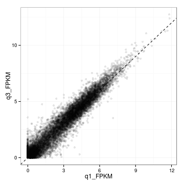 


### Ordered by gene body 5hmC

```r
gg <- ggplot(gene.fpkm.mat.c100.m[-grep("WT", gene.fpkm.mat.c100.m$variable), 
    ], aes(index, value, color = variable))
gg + geom_point() + scale_color_brewer(name = "Dnmt3a", palette = "Set1") + 
    stat_smooth(se = F) + coord_cartesian(ylim = c(0, 5)) + labs(x = "5hmC gene body index", 
    y = "log2(FPKM+1)") + theme(legend.position = c(0.8, 0.3))
```

 


```r
gg <- ggplot(gene.fpkm.mat.c100.m[grep("WT", gene.fpkm.mat.c100.m$variable), 
    ], aes(index, value, color = variable))
gg + geom_point() + scale_color_brewer(name = "Dnmt3a", palette = "Set1") + 
    stat_smooth(se = F) + coord_cartesian(ylim = c(-1, 1)) + labs(x = "5hmC gene body index", 
    y = "log2(FPKM+1)") + theme(legend.position = c(0.8, 0.3))
```

 


### Ordered by gene body 5hmC KO / WT

```r
data.mid.1log2 <- log2(data.mid + 0.01)
data.mid.1log2 <- pairwise(data.mid.1log2[, 6:1], subtract)
data.mid.1log2 <- data.mid.1log2[order(data.mid.1log2[, "ko_omp_hmc_wt_omp_hmc"]), 
    ]
data.mid <- data.mid[order(data.mid.1log2[, "ko_omp_hmc_wt_omp_hmc"]), ]

data.mid.1log2.c100 <- chunkMatrix(data.mid.1log2, 100, median)
data.mid.1log2.c100.m <- melt(data.mid.1log2.c100, id.vars = "index")
```


```r
gene.fpkm.mat <- na.omit(gene.fpkm.mat[match(rownames(data.mid), gene.fpkm.mat[, 
    1]), ])
gene.fpkm.mat.1log2 <- numcolwise(onelog2)(gene.fpkm.mat)
gene.fpkm.mat.1log2$id <- gene.fpkm.mat$gene_short_name
gene.fpkm.mat.1log2 <- transform(gene.fpkm.mat.1log2, q2.q1 = q2_FPKM - q1_FPKM, 
    q3.q1 = q3_FPKM - q1_FPKM)


gene.fpkm.mat.c100 <- chunkMatrix(gene.fpkm.mat.1log2[, -grep("id", colnames(gene.fpkm.mat.1log2))], 
    100, median)
gene.fpkm.mat.c100.m <- melt(gene.fpkm.mat.c100, id.vars = "index")
levels(gene.fpkm.mat.c100.m$variable) <- c("+/+", "+/-", "-/-", "Het / WT", 
    "KO / WT")
```


```r
gg <- ggplot(data.mid.1log2.c100.m[data.mid.1log2.c100.m$variable == "ko_omp_hmc_wt_omp_hmc", 
    ], aes(index, value))
gg + geom_point()
```

 


```r
gg <- ggplot(gene.fpkm.mat.c100.m[-grep("WT", gene.fpkm.mat.c100.m$variable), 
    ], aes(index, value, color = variable))
gg + geom_point() + scale_color_brewer(name = "Dnmt3a", palette = "Set1") + 
    stat_smooth(se = F) + coord_cartesian(ylim = c(0, 5)) + labs(x = "5hmC gene body index", 
    y = "log2(FPKM+1)") + theme(legend.position = c(0.8, 0.3))
```

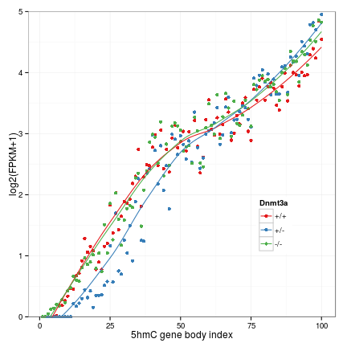 


```r
gg <- ggplot(gene.fpkm.mat.c100.m[grep("WT", gene.fpkm.mat.c100.m$variable), 
    ], aes(index, value, color = variable))
gg + geom_point() + scale_color_brewer(name = "Dnmt3a", palette = "Set1") + 
    stat_smooth(se = F) + coord_cartesian(ylim = c(-1, 1)) + labs(x = "5hmC gene body index", 
    y = "log2(FPKM+1)") + theme(legend.position = c(0.8, 0.3))
```

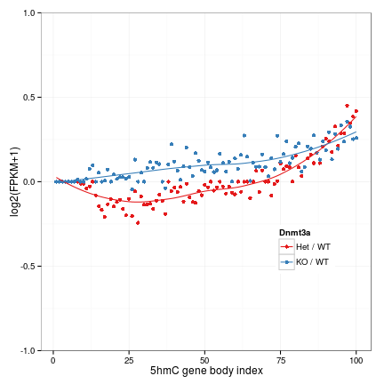 


### Ordered by WT RNA

```r
gene.fpkm.mat <- gene.fpkm.mat[order(gene.fpkm.mat[, "q1_FPKM"]), ]
gene.fpkm.mat.c100 <- chunkMatrix(gene.fpkm.mat[, -grep("gene", colnames(gene.fpkm.mat))], 
    100, median)
gene.fpkm.mat.c100.m <- melt(gene.fpkm.mat.c100, id.vars = "index")
```


```r
gg <- ggplot(gene.fpkm.mat.c100.m, aes(index, value, color = variable))
gg + geom_point()
```

 


### 5hmC versus RNA

```r
gene.fpkm.mat <- gene.fpkm.mat[order(gene.fpkm.mat[, "q1_FPKM"]), ]
gene.fpkm.mat.nz <- gene.fpkm.mat[gene.fpkm.mat$q1_FPKM > 0, ]
data.mid <- data.mid[match(gene.fpkm.mat.nz$gene_short_name, rownames(data.mid)), 
    ]
data.mid.c100 <- chunkMatrix(data.mid[-grep("id", colnames(data.mid))], 500, 
    median)
data.mid.c100.m <- melt(data.mid.c100, id.vars = "index")
```


```r
s <- str_split(data.mid.c100.m$variable, "_")
data.mid.c100.m$geno <- factor(unlist(lapply(s, function(x) x[1])), levels = c("wt", 
    "het", "ko"))
levels(data.mid.c100.m$geno) <- c("+/+", "+/-", "-/-")
data.mid.c100.m$celltype <- factor(unlist(lapply(s, function(x) x[2])), levels = c("omp", 
    "ngn", "icam"))
levels(data.mid.c100.m$celltype) <- c("mOSN", "GBC", "HBC")
data.mid.c100.m$mod <- factor(unlist(lapply(s, function(x) x[3])), levels = c("hmc", 
    "mc"))
levels(data.mid.c100.m$mod) <- c("5hmC", "5mC")
```


```r
gg <- ggplot(data.mid.c100.m[data.mid.c100.m$celltype == "mOSN", ], aes(index, 
    value, color = geno))
gg + facet_grid(mod ~ .) + stat_smooth(se = T)
```

 


```r
data.mid$id <- rownames(data.mid)
data.mid.m <- melt(data.mid)
s <- str_split(data.mid.m$variable, "_")
data.mid.m$geno <- factor(unlist(lapply(s, function(x) x[1])), levels = c("wt", 
    "het", "ko"))
levels(data.mid.m$geno) <- c("+/+", "+/-", "-/-")
data.mid.m$celltype <- factor(unlist(lapply(s, function(x) x[2])), levels = c("omp", 
    "ngn", "icam"))
levels(data.mid.m$celltype) <- c("mOSN", "GBC", "HBC")
data.mid.m$mod <- factor(unlist(lapply(s, function(x) x[3])), levels = c("hmc", 
    "mc"))
levels(data.mid.m$mod) <- c("5hmC", "5mC")
data.mid.m$index <- 1:nrow(data.mid)
```


```r
gg <- ggplot(data.mid.m[data.mid.m$celltype == "mOSN", ], aes(index, value, 
    color = geno))
gg + facet_grid(mod ~ .) + stat_smooth(se = T) + scale_color_brewer(palette = "Set1", 
    name = "Dnmt3a") + labs(x = "mOSN expression index", y = "Mean RPKM")
```

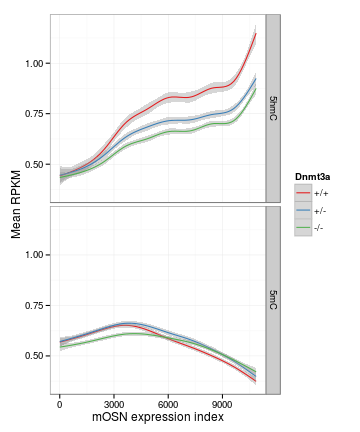 


Compare with developmental gene expression 
--------------------------------------------------

```r
gene.sig <- gene[gene$significant == "yes", ]
cells.rna <- readRDS("~/s2/analysis/rna/rdata/omp_ngn_icam_mrna_ucsc_fpkm_1log2.rds")
cells.rna.m <- melt(cells.rna)
levels(cells.rna.m$variable) <- c("mOSN", "GBC", "HBC")
```


```r
gene.sig.q3.up <- gene.sig[gene.sig$sample_2 == "q3" & gene.sig$log2.fold_change. > 
    0, ]
dim(gene.sig.q3.up[!duplicated(gene.sig.q3.up$gene), ])
```

```
## [1] 211  14
```

```r
gene.sig.q3.down <- gene.sig[gene.sig$sample_2 == "q3" & gene.sig$log2.fold_change. < 
    0, ]
dim(gene.sig.q3.down)
```

```
## [1] 13 14
```

```r
cells.rna.m$sig.q3.up <- cells.rna.m$id %in% gene.sig.q3.up$gene
cells.rna.m$sig.q3.down <- cells.rna.m$id %in% gene.sig.q3.down$gene
```


Significantly upregulated genes in mOSNs are expressed in ICAM

```r
gg <- ggplot(cells.rna.m, aes(variable, value, fill = sig.q3.up))
gg <- gg + geom_boxplot(outlier.shape = NA) + scale_fill_manual(name = "Upregulated in Dnmt3a -/- mOSNs", 
    values = c("grey", "red3")) + labs(x = "", y = "log2(FPKM + 1)")
gg <- gg + theme(legend.position = c(0.4, 0.9)) + coord_cartesian(ylim = c(0, 
    12))
gg
```

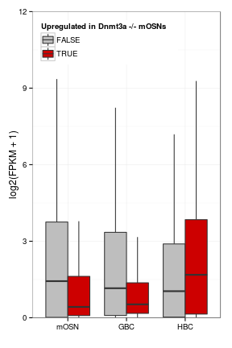 


```r
gg <- ggplot(cells.rna.m, aes(variable, value, fill = sig.q3.down))
gg + geom_boxplot()
```

 


```r
gene.fpkm.mat.1log2.m <- melt(gene.fpkm.mat.1log2)
```


```r
cells.class <- read.delim("~/s2/analysis/rna/summaries/omp_ngn_icam_mrna_ucsc_fpkm_1log2_rna_class.txt")
gene.fpkm.mat.1log2.m$class <- cells.class$class[match(gene.fpkm.mat.1log2.m$id, 
    cells.class$id)]
gene.fpkm.mat.1log2.m <- na.omit(gene.fpkm.mat.1log2.m)
gene.fpkm.mat.1log2.m$class <- factor(gene.fpkm.mat.1log2.m$class, levels = c("mosn-specific", 
    "mosn/gbc-common", "gbc-specific", "gbc/hbc-common", "hbc-specific"))
```


Not general increase in HBC-specific gene expression

```r
gg <- ggplot(na.omit(gene.fpkm.mat.1log2.m[gene.fpkm.mat.1log2.m$variable == 
    "q3.q1", ]), aes(value, color = class))
gg + geom_density() + geom_vline(xintercept = 0, linetype = 2) + scale_color_brewer(palette = "Set1") + 
    facet_grid(class ~ .)
```

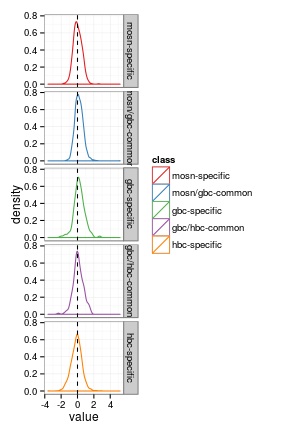 


### Gene body 5hmC 

```r
hmc <- makeFeatureMatrix2("refgene_nodup.bed_chr", "d3xog_tt3_hmc", data_type = "rpkm/mean")
```

```
## [1] "omp_hmc_rep1_q30_rmdup_extend300_mean_omp_hmc_rep2_q30_rmdup"
## [2] "d3xog_het_hmc_paired_q30"                                    
## [3] "d3xog_ko_hmc_paired_q30"                                     
## [4] "ott3_hmc_rep1_mean_ott3_hmc_rep2"
```

```r
hmc.m <- melt(hmc)
hmc.m$id <- rownames(hmc)
```


```r
data.mid.m$sig.q3.up <- data.mid.m$id %in% gene.sig.q3.up$gene
```


```r
data.mid.m.ratio <- ddply(data.mid.m[data.mid.m$celltype == "mOSN", ], .(mod, 
    sig.q3.up, id), summarize, ko.wt = log2((value[geno == "-/-"] + 0.01)/(value[geno == 
    "+/+"] + 0.01)))
```


```r
gg <- ggplot(data.mid.m.ratio, aes(ko.wt, color = sig.q3.up))
gg + geom_density() + facet_grid(mod ~ .) + geom_vline(xintercept = 0, linetype = 2) + 
    scale_color_manual(name = "Upregulated in Dnmt3a -/- mOSNs", values = c("grey3", 
        "red3")) + coord_cartesian(xlim = c(-2, 2))
```

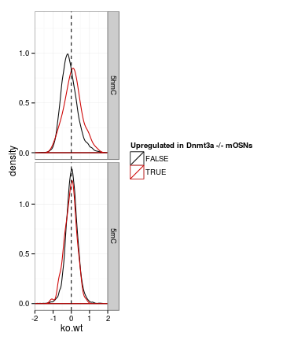 


