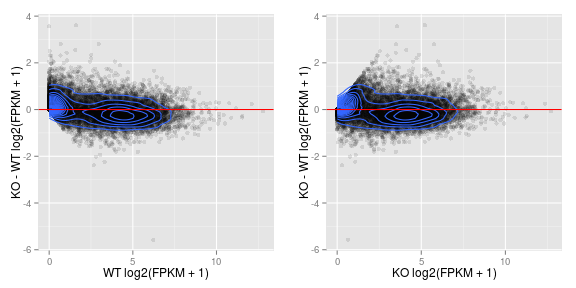
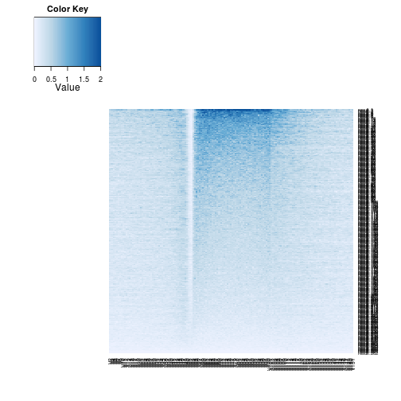
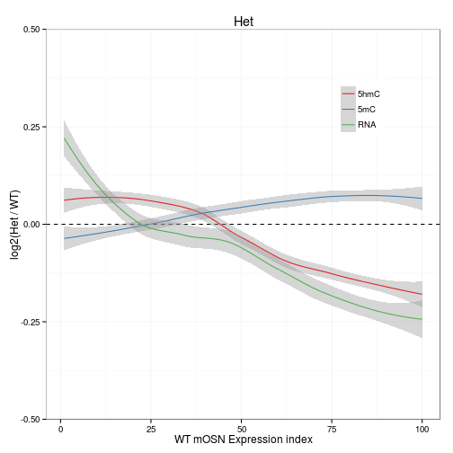
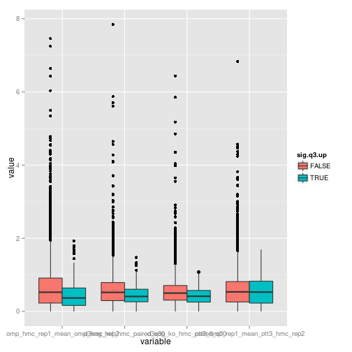
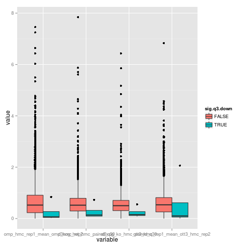

D3xOG rmRNA -- run8
========================================================

Cuffdiff parameters:
* version 2.1.1
* -b /seq/lib/indexes/mm9.fa 
* -M /home/user/lib/rmsk/rmsk.gtf 
* --compatible-hits-norm
* -u
* --library-norm-method geometric
* --dispersion-method pooled
* genes_chr_protein.gtf

Samples
  * wt
    * 121126/omp_rmrna_blank/omp_rmrna_rep1_blank.bam
    * 130326/omp_rmrna_rep2_blank/omp_rmrna_rep2_blank.bam
    * 121126/d3xog_wt_rmrna_blank/d3xog_wt_rmrna_blank.bam
  * het 
    * 130326/d3xog_het_rmrna_blank/d3xog_het_rmrna_blank.bam
  * ko
    * 121126/d3xog_ko_rmrna_blank/d3xog_ko_rmrna_blank.bam
    * 130326/d3xog_ko_rmrna_rep2_blank/d3xog_ko_rmrna_rep2_blank.bam
    

```r
opts_chunk$set(warning = FALSE, message = FALSE, error = FALSE)
library(plyr)
library(reshape2)
library(ggplot2)
library(gridExtra)
```

```
## Loading required package: grid
```

```r
suppressPackageStartupMessages(source("~/src/seqAnalysis/R/features.R"))
suppressPackageStartupMessages(source("~/src/seqAnalysis/R/image.R"))
```


  

```r
wt.hmc <- makeImage("omp_hmc_rep1_mean_omp_hmc_rep2", "gene_whole_W200N50F50_chr", 
    data_type = "rpkm/mean", image = F)
```

```
## [1] "/media/storage2/analysis/profiles/norm/rpkm/mean/gene_whole_W200N50F50_chr/images/omp_hmc_rep1_mean_omp_hmc_rep2"
```

```r
# wt.hmc <- makeImage('omp_hmc_120424_rpkm', 'gene_whole_W200N50F50_chr',
# data_type='rpkm/mean', image=F)
het.hmc <- makeImage("d3xog_het_hmc_paired_q30", "gene_whole_W200N50F50_chr", 
    data_type = "rpkm/mean", image = F)
```

```
## [1] "/media/storage2/analysis/profiles/norm/rpkm/mean/gene_whole_W200N50F50_chr/images/d3xog_het_hmc_paired_q30"
```

```r
ko.hmc <- makeImage("d3xog_ko_hmc_paired_q30", "gene_whole_W200N50F50_chr", 
    data_type = "rpkm/mean", image = F)
```

```
## [1] "/media/storage2/analysis/profiles/norm/rpkm/mean/gene_whole_W200N50F50_chr/images/d3xog_ko_hmc_paired_q30"
```


#### Compute means of gene body levels

```r
wt.hmc.up <- apply(wt.hmc[, 51:100], 1, mean)
het.hmc.up <- apply(het.hmc[, 51:100], 1, mean)
ko.hmc.up <- apply(ko.hmc[, 51:100], 1, mean)

wt.hmc.up <- wt.hmc.up[order(wt.hmc.up)]
het.hmc.up <- het.hmc.up[match(names(wt.hmc.up), names(het.hmc.up))]
ko.hmc.up <- ko.hmc.up[match(names(wt.hmc.up), names(ko.hmc.up))]

hmc.up <- cbind(wt.hmc.up, het.hmc.up, ko.hmc.up)
hmc.up.c100 <- chunkMatrix(hmc.up, 100)
hmc.up.c100.m <- melt(hmc.up.c100, id.vars = "index")
```


```r
gg <- ggplot(hmc.up.c100.m, aes(index, value, color = variable))
gg + geom_point() + coord_cartesian(xlim = c(20, 100))
```

 


```r
gene <- read.delim("~/s2/data/rna/cuffdiff/d3xog_wt_het_ko_rmrna_run8/gene_exp.diff")
gene.read <- read.delim("~/s2/data/rna/cuffdiff/d3xog_wt_het_ko_rmrna_run8/genes.read_group_tracking")
gene.read.fpkm <- dcast(gene.read, tracking_id ~ condition + replicate, value.var = "FPKM")
gene.read.fpkm$gene <- gene$gene[match(gene.read.fpkm$tracking_id, gene$test_id)]
gene.read.fpkm <- na.omit(gene.read.fpkm[match(names(wt.hmc.up), gene.read.fpkm$gene), 
    ])
gene.read.fpkm <- numcolwise(onelog2)(gene.read.fpkm)
cor(gene.read.fpkm)
```

```
##        q1_0   q1_1   q1_2   q2_0   q3_0   q3_1
## q1_0 1.0000 0.9742 0.9479 0.9788 0.9215 0.9621
## q1_1 0.9742 1.0000 0.9581 0.9698 0.9127 0.9760
## q1_2 0.9479 0.9581 1.0000 0.9517 0.9414 0.9615
## q2_0 0.9788 0.9698 0.9517 1.0000 0.9306 0.9684
## q3_0 0.9215 0.9127 0.9414 0.9306 1.0000 0.9223
## q3_1 0.9621 0.9760 0.9615 0.9684 0.9223 1.0000
```


```r
gene.read.fpkm.0 <- gene.read.fpkm[, c("q3_0", "q2_0", "q1_0")]
gene.read.fpkm.0.sub <- pairwise(gene.read.fpkm.0, subtract)
```

```
## [1] "q3_0" "q2_0"
## [1] "q3_0" "q1_0"
## [1] "q2_0" "q1_0"
```


```r
gene.read.fpkm.c100 <- chunkMatrix(gene.read.fpkm, 100, median)
head(gene.read.fpkm.c100)
```

```
##          q1_0 q1_1   q1_2 q2_0 q3_0    q3_1 index
## result.1    0    0 0.0000    0    0 0.00000     1
## result.2    0    0 0.0000    0    0 0.00000     2
## result.3    0    0 0.0000    0    0 0.00000     3
## result.4    0    0 0.0000    0    0 0.09997     4
## result.5    0    0 0.0000    0    0 0.08775     5
## result.6    0    0 0.1138    0    0 0.12034     6
```

```r
gene.read.fpkm.c100.m <- melt(gene.read.fpkm.c100, id.vars = "index")
```


#### Replicates separate

```r
gg.rep <- ggplot(gene.read.fpkm.c100.m[gene.read.fpkm.c100.m$variable %in% c("q1_0", 
    "q2_0", "q3_0"), ], aes(index, value, color = variable))
gg.rep + geom_point() + scale_color_manual(values = c("red1", "blue", "green2"))
```

 


```r
gene.read.fpkm.0.sub.c100 <- chunkMatrix(gene.read.fpkm.0.sub, 100, mean)
head(gene.read.fpkm.0.sub.c100)
```

```
##          q3_0_q2_0 q3_0_q1_0 q2_0_q1_0 index
## result.1   0.02375 -0.001525 -0.025270     1
## result.2   0.07166  0.048927 -0.022733     2
## result.3   0.09774  0.086690 -0.011046     3
## result.4   0.25046  0.251737  0.001277     4
## result.5   0.24144  0.203878 -0.037564     5
## result.6   0.19865  0.129218 -0.069433     6
```

```r
gene.read.fpkm.0.sub.c100.m <- melt(gene.read.fpkm.0.sub.c100, id.vars = "index")
```


```r
gg.rep <- ggplot(gene.read.fpkm.0.sub.c100.m, aes(index, value, color = variable))
gg.rep + geom_point() + scale_color_manual(values = c("red1", "blue", "green2"))
```

 


```r
par(mfrow = c(2, 3))
apply(gene.read.fpkm, 2, function(x) plot(density(x)))
```

 

```
## NULL
```


```r
gene.fpkm <- read.delim("~/s2/data/rna/cuffdiff/d3xog_wt_het_ko_rmrna_run8/genes.fpkm_tracking")
gene.fpkm.mat <- gene.fpkm[, c("gene_short_name", "q1_FPKM", "q2_FPKM", "q3_FPKM")]
gene.fpkm.mat <- na.omit(gene.fpkm.mat[match(names(wt.hmc.up), gene.fpkm.mat[, 
    1]), ])
gene.fpkm.mat <- numcolwise(onelog2)(gene.fpkm.mat)
gene.fpkm.mat <- transform(gene.fpkm.mat, q2.q1 = q2_FPKM - q1_FPKM, q3.q1 = q3_FPKM - 
    q1_FPKM)


gene.fpkm.mat.c100 <- chunkMatrix(gene.fpkm.mat, 100, median)
gene.fpkm.mat.c100.m <- melt(gene.fpkm.mat.c100, id.vars = "index")
```


### MAplots

```r
rna.gg <- ggplot(gene.fpkm.mat, aes(q1_FPKM, q3.q1)) + geom_point(alpha = I(1/10)) + 
    geom_density2d(breaks = seq(0, 0.5, 0.025)) + labs(x = "WT log2(FPKM + 1)", 
    y = "KO - WT log2(FPKM + 1)") + geom_hline(yintercept = 0, color = "red")
# rna.gg
rna2.gg <- ggplot(gene.fpkm.mat, aes(q3_FPKM, q3.q1)) + geom_point(alpha = I(1/10)) + 
    geom_density2d(breaks = seq(0, 0.5, 0.025)) + labs(x = "KO log2(FPKM + 1)", 
    y = "KO - WT log2(FPKM + 1)") + geom_hline(yintercept = 0, color = "red")
# rna.count.gg <- ggplot(rna.counts.1log2.nz, aes(wt, ko.wt)) +
# geom_point(alpha=I(1/10)) + geom_density2d(breaks=seq(0, .5,.025)) +
# labs(title='Counts DESeq norm')
grid.arrange(rna.gg, rna2.gg, ncol = 2)
```

 


```r
gg <- ggplot(gene.fpkm.mat.c100.m, aes(index, value, color = variable))
gg + geom_point()
```

 


```r
gg <- ggplot(gene.fpkm.mat.c100.m[gene.fpkm.mat.c100.m$variable %in% c("q2.q1", 
    "q3.q1"), ], aes(index, value, color = variable))
gg + geom_point()
```

 


```r
gene.fpkm.mat <- transform(gene.fpkm.mat, q2.q1 = q2_FPKM - q1_FPKM, q3.q1 = q3_FPKM - 
    q1_FPKM)
par(mfrow = c(1, 5))
apply(gene.fpkm.mat, 2, function(x) plot(density(x)))
```

 

```
## NULL
```


Compare with developmental gene expression 
--------------------------------------------------

```r
gene.sig <- gene[gene$significant == "yes", ]
cells.rna <- read.delim("~/s2/analysis/rna/summaries/omp_ngn_icam_mrna_dup_biasCorrect_plus1_log2")
cells.rna.m <- melt(cells.rna)
cells.rna.m$id <- rownames(cells.rna)
```


```r
gene.sig.q3.up <- gene.sig[gene.sig$sample_2 == "q3" & gene.sig$log2.fold_change. > 
    0, ]
dim(gene.sig.q3.up[!duplicated(gene.sig.q3.up$gene), ])
```

```
## [1] 230  14
```

```r
gene.sig.q3.down <- gene.sig[gene.sig$sample_2 == "q3" & gene.sig$log2.fold_change. < 
    0, ]
dim(gene.sig.q3.down)
```

```
## [1]  6 14
```

```r
cells.rna.m$sig.q3.up <- cells.rna.m$id %in% gene.sig.q3.up$gene
cells.rna.m$sig.q3.down <- cells.rna.m$id %in% gene.sig.q3.down$gene
```


```r
gg <- ggplot(cells.rna.m, aes(variable, value, fill = sig.q3.up))
gg + geom_boxplot()
```

 


```r
gg <- ggplot(cells.rna.m, aes(variable, value, fill = sig.q3.down))
gg + geom_boxplot()
```

 


### Gene body 5hmC 

```r
hmc <- makeFeatureMatrix2("refgene_nodup.bed_chr", "d3xog_tt3_hmc", data_type = "rpkm/mean")
```

```
## [1] "omp_hmc_rep1_mean_omp_hmc_rep2"   "d3xog_het_hmc_paired_q30"        
## [3] "d3xog_ko_hmc_paired_q30"          "ott3_hmc_rep1_mean_ott3_hmc_rep2"
```

```r
hmc.m <- melt(hmc)
hmc.m$id <- rownames(hmc)
```


```r
hmc.m$sig.q3.up <- hmc.m$id %in% gene.sig.q3.up$gene
hmc.m$sig.q3.down <- hmc.m$id %in% gene.sig.q3.down$gene
```


```r
gg <- ggplot(hmc.m, aes(variable, value, fill = sig.q3.up))
gg + geom_boxplot()
```

 


```r
gg <- ggplot(hmc.m, aes(variable, value, fill = sig.q3.down))
gg + geom_boxplot()
```

 

