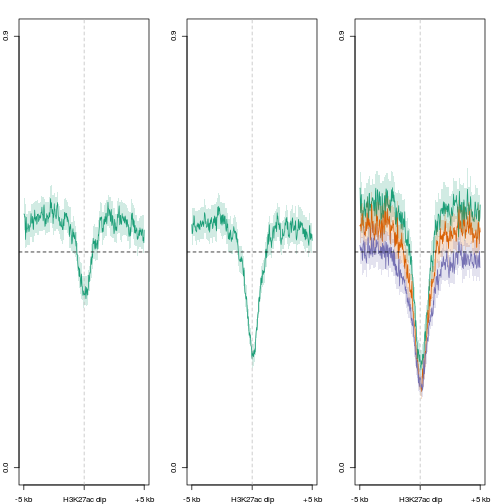
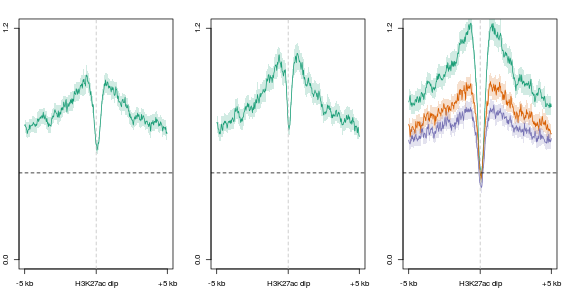
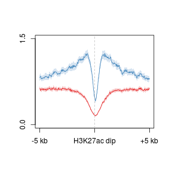
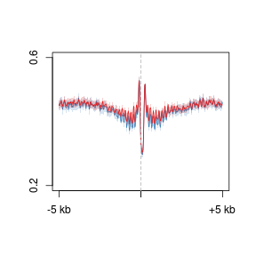
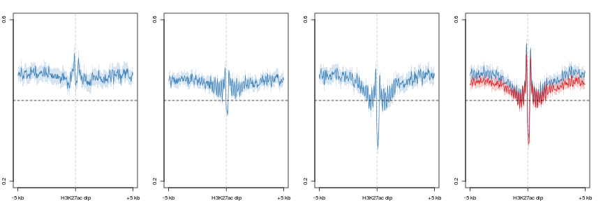
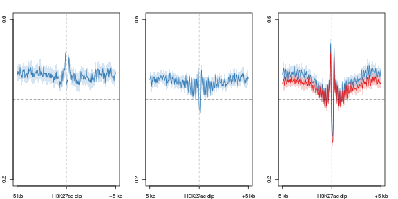
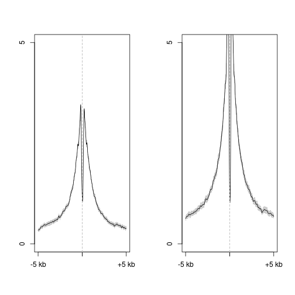
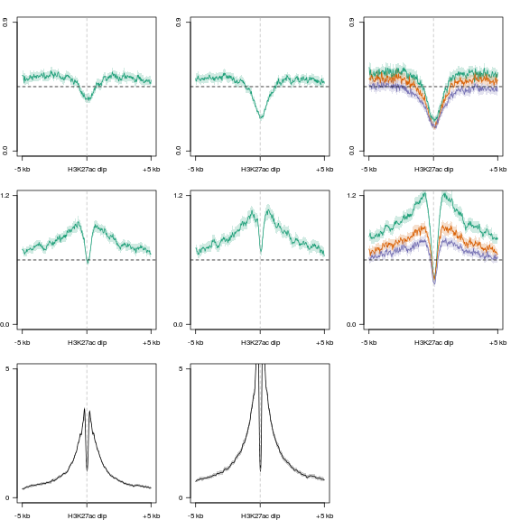

H3K27ac dips - profiles
========================================================


```r
suppressPackageStartupMessages(source("~/src/seqAnalysis/R/profiles2.R"))
```


```r
makeProfile2.allSamp("ak27_F3_interV_genes_W25F100_ak27_height3_min1.bed_W25F200_both_chr", 
    data_type = "rpkm/mean")
```

```
## [1] "/media/storage2/analysis/profiles/norm/rpkm/mean/ak27_F3_interV_genes_W25F100_ak27_height3_min1.bed_W25F200_both_chr"
## Note: next may be used in wrong context: no loop is visible
```

```
## Error: task 1 failed - "no loop for break/next, jumping to top level"
```


```r
par(mfrow = c(1, 3), mar = c(2, 2, 2, 2))
plot2("ak27_F3_interV_genes_W25F100_ak27_height3_min1.bed_W25F200_both_chr", 
    "icam_mc_rep1_q30_rmdup_extend300_mean_icam_mc_rep2_q30_rmdup", data_type = "rpkm/mean", 
    cols = col3[1], y.vals = c(0, 0.9), lab = "H3K27ac dip")
```

```
## [1] "icam_mc_rep1_q30_rmdup_extend300_mean_icam_mc_rep2_q30_rmdup_mean"
```

```
## [1] 0.0 0.9
```

```r
abline(h = 0.45, lty = 2)
plot2("ak27_F3_interV_genes_W25F100_ak27_height3_min1.bed_W25F200_both_chr", 
    "ngn_mc_rep1_q30_rmdup_extend300_mean_ngn_mc_rep2_q30_rmdup", data_type = "rpkm/mean", 
    cols = col3[1], y.vals = c(0, 0.9), lab = "H3K27ac dip")
```

```
## [1] "ngn_mc_rep1_q30_rmdup_extend300_mean_ngn_mc_rep2_q30_rmdup_mean"
```

```
## [1] 0.0 0.9
```

```r
abline(h = 0.45, lty = 2)
plot2.several("ak27_F3_interV_genes_W25F100_ak27_height3_min1.bed_W25F200_both_chr", 
    "d3xog_mc", data_type = "rpkm/mean", cols = col3, y.vals = c(0, 0.9), lab = "H3K27ac dip")
```

```
## [1] "omp_mc_rep1_q30_rmdup_extend300_mean"
## [1] "d3xog_het_mc_sort_q30_rmdup_mean"
## [1] "d3xog_ko_mc_sort_q30_rmdup_mean"
```

```
## [1] 0.0 0.9
```

```r
abline(h = 0.45, lty = 2)
```

 


### 5hmC
Reduction of levels flanking H3K27ac dip site, however not complete loss. Explained by reduction of Dnmt3a-mediated 5mC substrate; however, targeting still occurs. 
Targeting of oxidation is Dnmt3a-independent.

```r
par(mfrow = c(1, 3), mar = c(2, 2, 2, 2))
plot2("ak27_F3_interV_genes_W25F100_ak27_height3_min1.bed_W25F200_both_chr", 
    "icam_hmc_rep1_q30_rmdup_extend300_mean_icam_hmc_rep2_q30_rmdup", data_type = "rpkm/mean", 
    cols = col3[1], y.vals = c(0, 1.2), lab = "H3K27ac dip")
```

```
## [1] "icam_hmc_rep1_q30_rmdup_extend300_mean_icam_hmc_rep2_q30_rmdup_mean"
```

```
## [1] 0.0 1.2
```

```r
abline(h = 0.45, lty = 2)
plot2("ak27_F3_interV_genes_W25F100_ak27_height3_min1.bed_W25F200_both_chr", 
    "ngn_hmc_rep1_q30_rmdup_extend300_mean_ngn_hmc_rep2_q30_rmdup", data_type = "rpkm/mean", 
    cols = col3[1], y.vals = c(0, 1.2), lab = "H3K27ac dip")
```

```
## [1] "ngn_hmc_rep1_q30_rmdup_extend300_mean_ngn_hmc_rep2_q30_rmdup_mean"
```

```
## [1] 0.0 1.2
```

```r
abline(h = 0.45, lty = 2)
plot2.several("ak27_F3_interV_genes_W25F100_ak27_height3_min1.bed_W25F200_both_chr", 
    "d3xog_hmc", data_type = "rpkm/mean", cols = col3, y.vals = c(0, 1.2), lab = "H3K27ac dip")
```

```
## [1] "omp_hmc_rep1_q30_rmdup_extend300_mean_omp_hmc_rep2_q30_rmdup_mean"
## [1] "d3xog_het_hmc_sort_q30_rmdup_mean"
## [1] "d3xog_ko_hmc_sort_q30_rmdup_mean"
```

```
## [1] 0.0 1.2
```

```r
abline(h = 0.45, lty = 2)
```

 


#### O/Tet3
Overexpression of Tet3 targets H3K27ac dip flanking regions. Full oxidation

```r
par(mfrow = c(1, 1))
plot2.several("ak27_F3_interV_genes_W25F100_ak27_height3_min1.bed_W25F200_both_chr", 
    "tt3_rep", data_type = "rpkm/mean", cols = col2, y.vals = c(0, 1.5), lab = "H3K27ac dip")
```

```
## [1] "omp_hmc_rep1_mean_omp_hmc_rep2_mean"
## [1] "ott3_hmc_rep1_mean_ott3_hmc_rep2_mean"
```

 

```
## [1] 0.0 1.5
```


#### Nucleosomes
Nucleosome depletion and structuring still occurs

```r
plot2.several("ak27_F3_interV_genes_W25F100_ak27_height3_min1.bed_W25F200_both_chr", 
    "d3xog_nuc", data_type = "rpkm/mean", cols = col2, y.vals = c(0.2, 0.6), 
    baseline = T)
```

```
## [1] "d3xog_wt_nuc_478_rmdup_q30_mean"
## [1] "d3xog_ko_nuc_256_rmdup_q30_mean"
```

 

```
## [1] 0.2 0.6
```


```r
par(mfrow = c(1, 4), mar = c(2, 2, 2, 2))
plot2("ak27_F3_interV_genes_W25F100_ak27_height3_min1.bed_W25F200_both_chr", 
    "icam_nuc_01234", data_type = "rpkm/mean", cols = col2[1], y.vals = c(0.2, 
        0.6), lab = "H3K27ac dip")
```

```
## [1] "icam_nuc_01234_mean"
```

```
## [1] 0.2 0.6
```

```r
abline(h = 0.4, lty = 2)
plot2("ak27_F3_interV_genes_W25F100_ak27_height3_min1.bed_W25F200_both_chr", 
    "ngn_nuc_456", data_type = "rpkm/mean", cols = col2[1], y.vals = c(0.2, 
        0.6), lab = "H3K27ac dip")
```

```
## [1] "ngn_nuc_456_mean"
```

```
## [1] 0.2 0.6
```

```r
abline(h = 0.4, lty = 2)
plot2("ak27_F3_interV_genes_W25F100_ak27_height3_min1.bed_W25F200_both_chr", 
    "omp_nuc_0123", data_type = "rpkm/mean", cols = col2[1], y.vals = c(0.2, 
        0.6), lab = "H3K27ac dip")
```

```
## [1] "omp_nuc_0123_mean"
```

```
## [1] 0.2 0.6
```

```r
abline(h = 0.4, lty = 2)
plot2.several("ak27_F3_interV_genes_W25F100_ak27_height3_min1.bed_W25F200_both_chr", 
    "d3xog_nuc", data_type = "rpkm/mean", cols = col2, y.vals = c(0.2, 0.6), 
    lab = "H3K27ac dip")
```

```
## [1] "d3xog_wt_nuc_478_rmdup_q30_mean"
## [1] "d3xog_ko_nuc_256_rmdup_q30_mean"
```

```
## [1] 0.2 0.6
```

```r
abline(h = 0.4, lty = 2)
```

 


```r
par(mfrow = c(1, 3), mar = c(2, 2, 2, 2))
plot2("ak27_F3_interV_genes_W25F100_ak27_height3_min1.bed_W25F200_both_chr", 
    "icam_nuc_01234", data_type = "rpkm/mean", cols = col2[1], y.vals = c(0.2, 
        0.6), lab = "H3K27ac dip")
```

```
## [1] "icam_nuc_01234_mean"
```

```
## [1] 0.2 0.6
```

```r
abline(h = 0.4, lty = 2)
plot2("ak27_F3_interV_genes_W25F100_ak27_height3_min1.bed_W25F200_both_chr", 
    "ngn_nuc_456", data_type = "rpkm/mean", cols = col2[1], y.vals = c(0.2, 
        0.6), lab = "H3K27ac dip")
```

```
## [1] "ngn_nuc_456_mean"
```

```
## [1] 0.2 0.6
```

```r
abline(h = 0.4, lty = 2)

plot2.several("ak27_F3_interV_genes_W25F100_ak27_height3_min1.bed_W25F200_both_chr", 
    "d3xog_nuc", data_type = "rpkm/mean", cols = col2, y.vals = c(0.2, 0.6), 
    lab = "H3K27ac dip")
```

```
## [1] "d3xog_wt_nuc_478_rmdup_q30_mean"
## [1] "d3xog_ko_nuc_256_rmdup_q30_mean"
```

```
## [1] 0.2 0.6
```

```r
abline(h = 0.4, lty = 2)
```

 


#### Enhancer modifications

```r
par(mfrow = c(1, 2))
plot2("ak27_F3_interV_genes_W25F100_ak27_height3_min1.bed_W25F200_both_chr", 
    "moe_h3k4me1_rmdup_sub_moe_d3a_wt_input_q30_rmdup_smooth5", data_type = "rpkm/mean", 
    y.vals = c(0, 5))
```

```
## [1] "moe_h3k4me1_rmdup_sub_moe_d3a_wt_input_q30_rmdup_smooth5_mean"
```

```
## [1] 0 5
```

```r
plot2("ak27_F3_interV_genes_W25F100_ak27_height3_min1.bed_W25F200_both_chr", 
    "moe_h3k27ac_rmdup_sub_moe_d3a_wt_input_q30_rmdup_smooth5", data_type = "rpkm/mean", 
    y.vals = c(0, 5))
```

```
## [1] "moe_h3k27ac_rmdup_sub_moe_d3a_wt_input_q30_rmdup_smooth5_mean"
```

 

```
## [1] 0 5
```


### Combined

```r
par(mfrow = c(3, 3), mar = c(2, 2, 2, 2))
plot2("ak27_F3_interV_genes_W25F100_ak27_height3_min1.bed_W25F200_both_chr", 
    "icam_mc_rep1_q30_rmdup_extend300_mean_icam_mc_rep2_q30_rmdup", data_type = "rpkm/mean", 
    cols = col3[1], y.vals = c(0, 0.9), lab = "H3K27ac dip")
```

```
## [1] "icam_mc_rep1_q30_rmdup_extend300_mean_icam_mc_rep2_q30_rmdup_mean"
```

```
## [1] 0.0 0.9
```

```r
abline(h = 0.45, lty = 2)
plot2("ak27_F3_interV_genes_W25F100_ak27_height3_min1.bed_W25F200_both_chr", 
    "ngn_mc_rep1_q30_rmdup_extend300_mean_ngn_mc_rep2_q30_rmdup", data_type = "rpkm/mean", 
    cols = col3[1], y.vals = c(0, 0.9), lab = "H3K27ac dip")
```

```
## [1] "ngn_mc_rep1_q30_rmdup_extend300_mean_ngn_mc_rep2_q30_rmdup_mean"
```

```
## [1] 0.0 0.9
```

```r
abline(h = 0.45, lty = 2)
plot2.several("ak27_F3_interV_genes_W25F100_ak27_height3_min1.bed_W25F200_both_chr", 
    "d3xog_mc", data_type = "rpkm/mean", cols = col3, y.vals = c(0, 0.9), lab = "H3K27ac dip")
```

```
## [1] "omp_mc_rep1_q30_rmdup_extend300_mean"
## [1] "d3xog_het_mc_sort_q30_rmdup_mean"
## [1] "d3xog_ko_mc_sort_q30_rmdup_mean"
```

```
## [1] 0.0 0.9
```

```r
abline(h = 0.45, lty = 2)
plot2("ak27_F3_interV_genes_W25F100_ak27_height3_min1.bed_W25F200_both_chr", 
    "icam_hmc_rep1_q30_rmdup_extend300_mean_icam_hmc_rep2_q30_rmdup", data_type = "rpkm/mean", 
    cols = col3[1], y.vals = c(0, 1.2), lab = "H3K27ac dip")
```

```
## [1] "icam_hmc_rep1_q30_rmdup_extend300_mean_icam_hmc_rep2_q30_rmdup_mean"
```

```
## [1] 0.0 1.2
```

```r
abline(h = 0.6, lty = 2)
plot2("ak27_F3_interV_genes_W25F100_ak27_height3_min1.bed_W25F200_both_chr", 
    "ngn_hmc_rep1_q30_rmdup_extend300_mean_ngn_hmc_rep2_q30_rmdup", data_type = "rpkm/mean", 
    cols = col3[1], y.vals = c(0, 1.2), lab = "H3K27ac dip")
```

```
## [1] "ngn_hmc_rep1_q30_rmdup_extend300_mean_ngn_hmc_rep2_q30_rmdup_mean"
```

```
## [1] 0.0 1.2
```

```r
abline(h = 0.6, lty = 2)
plot2.several("ak27_F3_interV_genes_W25F100_ak27_height3_min1.bed_W25F200_both_chr", 
    "d3xog_hmc", data_type = "rpkm/mean", cols = col3, y.vals = c(0, 1.2), lab = "H3K27ac dip")
```

```
## [1] "omp_hmc_rep1_q30_rmdup_extend300_mean_omp_hmc_rep2_q30_rmdup_mean"
## [1] "d3xog_het_hmc_sort_q30_rmdup_mean"
## [1] "d3xog_ko_hmc_sort_q30_rmdup_mean"
```

```
## [1] 0.0 1.2
```

```r
abline(h = 0.6, lty = 2)

plot2("ak27_F3_interV_genes_W25F100_ak27_height3_min1.bed_W25F200_both_chr", 
    "moe_h3k4me1_rmdup_sub_moe_d3a_wt_input_q30_rmdup_smooth5", data_type = "rpkm/mean", 
    y.vals = c(0, 5), lab = "H3K27ac dip")
```

```
## [1] "moe_h3k4me1_rmdup_sub_moe_d3a_wt_input_q30_rmdup_smooth5_mean"
```

```
## [1] 0 5
```

```r
plot2("ak27_F3_interV_genes_W25F100_ak27_height3_min1.bed_W25F200_both_chr", 
    "moe_h3k27ac_rmdup_sub_moe_d3a_wt_input_q30_rmdup_smooth5", data_type = "rpkm/mean", 
    y.vals = c(0, 5), lab = "H3K27ac dip")
```

```
## [1] "moe_h3k27ac_rmdup_sub_moe_d3a_wt_input_q30_rmdup_smooth5_mean"
```

```
## [1] 0 5
```

```r
plot2("ak27_F3_interV_genes_W25F100_ak27_height3_min1.bed_W25F200_both_chr", 
    "d3a_het_dnase_sort_q30", data_type = "rpkm/mean", y.vals = c(0, 3), lab = "H3K27ac dip")
```

```
## Error: Annotation file not found
```

 

