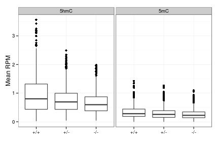
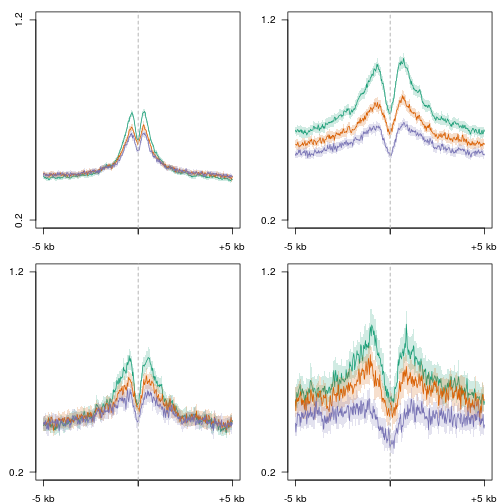
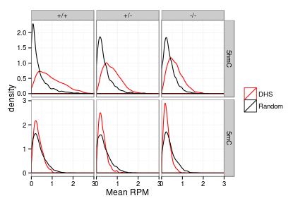
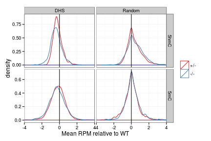

D3a - DNase peaks, H3K27ac - features
========================================================


```r
suppressPackageStartupMessages(source("~/src/seqAnalysis/R/features.R"))
```


```r
mod <- makeFeatureMatrix2("d3a_het_dnase_inter_moe_h3k27ac_interV_genes_2.bed_chr", 
    "d3xog_hmc_mc", data_type = "rpkm/mean", select = "flank1000")
```

```
##             omp_hmc_rep1_q30_rmdup_extend300_mean_omp_hmc_rep2_q30_rmdup 
## "omp_hmc_rep1_q30_rmdup_extend300_mean_omp_hmc_rep2_q30_rmdup_flank1000" 
##                                             d3xog_het_hmc_sort_q30_rmdup 
##                                 "d3xog_het_hmc_sort_q30_rmdup_flank1000" 
##                                              d3xog_ko_hmc_sort_q30_rmdup 
##                                  "d3xog_ko_hmc_sort_q30_rmdup_flank1000" 
##                                          omp_mc_rep1_q30_rmdup_extend300 
##                              "omp_mc_rep1_q30_rmdup_extend300_flank1000" 
##                                              d3xog_het_mc_sort_q30_rmdup 
##                                  "d3xog_het_mc_sort_q30_rmdup_flank1000" 
##                                               d3xog_ko_mc_sort_q30_rmdup 
##                                   "d3xog_ko_mc_sort_q30_rmdup_flank1000"
```

```r
random <- makeFeatureMatrix2("d3a_het_dnase_sort_q30_dnase_sub_igenome_ensembl_genes_extend5kb_shuffle.bed_chr", 
    "d3xog_hmc_mc", data_type = "rpkm/mean", select = "flank1000")
```

```
##             omp_hmc_rep1_q30_rmdup_extend300_mean_omp_hmc_rep2_q30_rmdup 
## "omp_hmc_rep1_q30_rmdup_extend300_mean_omp_hmc_rep2_q30_rmdup_flank1000" 
##                                             d3xog_het_hmc_sort_q30_rmdup 
##                                 "d3xog_het_hmc_sort_q30_rmdup_flank1000" 
##                                              d3xog_ko_hmc_sort_q30_rmdup 
##                                  "d3xog_ko_hmc_sort_q30_rmdup_flank1000" 
##                                          omp_mc_rep1_q30_rmdup_extend300 
##                              "omp_mc_rep1_q30_rmdup_extend300_flank1000" 
##                                              d3xog_het_mc_sort_q30_rmdup 
##                                  "d3xog_het_mc_sort_q30_rmdup_flank1000" 
##                                               d3xog_ko_mc_sort_q30_rmdup 
##                                   "d3xog_ko_mc_sort_q30_rmdup_flank1000"
```


```r
mod <- namerows(mod)
mod.m <- melt(mod)
```

```
## Using id as id variables
```

```r
v <- str_split(mod.m$variable, "_")
mod.m$mod <- factor(unlist(lapply(v, function(x) x[1])))
mod.m$geno <- factor(unlist(lapply(v, function(x) x[2])), levels = c("wt", "het", 
    "ko"))
levels(mod.m$mod) <- c("5hmC", "5mC")
levels(mod.m$geno) <- c("+/+", "+/-", "-/-")
```


```r
theme_set(theme_bw())
gg <- ggplot(mod.m, aes(geno, value))
gg <- gg + geom_boxplot() + facet_grid(. ~ mod)
gg <- gg + labs(y = "Mean RPM", x = "")
gg
```

 


```r
random <- namerows(random)
random.m <- melt(random)
```

```
## Using id as id variables
```

```r
v <- str_split(random.m$variable, "_")
random.m$mod <- factor(unlist(lapply(v, function(x) x[1])))
random.m$geno <- factor(unlist(lapply(v, function(x) x[2])), levels = c("wt", 
    "het", "ko"))
levels(random.m$mod) <- c("5hmC", "5mC")
levels(random.m$geno) <- c("+/+", "+/-", "-/-")
```


```r
gg <- ggplot(random.m, aes(geno, value))
gg + geom_boxplot() + facet_grid(. ~ mod) + coord_cartesian(ylim = c(0, 3.5))
```

 


```r
mod.m$type <- "DHS"
random.m$type <- "Random"
comb <- rbind(mod.m, random.m)
levels(comb$mod) <- c("5hmC", "5mC")
levels(comb$geno) <- c("+/+", "+/-", "-/-")
```


Not full loss of 5hmC. 

```r
theme_set(theme_bw())
gg <- ggplot(comb, aes(value, color = type))
gg <- gg + geom_density() + facet_grid(mod ~ geno, scales = "free_y") + coord_cartesian(xlim = c(0, 
    3))
gg <- gg + scale_color_manual(values = c("red", "black")) + theme(legend.title = element_blank())
gg <- gg + labs(x = "Mean RPM")
gg
```

 


```r
comb <- ddply(comb, .(id, mod, type), mutate, value.wt = log2((value + 0.01)/(value[geno == 
    "+/+"] + 0.01)))
```


DHS flanking regions are targeted for Dnmt3a-mediated 5mC. No general reduction at randomly selected regions.

```r
theme_set(theme_bw())
gg <- ggplot(comb[comb$geno != "+/+", ], aes(value.wt, color = geno)) + theme(legend.title = element_blank(), 
    legend.key = element_rect(fill = "white"), legend.background = element_rect())
gg <- gg + geom_density() + facet_grid(mod ~ type, scales = "free_y") + coord_cartesian(xlim = c(-4, 
    4))
gg <- gg + geom_vline(xintercept = 0) + labs(x = "Mean RPM relative to WT") + 
    scale_color_brewer(palette = "Set1")
gg
```

 

