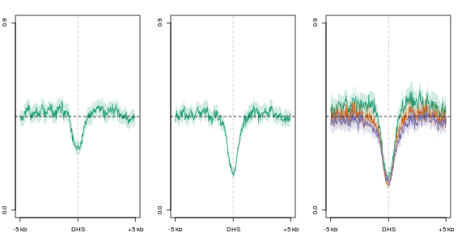
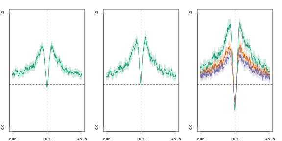
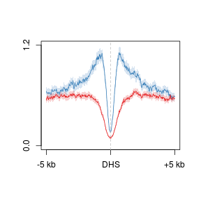
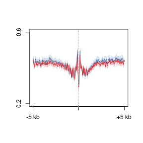
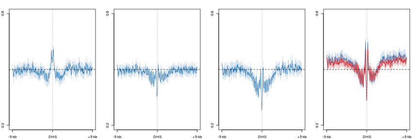
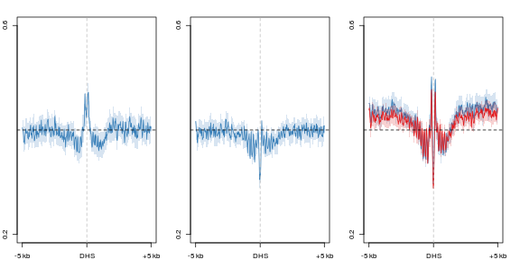
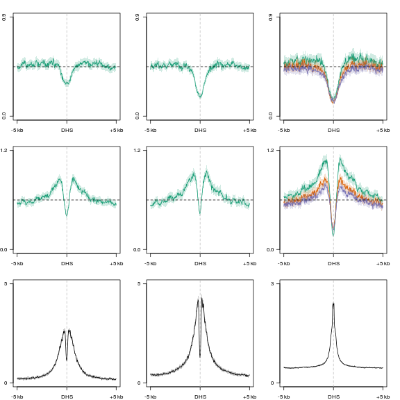

D3a - DNase peaks, H3K27ac - profiles
========================================================


```r
suppressPackageStartupMessages(source("~/src/seqAnalysis/R/profiles2.R"))
opts_chunk$set(warning = FALSE, message = FALSE, error = FALSE, results = "hide")
```


```r
makeProfile2.allSamp("d3a_het_dnase_inter_moe_h3k27ac_interV_genes_2.bed_W25F200_both_chr", 
    data_type = "rpkm/mean", rm.outliers = 0.01)
```


#### 5mC
Reduction of 5mC levels flanking DHS

```r
par(mfrow = c(1, 3), mar = c(2, 2, 2, 2))
plot2("d3a_het_dnase_inter_moe_h3k27ac_interV_genes_2.bed_W25F200_both_chr", 
    "icam_mc_rep1_q30_rmdup_extend300_mean_icam_mc_rep2_q30_rmdup", data_type = "rpkm/mean", 
    group2 = "trim0.01", cols = col3[1], y.vals = c(0, 0.9), lab = "DHS")
abline(h = 0.45, lty = 2)
plot2("d3a_het_dnase_inter_moe_h3k27ac_interV_genes_2.bed_W25F200_both_chr", 
    "ngn_mc_rep1_q30_rmdup_extend300_mean_ngn_mc_rep2_q30_rmdup", data_type = "rpkm/mean", 
    group2 = "trim0.01", cols = col3[1], y.vals = c(0, 0.9), lab = "DHS")
abline(h = 0.45, lty = 2)
plot2.several("d3a_het_dnase_inter_moe_h3k27ac_interV_genes_2.bed_W25F200_both_chr", 
    "d3xog_mc", data_type = "rpkm/mean", group2 = "trim0.01", cols = col3, y.vals = c(0, 
        0.9), lab = "DHS")
abline(h = 0.45, lty = 2)
```

 


### 5hmC
Reduction of levels flanking DHS site, however not complete loss. Explained by reduction of Dnmt3a-mediated 5mC substrate; however, targeting still occurs. 
Targeting of oxidation is Dnmt3a-independent.

```r
par(mfrow = c(1, 3), mar = c(2, 2, 2, 2))
plot2("d3a_het_dnase_inter_moe_h3k27ac_interV_genes_2.bed_W25F200_both_chr", 
    "icam_hmc_rep1_q30_rmdup_extend300_mean_icam_hmc_rep2_q30_rmdup", data_type = "rpkm/mean", 
    group2 = "trim0.01", cols = col3[1], y.vals = c(0, 1.2), lab = "DHS")
abline(h = 0.45, lty = 2)
plot2("d3a_het_dnase_inter_moe_h3k27ac_interV_genes_2.bed_W25F200_both_chr", 
    "ngn_hmc_rep1_q30_rmdup_extend300_mean_ngn_hmc_rep2_q30_rmdup", data_type = "rpkm/mean", 
    group2 = "trim0.01", cols = col3[1], y.vals = c(0, 1.2), lab = "DHS")
abline(h = 0.45, lty = 2)
plot2.several("d3a_het_dnase_inter_moe_h3k27ac_interV_genes_2.bed_W25F200_both_chr", 
    "d3xog_hmc", data_type = "rpkm/mean", group2 = "trim0.01", cols = col3, 
    y.vals = c(0, 1.2), lab = "DHS")
abline(h = 0.45, lty = 2)
```

 


#### O/Tet3
Overexpression of Tet3 targets DHS flanking regions. Full oxidation

```r
par(mfrow = c(1, 1))
plot2.several("d3a_het_dnase_inter_moe_h3k27ac_interV_genes_2.bed_W25F200_both_chr", 
    "tt3_rep", data_type = "rpkm/mean", group2 = "trim0.01", cols = col2, y.vals = c(0, 
        1.2), lab = "DHS")
```

 


#### Nucleosomes
Nucleosome depletion and structuring still occurs

```r
plot2.several("d3a_het_dnase_inter_moe_h3k27ac_interV_genes_2.bed_W25F200_both_chr", 
    "d3xog_nuc", data_type = "rpkm/mean", group2 = "trim0.01", cols = col2, 
    y.vals = c(0.2, 0.6))
```

 


```r
par(mfrow = c(1, 4), mar = c(2, 2, 2, 2))
plot2("d3a_het_dnase_inter_moe_h3k27ac_interV_genes_2.bed_W25F200_both_chr", 
    "icam_nuc_01234", data_type = "rpkm/mean", group2 = "trim0.01", cols = col2[1], 
    y.vals = c(0.2, 0.6), lab = "DHS")
abline(h = 0.4, lty = 2)
plot2("d3a_het_dnase_inter_moe_h3k27ac_interV_genes_2.bed_W25F200_both_chr", 
    "ngn_nuc_456", data_type = "rpkm/mean", group2 = "trim0.01", cols = col2[1], 
    y.vals = c(0.2, 0.6), lab = "DHS")
abline(h = 0.4, lty = 2)
plot2("d3a_het_dnase_inter_moe_h3k27ac_interV_genes_2.bed_W25F200_both_chr", 
    "omp_nuc_0123", data_type = "rpkm/mean", group2 = "trim0.01", cols = col2[1], 
    y.vals = c(0.2, 0.6), lab = "DHS")
abline(h = 0.4, lty = 2)
plot2.several("d3a_het_dnase_inter_moe_h3k27ac_interV_genes_2.bed_W25F200_both_chr", 
    "d3xog_nuc", data_type = "rpkm/mean", group2 = "trim0.01", cols = col2, 
    y.vals = c(0.2, 0.6), lab = "DHS")
abline(h = 0.4, lty = 2)
```

 


```r
par(mfrow = c(1, 3), mar = c(2, 2, 2, 2))
plot2("d3a_het_dnase_inter_moe_h3k27ac_interV_genes_2.bed_W25F200_both_chr", 
    "icam_nuc_01234", data_type = "rpkm/mean", group2 = "trim0.01", cols = col2[1], 
    y.vals = c(0.2, 0.6), lab = "DHS")
abline(h = 0.4, lty = 2)
plot2("d3a_het_dnase_inter_moe_h3k27ac_interV_genes_2.bed_W25F200_both_chr", 
    "ngn_nuc_456", data_type = "rpkm/mean", group2 = "trim0.01", cols = col2[1], 
    y.vals = c(0.2, 0.6), lab = "DHS")
abline(h = 0.4, lty = 2)

plot2.several("d3a_het_dnase_inter_moe_h3k27ac_interV_genes_2.bed_W25F200_both_chr", 
    "d3xog_nuc", data_type = "rpkm/mean", group2 = "trim0.01", cols = col2, 
    y.vals = c(0.2, 0.6), lab = "DHS")
abline(h = 0.4, lty = 2)
```

 


#### Enhancer modifications

```r
par(mfrow = c(1, 2))
plot2("d3a_het_dnase_inter_moe_h3k27ac_interV_genes_2.bed_W25F200_both_chr", 
    "moe_h3k4me1_rmdup_sub_moe_d3a_wt_input_q30_rmdup", data_type = "rpkm/mean", 
    group2 = "trim0.01", y.vals = c(0, 5))
plot2("d3a_het_dnase_inter_moe_h3k27ac_interV_genes_2.bed_W25F200_both_chr", 
    "moe_h3k27ac_rmdup_sub_moe_d3a_wt_input_q30_rmdup", data_type = "rpkm/mean", 
    group2 = "trim0.01", y.vals = c(0, 5))
```

 


### Combined

```r
par(mfrow = c(3, 3), mar = c(2, 2, 2, 2))
plot2("d3a_het_dnase_inter_moe_h3k27ac_interV_genes_2.bed_W25F200_both_chr", 
    "icam_mc_rep1_q30_rmdup_extend300_mean_icam_mc_rep2_q30_rmdup", data_type = "rpkm/mean", 
    group2 = "trim0.01", cols = col3[1], y.vals = c(0, 0.9), lab = "DHS")
abline(h = 0.45, lty = 2)
plot2("d3a_het_dnase_inter_moe_h3k27ac_interV_genes_2.bed_W25F200_both_chr", 
    "ngn_mc_rep1_q30_rmdup_extend300_mean_ngn_mc_rep2_q30_rmdup", data_type = "rpkm/mean", 
    group2 = "trim0.01", cols = col3[1], y.vals = c(0, 0.9), lab = "DHS")
abline(h = 0.45, lty = 2)
plot2.several("d3a_het_dnase_inter_moe_h3k27ac_interV_genes_2.bed_W25F200_both_chr", 
    "d3xog_mc", data_type = "rpkm/mean", group2 = "trim0.01", cols = col3, y.vals = c(0, 
        0.9), lab = "DHS")
abline(h = 0.45, lty = 2)
plot2("d3a_het_dnase_inter_moe_h3k27ac_interV_genes_2.bed_W25F200_both_chr", 
    "icam_hmc_rep1_q30_rmdup_extend300_mean_icam_hmc_rep2_q30_rmdup", data_type = "rpkm/mean", 
    group2 = "trim0.01", cols = col3[1], y.vals = c(0, 1.2), lab = "DHS")
abline(h = 0.6, lty = 2)
plot2("d3a_het_dnase_inter_moe_h3k27ac_interV_genes_2.bed_W25F200_both_chr", 
    "ngn_hmc_rep1_q30_rmdup_extend300_mean_ngn_hmc_rep2_q30_rmdup", data_type = "rpkm/mean", 
    group2 = "trim0.01", cols = col3[1], y.vals = c(0, 1.2), lab = "DHS")
abline(h = 0.6, lty = 2)
plot2.several("d3a_het_dnase_inter_moe_h3k27ac_interV_genes_2.bed_W25F200_both_chr", 
    "d3xog_hmc", data_type = "rpkm/mean", group2 = "trim0.01", cols = col3, 
    y.vals = c(0, 1.2), lab = "DHS")
abline(h = 0.6, lty = 2)

plot2("d3a_het_dnase_inter_moe_h3k27ac_interV_genes_2.bed_W25F200_both_chr", 
    "moe_h3k4me1_rmdup_sub_moe_d3a_wt_input_q30_rmdup", data_type = "rpkm/mean", 
    group2 = "trim0.01", y.vals = c(0, 5), lab = "DHS")
plot2("d3a_het_dnase_inter_moe_h3k27ac_interV_genes_2.bed_W25F200_both_chr", 
    "moe_h3k27ac_rmdup_sub_moe_d3a_wt_input_q30_rmdup", data_type = "rpkm/mean", 
    group2 = "trim0.01", y.vals = c(0, 5), lab = "DHS")
plot2("d3a_het_dnase_inter_moe_h3k27ac_interV_genes_2.bed_W25F200_both_chr", 
    "d3a_het_dnase_sort_q30", data_type = "rpkm/mean", group2 = "trim0.01", 
    y.vals = c(0, 3), lab = "DHS")
```

 

