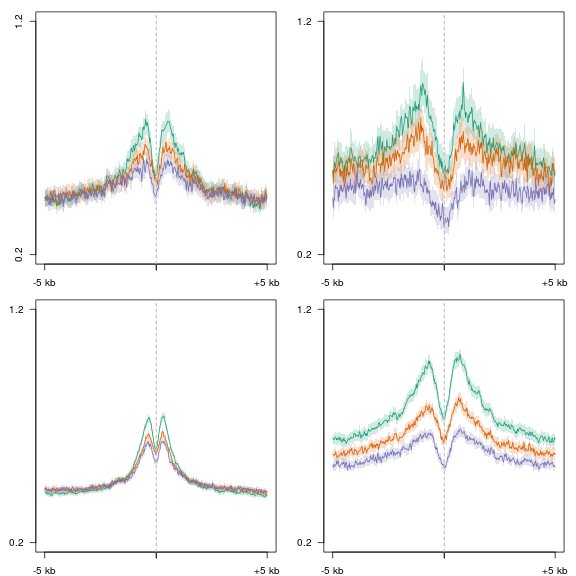
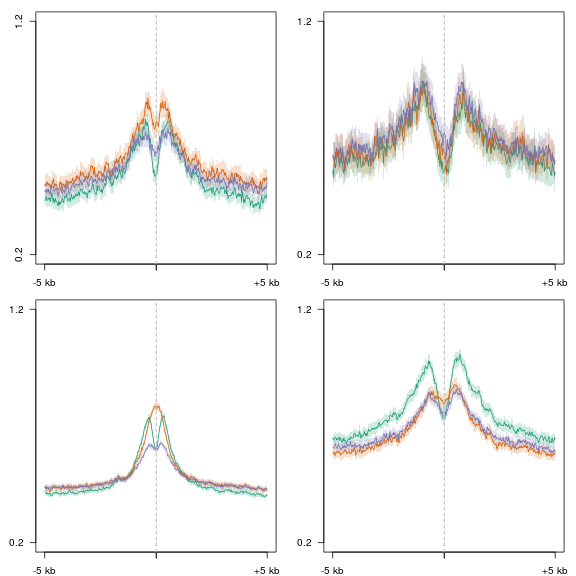
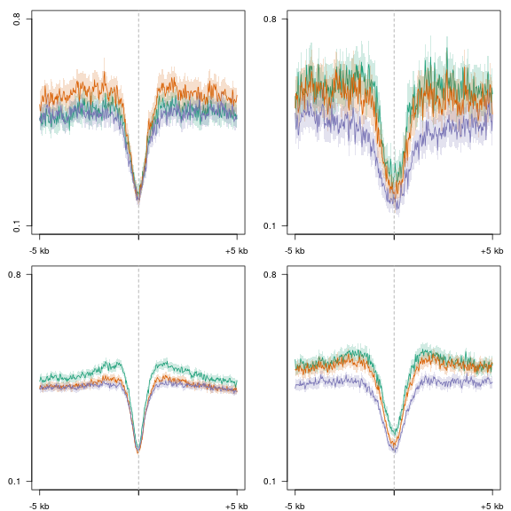
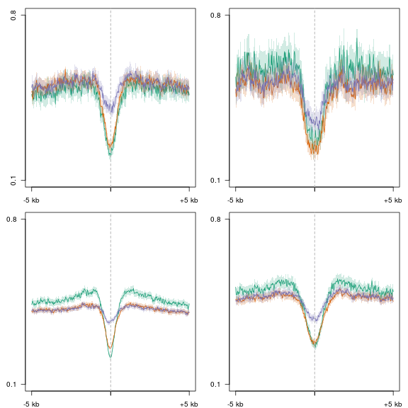
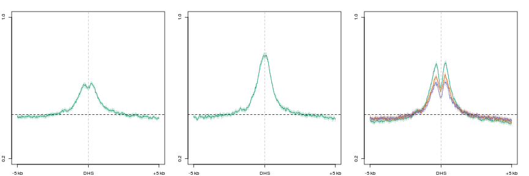
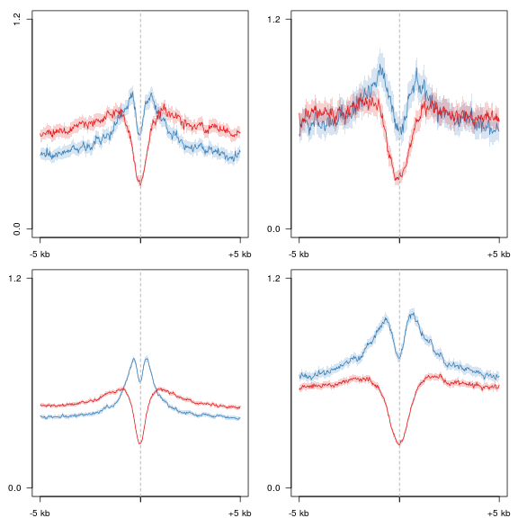
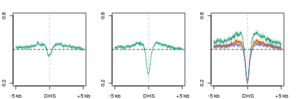
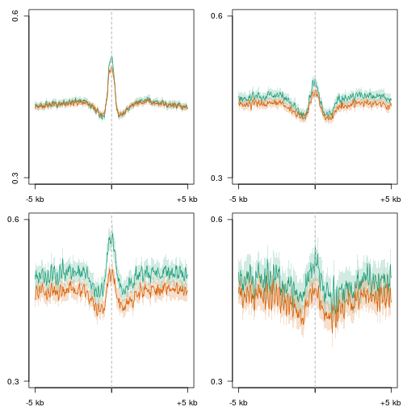

D
========================================================


```r
suppressPackageStartupMessages(source("~/src/seqAnalysis/R/profiles2.R"))
suppressPackageStartupMessages(source("~/src/seqAnalysis/R/image.R"))
suppressPackageStartupMessages(source("~/src/seqAnalysis/R/features.R"))
library(ggplot2)
library(reshape2)
```

```
## Attaching package: 'reshape2'
```

```
## The following object(s) are masked from 'package:reshape':
## 
## colsplit, melt, recast
```

```r
library(gridExtra)
library(mclust)
```

```
## Package 'mclust' version 4.1
```

```
## Attaching package: 'mclust'
```

```
## The following object(s) are masked from 'package:GenomicRanges':
## 
## map
```

```
## The following object(s) are masked from 'package:IRanges':
## 
## map
```


```r
mk4 <- read.delim("~/s2/data/homer/peaks/moe_h3k4me1_q30_rmdup_gc/moe_h3k4me1_q30_rmdup_gc_input_moe_d3a_wt_input_q30_rmdup_gc_F2_interV_igenome_ensembl_genes_extend5kb.bed", 
    header = F)
mk4.tk27 <- read.delim("~/s2/data/homer/peaks/moe_h3k4me1_q30_rmdup_gc/moe_h3k4me1_q30_rmdup_gc_input_moe_d3a_wt_input_q30_rmdup_gc_F2_interV_igenome_ensembl_genes_extend5kb_inter_moe_d3a_wt_h3k27me3_gc_input_moe_d3a_wt_input_gc_histone_F3.bed", 
    header = F)
mk4.ak27 <- read.delim("~/s2/data/homer/peaks/moe_h3k4me1_q30_rmdup_gc/moe_h3k4me1_q30_rmdup_gc_input_moe_d3a_wt_input_q30_rmdup_gc_F2_interV_igenome_ensembl_genes_extend5kb_inter_moe_h3k27ac_q30_rmdup_gc_input_moe_d3a_wt_input_q30_rmdup_gc_histone_F2.bed", 
    header = F)
mk4.pres <- matrix(0, ncol = 3, nrow = nrow(mk4))
mk4.pres[, 1] <- 1
rownames(mk4.pres) <- mk4[, 4]
mk4.pres[rownames(mk4.pres) %in% mk4.tk27[, 4], 2] <- 1
mk4.pres[rownames(mk4.pres) %in% mk4.ak27[, 4], 3] <- 1
colnames(mk4.pres) <- c("mk4", "tk27", "ak27")
mk4.pres <- data.frame(mk4.pres)
mk4.pres$tk27.only <- mk4.pres[, 2] & !mk4.pres[, 3]
mk4.pres$ak27.only <- mk4.pres[, 3] & !mk4.pres[, 2]
mk4.pres$tk27.ak27 <- mk4.pres[, 3] & mk4.pres[, 2]
mk4.pres$mk4.only <- !mk4.pres[, 3] & !mk4.pres[, 2]
```


```r
en <- makeFeatureMatrix2("mk4_interV_genes.bed_chr", "hist_mod", data_type = "rpkm/mean")
```

```
## [1] "moe_d3a_wt_h3k27me3_q30_rmdup_sub_moe_d3a_wt_input_q30_rmdup"
## [2] "moe_h3k27ac_rmdup_sub_moe_d3a_wt_input_q30_rmdup"            
## [3] "moe_h3k4me1_rmdup_sub_moe_d3a_wt_input_q30_rmdup"
```

```r
en <- cbind(en, mk4.pres[match(rownames(en), rownames(mk4.pres)), 3:7])
en$class <- 0
en$class[en$mk4.only] <- "no H3K27me3 or H3K27ac"
en$class[en$tk27.only] <- "only H3K27me3"
en$class[en$ak27.only] <- "only H3K27ac"
en$class[en$tk27.ak27] <- "both H3K27me3 and H3K27ac"
```


```r
gg <- ggplot(en, aes(ak27, tk27, color = factor(class)))
gg + geom_point(alpha = I(1/10)) + scale_color_brewer(palette = "Set1") + theme(legend.position = c(0.8, 
    0.8))
```

 


```r

makeProfile2.allSamp("mk4_interV_genes_ak27_only.bed_W25F200_both_chr", data_type = "rpkm/mean", 
    rm.outliers = 0.01)
```

```
## [1] "/media/storage2/analysis/profiles/norm/rpkm/mean/mk4_interV_genes_ak27_only.bed_W25F200_both_chr"
## Note: next may be used in wrong context: no loop is visible
```

```
## Error: task 1 failed - "no loop for break/next, jumping to top level"
```

```r
makeProfile2.allSamp("mk4_interV_genes_ak27_tk27.bed_W25F200_both_chr", data_type = "rpkm/mean", 
    rm.outliers = 0.01)
```

```
## [1] "/media/storage2/analysis/profiles/norm/rpkm/mean/mk4_interV_genes_ak27_tk27.bed_W25F200_both_chr"
## Note: next may be used in wrong context: no loop is visible
```

```
## Error: task 1 failed - "no loop for break/next, jumping to top level"
```

```r
makeProfile2.allSamp("mk4_interV_genes_tk27_only.bed_W25F200_both_chr", data_type = "rpkm/mean", 
    rm.outliers = 0.01)
```

```
## [1] "/media/storage2/analysis/profiles/norm/rpkm/mean/mk4_interV_genes_tk27_only.bed_W25F200_both_chr"
## Note: next may be used in wrong context: no loop is visible
```

```
## Error: task 1 failed - "no loop for break/next, jumping to top level"
```

```r
makeProfile2.allSamp("mk4_interV_genes_mk4_only.bed_W25F200_both_chr", data_type = "rpkm/mean", 
    rm.outliers = 0.01)
```

```
## [1] "/media/storage2/analysis/profiles/norm/rpkm/mean/mk4_interV_genes_mk4_only.bed_W25F200_both_chr"
## Note: next may be used in wrong context: no loop is visible
```

```
## Error: task 1 failed - "no loop for break/next, jumping to top level"
```


```r
par(mfrow = c(2, 2), mar = c(2, 3, 1, 1))
plot2.several("mk4_interV_genes_tk27_only.bed_W25F200_both_chr", "d3xog_hmc", 
    data_type = "rpkm/mean", group2 = "trim0.01", cols = col3, y.vals = c(0.2, 
        1.2))
```

```
## [1] "omp_hmc_rep1_q30_rmdup_extend300_mean_omp_hmc_rep2_q30_rmdup_trim0.01"
## [1] "omp_hmc_rep1_q30_rmdup_extend300_mean_omp_hmc_rep2_q30_rmdup_trim0.01_mean"
## [1] "d3xog_het_hmc_sort_q30_rmdup_trim0.01"
## [1] "d3xog_het_hmc_sort_q30_rmdup_trim0.01_mean"
## [1] "d3xog_ko_hmc_sort_q30_rmdup_trim0.01"
## [1] "d3xog_ko_hmc_sort_q30_rmdup_trim0.01_mean"
```

```
## [1] 0.2 1.2
```

```r
plot2.several("mk4_interV_genes_ak27_tk27.bed_W25F200_both_chr", "d3xog_hmc", 
    data_type = "rpkm/mean", group2 = "trim0.01", cols = col3, y.vals = c(0.2, 
        1.2))
```

```
## [1] "omp_hmc_rep1_q30_rmdup_extend300_mean_omp_hmc_rep2_q30_rmdup_trim0.01"
## [1] "omp_hmc_rep1_q30_rmdup_extend300_mean_omp_hmc_rep2_q30_rmdup_trim0.01_mean"
## [1] "d3xog_het_hmc_sort_q30_rmdup_trim0.01"
## [1] "d3xog_het_hmc_sort_q30_rmdup_trim0.01_mean"
## [1] "d3xog_ko_hmc_sort_q30_rmdup_trim0.01"
## [1] "d3xog_ko_hmc_sort_q30_rmdup_trim0.01_mean"
```

```
## [1] 0.2 1.2
```

```r
plot2.several("mk4_interV_genes_mk4_only.bed_W25F200_both_chr", "d3xog_hmc", 
    data_type = "rpkm/mean", group2 = "trim0.01", cols = col3, y.vals = c(0.2, 
        1.2))
```

```
## [1] "omp_hmc_rep1_q30_rmdup_extend300_mean_omp_hmc_rep2_q30_rmdup_trim0.01"
## [1] "omp_hmc_rep1_q30_rmdup_extend300_mean_omp_hmc_rep2_q30_rmdup_trim0.01_mean"
## [1] "d3xog_het_hmc_sort_q30_rmdup_trim0.01"
## [1] "d3xog_het_hmc_sort_q30_rmdup_trim0.01_mean"
## [1] "d3xog_ko_hmc_sort_q30_rmdup_trim0.01"
## [1] "d3xog_ko_hmc_sort_q30_rmdup_trim0.01_mean"
```

```
## [1] 0.2 1.2
```

```r
plot2.several("mk4_interV_genes_ak27_only.bed_W25F200_both_chr", "d3xog_hmc", 
    data_type = "rpkm/mean", group2 = "trim0.01", cols = col3, y.vals = c(0.2, 
        1.2))
```

```
## [1] "omp_hmc_rep1_q30_rmdup_extend300_mean_omp_hmc_rep2_q30_rmdup_trim0.01"
## [1] "omp_hmc_rep1_q30_rmdup_extend300_mean_omp_hmc_rep2_q30_rmdup_trim0.01_mean"
## [1] "d3xog_het_hmc_sort_q30_rmdup_trim0.01"
## [1] "d3xog_het_hmc_sort_q30_rmdup_trim0.01_mean"
## [1] "d3xog_ko_hmc_sort_q30_rmdup_trim0.01"
## [1] "d3xog_ko_hmc_sort_q30_rmdup_trim0.01_mean"
```

 

```
## [1] 0.2 1.2
```


```r
par(mfrow = c(2, 2), mar = c(2, 3, 1, 1))
plot2.several("mk4_interV_genes_tk27_only.bed_W25F200_both_chr", "cells_hmc_rep", 
    data_type = "rpkm/mean", group2 = "trim0.01", cols = col3, y.vals = c(0.2, 
        1.2))
```

```
## [1] "omp_hmc_rep1_q30_rmdup_extend300_mean_omp_hmc_rep2_q30_rmdup_trim0.01"
## [1] "omp_hmc_rep1_q30_rmdup_extend300_mean_omp_hmc_rep2_q30_rmdup_trim0.01_mean"
## [1] "ngn_hmc_rep1_q30_rmdup_extend300_mean_ngn_hmc_rep2_q30_rmdup_trim0.01"
## [1] "ngn_hmc_rep1_q30_rmdup_extend300_mean_ngn_hmc_rep2_q30_rmdup_trim0.01_mean"
## [1] "icam_hmc_rep1_q30_rmdup_extend300_mean_icam_hmc_rep2_q30_rmdup_trim0.01"
## [1] "icam_hmc_rep1_q30_rmdup_extend300_mean_icam_hmc_rep2_q30_rmdup_trim0.01_mean"
```

```
## [1] 0.2 1.2
```

```r
plot2.several("mk4_interV_genes_ak27_tk27.bed_W25F200_both_chr", "cells_hmc_rep", 
    data_type = "rpkm/mean", group2 = "trim0.01", cols = col3, y.vals = c(0.2, 
        1.2))
```

```
## [1] "omp_hmc_rep1_q30_rmdup_extend300_mean_omp_hmc_rep2_q30_rmdup_trim0.01"
## [1] "omp_hmc_rep1_q30_rmdup_extend300_mean_omp_hmc_rep2_q30_rmdup_trim0.01_mean"
## [1] "ngn_hmc_rep1_q30_rmdup_extend300_mean_ngn_hmc_rep2_q30_rmdup_trim0.01"
## [1] "ngn_hmc_rep1_q30_rmdup_extend300_mean_ngn_hmc_rep2_q30_rmdup_trim0.01_mean"
## [1] "icam_hmc_rep1_q30_rmdup_extend300_mean_icam_hmc_rep2_q30_rmdup_trim0.01"
## [1] "icam_hmc_rep1_q30_rmdup_extend300_mean_icam_hmc_rep2_q30_rmdup_trim0.01_mean"
```

```
## [1] 0.2 1.2
```

```r
plot2.several("mk4_interV_genes_mk4_only.bed_W25F200_both_chr", "cells_hmc_rep", 
    data_type = "rpkm/mean", group2 = "trim0.01", cols = col3, y.vals = c(0.2, 
        1.2))
```

```
## [1] "omp_hmc_rep1_q30_rmdup_extend300_mean_omp_hmc_rep2_q30_rmdup_trim0.01"
## [1] "omp_hmc_rep1_q30_rmdup_extend300_mean_omp_hmc_rep2_q30_rmdup_trim0.01_mean"
## [1] "ngn_hmc_rep1_q30_rmdup_extend300_mean_ngn_hmc_rep2_q30_rmdup_trim0.01"
## [1] "ngn_hmc_rep1_q30_rmdup_extend300_mean_ngn_hmc_rep2_q30_rmdup_trim0.01_mean"
## [1] "icam_hmc_rep1_q30_rmdup_extend300_mean_icam_hmc_rep2_q30_rmdup_trim0.01"
## [1] "icam_hmc_rep1_q30_rmdup_extend300_mean_icam_hmc_rep2_q30_rmdup_trim0.01_mean"
```

```
## [1] 0.2 1.2
```

```r
plot2.several("mk4_interV_genes_ak27_only.bed_W25F200_both_chr", "cells_hmc_rep", 
    data_type = "rpkm/mean", group2 = "trim0.01", cols = col3, y.vals = c(0.2, 
        1.2))
```

```
## [1] "omp_hmc_rep1_q30_rmdup_extend300_mean_omp_hmc_rep2_q30_rmdup_trim0.01"
## [1] "omp_hmc_rep1_q30_rmdup_extend300_mean_omp_hmc_rep2_q30_rmdup_trim0.01_mean"
## [1] "ngn_hmc_rep1_q30_rmdup_extend300_mean_ngn_hmc_rep2_q30_rmdup_trim0.01"
## [1] "ngn_hmc_rep1_q30_rmdup_extend300_mean_ngn_hmc_rep2_q30_rmdup_trim0.01_mean"
## [1] "icam_hmc_rep1_q30_rmdup_extend300_mean_icam_hmc_rep2_q30_rmdup_trim0.01"
## [1] "icam_hmc_rep1_q30_rmdup_extend300_mean_icam_hmc_rep2_q30_rmdup_trim0.01_mean"
```

 

```
## [1] 0.2 1.2
```


```r
par(mfrow = c(2, 2), mar = c(2, 3, 1, 1))
plot2.several("mk4_interV_genes_tk27_only.bed_W25F200_both_chr", "d3xog_mc", 
    data_type = "rpkm/mean", group2 = "trim0.01", cols = col3, y.vals = c(0.1, 
        0.8))
```

```
## [1] "omp_mc_rep1_q30_rmdup_extend300_trim0.01"
## [1] "omp_mc_rep1_q30_rmdup_extend300_trim0.01_mean"
## [1] "d3xog_het_mc_sort_q30_rmdup_trim0.01"
## [1] "d3xog_het_mc_sort_q30_rmdup_trim0.01_mean"
## [1] "d3xog_ko_mc_sort_q30_rmdup_trim0.01"
## [1] "d3xog_ko_mc_sort_q30_rmdup_trim0.01_mean"
```

```
## [1] 0.1 0.8
```

```r
plot2.several("mk4_interV_genes_ak27_tk27.bed_W25F200_both_chr", "d3xog_mc", 
    data_type = "rpkm/mean", group2 = "trim0.01", cols = col3, y.vals = c(0.1, 
        0.8))
```

```
## [1] "omp_mc_rep1_q30_rmdup_extend300_trim0.01"
## [1] "omp_mc_rep1_q30_rmdup_extend300_trim0.01_mean"
## [1] "d3xog_het_mc_sort_q30_rmdup_trim0.01"
## [1] "d3xog_het_mc_sort_q30_rmdup_trim0.01_mean"
## [1] "d3xog_ko_mc_sort_q30_rmdup_trim0.01"
## [1] "d3xog_ko_mc_sort_q30_rmdup_trim0.01_mean"
```

```
## [1] 0.1 0.8
```

```r
plot2.several("mk4_interV_genes_mk4_only.bed_W25F200_both_chr", "d3xog_mc", 
    data_type = "rpkm/mean", group2 = "trim0.01", cols = col3, y.vals = c(0.1, 
        0.8))
```

```
## [1] "omp_mc_rep1_q30_rmdup_extend300_trim0.01"
## [1] "omp_mc_rep1_q30_rmdup_extend300_trim0.01_mean"
## [1] "d3xog_het_mc_sort_q30_rmdup_trim0.01"
## [1] "d3xog_het_mc_sort_q30_rmdup_trim0.01_mean"
## [1] "d3xog_ko_mc_sort_q30_rmdup_trim0.01"
## [1] "d3xog_ko_mc_sort_q30_rmdup_trim0.01_mean"
```

```
## [1] 0.1 0.8
```

```r
plot2.several("mk4_interV_genes_ak27_only.bed_W25F200_both_chr", "d3xog_mc", 
    data_type = "rpkm/mean", group2 = "trim0.01", cols = col3, y.vals = c(0.1, 
        0.8))
```

```
## [1] "omp_mc_rep1_q30_rmdup_extend300_trim0.01"
## [1] "omp_mc_rep1_q30_rmdup_extend300_trim0.01_mean"
## [1] "d3xog_het_mc_sort_q30_rmdup_trim0.01"
## [1] "d3xog_het_mc_sort_q30_rmdup_trim0.01_mean"
## [1] "d3xog_ko_mc_sort_q30_rmdup_trim0.01"
## [1] "d3xog_ko_mc_sort_q30_rmdup_trim0.01_mean"
```

 

```
## [1] 0.1 0.8
```


```r
par(mfrow = c(2, 2), mar = c(2, 3, 1, 1))
plot2.several("mk4_interV_genes_tk27_only.bed_W25F200_both_chr", "cells_mc_rep", 
    data_type = "rpkm/mean", group2 = "trim0.01", cols = col3, y.vals = c(0.1, 
        0.8))
```

```
## [1] "omp_mc_rep1_q30_rmdup_extend300_trim0.01"
## [1] "omp_mc_rep1_q30_rmdup_extend300_trim0.01_mean"
## [1] "ngn_mc_rep1_q30_rmdup_extend300_mean_ngn_mc_rep2_q30_rmdup_trim0.01"
## [1] "ngn_mc_rep1_q30_rmdup_extend300_mean_ngn_mc_rep2_q30_rmdup_trim0.01_mean"
## [1] "icam_mc_rep1_q30_rmdup_extend300_mean_icam_mc_rep2_q30_rmdup_trim0.01"
## [1] "icam_mc_rep1_q30_rmdup_extend300_mean_icam_mc_rep2_q30_rmdup_trim0.01_mean"
```

```
## [1] 0.1 0.8
```

```r
plot2.several("mk4_interV_genes_ak27_tk27.bed_W25F200_both_chr", "cells_mc_rep", 
    data_type = "rpkm/mean", group2 = "trim0.01", cols = col3, y.vals = c(0.1, 
        0.8))
```

```
## [1] "omp_mc_rep1_q30_rmdup_extend300_trim0.01"
## [1] "omp_mc_rep1_q30_rmdup_extend300_trim0.01_mean"
## [1] "ngn_mc_rep1_q30_rmdup_extend300_mean_ngn_mc_rep2_q30_rmdup_trim0.01"
## [1] "ngn_mc_rep1_q30_rmdup_extend300_mean_ngn_mc_rep2_q30_rmdup_trim0.01_mean"
## [1] "icam_mc_rep1_q30_rmdup_extend300_mean_icam_mc_rep2_q30_rmdup_trim0.01"
## [1] "icam_mc_rep1_q30_rmdup_extend300_mean_icam_mc_rep2_q30_rmdup_trim0.01_mean"
```

```
## [1] 0.1 0.8
```

```r
plot2.several("mk4_interV_genes_mk4_only.bed_W25F200_both_chr", "cells_mc_rep", 
    data_type = "rpkm/mean", group2 = "trim0.01", cols = col3, y.vals = c(0.1, 
        0.8))
```

```
## [1] "omp_mc_rep1_q30_rmdup_extend300_trim0.01"
## [1] "omp_mc_rep1_q30_rmdup_extend300_trim0.01_mean"
## [1] "ngn_mc_rep1_q30_rmdup_extend300_mean_ngn_mc_rep2_q30_rmdup_trim0.01"
## [1] "ngn_mc_rep1_q30_rmdup_extend300_mean_ngn_mc_rep2_q30_rmdup_trim0.01_mean"
## [1] "icam_mc_rep1_q30_rmdup_extend300_mean_icam_mc_rep2_q30_rmdup_trim0.01"
## [1] "icam_mc_rep1_q30_rmdup_extend300_mean_icam_mc_rep2_q30_rmdup_trim0.01_mean"
```

```
## [1] 0.1 0.8
```

```r
plot2.several("mk4_interV_genes_ak27_only.bed_W25F200_both_chr", "cells_mc_rep", 
    data_type = "rpkm/mean", group2 = "trim0.01", cols = col3, y.vals = c(0.1, 
        0.8))
```

```
## [1] "omp_mc_rep1_q30_rmdup_extend300_trim0.01"
## [1] "omp_mc_rep1_q30_rmdup_extend300_trim0.01_mean"
## [1] "ngn_mc_rep1_q30_rmdup_extend300_mean_ngn_mc_rep2_q30_rmdup_trim0.01"
## [1] "ngn_mc_rep1_q30_rmdup_extend300_mean_ngn_mc_rep2_q30_rmdup_trim0.01_mean"
## [1] "icam_mc_rep1_q30_rmdup_extend300_mean_icam_mc_rep2_q30_rmdup_trim0.01"
## [1] "icam_mc_rep1_q30_rmdup_extend300_mean_icam_mc_rep2_q30_rmdup_trim0.01_mean"
```

 

```
## [1] 0.1 0.8
```


```r
par(mfrow = c(1, 3), mar = c(2, 2, 2, 2))
plot2("mk4_interV_genes_mk4_only.bed_W25F200_both_chr", "icam_hmc_rep1_q30_rmdup_extend300_mean_icam_hmc_rep2_q30_rmdup", 
    data_type = "rpkm/mean", group2 = "trim0.01", cols = col3[1], y.vals = c(0.2, 
        1), lab = "DHS")
```

```
## [1] "icam_hmc_rep1_q30_rmdup_extend300_mean_icam_hmc_rep2_q30_rmdup_trim0.01"
## [1] "icam_hmc_rep1_q30_rmdup_extend300_mean_icam_hmc_rep2_q30_rmdup_trim0.01_mean"
```

```
## [1] 0.2 1.0
```

```r
abline(h = 0.45, lty = 2)
plot2("mk4_interV_genes_mk4_only.bed_W25F200_both_chr", "ngn_hmc_rep1_q30_rmdup_extend300_mean_ngn_hmc_rep2_q30_rmdup", 
    data_type = "rpkm/mean", group2 = "trim0.01", cols = col3[1], y.vals = c(0.2, 
        1), lab = "DHS")
```

```
## [1] "ngn_hmc_rep1_q30_rmdup_extend300_mean_ngn_hmc_rep2_q30_rmdup_trim0.01"
## [1] "ngn_hmc_rep1_q30_rmdup_extend300_mean_ngn_hmc_rep2_q30_rmdup_trim0.01_mean"
```

```
## [1] 0.2 1.0
```

```r
abline(h = 0.45, lty = 2)
plot2.several("mk4_interV_genes_mk4_only.bed_W25F200_both_chr", "d3xog_hmc", 
    data_type = "rpkm/mean", group2 = "trim0.01", cols = col3, y.vals = c(0.2, 
        1), lab = "DHS")
```

```
## [1] "omp_hmc_rep1_q30_rmdup_extend300_mean_omp_hmc_rep2_q30_rmdup_trim0.01"
## [1] "omp_hmc_rep1_q30_rmdup_extend300_mean_omp_hmc_rep2_q30_rmdup_trim0.01_mean"
## [1] "d3xog_het_hmc_sort_q30_rmdup_trim0.01"
## [1] "d3xog_het_hmc_sort_q30_rmdup_trim0.01_mean"
## [1] "d3xog_ko_hmc_sort_q30_rmdup_trim0.01"
## [1] "d3xog_ko_hmc_sort_q30_rmdup_trim0.01_mean"
```

```
## [1] 0.2 1.0
```

```r
abline(h = 0.45, lty = 2)
```

 


```r
par(mfrow = c(2, 2), mar = c(2, 3, 1, 1))
plot2.several("mk4_interV_genes_tk27_only.bed_W25F200_both_chr", "tt3_rep", 
    data_type = "rpkm/mean", group2 = "trim0.01", cols = col2, y.vals = c(0, 
        1.2))
```

```
## [1] "omp_hmc_rep1_mean_omp_hmc_rep2_trim0.01"
## [1] "omp_hmc_rep1_mean_omp_hmc_rep2_trim0.01_mean"
## [1] "ott3_hmc_rep1_mean_ott3_hmc_rep2_trim0.01"
## [1] "ott3_hmc_rep1_mean_ott3_hmc_rep2_trim0.01_mean"
```

```
## [1] 0.0 1.2
```

```r
plot2.several("mk4_interV_genes_ak27_tk27.bed_W25F200_both_chr", "tt3_rep", 
    data_type = "rpkm/mean", group2 = "trim0.01", cols = col2, y.vals = c(0, 
        1.2))
```

```
## [1] "omp_hmc_rep1_mean_omp_hmc_rep2_trim0.01"
## [1] "omp_hmc_rep1_mean_omp_hmc_rep2_trim0.01_mean"
## [1] "ott3_hmc_rep1_mean_ott3_hmc_rep2_trim0.01"
## [1] "ott3_hmc_rep1_mean_ott3_hmc_rep2_trim0.01_mean"
```

```
## [1] 0.0 1.2
```

```r
plot2.several("mk4_interV_genes_mk4_only.bed_W25F200_both_chr", "tt3_rep", data_type = "rpkm/mean", 
    group2 = "trim0.01", cols = col2, y.vals = c(0, 1.2))
```

```
## [1] "omp_hmc_rep1_mean_omp_hmc_rep2_trim0.01"
## [1] "omp_hmc_rep1_mean_omp_hmc_rep2_trim0.01_mean"
## [1] "ott3_hmc_rep1_mean_ott3_hmc_rep2_trim0.01"
## [1] "ott3_hmc_rep1_mean_ott3_hmc_rep2_trim0.01_mean"
```

```
## [1] 0.0 1.2
```

```r
plot2.several("mk4_interV_genes_ak27_only.bed_W25F200_both_chr", "tt3_rep", 
    data_type = "rpkm/mean", group2 = "trim0.01", cols = col2, y.vals = c(0, 
        1.2))
```

```
## [1] "omp_hmc_rep1_mean_omp_hmc_rep2_trim0.01"
## [1] "omp_hmc_rep1_mean_omp_hmc_rep2_trim0.01_mean"
## [1] "ott3_hmc_rep1_mean_ott3_hmc_rep2_trim0.01"
## [1] "ott3_hmc_rep1_mean_ott3_hmc_rep2_trim0.01_mean"
```

 

```
## [1] 0.0 1.2
```


```r
par(mfrow = c(1, 3), mar = c(2, 2, 2, 2))
plot2("mk4_interV_genes_mk4_only.bed_W25F200_both_chr", "icam_mc_rep1_q30_rmdup_extend300_mean_icam_mc_rep2_q30_rmdup", 
    data_type = "rpkm/mean", group2 = "trim0.01", cols = col3[1], y.vals = c(0.2, 
        0.6), lab = "DHS")
```

```
## [1] "icam_mc_rep1_q30_rmdup_extend300_mean_icam_mc_rep2_q30_rmdup_trim0.01"
## [1] "icam_mc_rep1_q30_rmdup_extend300_mean_icam_mc_rep2_q30_rmdup_trim0.01_mean"
```

```
## [1] 0.2 0.6
```

```r
abline(h = 0.4, lty = 2)
plot2("mk4_interV_genes_mk4_only.bed_W25F200_both_chr", "ngn_mc_rep1_q30_rmdup_extend300_mean_ngn_mc_rep2_q30_rmdup", 
    data_type = "rpkm/mean", group2 = "trim0.01", cols = col3[1], y.vals = c(0.2, 
        0.6), lab = "DHS")
```

```
## [1] "ngn_mc_rep1_q30_rmdup_extend300_mean_ngn_mc_rep2_q30_rmdup_trim0.01"
## [1] "ngn_mc_rep1_q30_rmdup_extend300_mean_ngn_mc_rep2_q30_rmdup_trim0.01_mean"
```

```
## [1] 0.2 0.6
```

```r
abline(h = 0.4, lty = 2)
plot2.several("mk4_interV_genes_mk4_only.bed_W25F200_both_chr", "d3xog_mc", 
    data_type = "rpkm/mean", group2 = "trim0.01", cols = col3, y.vals = c(0.2, 
        0.6), lab = "DHS")
```

```
## [1] "omp_mc_rep1_q30_rmdup_extend300_trim0.01"
## [1] "omp_mc_rep1_q30_rmdup_extend300_trim0.01_mean"
## [1] "d3xog_het_mc_sort_q30_rmdup_trim0.01"
## [1] "d3xog_het_mc_sort_q30_rmdup_trim0.01_mean"
## [1] "d3xog_ko_mc_sort_q30_rmdup_trim0.01"
## [1] "d3xog_ko_mc_sort_q30_rmdup_trim0.01_mean"
```

```
## [1] 0.2 0.6
```

```r
abline(h = 0.4, lty = 2)
```

 


#### Nucleosomes

```r
par(mfrow = c(2, 2), mar = c(2, 3, 1, 1))
plot2.several("mk4_interV_genes_mk4_only.bed_W25F200_both_chr", "d3xog_nuc", 
    data_type = "rpkm/mean", group2 = "trim0.01", cols = col3, y.vals = c(0.3, 
        0.6))
```

```
## [1] "d3xog_wt_nuc_478_rmdup_q30_trim0.01"
## [1] "d3xog_wt_nuc_478_rmdup_q30_trim0.01_mean"
## [1] "d3xog_ko_nuc_256_rmdup_q30_trim0.01"
## [1] "d3xog_ko_nuc_256_rmdup_q30_trim0.01_mean"
```

```
## [1] 0.3 0.6
```

```r
plot2.several("mk4_interV_genes_ak27_only.bed_W25F200_both_chr", "d3xog_nuc", 
    data_type = "rpkm/mean", group2 = "trim0.01", cols = col3, y.vals = c(0.3, 
        0.6))
```

```
## [1] "d3xog_wt_nuc_478_rmdup_q30_trim0.01"
## [1] "d3xog_wt_nuc_478_rmdup_q30_trim0.01_mean"
## [1] "d3xog_ko_nuc_256_rmdup_q30_trim0.01"
## [1] "d3xog_ko_nuc_256_rmdup_q30_trim0.01_mean"
```

```
## [1] 0.3 0.6
```

```r
plot2.several("mk4_interV_genes_tk27_only.bed_W25F200_both_chr", "d3xog_nuc", 
    data_type = "rpkm/mean", group2 = "trim0.01", cols = col3, y.vals = c(0.3, 
        0.6))
```

```
## [1] "d3xog_wt_nuc_478_rmdup_q30_trim0.01"
## [1] "d3xog_wt_nuc_478_rmdup_q30_trim0.01_mean"
## [1] "d3xog_ko_nuc_256_rmdup_q30_trim0.01"
## [1] "d3xog_ko_nuc_256_rmdup_q30_trim0.01_mean"
```

```
## [1] 0.3 0.6
```

```r
plot2.several("mk4_interV_genes_ak27_tk27.bed_W25F200_both_chr", "d3xog_nuc", 
    data_type = "rpkm/mean", group2 = "trim0.01", cols = col3, y.vals = c(0.3, 
        0.6))
```

```
## [1] "d3xog_wt_nuc_478_rmdup_q30_trim0.01"
## [1] "d3xog_wt_nuc_478_rmdup_q30_trim0.01_mean"
## [1] "d3xog_ko_nuc_256_rmdup_q30_trim0.01"
## [1] "d3xog_ko_nuc_256_rmdup_q30_trim0.01_mean"
```

 

```
## [1] 0.3 0.6
```

