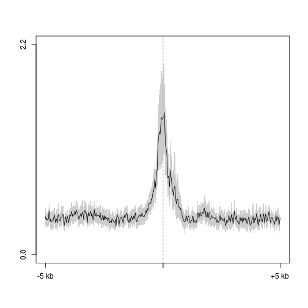
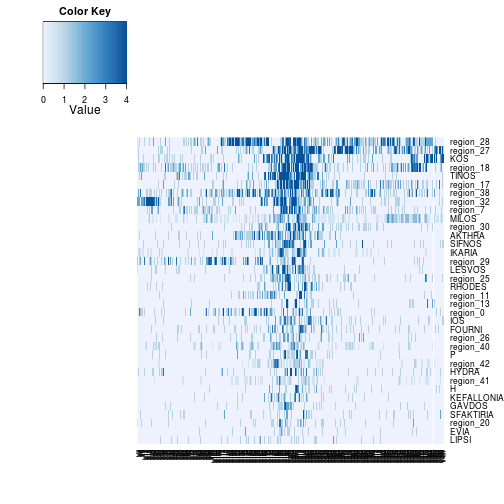
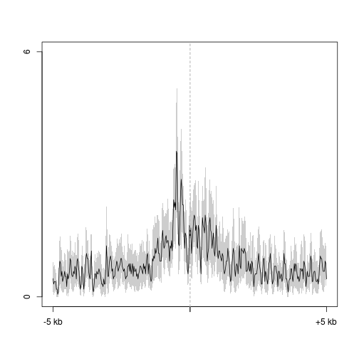
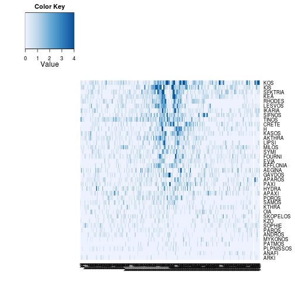
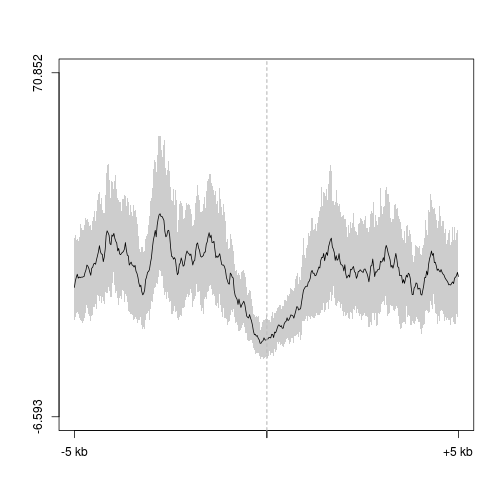
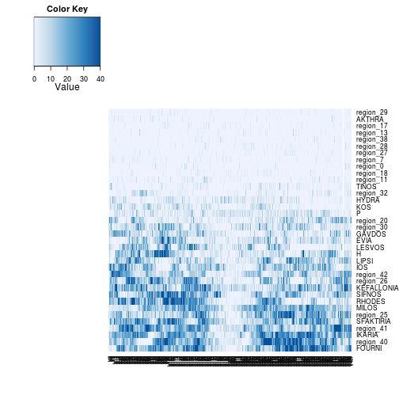
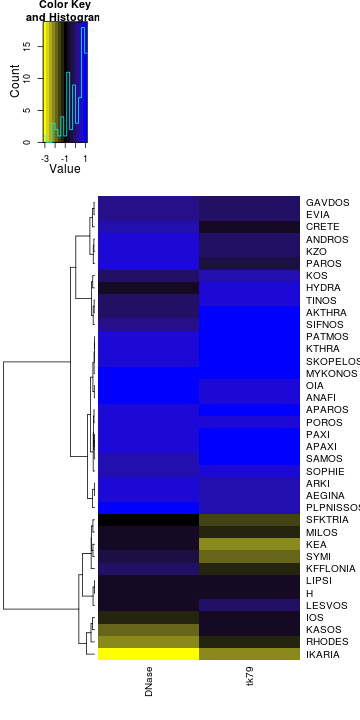

Greek islands
========================================================


```r
suppressPackageStartupMessages(source("~/src/seqAnalysis/R/profiles2.R"))
suppressPackageStartupMessages(source("~/src/seqAnalysis/R/image.R"))
```


```r
dnase <- makeImage("d3a_het_dnase_sort_q30", "greek_islands_mod.bed_W25F200_both_chr", 
    data_type = "rpkm/mean", image = FALSE)
```

```
## [1] "/media/storage2/analysis/profiles/norm/rpkm/mean/greek_islands_mod.bed_W25F200_both_chr/images/d3a_het_dnase_sort_q30"
```

```r
ind <- which(is.na(dnase), arr.ind = T)
dnase[ind] <- 0
dnase.pc <- prcomp(dnase)
dnase.pred <- predict(dnase.pc, dnase)
```


```r
plot2("greek_islands_mod.bed_W25F200_both_chr", "d3a_het_dnase_sort_q30", data_type = "rpkm/mean", 
    fname = "manual", y.vals = c(0, 2.2))
```

```
## [1] "d3a_het_dnase_sort_q30_mean"
```

 

```
## [1] 0.0 2.2
```


```r
MP.heat(dnase[order(dnase.pred[, 1]), ], range = c(0, 4))
```

 


```
positionMatrix.all("greek_islands_mod.bed_W25F200_both_chr", data_type="bam/mean")
```


```r
mk4 <- makeImage("omp_h3k4me1", "greek_islands_mod.bed_W25F200_both_chr", data_type = "bam/mean", 
    image = FALSE)
```

```
## [1] "/media/storage2/analysis/profiles/norm/bam/mean/greek_islands_mod.bed_W25F200_both_chr/images/omp_h3k4me1"
```

```r
ind <- which(is.na(mk4), arr.ind = T)
mk4[ind] <- 0
mk4.pc <- prcomp(mk4)
mk4.pred <- predict(mk4.pc, mk4)
```


```r
plot2("greek_islands_mod.bed_W25F200_both_chr", "omp_h3k4me1", data_type = "bam/mean", 
    fname = "manual", y.vals = c(0, 6))
```

```
## [1] "omp_h3k4me1_mean"
```

 

```
## [1] 0 6
```


```r
MP.heat(mk4[order(mk4.pred[, 1]), ], range = c(0, 4))
```

 


### tk79


```r
plot2("greek_islands_mod.bed_W25F200_both_chr", "moe_tk79", data_type = "bam/mean", 
    fname = "manual")
```

```
## [1] "moe_tk79_mean"
```

 

```
## [1] -6.593 70.852
```


```r
tk79 <- makeImage("moe_tk79", "greek_islands_mod.bed_W25F200_both_chr", data_type = "bam/mean", 
    image = F)
```

```
## [1] "/media/storage2/analysis/profiles/norm/bam/mean/greek_islands_mod.bed_W25F200_both_chr/images/moe_tk79"
```

```r
ind <- which(is.na(tk79), arr.ind = T)
tk79[ind] <- 0
tk79.pc <- prcomp(tk79)
tk79.pred <- predict(tk79.pc, tk79)
```


```r
MP.heat(tk79[order(tk79.pred[, 1]), ], range = c(0, 100))
```

 


#### Ordered by DNase PC1

```r
MP.heat(tk79[order(dnase.pred[, 1]), ], range = c(0, 100))
```

 


#### Cluster by DNase and tk79


```r
pc <- cbind(dnase.pred[, 1], tk79.pred[, 1])
colnames(pc) <- c("DNase", "tk79")
pc <- scale(pc)
pc.dist <- dist(pc)
pc.hclust <- hclust(pc.dist, method = "ward")
```


```r
lab.palette <- colorRampPalette(c("yellow", "black", "blue"), space = "Lab")
heatmap.2(pc, Rowv = as.dendrogram(pc.hclust), Colv = FALSE, dendrogram = "row", 
    trace = "none", cexCol = 1, cexRow = 1, col = lab.palette)
```

 


