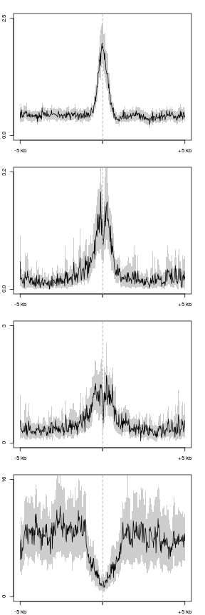
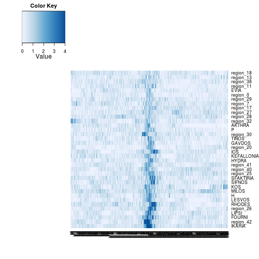
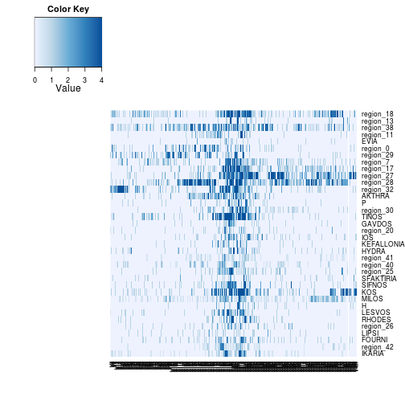
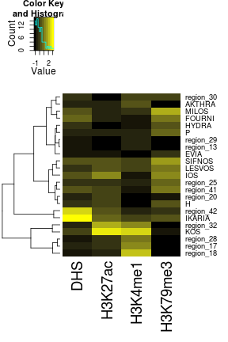
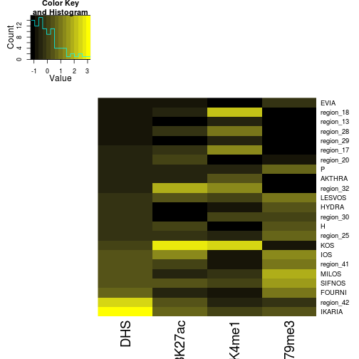
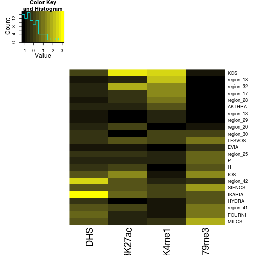

Greek islands
========================================================


```r
suppressPackageStartupMessages(source("~/src/seqAnalysis/R/profiles2.R"))
suppressPackageStartupMessages(source("~/src/seqAnalysis/R/image.R"))
suppressPackageStartupMessages(source("~/src/seqAnalysis/R/features.R"))
```


### Profiles


```r
makeProfile2.allSamp("greek_islands_v4.bed_W25F200_both_chr", data_type = "rpkm/mean")
```

```
## [1] "/media/storage2/analysis/profiles/norm/rpkm/mean/greek_islands_v4.bed_W25F200_both_chr"
## Note: next may be used in wrong context: no loop is visible
```

```
## Error: task 1 failed - "no loop for break/next, jumping to top level"
```


```r
par(mfrow = c(4, 1), mar = c(2, 2, 2, 2))
plot2("greek_islands_v4.bed_W25F200_both_chr", "d3a_het_dnase_sort_q30", data_type = "rpkm/mean", 
    fname = "manual", y.vals = c(0, 2.5))
```

```
## [1] "d3a_het_dnase_sort_q30_mean"
```

```
## [1] 0.0 2.5
```

```r
plot2("greek_islands_v4.bed_W25F200_both_chr", "moe_h3k4me1_rmdup", data_type = "rpkm/mean", 
    y.vals = c(0, 3.2))
```

```
## [1] "moe_h3k4me1_rmdup_mean"
```

```
## [1] 0.0 3.2
```

```r
plot2("greek_islands_v4.bed_W25F200_both_chr", "moe_h3k27ac_rmdup", data_type = "rpkm/mean", 
    y.vals = c(0, 3))
```

```
## [1] "moe_h3k27ac_rmdup_mean"
```

```
## [1] 0 3
```

```r
plot2("greek_islands_v4.bed_W25F200_both_chr", "moe_tk79", data_type = "rpkm/mean", 
    fname = "manual", y.vals = c(0, 16))
```

```
## [1] "moe_tk79_mean"
```

 

```
## [1]  0 16
```


### Images
```
positionMatrix.all("greek_islands_v4.bed_W25F200_both_chr", data_type="rpkm/mean")
```


```r
mk4 <- makeImage("moe_h3k4me1_rmdup", "greek_islands_v4.bed_W25F200_both_chr", 
    data_type = "rpkm/mean", image = FALSE)
```

```
## [1] "/media/storage2/analysis/profiles/norm/rpkm/mean/greek_islands_v4.bed_W25F200_both_chr/images/moe_h3k4me1_rmdup"
```

```r
ind <- which(is.na(mk4), arr.ind = T)
mk4[ind] <- 0
mk4.pc <- prcomp(mk4)
mk4.pred <- predict(mk4.pc, mk4)
```


```r
MP.heat(mk4[order(mk4.pred[, 1]), ], range = c(0, 4))
```

 


```r
ac27 <- makeImage("moe_h3k27ac_rmdup", "greek_islands_v4.bed_W25F200_both_chr", 
    data_type = "rpkm/mean", image = FALSE)
```

```
## [1] "/media/storage2/analysis/profiles/norm/rpkm/mean/greek_islands_v4.bed_W25F200_both_chr/images/moe_h3k27ac_rmdup"
```

```r
ind <- which(is.na(ac27), arr.ind = T)
ac27[ind] <- 0
ac27.pc <- prcomp(ac27)
ac27.pred <- predict(ac27.pc, ac27)
```


```r
MP.heat(ac27[order(ac27.pred[, 1]), ], range = c(0, 4))
```

 


```r
dnase <- makeImage("d3a_het_dnase_sort_q30", "greek_islands_v4.bed_W25F200_both_chr", 
    data_type = "rpkm/mean", image = FALSE)
```

```
## [1] "/media/storage2/analysis/profiles/norm/rpkm/mean/greek_islands_v4.bed_W25F200_both_chr/images/d3a_het_dnase_sort_q30"
```

```r
ind <- which(is.na(dnase), arr.ind = T)
dnase[ind] <- 0
dnase.pc <- prcomp(dnase)
dnase.pred <- predict(dnase.pc, dnase)
```


```r
MP.heat(dnase[order(dnase.pred[, 1]), ], range = c(0, 4))
```

 


```r
tk79 <- makeImage("moe_tk79", "greek_islands_v4.bed_W25F200_both_chr", data_type = "rpkm/mean", 
    image = F)
```

```
## [1] "/media/storage2/analysis/profiles/norm/rpkm/mean/greek_islands_v4.bed_W25F200_both_chr/images/moe_tk79"
```

```r
ind <- which(is.na(tk79), arr.ind = T)
tk79[ind] <- 0
tk79.pc <- prcomp(tk79)
tk79.pred <- predict(tk79.pc, tk79)
```


```r
MP.heat(tk79[order(tk79.pred[, 1]), ], range = c(0, 40))
```

 


#### Ordered by DNase PC1

```r
MP.heat(dnase[order(dnase.pred[, 1]), ], range = c(0, 4))
```

 

```r
MP.heat(mk4[order(dnase.pred[, 1]), ], range = c(0, 4))
```

 

```r
MP.heat(ac27[order(dnase.pred[, 1]), ], range = c(0, 4))
```

 

```r
MP.heat(tk79[order(dnase.pred[, 1]), ], range = c(0, 40))
```

 


#### Cluster


```r
feat <- makeFeatureMatrix2("greek_islands_v4.bed_chr", "en_marks", data_type = "rpkm/mean")
```

```
## [1] "d3a_het_dnase_sort_q30" "moe_h3k27ac_rmdup"     
## [3] "moe_h3k4me1_rmdup"      "moe_tk79"
```

```r
# mat_score <- read.delim('~/data/greek/greek_islands_v3', header=F)
# feat$mat_score <- mat_score[match(rownames(feat), mat_score[,4]),5]
feat.s <- as.data.frame(scale(feat))
```


#### Hclust

```r
feat.s.dist <- dist(feat.s[, c(1:3)])
feat.s.hc <- hclust(feat.s.dist, method = "ward")
colnames(feat.s) <- c("DHS", "H3K27ac", "H3K4me1", "H3K79me3")
```


```r
lab.palette <- colorRampPalette(c("black", "yellow"), space = "Lab")
heatmap.2(as.matrix(feat.s), Rowv = as.dendrogram(feat.s.hc), Colv = F, dendrogram = "row", 
    trace = "none", col = lab.palette, margins = c(9, 5))
```

 


#### PCA

```r
feat.s.pc <- prcomp(feat.s[, 1:4])
feat.s.pred <- predict(feat.s.pc, feat.s)
par(mfrow = c(1, 2))
plot(feat.s.pc)
biplot(feat.s.pc)
```

 


```r
heatmap.2(as.matrix(feat.s[order(feat.s[, 1]), 1:4]), Rowv = F, Colv = F, trace = "none", 
    col = lab.palette)
```

```
## Warning: Discrepancy: Rowv is FALSE, while dendrogram is `both'. Omitting
## row dendogram.
```

```
## Warning: Discrepancy: Colv is FALSE, while dendrogram is `none'. Omitting
## column dendogram.
```

 


```r
heatmap.2(as.matrix(feat.s[order(feat.s.pred[, 1]), 1:4]), Rowv = F, Colv = F, 
    trace = "none", col = lab.palette)
```

```
## Warning: Discrepancy: Rowv is FALSE, while dendrogram is `both'. Omitting
## row dendogram.
```

```
## Warning: Discrepancy: Colv is FALSE, while dendrogram is `none'. Omitting
## column dendogram.
```

 


#### MClust

```r
library(mclust)
```

```
## Package 'mclust' version 4.1
```

```
## Attaching package: 'mclust'
```

```
## The following object(s) are masked from 'package:GenomicRanges':
## 
## map
```

```
## The following object(s) are masked from 'package:IRanges':
## 
## map
```

```r
mc <- Mclust(feat.s[, 1:3], G = 2)
```


#### Kmeans

```r
feat.s.k2 <- kmeans(feat.s, centers = 2)
feat.s.k3 <- kmeans(feat.s, centers = 3)
```


```r
feat.s$mc2 <- mc$classification
feat.s$k2 <- feat.s.k2$cluster
feat.s$k3 <- feat.s.k3$cluster
```


```r
library(gridExtra)
gg1 <- ggplot(feat.s, aes(moe_h3k27ac_rmdup, moe_h3k4me1_rmdup, color = factor(mc2))) + 
    geom_point() + theme(legend.position = "none")
gg2 <- ggplot(feat.s, aes(moe_h3k27ac_rmdup, d3a_het_dnase_sort_q30, color = factor(mc2))) + 
    geom_point() + theme(legend.position = "none")
gg3 <- ggplot(feat.s, aes(moe_h3k4me1_rmdup, d3a_het_dnase_sort_q30, color = factor(mc2))) + 
    geom_point() + theme(legend.position = "none")
# gg4 <- ggplot(feat.s, aes(mat_score, d3a_het_dnase_sort_q30,
# color=factor(mc2))) + geom_point() + theme(legend.position='none')
grid.arrange(gg1, gg2, gg3, nrow = 1, ncol = 3)
```

```
## Error: object 'moe_h3k27ac_rmdup' not found
```


