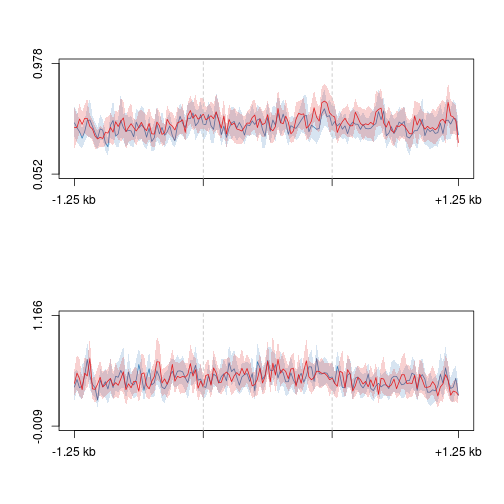
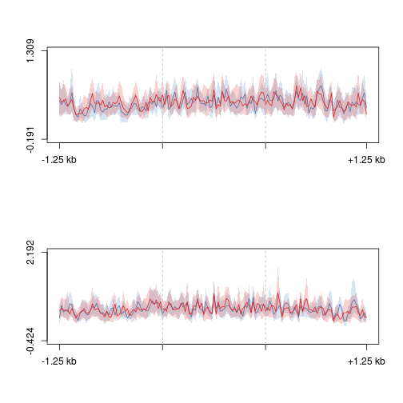
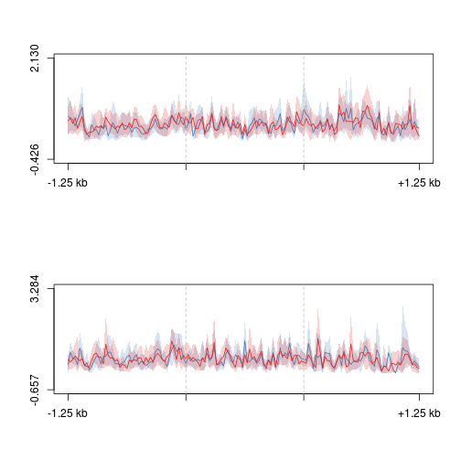
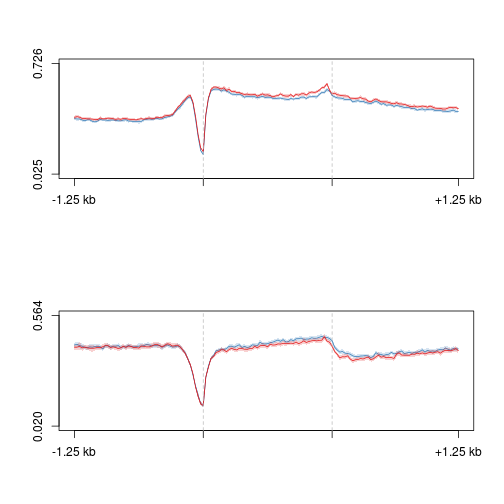
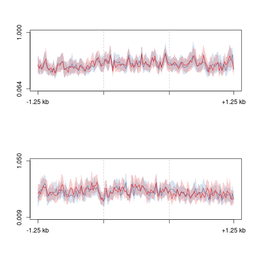
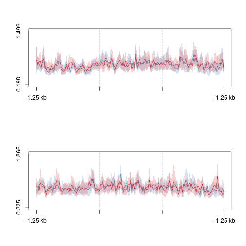
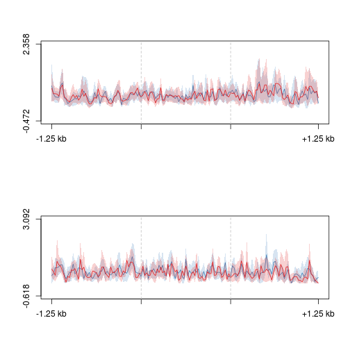
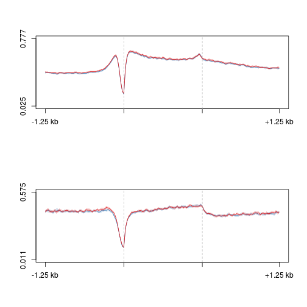

Analysis for Guan
========================================================

**In each plot, 5hmC is on top and 5mC is on bottom.**
**Blue is contra, red is ipsi**


```r
suppressPackageStartupMessages(source("~/src/seqAnalysis/R/profiles2.R"))
```


Dorsal
-------

### List 1 

```r
plot2.several("gene_whole_W200N50F50_guanz_list1_chr", set = "guanz_dorsal", 
    data_type = "rpkm/mean", cols = col2, fname = "manual")
```

```
## [1] "cd_hmc_mean"
## [1] "id_hmc_mean"
## [1] "cd_mc_mean"
## [1] "id_mc_mean"
```

```
## [1] 0.052 0.978
```

 

```
## [1] -0.009  1.166
```


### List 2

```r
plot2.several("gene_whole_W200N50F50_guanz_list2_chr", set = "guanz_dorsal", 
    data_type = "rpkm/mean", cols = col2, fname = "manual")
```

```
## [1] "cd_hmc_mean"
## [1] "id_hmc_mean"
## [1] "cd_mc_mean"
## [1] "id_mc_mean"
```

```
## [1] -0.191  1.309
```

 

```
## [1] -0.424  2.192
```


### List 3

```r
plot2.several("gene_whole_W200N50F50_guanz_list3_chr", set = "guanz_dorsal", 
    data_type = "rpkm/mean", cols = col2, fname = "manual")
```

```
## [1] "cd_hmc_mean"
## [1] "id_hmc_mean"
## [1] "cd_mc_mean"
## [1] "id_mc_mean"
```

```
## [1] -0.426  2.130
```

 

```
## [1] -0.657  3.284
```


### All genes 

```r
plot2.several("gene_whole_W200N50F50_chr", set = "guanz_dorsal", data_type = "rpkm/mean", 
    cols = col2, fname = "manual")
```

```
## [1] "cd_hmc_mean"
## [1] "id_hmc_mean"
## [1] "cd_mc_mean"
## [1] "id_mc_mean"
```

```
## [1] 0.025 0.726
```

 

```
## [1] 0.020 0.564
```

Ventral
-------------------

### List 1 

```r
plot2.several("gene_whole_W200N50F50_guanz_list1_chr", set = "guanz_ventral", 
    data_type = "rpkm/mean", cols = col2, fname = "manual")
```

```
## [1] "cv_hmc_mean"
## [1] "iv_hmc_mean"
## [1] "cv_mc_mean"
## [1] "iv_mc_mean"
```

```
## [1] 0.064 1.000
```

 

```
## [1] 0.009 1.050
```


### List 2

```r
plot2.several("gene_whole_W200N50F50_guanz_list2_chr", set = "guanz_ventral", 
    data_type = "rpkm/mean", cols = col2, fname = "manual")
```

```
## [1] "cv_hmc_mean"
## [1] "iv_hmc_mean"
## [1] "cv_mc_mean"
## [1] "iv_mc_mean"
```

```
## [1] -0.198  1.499
```

 

```
## [1] -0.335  1.865
```


### List 3

```r
plot2.several("gene_whole_W200N50F50_guanz_list3_chr", set = "guanz_ventral", 
    data_type = "rpkm/mean", cols = col2, fname = "manual")
```

```
## [1] "cv_hmc_mean"
## [1] "iv_hmc_mean"
## [1] "cv_mc_mean"
## [1] "iv_mc_mean"
```

```
## [1] -0.472  2.358
```

 

```
## [1] -0.618  3.092
```


### All genes

```r
plot2.several("gene_whole_W200N50F50_chr", set = "guanz_ventral", data_type = "rpkm/mean", 
    cols = col2, fname = "manual")
```

```
## [1] "cv_hmc_mean"
## [1] "iv_hmc_mean"
## [1] "cv_mc_mean"
## [1] "iv_mc_mean"
```

```
## [1] 0.025 0.777
```

 

```
## [1] 0.011 0.575
```

