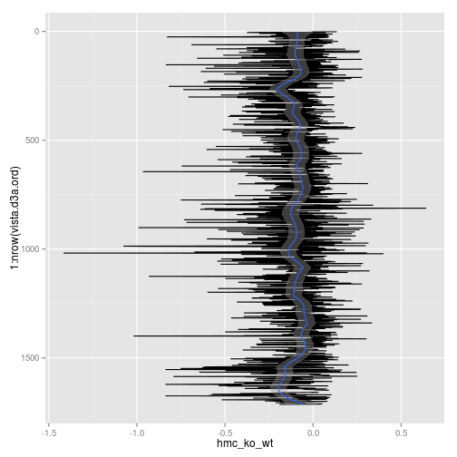

Classification of enhancers by homeodomain sites
==========
Goal
----------
Berger et al (2008) defined the binding preferences of 178 homeodomain transcription factors for Y 8-mers. Can we classify Dnmt3a-targeted regions by the occurence or distribution of these preferred sequences? That is, can we use this information to predict what HD will bind a given region? 

### Approach
1. Count the number of HD sites within a given sequence
    * Dnmt3a-targeted conserved regions (N = 7903)
    * Vista enhancers (N = 1756)
    * Conserved regions within vista enhancers (N = 4020)
      * phastConsElements30way_len50_inter_vista2_masked.fa
      
2. Cluster training set (1/10 of data)
    * Algorithms
      * HOPACH
      * Hclust
      * Proximity matrix from random forest
  
3. Classify remainder using random forest

### Code

#### 1. Count the number of HD sites within a given sequence

Run Jellyfish to construct hash tables of 8mer counts within a given sequence.

First set up directory of fasta files with individual sequences. In R,
```
sapply(names(vista.fa), function(x) write.XStringSet(vista.fa[x], paste("~/data/vista/vista_masked_8mer/", x, ".fa", sep=""), format="fasta))
```

For-loop through `jellyfish count` function. While in sequence directory:
```
for f in `ls`; do jellyfish count -o ../phastConsElements30way_len50_inter_vista2_masked_8mer/"$f" 
-m 8 -c 3 -s 100000 -t 6 -C $f; done
```

Convert hash tables to fasta output in which the header the the number of occurences of the sequence. While in 'phastConsElements30way_len50_inter_vista2_masked_8mer' directory:
```
for f in `ls`; do jellyfish dump -o "$f".fa $f; done
```

Assemble count matrix in R. 'parse_kmer_counts' returns a matrix with rows corresponding to each sequence and columns to each HD in ESCORE_MAT. 
```
source("~/src/seqAnalysis/R/hd.R")
counts <- parse_kmer_counts("~/data/vista/phastConsElements30way_len50_inter_vista2_masked_8mer")
```

Normalize counts by expected binomial occurences
```
vista.cons <- read.DNAStringSet("~/data/vista/phastConsElements30way_len50_inter_vista2_masked.fa")
vista.count.norm <- norm_by_binom(counts, vista.cons)
```

Threshold count matrix by significant E-score (0.45) and remove outliers.
```
vista.count.norm.thresh <- threshold_count_matrix(vista.count.norm)
q <- quantile(rowSums(vista.count.norm.thresh), probs=c(.01, .99))
vista.counts.norm.thresh.98 <- vista.counts.norm.thresh[rowSums(vista.counts.norm.thresh)>=q[1] & rowSums(vista.counts.norm.thresh)<=q[2],]
```

#### 2. Clustering

#### HOPACH


```r
vista.counts.norm.thresh.98 <- readRDS("~/data/vista/vista_masked_counts_normBinom_thresh45_mid98.rds")
```

Consangle distance matrix
```
vista.counts.norm.thresh.98.cos <- distancematrix(vista.counts.norm.thresh.98, "cosangle")
```

Hopach clustering
```
vista.counts.norm.thresh.98.ho <- hopach(data=vista.counts.norm.thresh.98, dmat=vista.counts.norm.thresh.98.cos)
```

```r
vista.counts.norm.thresh.98.ho <- readRDS("~/data/vista/vista_masked_counts_normBinom_thresh45_mid98_hopach_cosangle.rds")
```


Plot original data with hopach ordering.

```r
suppressPackageStartupMessages(library(gplots))
heatmap.2(vista.counts.norm.thresh.98[vista.counts.norm.thresh.98.ho$final$order, 
    ], trace = "none", Rowv = F, breaks = seq(0, 2000, 100))
```

```
## Warning: Discrepancy: Rowv is FALSE, while dendrogram is `column'.
## Omitting row dendogram.
```

 


Plot 5hmC Dnmt3a KO/WT ratios in this order.

```r
vista.d3a <- readRDS("~/s2/analysis/features/norm/rpkm/mean/rdata/d3a_rpkm_vista.bed_chr_sqrt_ratios")
vista.d3a.ord <- vista.d3a[match(rownames(vista.counts.norm.thresh.98), rownames(vista.d3a)), 
    ]
library(ggplot2)
rename <- reshape::rename
gg <- ggplot(vista.d3a.ord, aes(x = 1:nrow(vista.d3a.ord), y = hmc_ko_wt))
gg <- gg + geom_line() + coord_flip() + scale_x_reverse()
gg <- gg + stat_smooth(method = "loess", span = 0.1)
gg
```

```
## Warning: Removed 19 rows containing missing values (stat_smooth).
```

 


#### Hierachical clustering

Euclici
