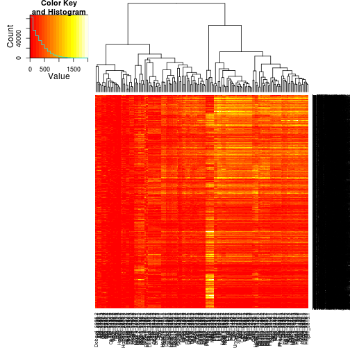

Classification of enhancers by homeodomain sites
========================================================

Goal
----------
Berger et al (2008) defined the binding preferences of X homeodomain transcription factors for Y 8-mers. Can we classify Dnmt3a-targeted regions by the occurence or distribution of these preferred sequences? That is, can we use this information to predict what HD will bind a given region? 

### Approach
1. Count the number of HD sites within a given sequence
    * Dnmt3a-targeted conserved regions (N = 7903)
    * Vista enhancers (N = 1756)
2. Cluster training set
    * HOPACH
    * Hclust
    * Proximity matrix from random forest
3. Classify remainder using random forest

### Code

#### 1. Count the number of HD sites within a given sequence

Load source file and read in data

```r
suppressPackageStartupMessages(source("~/src/seqAnalysis/R/hd.R"))
```

```
vista <- read.DNAStringSet("~/data/vista/vista.fa")
```
Count the number of occurences of each 8-mer above a given E-score threshold for each sequence
```
vista.count <- countHDsites(vista, .45)
```

Normalize counts by sequence length
```
vista.count.norm <- norm_hd_matrix(vista.count, vista)
```


```r
# Read in matrix of 8-mer occurences Rows: genomic regions Columns: HD

vista.count <- readRDS("~/data/hughes/vista_count.rds")
```

```
## Warning: cannot open compressed file
## '/home/user/data/hughes/vista_count.rds', probable reason 'No such file or
## directory'
```

```
## Error: cannot open the connection
```


```r
plot(cars)
```

 


