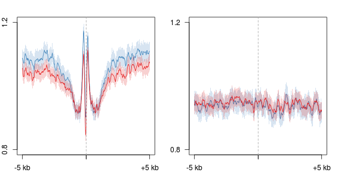
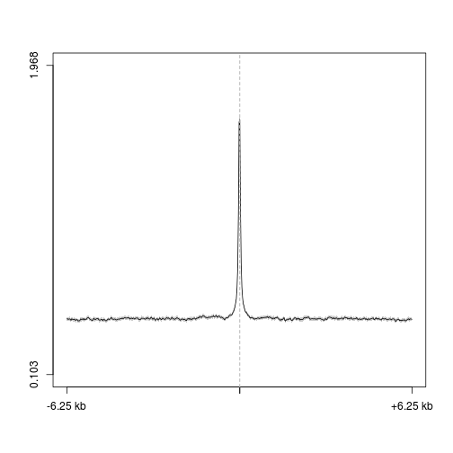
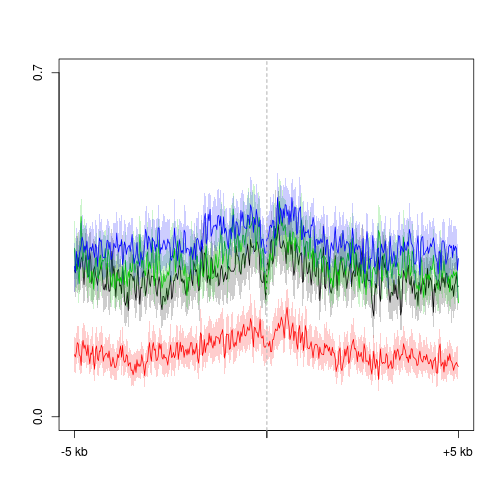
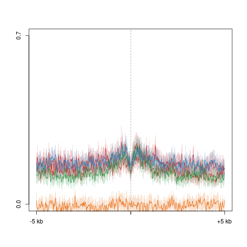
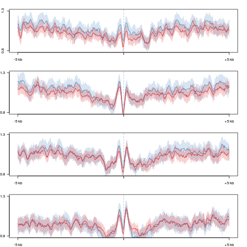
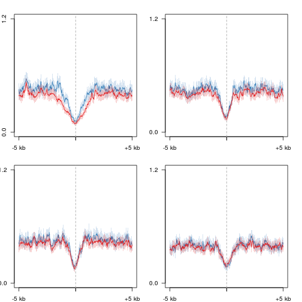
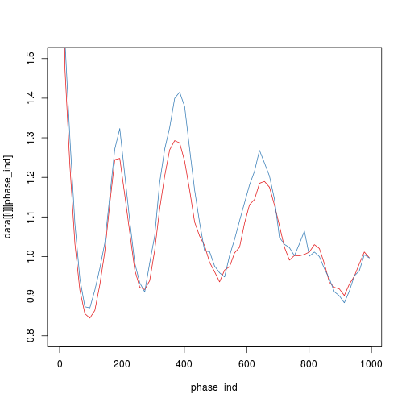

D3a - DNase peaks 2 
========================================================


```r
opts_chunk$set(warning = FALSE, message = FALSE, error = FALSE, results = "hide")
suppressPackageStartupMessages(source("~/src/seqAnalysis/R/profiles2.R"))
library(ggplot2)
```


```r
makeProfile2.allSamp("d3a_het_dnase_sort_q30_dnase_sub_igenome_ensembl_genes_extend5kb_nosex.bed_W25F200_both_chr", 
    data_type = "bam_extend/mean_chrom_mean_0", rm.outliers = 0.01)
makeProfile2.allSamp("d3a_het_dnase_sort_q30_dnase_sub_igenome_ensembl_genes_extend5kb.bed_W25F200_both_chr", 
    data_type = "bam_ends/mean", rm.outliers = 0.01)
makeProfile2.allSamp("d3a_het_dnase_sort_q30_dnase_sub_igenome_ensembl_genes_extend5kb_nosex.bed_W25F200_both_chr", 
    data_type = "rpkm/mean", rm.outliers = 0.01)
makeProfile2.allSamp("d3a_het_dnase_sort_q30_dnase_sub_igenome_ensembl_genes_extend5kb.bed_W25F200_both_chr", 
    data_type = "bam/mean", rm.outliers = 0.01)
```


```r
makeProfile2.allSamp("d3a_het_dnase_sort_q30_dnase_sub_igenome_ensembl_genes_extend5kb_nosex.bed_W25F200_both_chr", 
    data_type = "bam_extend/mean_chrom_mean_0", rm.outliers = 0.01, group2 = "d3a_het_dnase_sort_q30_dnase_sub_igenome_ensembl_genes_extend5kb_d3a_hmc_flank1000_ko_wt_ratio_q10")
makeProfile2.allSamp("d3a_het_dnase_sort_q30_dnase_sub_igenome_ensembl_genes_extend5kb.bed_W25F200_both_chr", 
    data_type = "rpkm/mean", rm.outliers = 0.01, group2 = "d3a_het_dnase_sort_q30_dnase_sub_igenome_ensembl_genes_extend5kb_d3a_hmc_flank1000_ko_wt_ratio_q10")
```


```r
makeProfile2.allSamp("d3a_het_dnase_sort_q30_dnase_sub_igenome_ensembl_genes_extend5kb_shuffle_nosex.bed_W25F200_both_chr", 
    data_type = "bam_extend/mean_chrom_mean_0", rm.outliers = 0.01)
makeProfile2.allSamp("d3a_het_dnase_sort_q30_dnase_sub_igenome_ensembl_genes_extend5kb_shuffle.bed_W25F200_both_chr", 
    data_type = "bam_ends/mean", rm.outliers = 0.01)
makeProfile2.allSamp("d3a_het_dnase_sort_q30_dnase_sub_igenome_ensembl_genes_extend5kb_shuffle.bed_W25F200_both_chr", 
    data_type = "rpkm/mean", rm.outliers = 0.01)
```


#### 50 kb view

```r
makeProfile2.allSamp("d3a_het_dnase_sort_q30_dnase_sub_igenome_ensembl_genes_extend5kb.bed_W200F250_both_chr", 
    data_type = "bam_extend/mean_chrom_mean_0", rm.outliers = 0.01)
makeProfile2.allSamp("d3a_het_dnase_sort_q30_dnase_sub_igenome_ensembl_genes_extend5kb.bed_W200F250_both_chr", 
    data_type = "bam_ends/mean", rm.outliers = 0.01)
makeProfile2.allSamp("d3a_het_dnase_sort_q30_dnase_sub_igenome_ensembl_genes_extend5kb.bed_W200F250_both_chr", 
    data_type = "rpkm/mean", rm.outliers = 0.01)
makeProfile2.allSamp("d3a_het_dnase_sort_q30_dnase_sub_igenome_ensembl_genes_extend5kb.bed_W200F250_both_chr", 
    data_type = "bam/mean", rm.outliers = 0.01)
```


### 5hmC

```r
par(mfrow = c(1, 2), mar = c(2, 2, 2, 2))
plot2.several("d3a_het_dnase_sort_q30_dnase_sub_igenome_ensembl_genes_extend5kb.bed_W25F200_both_chr", 
    "d3a_hmc", data_type = "rpkm/mean", group2 = "trim0.01", cols = col2, y.vals = c(0.2, 
        1))
plot2.several("d3a_het_dnase_sort_q30_dnase_sub_igenome_ensembl_genes_extend5kb_shuffle.bed_W25F200_both_chr", 
    "d3a_hmc", data_type = "rpkm/mean", group2 = "trim0.01", cols = col2, y.vals = c(0.2, 
        1))
```

 


#### 50 kb view

```r
par(mfrow = c(1, 2), mar = c(2, 2, 2, 2))
plot2.several("d3a_het_dnase_sort_q30_dnase_sub_igenome_ensembl_genes_extend5kb.bed_W200F250_both_chr", 
    "d3a_hmc", data_type = "rpkm/mean", group2 = "trim0.01", cols = col2, y.vals = c(0.2, 
        1))
#
# plot2.several('d3a_het_dnase_sort_q30_dnase_sub_igenome_ensembl_genes_extend5kb_shuffle.bed_W25F200_both_chr',
# 'd3a_hmc', data_type='rpkm/mean', group2='trim0.01', cols=col2,
# y.vals=c(.2, 1))
```


### 5mC

```r
par(mfrow = c(1, 2), mar = c(2, 2, 2, 2))
plot2.several("d3a_het_dnase_sort_q30_dnase_sub_igenome_ensembl_genes_extend5kb.bed_W25F200_both_chr", 
    "d3a_mc", data_type = "rpkm/mean", group2 = "trim0.01", cols = col2, y.vals = c(0, 
        0.6))
plot2.several("d3a_het_dnase_sort_q30_dnase_sub_igenome_ensembl_genes_extend5kb_shuffle.bed_W25F200_both_chr", 
    "d3a_hmc", data_type = "rpkm/mean", group2 = "trim0.01", cols = col2, y.vals = c(0, 
        1))
```

 


#### 50 kb view

```r
par(mfrow = c(1, 2), mar = c(2, 2, 2, 2))
plot2.several("d3a_het_dnase_sort_q30_dnase_sub_igenome_ensembl_genes_extend5kb.bed_W200F250_both_chr", 
    "d3a_mc", data_type = "rpkm/mean", group2 = "trim0.01", cols = col2, y.vals = c(0.2, 
        1))
#
# plot2.several('d3a_het_dnase_sort_q30_dnase_sub_igenome_ensembl_genes_extend5kb_shuffle.bed_W25F200_both_chr',
# 'd3a_hmc', data_type='rpkm/mean', group2='trim0.01', cols=col2,
# y.vals=c(.2, 1))
```


### Nucleosomes

```r
par(mfrow = c(1, 2), mar = c(2, 2, 2, 2))
plot2.several("d3a_het_dnase_sort_q30_dnase_sub_igenome_ensembl_genes_extend5kb_nosex.bed_W25F200_both_chr", 
    "d3a_nuc_extend", data_type = "bam_extend/mean_chrom_mean_0", group2 = "trim0.01", 
    cols = col2, y.vals = c(0.8, 1.2), baseline = F)
plot2.several("d3a_het_dnase_sort_q30_dnase_sub_igenome_ensembl_genes_extend5kb_shuffle_nosex.bed_W25F200_both_chr", 
    "d3a_nuc_extend", data_type = "bam_extend/mean_chrom_mean_0", group2 = "trim0.01", 
    cols = col2, y.vals = c(0.8, 1.2))
```

 

```r
plot2.several("d3a_het_dnase_sort_q30_dnase_sub_igenome_ensembl_genes_extend5kb_nosex.bed_W25F200_both_chr", 
    "d3a_nuc2", data_type = "rpkm/mean", group2 = "trim0.01", cols = col2)
```

 


```r
plot2.several("d3a_het_dnase_sort_q30_dnase_sub_igenome_ensembl_genes_extend5kb_nosex.bed_W25F200_both_chr", 
    "d3a_nuc_extend", data_type = "bam_extend/mean_chrom_mean", group2 = "trim0.01", 
    cols = col2, y.vals = c(0.8, 1.2), baseline = F)
```

 


#### 50 kb view

```r
plot2.several("d3a_het_dnase_sort_q30_dnase_sub_igenome_ensembl_genes_extend5kb_nosex.bed_W200F250_both_chr", 
    "d3a_nuc_extend", data_type = "bam_extend/mean_chrom_mean_0", group2 = "trim0.01", 
    cols = col2, y.vals = c(0.8, 1.2), baseline = F)
plot2.several("d3a_het_dnase_sort_q30_dnase_sub_igenome_ensembl_genes_extend5kb_nosex.bed_W200F250_both_chr", 
    "d3a_nuc2", data_type = "rpkm/mean", group2 = "trim0.01", cols = col2)
```

 


#### DNase

```r
par(mar = c(2, 2, 2, 2))
plot2("d3a_het_dnase_sort_q30_dnase_sub_igenome_ensembl_genes_extend5kb.bed_W25F200_both_chr", 
    "d3a_het_dnase_sort_q30", data_type = "bam_ends/mean", group2 = "trim0.01", 
    y.vals = c(0, 0.7))
```

 


```r
plot2("d3a_het_dnase_sort_q30_dnase_sub_igenome_ensembl_genes_extend5kb.bed_W200F250_both_chr", 
    "d3a_het_dnase_sort_q30", data_type = "bam_ends/mean", group2 = "trim0.01")
```

 


#### RNA

```r
plot2.several("d3a_het_dnase_sort_q30_dnase_sub_igenome_ensembl_genes_extend5kb.bed_W25F200_both_chr", 
    "d3xog_rmrna", data_type = "bam/mean", group2 = "trim0.01", cols = col2, 
    y.vals = c(0, 0.7))
```

 


```r
plot2.several("d3a_het_dnase_sort_q30_dnase_sub_igenome_ensembl_genes_extend5kb.bed_W200F250_both_chr", 
    "d3xog_rmrna", data_type = "bam/mean", group2 = "trim0.01", cols = col2, 
    y.vals = c(0, 0.7), wsize = 200, range = c(201, 300))
```

 


```r
plot2.several("d3a_het_dnase_sort_q30_dnase_sub_igenome_ensembl_genes_extend5kb.bed_W25F200_both_chr", 
    "d3a_mrna", data_type = "bam/mean", group2 = "trim0.01", cols = col2, wsize = 25)
```

 


```r
par(mfrow = c(2, 2), mar = c(2, 2, 2, 2))
for (i in 1:4) {
    plot2.several("d3a_het_dnase_sort_q30_dnase_sub_igenome_ensembl_genes_extend5kb.bed_W25F200_both_chr", 
        "d3a_hmc", data_type = "rpkm/mean", group2 = "d3a_het_dnase_sort_q30_dnase_sub_igenome_ensembl_genes_extend5kb_d3a_hmc_flank1000_ko_wt_ratio_q4_trim0.01", 
        cols = col2, group2_col = i, y.vals = c(0, 1.2))
}
```

 


```r
par(mfrow = c(2, 2), mar = c(2, 2, 2, 2))
for (i in 1:4) {
    plot2.several("d3a_het_dnase_sort_q30_dnase_sub_igenome_ensembl_genes_extend5kb.bed_W25F200_both_chr", 
        "d3a_mc", data_type = "rpkm/mean", group2 = "d3a_het_dnase_sort_q30_dnase_sub_igenome_ensembl_genes_extend5kb_d3a_hmc_flank1000_ko_wt_ratio_q4_trim0.01", 
        cols = col2, group2_col = i, y.vals = c(0, 1.2))
}
```

 


```r
par(mfrow = c(2, 2), mar = c(2, 2, 2, 2))
for (i in c(1, 4, 7, 10)) {
    plot2.several("d3a_het_dnase_sort_q30_dnase_sub_igenome_ensembl_genes_extend5kb.bed_W25F200_both_chr", 
        "d3a_hmc", data_type = "rpkm/mean", group2 = "d3a_het_dnase_sort_q30_dnase_sub_igenome_ensembl_genes_extend5kb_d3a_hmc_flank1000_ko_wt_ratio_q10_trim0.01", 
        cols = col2, group2_col = i, y.vals = c(0, 1.2))
}
```

 


```r
par(mfrow = c(2, 2), mar = c(2, 2, 2, 2))
for (i in c(1, 4, 7, 10)) {
    plot2.several("d3a_het_dnase_sort_q30_dnase_sub_igenome_ensembl_genes_extend5kb.bed_W25F200_both_chr", 
        "d3a_mc", data_type = "rpkm/mean", group2 = "d3a_het_dnase_sort_q30_dnase_sub_igenome_ensembl_genes_extend5kb_d3a_hmc_flank1000_ko_wt_ratio_q10_trim0.01", 
        cols = col2, group2_col = i, y.vals = c(0, 0.8))
}
```

 


```r
par(mfrow = c(4, 1), mar = c(2, 2, 2, 2))
for (i in 1:4) {
    plot2.several("d3a_het_dnase_sort_q30_dnase_sub_igenome_ensembl_genes_extend5kb_nosex.bed_W25F200_both_chr", 
        "d3a_nuc_extend", data_type = "bam_extend/mean_chrom_mean_0", group2 = "d3a_het_dnase_sort_q30_dnase_sub_igenome_ensembl_genes_extend5kb_d3a_hmc_flank1000_ko_wt_ratio_q4_trim0.01", 
        cols = col2, group2_col = i, y.vals = c(0.8, 1.3))
}
```

 


```r
par(mfrow = c(4, 1), mar = c(2, 2, 2, 2))
for (i in c(1, 4, 7, 10)) {
    plot2.several("d3a_het_dnase_sort_q30_dnase_sub_igenome_ensembl_genes_extend5kb_nosex.bed_W25F200_both_chr", 
        "d3a_nuc_extend", data_type = "bam_extend/mean_chrom_mean_0", group2 = "d3a_het_dnase_sort_q30_dnase_sub_igenome_ensembl_genes_extend5kb_d3a_hmc_flank1000_ko_wt_ratio_q10_trim0.01", 
        cols = col2, group2_col = i, y.vals = c(0.8, 1.3))
}
```

 


Nuc phasing
----------------

```r
suppressPackageStartupMessages(source("~/src/seqAnalysis/R/phase.R"))
```


```
phase_batch.py -t d3xog_nuc_pileup2.trk -b dnase -n 2 -l 1000
```

```r
pd <- loadPhaseData("~/s2/analysis/nuc/phasogram/dnase/")
ind16 <- seq(1, 1000, 16)
pd.n <- normPhaseData(pd, ind16)
```


```r
plotPhase.pair(pd.n, ind16, 1, cols = rev(col2), ylim = c(0.8, 1.5))
```

 


Expression of genes adjacent to intergenic DNase HS sites with increased/decreased nuc occupancy
------------------

```r
d3.inter.q75.rg <- read.delim("~/s2/data/homer/peaks/d3a_het_dnase_sort_q30/d3a_het_dnase_sort_q30_dnase_sub_igenome_ensembl_genes_extend5kb_nosex_mid1kb_d3xog_ko_wt_ratio_q75_closest_refgene_nodup.bed", 
    header = F)
d3.inter.q25.rg <- read.delim("~/s2/data/homer/peaks/d3a_het_dnase_sort_q30/d3a_het_dnase_sort_q30_dnase_sub_igenome_ensembl_genes_extend5kb_nosex_mid1kb_d3xog_ko_wt_ratio_q25_closest_refgene_nodup.bed", 
    header = F)
rna.1log2 <- readRDS("~/s2/analysis/rna/rdata/d3xog_wt_ko_rmrna_masked_uq_comp_1log2.rds")
rna.1log2$d3.inter <- "mid"
rna.1log2$d3.inter[rna.1log2$gene %in% d3.inter.q75.rg[, 10]] <- "q75"
rna.1log2$d3.inter[rna.1log2$gene %in% d3.inter.q25.rg[, 10]] <- "q25"
```


```r
theme_set(theme_bw())
gg <- ggplot(rna.1log2, aes(x = ko.wt, color = d3.inter))
gg <- gg + geom_density() + coord_cartesian(xlim = c(-3, 3)) + scale_color_manual(values = c("black", 
    "red", "blue"))
gg <- gg + labs(x = c("KO / WT log2(FPKM + 1)"))
gg
```

 

