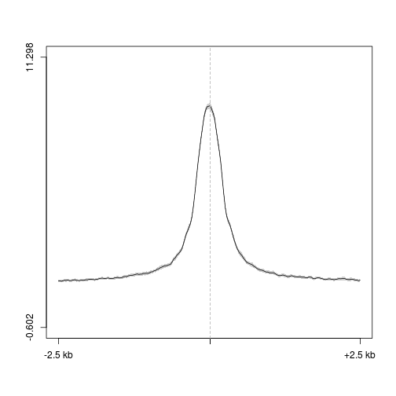
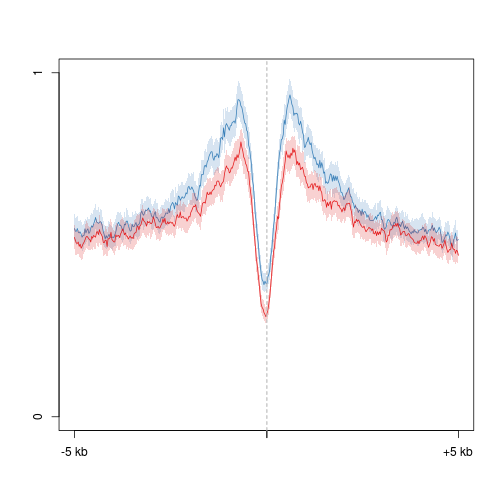
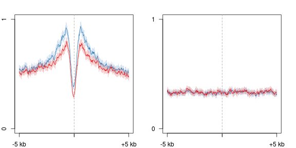
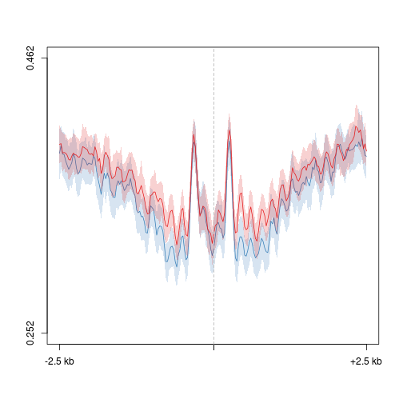
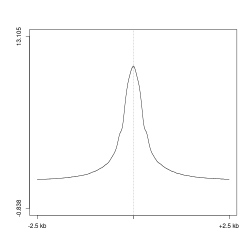
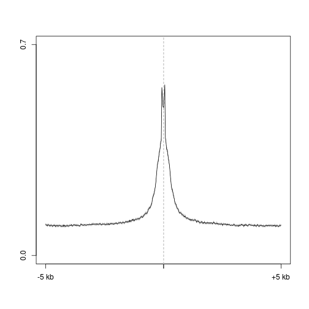
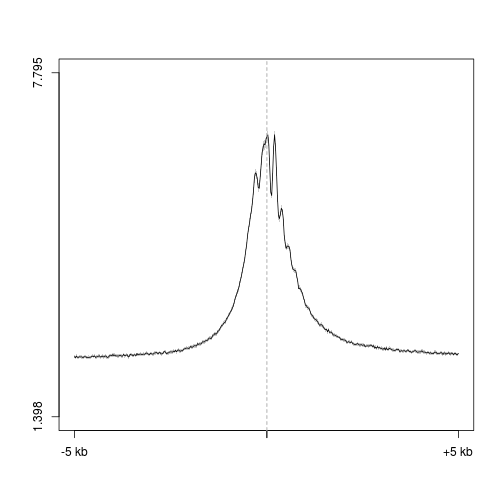
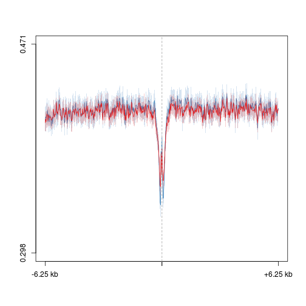

D3a DNase
========================================================

Intergenic DNase peaks in Dnmt3a het
--------------------------------------

```r
suppressPackageStartupMessages(source("~/src/seqAnalysis/R/profiles2.R"))
```


### DNase

```r
plot2("d3a_het_dnase_sort_q30_F3_size500_sub_igenome_ensembl_genes_extend5kb.bed_W25F200_both_chr", 
    "d3a_het_dnase_sort_q30_rmdup", data_type = "bam/mean", group2 = "exclude-chrX_trim0.01", 
    fname = "manual", range = c(101, 300))
```

```
## [1] "d3a_het_dnase_sort_q30_rmdup_exclude-chrX_trim0.01"
## [1] "d3a_het_dnase_sort_q30_rmdup_exclude-chrX_trim0.01_mean"
```

 

```
## [1] -0.602 11.298
```


### 5hmC

```r
plot2.several("d3a_het_dnase_sort_q30_F3_size500_sub_igenome_ensembl_genes_extend5kb.bed_W25F200_both_chr", 
    "d3a_hmc", data_type = "rpkm/mean", cols = col2, group2 = "exclude-chrX_trim0.01", 
    fname = "manual", range = c(101, 300))
```

```
## [1] "moe_d3a_wt_hmc_rpkm_exclude-chrX_trim0.01"
## [1] "moe_d3a_wt_hmc_rpkm_exclude-chrX_trim0.01_mean"
## [1] "moe_d3a_ko_hmc_rpkm_exclude-chrX_trim0.01"
## [1] "moe_d3a_ko_hmc_rpkm_exclude-chrX_trim0.01_mean"
```

 

```
## [1] 0.044 1.384
```


### 5mC

```r
plot2.several("d3a_het_dnase_sort_q30_F3_size500_sub_igenome_ensembl_genes_extend5kb.bed_W25F200_both_chr", 
    "d3a_mc", data_type = "rpkm/mean", cols = col2, group2 = "exclude-chrX_trim0.01", 
    fname = "manual", range = c(101, 300))
```

```
## [1] "moe_d3a_wt_mc_rpkm_exclude-chrX_trim0.01"
## [1] "moe_d3a_wt_mc_rpkm_exclude-chrX_trim0.01_mean"
## [1] "moe_d3a_ko_mc_rpkm_exclude-chrX_trim0.01"
## [1] "moe_d3a_ko_mc_rpkm_exclude-chrX_trim0.01_mean"
```

 

```
## [1] 0.005 0.656
```


### Nuc -- midpoint

```r
plot2.several("d3a_het_dnase_sort_q30_F3_size500_sub_igenome_ensembl_genes_extend5kb.bed_W25F200_both_chr", 
    "d3a_nuc2", data_type = "rpkm/mean", cols = col2, group2 = "exclude-chrX_trim0.01", 
    fname = "manual", range = c(101, 300))
```

```
## [1] "d3xog_wt_nuc_478_rmdup_exclude-chrX_trim0.01"
## [1] "d3xog_wt_nuc_478_rmdup_exclude-chrX_trim0.01_mean"
## [1] "d3xog_ko_nuc_256_rmdup_exclude-chrX_trim0.01"
## [1] "d3xog_ko_nuc_256_rmdup_exclude-chrX_trim0.01_mean"
```

 

```
## [1] 0.252 0.462
```


All DNase peaks in Dnmt3a het
--------------------------------------

```r
suppressPackageStartupMessages(source("~/src/seqAnalysis/R/profiles2.R"))
```


### DNase

```r
plot2("d3a_het_dnase_sort_q30_F3_size500.bed_W25F200_both_chr", "d3a_het_dnase_sort_q30_rmdup", 
    data_type = "bam/mean", group2 = "exclude-chrX_trim0.01", fname = "manual", 
    range = c(101, 300))
```

```
## [1] "d3a_het_dnase_sort_q30_rmdup_exclude-chrX_trim0.01"
## [1] "d3a_het_dnase_sort_q30_rmdup_exclude-chrX_trim0.01_mean"
```

 

```
## [1] -0.838 13.105
```


### 5hmC

```r
plot2.several("d3a_het_dnase_sort_q30_F3_size500.bed_W25F200_both_chr", "d3a_hmc", 
    data_type = "rpkm/mean", cols = col2, group2 = "exclude-chrX_trim0.01", 
    fname = "manual", range = c(101, 300))
```

```
## [1] "moe_d3a_wt_hmc_rpkm_exclude-chrX_trim0.01"
## [1] "moe_d3a_wt_hmc_rpkm_exclude-chrX_trim0.01_mean"
## [1] "moe_d3a_ko_hmc_rpkm_exclude-chrX_trim0.01"
## [1] "moe_d3a_ko_hmc_rpkm_exclude-chrX_trim0.01_mean"
```

 

```
## [1] -0.113  1.047
```


### 5mC

```r
plot2.several("d3a_het_dnase_sort_q30_F3_size500.bed_W25F200_both_chr", "d3a_mc", 
    data_type = "rpkm/mean", cols = col2, group2 = "exclude-chrX_trim0.01", 
    fname = "manual", range = c(101, 300))
```

```
## [1] "moe_d3a_wt_mc_rpkm_exclude-chrX_trim0.01"
## [1] "moe_d3a_wt_mc_rpkm_exclude-chrX_trim0.01_mean"
## [1] "moe_d3a_ko_mc_rpkm_exclude-chrX_trim0.01"
## [1] "moe_d3a_ko_mc_rpkm_exclude-chrX_trim0.01_mean"
```

 

```
## [1] -0.071  0.586
```


### Nuc -- midpoint

```r
plot2.several("d3a_het_dnase_sort_q30_F3_size500.bed_W25F200_both_chr", "d3a_nuc2", 
    data_type = "rpkm/mean", cols = col2, group2 = "exclude-chrX_trim0.01", 
    fname = "manual", baseline = F, range = c(101, 300))
```

```
## [1] "d3xog_wt_nuc_478_rmdup_exclude-chrX_trim0.01"
## [1] "d3xog_wt_nuc_478_rmdup_exclude-chrX_trim0.01_mean"
## [1] "d3xog_ko_nuc_256_rmdup_exclude-chrX_trim0.01"
## [1] "d3xog_ko_nuc_256_rmdup_exclude-chrX_trim0.01_mean"
```

 

```
## [1] 0.170 0.446
```

