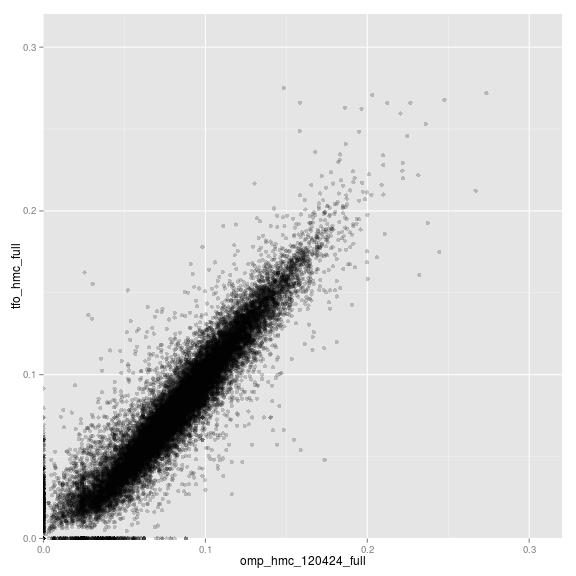
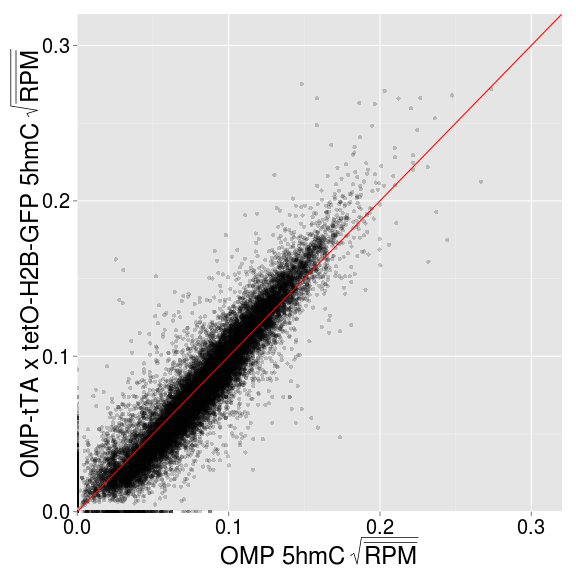
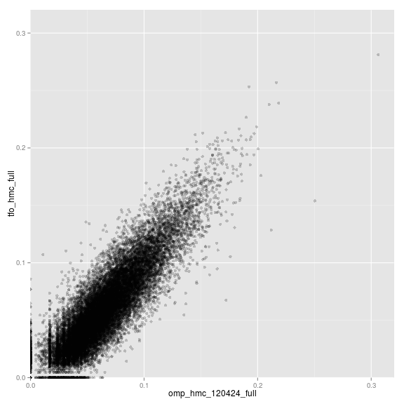
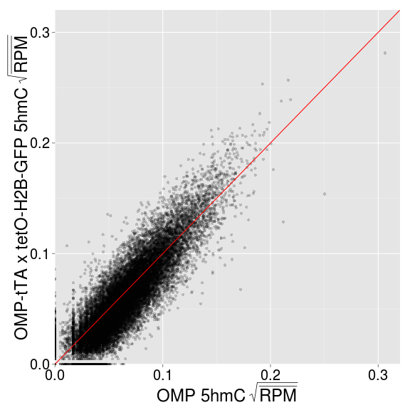
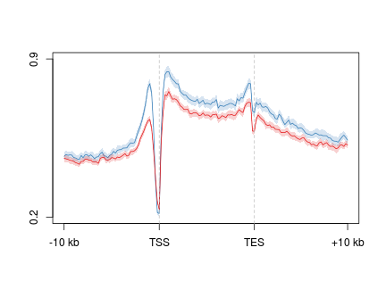
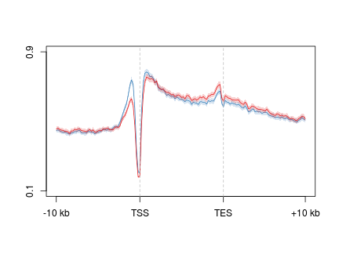

5hmC stability
========================================================

TFO
----------

Scatter of gene body levels

```r
tfo.gene <- read.delim("~/s2/analysis/features/norm/rpkm/mean/summaries/tfo_refgene_chr_sqrt")
cor(tfo.gene)
```

```
##                     tfo_hmc_full omp_hmc_120424_full
## tfo_hmc_full               1.000               0.935
## omp_hmc_120424_full        0.935               1.000
```


```r
library(ggplot2)
gg <- ggplot(tfo.gene, aes(omp_hmc_120424_full, tfo_hmc_full))
gg + geom_point(alpha = I(1/5)) + coord_cartesian(xlim = c(0, 0.32), ylim = c(0, 
    0.32))
```

 

```r
last_plot() + geom_abline(slope = 1, intercept = 0, color = "red") + xlab(bquote(.("OMP 5hmC" ~ 
    sqrt(bar(RPM))))) + ylab(bquote(.("OMP-tTA x tetO-H2B-GFP 5hmC" ~ sqrt(bar(RPM))))) + 
    theme(axis.text.x = element_text(size = 20, color = "black"), axis.text.y = element_text(size = 20, 
        color = "black"), axis.title.x = element_text(size = 24), axis.title.y = element_text(size = 24))
```

 

```r
last_plot() + annotate("text", x = 0.08, y = 0.3, label = "Pearson R = 0.94", 
    size = 9)
```

 


Scatter of TSS levels

```r
tfo.tss <- read.delim("~/s2/analysis/features/norm/rpkm/mean/summaries/tfo_refgene_-1kbTSS+1kb_chr_sqrt")
cor(tfo.tss)
```

```
##                     tfo_hmc_full omp_hmc_120424_full
## tfo_hmc_full              1.0000              0.8793
## omp_hmc_120424_full       0.8793              1.0000
```


```r
library(ggplot2)
gg <- ggplot(tfo.tss, aes(omp_hmc_120424_full, tfo_hmc_full))
gg + geom_point(alpha = I(1/5)) + coord_cartesian(xlim = c(0, 0.32), ylim = c(0, 
    0.32))
```

 

```r
last_plot() + geom_abline(slope = 1, intercept = 0, color = "red") + xlab(bquote(.("OMP 5hmC" ~ 
    sqrt(bar(RPM))))) + ylab(bquote(.("OMP-tTA x tetO-H2B-GFP 5hmC" ~ sqrt(bar(RPM))))) + 
    theme(axis.text.x = element_text(size = 20, color = "black"), axis.text.y = element_text(size = 20, 
        color = "black"), axis.title.x = element_text(size = 24), axis.title.y = element_text(size = 24))
```

 

```r
last_plot() + annotate("text", x = 0.08, y = 0.3, label = "Pearson R = 0.94", 
    size = 9)
```

 

Gene 5hmC plot comparing OMP with OMP-tTA / tetO-H2B-GFP (+DOX)

```r
suppressPackageStartupMessages(source("~/src/seqAnalysis/R/profiles2.R"))
```

```
makeProfile2("gene_whole_W200N50F50_chr", c("omp_hmc_120424_rpkm", "tfo_hmc_22M"), data_type="rpkm/mean")
makeProfile2("gene_whole_W200N50F50_chr", c("omp_hmc_120424_rpkm", "tfo_hmc_22M"), data_type="rpkm/mean", group2="omp_quartiles")
```


```r
plot2.several("gene_whole_W200N50F50_chr", "tfo_omp_rpkm", data_type = "rpkm/mean", 
    cols = col2, fname = "manual", wsize = 200, y.vals = c(0.2, 0.9), lab = c("TSS", 
        "TES"))
```

```
## [1] "tfo_hmc_22M_mean"
## [1] "omp_hmc_120424_rpkm_mean"
```

```
## [1] 0.2 0.9
```

 


Dnmt3a
----------

```
makeProfile2("gene_whole_W200N50F50_chr", c("moe_d3a_wt_hmc_rpkm", "moe_d3a_ko_hmc_rpkm"), data_type="rpkm/mean")
```

```r
plot2.several("gene_whole_W200N50F50_chr", "d3a_hmc", data_type = "rpkm/mean", 
    cols = col2, fname = "manual", wsize = 200, y.vals = c(0.1, 0.9), lab = c("TSS", 
        "TES"))
```

```
## [1] "moe_d3a_wt_hmc_rpkm_mean"
## [1] "moe_d3a_ko_hmc_rpkm_mean"
```

```
## [1] 0.1 0.9
```

 


Compute permutation significance

```r
suppressPackageStartupMessages(source("~/src/seqAnalysis/R/image.R"))
positionMatrix.all("gene_whole_W200N50F50_chr", data_type = "rpkm/mean")
wt <- makeImage("moe_d3a_wt_hmc_rpkm", "gene_whole_W200N50F50_chr", data_type = "rpkm/mean", 
    image = FALSE)
```

```
## [1] "/media/storage2/analysis/profiles/norm/rpkm/mean/gene_whole_W200N50F50_chr/images/moe_d3a_wt_hmc_rpkm"
```

```r
ko <- makeImage("moe_d3a_ko_hmc_rpkm", "gene_whole_W200N50F50_chr", data_type = "rpkm/mean", 
    image = FALSE)
```

```
## [1] "/media/storage2/analysis/profiles/norm/rpkm/mean/gene_whole_W200N50F50_chr/images/moe_d3a_ko_hmc_rpkm"
```


Permutation test

```r
suppressPackageStartupMessages(source("~/src/seqAnalysis/R/modeling.R"))
wt.ko.perm <- permutationTest.mat(wt, ko, N = 1000)
```


Add significance line to plot

```r
plot2.several("gene_whole_W200N50F50_chr", "d3a_hmc", data_type = "rpkm/mean", 
    cols = col2, fname = "manual", wsize = 200, y.vals = c(0.1, 0.9), lab = c("TSS", 
        "TES"))
```

```
## [1] "moe_d3a_wt_hmc_rpkm_mean"
## [1] "moe_d3a_ko_hmc_rpkm_mean"
```

```
## [1] 0.1 0.9
```

```r
plotSigLine(sig_values = wt.ko.perm, step = 5, yval = 0.85, thresh = 0.01)
```

 


