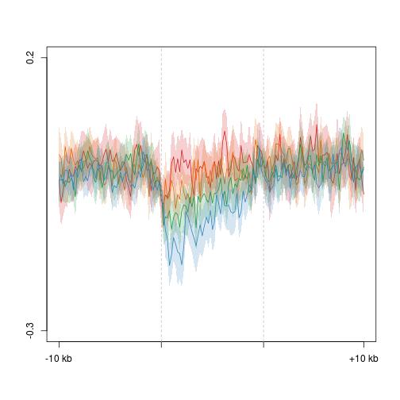
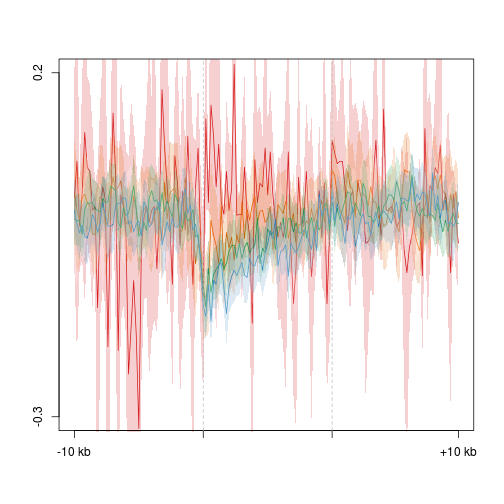
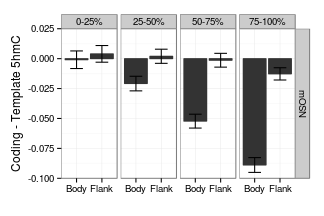

5hmC/5mC/mRNA strand asymmetry
========================================================

Gene profiles
--------------------------------------------------------
### Difference 


```r
suppressPackageStartupMessages(source("~/src/seqAnalysis/R/profiles2.R"))
```


### First try with full data set, do not remove outliers
```
makeProfile2("gene_whole_W200N50F50_chr", "omp_hmc_120424_rmdup_plus_omp_hmc_120424_rmdup_minus_W100_S25", group2="omp_quartiles", data_type="strand_diff/mean")
makeProfile2("gene_whole_W200N50F50_chr", "omp_mc_rmdup_plus_omp_mc_rmdup_minus_W100_S25", group2="omp_quartiles", data_type="strand_diff/mean")
makeProfile2("gene_whole_W200N50F50_chr", "ngn_hmc_120424_rmdup_plus_ngn_hmc_120424_rmdup_minus_W100_S25", group2="ngn_quartiles", data_type="strand_diff/mean")
makeProfile2("gene_whole_W200N50F50_chr", "ngn_mc_rmdup_plus_ngn_mc_rmdup_minus_W100_S25", group2="ngn_quartiles", data_type="strand_diff/mean")
makeProfile2("gene_whole_W200N50F50_chr", "icam_hmc_120424_rmdup_plus_icam_hmc_120424_rmdup_minus_W100_S25", group2="icam_quartiles", data_type="strand_diff/mean")
makeProfile2("gene_whole_W200N50F50_chr", "icam_mc_rmdup_plus_icam_mc_rmdup_minus_W100_S25", group2="icam_quartiles", data_type="strand_diff/mean")
```
#### OMP 5hmC Coding - Template

```r
plot2("gene_whole_W200N50F50_chr", "omp_hmc_120424_rmdup_plus_omp_hmc_120424_rmdup_minus_W100_S25", 
    group2 = "omp_quartiles", data_type = "strand_diff/mean", cols = col4_mod, 
    wsize = 200, fname = "manual", y.vals = c(-0.3, 0.2))
```

```
## [1] "omp_hmc_120424_rmdup_plus_omp_hmc_120424_rmdup_minus_W100_S25_omp_quartiles"
## [1] "omp_hmc_120424_rmdup_plus_omp_hmc_120424_rmdup_minus_W100_S25_omp_quartiles_mean"
```

```
## [1] -0.3  0.2
```

 

#### Neurog 5hmC Coding - Template

```r
plot2("gene_whole_W200N50F50_chr", "ngn_hmc_120424_rmdup_plus_ngn_hmc_120424_rmdup_minus_W100_S25", 
    group2 = "ngn_quartiles", data_type = "strand_diff/mean", cols = col4_mod, 
    wsize = 200, fname = "manual", y.vals = c(-0.3, 0.2))
```

```
## [1] "ngn_hmc_120424_rmdup_plus_ngn_hmc_120424_rmdup_minus_W100_S25_ngn_quartiles"
## [1] "ngn_hmc_120424_rmdup_plus_ngn_hmc_120424_rmdup_minus_W100_S25_ngn_quartiles_mean"
```

```
## [1] -0.3  0.2
```

 


#### Icam 5hmC Coding - Template

```r
plot2("gene_whole_W200N50F50_chr", "icam_hmc_120424_rmdup_plus_icam_hmc_120424_rmdup_minus_W100_S25", 
    group2 = "icam_quartiles", data_type = "strand_diff/mean", cols = col4_mod, 
    wsize = 200, fname = "manual", y.vals = c(-0.3, 0.2))
```

```
## [1] "icam_hmc_120424_rmdup_plus_icam_hmc_120424_rmdup_minus_W100_S25_icam_quartiles"
## [1] "icam_hmc_120424_rmdup_plus_icam_hmc_120424_rmdup_minus_W100_S25_icam_quartiles_mean"
```

```
## [1] -0.3  0.2
```

 


### Top/bottom 2% removed at each position, split by deciles, plot 20% and 100%
```
makeProfile2("gene_whole_W200N50F50_chr", "omp_hmc_120424_rmdup_plus_omp_hmc_120424_rmdup_minus_W100_S25", group2="omp_deciles", data_type="strand_diff/mean", rm.outliers=0.02)
makeProfile2("gene_whole_W200N50F50_chr", "omp_mc_rmdup_plus_omp_mc_rmdup_minus_W100_S25", group2="omp_deciles", data_type="strand_diff/mean", rm.outliers=0.02)
makeProfile2("gene_whole_W200N50F50_chr", "ngn_hmc_120424_rmdup_plus_ngn_hmc_120424_rmdup_minus_W100_S25", group2="ngn_deciles", data_type="strand_diff/mean", rm.outliers=0.02)
makeProfile2("gene_whole_W200N50F50_chr", "ngn_mc_rmdup_plus_ngn_mc_rmdup_minus_W100_S25", group2="ngn_deciles", data_type="strand_diff/mean", rm.outliers=0.02)
makeProfile2("gene_whole_W200N50F50_chr", "icam_hmc_120424_rmdup_plus_icam_hmc_120424_rmdup_minus_W100_S25", group2="icam_deciles", data_type="strand_diff/mean", rm.outliers=0.02)
makeProfile2("gene_whole_W200N50F50_chr", "icam_mc_rmdup_plus_icam_mc_rmdup_minus_W100_S25", group2="icam_deciles", data_type="strand_diff/mean", rm.outliers=0.02)
```
#### OMP 5hmC Coding - Template

```r
plot2("gene_whole_W200N50F50_chr", "omp_hmc_120424_rmdup_plus_omp_hmc_120424_rmdup_minus_W100_S25", 
    group2 = "omp_deciles_trim0.02", data_type = "strand_diff/mean", cols = col4_mod[c(2, 
        4)], wsize = 200, fname = "manual", group2_col = c(2, 8), y.vals = c(-0.2, 
        0.1), lab = c("TSS", "TES"))
```

```
## [1] "omp_hmc_120424_rmdup_plus_omp_hmc_120424_rmdup_minus_W100_S25_omp_deciles_trim0.02"
## [1] "omp_hmc_120424_rmdup_plus_omp_hmc_120424_rmdup_minus_W100_S25_omp_deciles_trim0.02_mean"
```

```
## [1] -0.2  0.1
```

```r
abline(h = 0, lty = 2)
```

 

#### Neurog 5hmC Coding - Template

```r
plot2("gene_whole_W200N50F50_chr", "ngn_hmc_120424_rmdup_plus_ngn_hmc_120424_rmdup_minus_W100_S25", 
    group2 = "ngn_deciles_trim0.02", data_type = "strand_diff/mean", cols = col4_mod[c(2, 
        4)], wsize = 200, fname = "manual", group2_col = c(2, 8), y.vals = c(-0.2, 
        0.1), lab = c("TSS", "TES"))
```

```
## [1] "ngn_hmc_120424_rmdup_plus_ngn_hmc_120424_rmdup_minus_W100_S25_ngn_deciles_trim0.02"
## [1] "ngn_hmc_120424_rmdup_plus_ngn_hmc_120424_rmdup_minus_W100_S25_ngn_deciles_trim0.02_mean"
```

```
## [1] -0.2  0.1
```

```r
abline(h = 0, lty = 2)
```

 


#### Icam 5hmC Coding - Template

```r
plot2("gene_whole_W200N50F50_chr", "icam_hmc_120424_rmdup_plus_icam_hmc_120424_rmdup_minus_W100_S25", 
    group2 = "icam_deciles_trim0.02", data_type = "strand_diff/mean", cols = col4_mod[c(2, 
        4)], wsize = 200, fname = "manual", group2_col = c(2, 8), y.vals = c(-0.2, 
        0.1), lab = c("TSS", "TES"))
```

```
## [1] "icam_hmc_120424_rmdup_plus_icam_hmc_120424_rmdup_minus_W100_S25_icam_deciles_trim0.02"
## [1] "icam_hmc_120424_rmdup_plus_icam_hmc_120424_rmdup_minus_W100_S25_icam_deciles_trim0.02_mean"
```

```
## [1] -0.2  0.1
```

```r
abline(h = 0, lty = 2)
```

 


#### OMP 5mC Coding - Template

```r
plot2("gene_whole_W200N50F50_chr", "omp_mc_rmdup_plus_omp_mc_rmdup_minus_W100_S25", 
    group2 = "omp_deciles_trim0.02", data_type = "strand_diff/mean", cols = col4_mod[c(2, 
        4)], wsize = 200, fname = "manual", group2_col = c(2, 8), y.vals = c(-0.3, 
        0.2), lab = c("TSS", "TES"))
```

```
## [1] "omp_mc_rmdup_plus_omp_mc_rmdup_minus_W100_S25_omp_deciles_trim0.02"
## [1] "omp_mc_rmdup_plus_omp_mc_rmdup_minus_W100_S25_omp_deciles_trim0.02_mean"
```

```
## [1] -0.3  0.2
```

```r
abline(h = 0, lty = 2)
```

 

#### Neurog 5mC Coding - Template

```r
plot2("gene_whole_W200N50F50_chr", "ngn_mc_rmdup_plus_ngn_mc_rmdup_minus_W100_S25", 
    group2 = "ngn_deciles_trim0.02", data_type = "strand_diff/mean", cols = col4_mod[c(2, 
        4)], wsize = 200, fname = "manual", group2_col = c(2, 8), y.vals = c(-0.2, 
        0.1), lab = c("TSS", "TES"))
```

```
## [1] "ngn_mc_rmdup_plus_ngn_mc_rmdup_minus_W100_S25_ngn_deciles_trim0.02"
## [1] "ngn_mc_rmdup_plus_ngn_mc_rmdup_minus_W100_S25_ngn_deciles_trim0.02_mean"
```

```
## [1] -0.2  0.1
```

```r
abline(h = 0, lty = 2)
```

 


#### Icam 5mC Coding - Template

```r
plot2("gene_whole_W200N50F50_chr", "icam_mc_rmdup_plus_icam_mc_rmdup_minus_W100_S25", 
    group2 = "icam_deciles_trim0.02", data_type = "strand_diff/mean", cols = col4_mod[c(2, 
        4)], wsize = 200, fname = "manual", group2_col = c(2, 8), y.vals = c(-0.3, 
        0.2), lab = c("TSS", "TES"))
```

```
## [1] "icam_mc_rmdup_plus_icam_mc_rmdup_minus_W100_S25_icam_deciles_trim0.02"
## [1] "icam_mc_rmdup_plus_icam_mc_rmdup_minus_W100_S25_icam_deciles_trim0.02_mean"
```

```
## [1] -0.3  0.2
```

```r
abline(h = 0, lty = 2)
```

 

### Fraction

### Top/bottom 2% removed at each position
```
makeProfile2("gene_whole_W200N50F50_chr", "omp_hmc_120424_rmdup_plus_omp_hmc_120424_rmdup_minus_W100_S25", group2="omp_quartiles", data_type="strand_fraction/mean", rm.outliers=0.02)
makeProfile2("gene_whole_W200N50F50_chr", "omp_mc_rmdup_plus_omp_mc_rmdup_minus_W100_S25", group2="omp_quartiles", data_type="strand_fraction/mean", rm.outliers=0.02)
makeProfile2("gene_whole_W200N50F50_chr", "ngn_hmc_120424_rmdup_plus_ngn_hmc_120424_rmdup_minus_W100_S25", group2="ngn_quartiles", data_type="strand_fraction/mean", rm.outliers=0.02)
makeProfile2("gene_whole_W200N50F50_chr", "ngn_mc_rmdup_plus_ngn_mc_rmdup_minus_W100_S25", group2="ngn_quartiles", data_type="strand_fraction/mean", rm.outliers=0.02)
makeProfile2("gene_whole_W200N50F50_chr", "icam_hmc_120424_rmdup_plus_icam_hmc_120424_rmdup_minus_W100_S25", group2="icam_quartiles", data_type="strand_fraction/mean", rm.outliers=0.02)
makeProfile2("gene_whole_W200N50F50_chr", "icam_mc_rmdup_plus_icam_mc_rmdup_minus_W100_S25", group2="icam_quartiles", data_type="strand_fraction/mean", rm.outliers=0.02)
```

#### OMP 5hmC (Coding - Template)/Total

```r
plot2("gene_whole_W200N50F50_chr", "omp_hmc_120424_rmdup_plus_omp_hmc_120424_rmdup_minus_W100_S25", 
    group2 = "omp_quartiles_trim0.02", data_type = "strand_fraction/mean", cols = col4_mod[c(1, 
        4)], wsize = 200, fname = "manual", group2_col = c(1, 4), y.vals = c(0.3, 
        0.7))
```

```
## [1] "omp_hmc_120424_rmdup_plus_omp_hmc_120424_rmdup_minus_W100_S25_omp_quartiles_trim0.02"
## [1] "omp_hmc_120424_rmdup_plus_omp_hmc_120424_rmdup_minus_W100_S25_omp_quartiles_trim0.02_mean"
```

```
## [1] 0.3 0.7
```

```r
abline(h = 0.5, lty = 2)
```

 

#### Neurog 5hmC (Coding - Template)/Total

```r
plot2("gene_whole_W200N50F50_chr", "ngn_hmc_120424_rmdup_plus_ngn_hmc_120424_rmdup_minus_W100_S25", 
    group2 = "ngn_quartiles_trim0.02", data_type = "strand_fraction/mean", cols = col4_mod[c(1, 
        4)], wsize = 200, fname = "manual", group2_col = c(1, 4), y.vals = c(0.3, 
        0.7))
```

```
## [1] "ngn_hmc_120424_rmdup_plus_ngn_hmc_120424_rmdup_minus_W100_S25_ngn_quartiles_trim0.02"
## [1] "ngn_hmc_120424_rmdup_plus_ngn_hmc_120424_rmdup_minus_W100_S25_ngn_quartiles_trim0.02_mean"
```

```
## [1] 0.3 0.7
```

```r
abline(h = 0.5, lty = 2)
```

 


#### Icam 5hmC (Coding - Template)/Total

```r
# plot2('gene_whole_W200N50F50_chr',
# 'icam_hmc_120424_rmdup_plus_icam_hmc_120424_rmdup_minus_W100_S25',
# group2='icam_quartiles_trim0.02', data_type='strand_fraction/mean',
# cols=col4_mod[c(1,4)], wsize=200, fname='manual', group2_col=c(1,4),
# y.vals=c(.3, .7))
```


Quantification by gene flank and body
--------------------------------------------------------

Construct position matrices for each cell type divided into expression quartiles
```
positionMatrix.group("gene_whole_W200N50F50_chr", "omp_hmc_120424_rmdup_plus_omp_hmc_120424_rmdup_minus_W100_S25", group2="omp_quartiles", data_type="strand_diff/mean")
positionMatrix.group("gene_whole_W200N50F50_chr", "ngn_hmc_120424_rmdup_plus_ngn_hmc_120424_rmdup_minus_W100_S25", group2="ngn_quartiles", data_type="strand_diff/mean")
positionMatrix.group("gene_whole_W200N50F50_chr", "icam_hmc_120424_rmdup_plus_icam_hmc_120424_rmdup_minus_W100_S25", group2="icam_quartiles", data_type="strand_diff/mean")
```
Load 5hmC matrices and compute mean flank and mid values

```r
suppressPackageStartupMessages(source("~/src/seqAnalysis/R/strand2.R"))
suppressPackageStartupMessages(source("~/src/seqAnalysis/R/ggplot.R"))
hmc.list <- lapply(c("omp", "ngn", "icam"), function(ct) lapply(c(0, 2, 3, 4), 
    function(x) read.delim(paste("~/s2/analysis/profiles/norm/strand_diff/mean/gene_whole_W200N50F50_chr/images/", 
        ct, "_hmc_120424_rmdup_plus_", ct, "_hmc_120424_rmdup_minus_W100_S25_", 
        ct, "_quartiles_", x, sep = ""), header = F, row.names = 1)))
for (i in 1:length(hmc.list)) {
    names(hmc.list[[i]]) <- c("0", "2", "3", "4")
}
hmc.list.df <- lapply(hmc.list, compute_mean_gene_set)
names(hmc.list.df) <- c("omp", "ngn", "icam")
hmc.list.df2 <- ldply(hmc.list.df)

hmc.list.df2[, 2] <- as.factor(hmc.list.df2[, 2])
levels(hmc.list.df2[, 2]) <- c("0-25%", "25-50%", "50-75%", "75-100%")
hmc.fac <- factor(1:3, labels = c("omp", "ngn", "icam"))
hmc.list.df2[, 1] <- hmc.fac[match(as.character(hmc.list.df2[, 1]), as.character(hmc.fac))]
levels(hmc.list.df2[, 1]) <- c("mOSN", "GBC", "HBC")
```


Plot mean value, split by grouping

```r
theme_set(theme_bw())
hmc.list.gg <- ggplot(hmc.list.df2, aes(pos, val, fill = .id, color = .id))
hmc.list.gg <- hmc.list.gg + stat_summary(geom = "bar", fun.y = "mean") + stat_sum_df("mean_cl_normal", 
    geom = "errorbar") + facet_grid(.id ~ group) + scale_fill_grey() + scale_color_grey()
hmc.list.gg <- hmc.list.gg + theme(legend.position = "none") + ylab("Coding - Template 5hmC") + 
    xlab("")
hmc.list.gg
```

```
## Warning: Removed 1 rows containing missing values (stat_summary).
```

```
## Warning: Removed 1 rows containing missing values (stat_summary).
```

```
## Warning: Removed 2 rows containing missing values (stat_summary).
```

```
## Warning: Removed 3 rows containing missing values (stat_summary).
```

```
## Warning: Removed 1 rows containing missing values (stat_summary).
```

```
## Warning: Removed 2 rows containing missing values (stat_summary).
```

```
## Warning: Removed 1 rows containing missing values (stat_summary).
```

```
## Warning: Removed 1 rows containing missing values (stat_summary).
```

```
## Warning: Removed 1 rows containing missing values (stat_summary).
```

```
## Warning: Removed 1 rows containing missing values (stat_summary).
```

```
## Warning: Removed 2 rows containing missing values (stat_summary).
```

```
## Warning: Removed 3 rows containing missing values (stat_summary).
```

```
## Warning: Removed 1 rows containing missing values (stat_summary).
```

```
## Warning: Removed 2 rows containing missing values (stat_summary).
```

```
## Warning: Removed 1 rows containing missing values (stat_summary).
```

```
## Warning: Removed 1 rows containing missing values (stat_summary).
```

 


Just mOSN data

```r
theme_set(theme_bw())
hmc.list.gg <- ggplot(hmc.list.df2[hmc.list.df2$.id == "mOSN", ], aes(pos, val, 
    fill = .id, color = .id))
hmc.list.gg <- hmc.list.gg + stat_summary(geom = "bar", fun.y = "mean") + stat_sum_df("mean_cl_normal", 
    geom = "errorbar") + facet_grid(.id ~ group) + scale_fill_grey() + scale_color_grey()
hmc.list.gg <- hmc.list.gg + theme(legend.position = "none") + ylab("Coding - Template 5hmC") + 
    xlab("") + coord_cartesian(ylim = c(-0.1, 0.025))
hmc.list.gg
```

```
## Warning: Removed 1 rows containing missing values (stat_summary).
```

```
## Warning: Removed 1 rows containing missing values (stat_summary).
```

```
## Warning: Removed 2 rows containing missing values (stat_summary).
```

```
## Warning: Removed 1 rows containing missing values (stat_summary).
```

```
## Warning: Removed 1 rows containing missing values (stat_summary).
```

```
## Warning: Removed 2 rows containing missing values (stat_summary).
```

 


Wilcoxon p-values for Body/Flank comparisons

```r
sapply(levels(hmc.list.df2$.id), function(ct) sapply(levels(hmc.list.df2$group), 
    function(x) with(hmc.list.df2[hmc.list.df2$.id == ct & hmc.list.df2$group == 
        x, ], wilcox.test(val[pos == "Body"], val[pos == "Flank"])$p.value)))
```

```
## Warning: cannot compute exact p-value with ties
```

```
##              mOSN       GBC       HBC
## 0-25%   1.414e-01 2.504e-02 5.110e-01
## 25-50%  5.857e-07 6.738e-06 1.797e-32
## 50-75%  1.970e-39 1.610e-42 6.380e-51
## 75-100% 1.541e-81 1.679e-84 1.456e-55
```


Repeat for 5mC data.
Construct position matrices for each cell type divided into expression quartiles
```
positionMatrix.group("gene_whole_W200N50F50_chr", "omp_mc_rmdup_plus_omp_mc_rmdup_minus_W100_S25", group2="omp_quartiles", data_type="strand_diff/mean")
positionMatrix.group("gene_whole_W200N50F50_chr", "ngn_mc_rmdup_plus_ngn_mc_rmdup_minus_W100_S25", group2="ngn_quartiles", data_type="strand_diff/mean")
positionMatrix.group("gene_whole_W200N50F50_chr", "icam_mc_rmdup_plus_icam_mc_rmdup_minus_W100_S25", group2="icam_quartiles", data_type="strand_diff/mean")
```
Load 5mC matrices and compute mean flank and mid values

```r
suppressPackageStartupMessages(source("~/src/seqAnalysis/R/strand2.R"))
suppressPackageStartupMessages(source("~/src/seqAnalysis/R/ggplot.R"))
mc.list <- lapply(c("omp", "ngn", "icam"), function(ct) lapply(c(0, 2, 3, 4), 
    function(x) read.delim(paste("~/s2/analysis/profiles/norm/strand_diff/mean/gene_whole_W200N50F50_chr/images/", 
        ct, "_mc_rmdup_plus_", ct, "_mc_rmdup_minus_W100_S25_", ct, "_quartiles_", 
        x, sep = ""), header = F, row.names = 1)))
for (i in 1:length(mc.list)) {
    names(mc.list[[i]]) <- c("0", "2", "3", "4")
}

mc.list.df <- lapply(mc.list, compute_mean_gene_set)
names(mc.list.df) <- c("omp", "ngn", "icam")
mc.list.df2 <- ldply(mc.list.df)

mc.list.df2[, 2] <- as.factor(mc.list.df2[, 2])
levels(mc.list.df2[, 2]) <- c("0-25%", "25-50%", "50-75%", "75-100%")
mc.fac <- factor(1:3, labels = c("omp", "ngn", "icam"))
mc.list.df2[, 1] <- mc.fac[match(as.character(mc.list.df2[, 1]), as.character(mc.fac))]
levels(mc.list.df2[, 1]) <- c("mOSN", "GBC", "HBC")
```


Plot mean value, split by grouping

```r
theme_set(theme_bw())
mc.list.gg <- ggplot(mc.list.df2, aes(pos, val, fill = .id, color = .id))
mc.list.gg <- mc.list.gg + stat_summary(geom = "bar", fun.y = "mean") + stat_sum_df("mean_cl_normal", 
    geom = "errorbar") + facet_grid(.id ~ group) + scale_fill_grey() + scale_color_grey()
mc.list.gg <- mc.list.gg + theme(legend.position = "none") + ylab("Coding - Template 5mC") + 
    xlab("")
mc.list.gg
```

```
## Warning: Removed 1 rows containing missing values (stat_summary).
```

```
## Warning: Removed 1 rows containing missing values (stat_summary).
```

```
## Warning: Removed 2 rows containing missing values (stat_summary).
```

```
## Warning: Removed 3 rows containing missing values (stat_summary).
```

```
## Warning: Removed 1 rows containing missing values (stat_summary).
```

```
## Warning: Removed 2 rows containing missing values (stat_summary).
```

```
## Warning: Removed 1 rows containing missing values (stat_summary).
```

```
## Warning: Removed 1 rows containing missing values (stat_summary).
```

```
## Warning: Removed 1 rows containing missing values (stat_summary).
```

```
## Warning: Removed 1 rows containing missing values (stat_summary).
```

```
## Warning: Removed 2 rows containing missing values (stat_summary).
```

```
## Warning: Removed 3 rows containing missing values (stat_summary).
```

```
## Warning: Removed 1 rows containing missing values (stat_summary).
```

```
## Warning: Removed 2 rows containing missing values (stat_summary).
```

```
## Warning: Removed 1 rows containing missing values (stat_summary).
```

```
## Warning: Removed 1 rows containing missing values (stat_summary).
```

 


Wilcoxon p-values for Body/Flank comparisons

```r
sapply(levels(mc.list.df2$.id), function(ct) sapply(levels(mc.list.df2$group), 
    function(x) with(mc.list.df2[mc.list.df2$.id == ct & mc.list.df2$group == 
        x, ], wilcox.test(val[pos == "Body"], val[pos == "Flank"])$p.value)))
```

```
## Warning: cannot compute exact p-value with ties
```

```
##              mOSN       GBC
## 0-25%   1.201e-03 3.525e-02
## 25-50%  2.169e-10 5.878e-06
## 50-75%  4.575e-30 1.623e-36
## 75-100% 3.882e-57 9.663e-66
##                                                      HBC
## 0-25%   0.5960581069557326916452666409895755350589752197
## 25-50%  0.0000000000000000000000000000000152517470589623
## 50-75%  0.0000000000000000000000000000000000244990657245
## 75-100% 0.0000000000000000000000000000000000000000003272
```

TSS Heatmaps
--------------------------------------------------------
Matrix of plus/minus strand differences for a given sample. For genes, plus/minus strand designation adjusted as coding/template strand.
First order MOE Dnmt3a WT polyA-RNA-seq by coding/template difference within the region -5 kb to 1.25 kb upstream of the TSS.

To make TSS RNA difference matrix, In terminal while in omp_rmrna dir,


```
$ bamStrand.py -o ~/s2/data/h5/omp_rmrna_strand_25.trk -w 25 --paired-end omp_rmrna.bam
$ bamStrand2.py -o ~/s2/data/h5/omp_rmrna_strand_diff_25.trk -w 100 -f diff omp_rmrna_strand_25.trk 
$ group.py -t omp_rmrna_strand_diff_25.trk -a refGene_noRandom_order_outsides2_tss_W25F200_chr --data_type strand_diff --strand
```


```r
positionMatrix.all("refGene_noRandom_order_outsides2_tss_W25F200_chr", data_type = "strand_diff/mean")
```

```
## Error: could not find function "positionMatrix.all"
```

```r
omp.rmrna <- makeImage("omp_rmrna_plus_omp_rmrna_minus_W100_S25", "refGene_noRandom_order_outsides2_tss_W25F200_chr", 
    data_type = "strand_diff/mean", image = FALSE)
```

```
## Error: could not find function "makeImage"
```


```r
suppressPackageStartupMessages(source("~/src/seqAnalysis/R/image.R"))
moe.rna <- read.delim("~/s2/analysis/profiles/norm/strand_diff/mean/refGene_noRandom_order_outsides2_tss_W25F200_chr/images/moe_d3a_wt_mrna_plus_sub_minus_1log_na_omit", 
    header = T)
moe.rna.up.mean <- apply(moe.rna[, 1:150], 1, mean)
moe.rna.up.mean <- sort(moe.rna.up.mean)
```


Order original matrix by these values and plot to check. Plot saved to "refGene_noRandom_order_outsides2_tss_W25F200_chr_strand_diff_mean_moe_d3a_wt_mrna_plus_sub_minus_1log_na_omit_order_-5kbTo-1250bp.pdf"


```r
moe.rna.ord.moe.rna.up <- moe.rna[match(names(moe.rna.up.mean), rownames(moe.rna)), 
    ]
MP.heat(as.matrix(moe.rna.ord.moe.rna.up), range = c(-0.02, 0.02), average = 50)
```

 


Order MOE Dnmt3a WT 5hmC matrix by RNA coding/template difference. Plot in "refGene_noRandom_order_outsides2_tss_W25F200_chr_strand_diff_mean_moe_d3a_wt_hmc_plus_sub_minus_order_m5kbTom1250bp.pdf"


```r
moe.hmc <- makeImage("moe_d3a_wt_hmc_plus_sub_minus", "refGene_noRandom_order_outsides2_tss_W25F200_chr", 
    data_type = "strand_diff/mean", image = FALSE)
```

```
## [1] "/media/storage2/analysis/profiles/norm/strand_diff/mean/refGene_noRandom_order_outsides2_tss_W25F200_chr/images/moe_d3a_wt_hmc_plus_sub_minus"
```

```r
moe.hmc.ord.moe.rna.up <- moe.hmc[match(names(moe.rna.up.mean), rownames(moe.hmc)), 
    ]
MP.heat(as.matrix(moe.hmc.ord.moe.rna.up), range = c(-0.005, 0.005), average = 100)
```

 


Repeat with developmental celltype data. First construct difference matrices. 

```
positionMatrix.all(anno="refGene_noRandom_order_outsides2_tss_W25F200_chr", "strand_diff/mean")

```

Test OMP 5hmC dataset. Heatmap saved in "refGene_noRandom_order_outsides2_tss_W25F200_chr_strand_diff_mean_omp_hmc_120424_rmdup_plus_omp_hmc_120424_rmdup_minus_W100_S25_order_m5kbTom1250bp.pdf"

#### OMP 5hmC Coding - Template

```r
omp.hmc <- makeImage("omp_hmc_120424_rmdup_plus_omp_hmc_120424_rmdup_minus_W100_S25", 
    "refGene_noRandom_order_outsides2_tss_W25F200_chr", data_type = "strand_diff/mean", 
    image = FALSE)
```

```
## [1] "/media/storage2/analysis/profiles/norm/strand_diff/mean/refGene_noRandom_order_outsides2_tss_W25F200_chr/images/omp_hmc_120424_rmdup_plus_omp_hmc_120424_rmdup_minus_W100_S25"
```

```r
omp.hmc.ord.moe.rna.up <- omp.hmc[match(names(moe.rna.up.mean), rownames(omp.hmc)), 
    ]
MP.heat(as.matrix(omp.hmc.ord.moe.rna.up), range = c(-0.25, 0.25), average = 100)
```

 


Repeat with other sets

```r
pos.hmc <- lapply(c("omp", "ngn", "icam"), function(x) makeImage(paste(x, "hmc_120424_rmdup_plus", 
    x, "hmc_120424_rmdup_minus_W100_S25", sep = "_"), "refGene_noRandom_order_outsides2_tss_W25F200_chr", 
    data_type = "strand_diff/mean", image = FALSE))
```

```
## [1] "/media/storage2/analysis/profiles/norm/strand_diff/mean/refGene_noRandom_order_outsides2_tss_W25F200_chr/images/omp_hmc_120424_rmdup_plus_omp_hmc_120424_rmdup_minus_W100_S25"
## [1] "/media/storage2/analysis/profiles/norm/strand_diff/mean/refGene_noRandom_order_outsides2_tss_W25F200_chr/images/ngn_hmc_120424_rmdup_plus_ngn_hmc_120424_rmdup_minus_W100_S25"
## [1] "/media/storage2/analysis/profiles/norm/strand_diff/mean/refGene_noRandom_order_outsides2_tss_W25F200_chr/images/icam_hmc_120424_rmdup_plus_icam_hmc_120424_rmdup_minus_W100_S25"
```

```r
pos.hmc.ord <- lapply(pos.hmc, function(x) x[match(names(moe.rna.up.mean), rownames(x)), 
    ])
pos.mc <- lapply(c("omp", "ngn", "icam"), function(x) makeImage(paste(x, "mc_rmdup_plus", 
    x, "mc_rmdup_minus_W100_S25", sep = "_"), "refGene_noRandom_order_outsides2_tss_W25F200_chr", 
    data_type = "strand_diff/mean", image = FALSE))
```

```
## [1] "/media/storage2/analysis/profiles/norm/strand_diff/mean/refGene_noRandom_order_outsides2_tss_W25F200_chr/images/omp_mc_rmdup_plus_omp_mc_rmdup_minus_W100_S25"
## [1] "/media/storage2/analysis/profiles/norm/strand_diff/mean/refGene_noRandom_order_outsides2_tss_W25F200_chr/images/ngn_mc_rmdup_plus_ngn_mc_rmdup_minus_W100_S25"
## [1] "/media/storage2/analysis/profiles/norm/strand_diff/mean/refGene_noRandom_order_outsides2_tss_W25F200_chr/images/icam_mc_rmdup_plus_icam_mc_rmdup_minus_W100_S25"
```

```r
pos.mc.ord <- lapply(pos.mc, function(x) x[match(names(moe.rna.up.mean), rownames(x)), 
    ])
```


#### Neurog1 5hmC Coding - Template

```r
MP.heat(as.matrix(pos.hmc.ord[[2]]), range = c(-0.25, 0.25), average = 100)
```

 


#### Icam 5hmC Coding - Template

```r
MP.heat(as.matrix(pos.hmc.ord[[3]]), range = c(-0.25, 0.25), average = 100)
```

 


#### OMP 5mC Coding - Template

```r
MP.heat(as.matrix(pos.mc.ord[[1]]), range = c(-0.25, 0.25), average = 100)
```

 


#### Neurog 5mC Coding - Template

```r
MP.heat(as.matrix(pos.mc.ord[[2]]), range = c(-0.25, 0.25), average = 100)
```

 


#### Icam 5mC Coding - Template

```r
MP.heat(as.matrix(pos.mc.ord[[3]]), range = c(-0.25, 0.25), average = 100)
```

 


