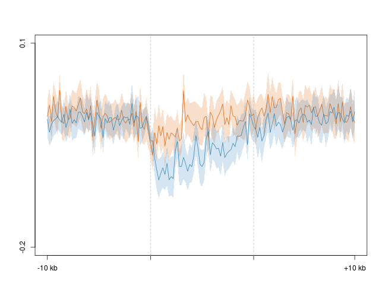
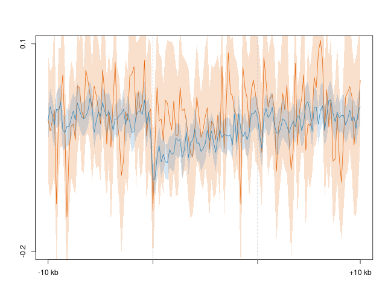
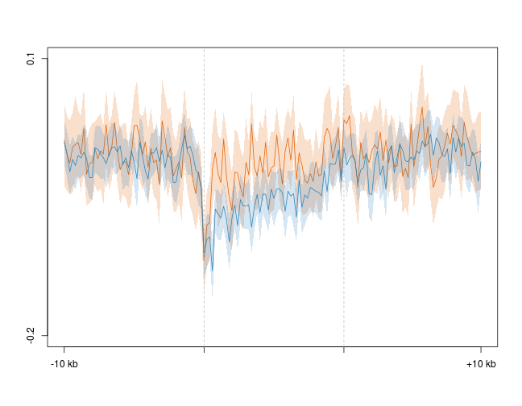
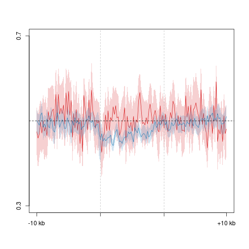
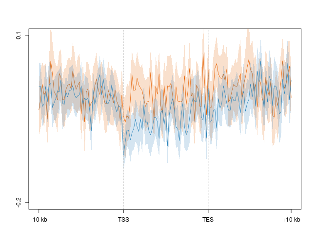
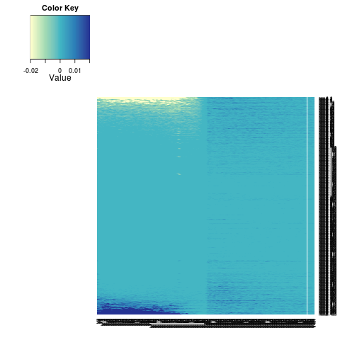
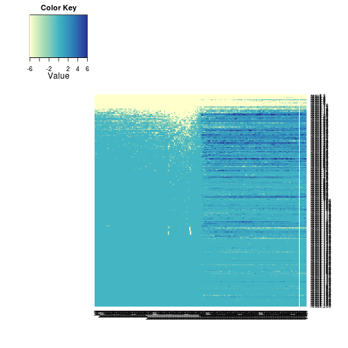
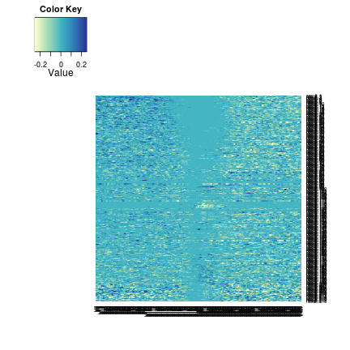
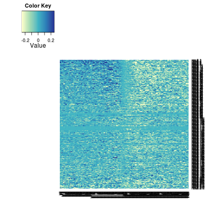

5hmC/5mC/mRNA strand asymmetry
========================================================

Gene profiles
--------------------------------------------------------
### Difference 


```r
suppressPackageStartupMessages(source("~/src/seqAnalysis/R/profiles2.R"))
```


### First try with full data set, do not remove outliers
```
makeProfile2("gene_whole_W200N50F50_chr", "omp_hmc_120424_rmdup_plus_omp_hmc_120424_rmdup_minus_W100_S25", group2="omp_quartiles", data_type="strand_diff/mean")
makeProfile2("gene_whole_W200N50F50_chr", "omp_mc_rmdup_plus_omp_mc_rmdup_minus_W100_S25", group2="omp_quartiles", data_type="strand_diff/mean")
makeProfile2("gene_whole_W200N50F50_chr", "ngn_hmc_120424_rmdup_plus_ngn_hmc_120424_rmdup_minus_W100_S25", group2="ngn_quartiles", data_type="strand_diff/mean")
makeProfile2("gene_whole_W200N50F50_chr", "ngn_mc_rmdup_plus_ngn_mc_rmdup_minus_W100_S25", group2="ngn_quartiles", data_type="strand_diff/mean")
makeProfile2("gene_whole_W200N50F50_chr", "icam_hmc_120424_rmdup_plus_icam_hmc_120424_rmdup_minus_W100_S25", group2="icam_quartiles", data_type="strand_diff/mean")
makeProfile2("gene_whole_W200N50F50_chr", "icam_mc_rmdup_plus_icam_mc_rmdup_minus_W100_S25", group2="icam_quartiles", data_type="strand_diff/mean")
```
#### OMP 5hmC Coding - Template

```r
plot2("gene_whole_W200N50F50_chr", "omp_hmc_120424_rmdup_plus_omp_hmc_120424_rmdup_minus_W100_S25", 
    group2 = "omp_quartiles", data_type = "strand_diff/mean", cols = col4_mod, 
    wsize = 200, fname = "manual", y.vals = c(-0.3, 0.2))
```

```
## [1] "omp_hmc_120424_rmdup_plus_omp_hmc_120424_rmdup_minus_W100_S25_omp_quartiles"
```

```
## [1] -0.3  0.2
```

 

#### Neurog 5hmC Coding - Template

```r
plot2("gene_whole_W200N50F50_chr", "ngn_hmc_120424_rmdup_plus_ngn_hmc_120424_rmdup_minus_W100_S25", 
    group2 = "ngn_quartiles", data_type = "strand_diff/mean", cols = col4_mod, 
    wsize = 200, fname = "manual", y.vals = c(-0.3, 0.2))
```

```
## [1] "ngn_hmc_120424_rmdup_plus_ngn_hmc_120424_rmdup_minus_W100_S25_ngn_quartiles"
```

```
## [1] -0.3  0.2
```

 


#### Icam 5hmC Coding - Template

```r
plot2("gene_whole_W200N50F50_chr", "icam_hmc_120424_rmdup_plus_icam_hmc_120424_rmdup_minus_W100_S25", 
    group2 = "icam_quartiles", data_type = "strand_diff/mean", cols = col4_mod, 
    wsize = 200, fname = "manual", y.vals = c(-0.3, 0.2))
```

```
## [1] "icam_hmc_120424_rmdup_plus_icam_hmc_120424_rmdup_minus_W100_S25_icam_quartiles"
```

```
## [1] -0.3  0.2
```

 


### Top/bottom 2% removed at each position
```
makeProfile2("gene_whole_W200N50F50_chr", "omp_hmc_120424_rmdup_plus_omp_hmc_120424_rmdup_minus_W100_S25", group2="omp_quartiles", data_type="strand_diff/mean", rm.outliers=0.02)
makeProfile2("gene_whole_W200N50F50_chr", "omp_mc_rmdup_plus_omp_mc_rmdup_minus_W100_S25", group2="omp_quartiles", data_type="strand_diff/mean", rm.outliers=0.02)
makeProfile2("gene_whole_W200N50F50_chr", "ngn_hmc_120424_rmdup_plus_ngn_hmc_120424_rmdup_minus_W100_S25", group2="ngn_quartiles", data_type="strand_diff/mean", rm.outliers=0.02)
makeProfile2("gene_whole_W200N50F50_chr", "ngn_mc_rmdup_plus_ngn_mc_rmdup_minus_W100_S25", group2="ngn_quartiles", data_type="strand_diff/mean", rm.outliers=0.02)
makeProfile2("gene_whole_W200N50F50_chr", "icam_hmc_120424_rmdup_plus_icam_hmc_120424_rmdup_minus_W100_S25", group2="icam_quartiles", data_type="strand_diff/mean", rm.outliers=0.02)
makeProfile2("gene_whole_W200N50F50_chr", "icam_mc_rmdup_plus_icam_mc_rmdup_minus_W100_S25", group2="icam_quartiles", data_type="strand_diff/mean", rm.outliers=0.02)
```
#### OMP 5hmC Coding - Template

```r
plot2("gene_whole_W200N50F50_chr", "omp_hmc_120424_rmdup_plus_omp_hmc_120424_rmdup_minus_W100_S25", 
    group2 = "omp_quartiles_trim0.02", data_type = "strand_diff/mean", cols = col4_mod[c(2, 
        4)], wsize = 200, fname = "manual", group2_col = c(2, 4), y.vals = c(-0.2, 
        0.1))
```

```
## [1] "omp_hmc_120424_rmdup_plus_omp_hmc_120424_rmdup_minus_W100_S25_omp_quartiles_trim0.02"
```

```
## [1] -0.2  0.1
```

 

#### Neurog 5hmC Coding - Template

```r
plot2("gene_whole_W200N50F50_chr", "ngn_hmc_120424_rmdup_plus_ngn_hmc_120424_rmdup_minus_W100_S25", 
    group2 = "ngn_quartiles_trim0.02", data_type = "strand_diff/mean", cols = col4_mod[c(2, 
        4)], wsize = 200, fname = "manual", group2_col = c(2, 4), y.vals = c(-0.2, 
        0.1))
```

```
## [1] "ngn_hmc_120424_rmdup_plus_ngn_hmc_120424_rmdup_minus_W100_S25_ngn_quartiles_trim0.02"
```

```
## [1] -0.2  0.1
```

 


#### Icam 5hmC Coding - Template

```r
plot2("gene_whole_W200N50F50_chr", "icam_hmc_120424_rmdup_plus_icam_hmc_120424_rmdup_minus_W100_S25", 
    group2 = "icam_quartiles_trim0.02", data_type = "strand_diff/mean", cols = col4_mod[c(2, 
        4)], wsize = 200, fname = "manual", group2_col = c(2, 4), y.vals = c(-0.2, 
        0.1))
```

```
## [1] "icam_hmc_120424_rmdup_plus_icam_hmc_120424_rmdup_minus_W100_S25_icam_quartiles_trim0.02"
```

```
## [1] -0.2  0.1
```

 


### Fraction

### Top/bottom 2% removed at each position
```
makeProfile2("gene_whole_W200N50F50_chr", "omp_hmc_120424_rmdup_plus_omp_hmc_120424_rmdup_minus_W100_S25", group2="omp_quartiles", data_type="strand_fraction/mean", rm.outliers=0.02)
makeProfile2("gene_whole_W200N50F50_chr", "omp_mc_rmdup_plus_omp_mc_rmdup_minus_W100_S25", group2="omp_quartiles", data_type="strand_fraction/mean", rm.outliers=0.02)
makeProfile2("gene_whole_W200N50F50_chr", "ngn_hmc_120424_rmdup_plus_ngn_hmc_120424_rmdup_minus_W100_S25", group2="ngn_quartiles", data_type="strand_fraction/mean", rm.outliers=0.02)
makeProfile2("gene_whole_W200N50F50_chr", "ngn_mc_rmdup_plus_ngn_mc_rmdup_minus_W100_S25", group2="ngn_quartiles", data_type="strand_fraction/mean", rm.outliers=0.02)
makeProfile2("gene_whole_W200N50F50_chr", "icam_hmc_120424_rmdup_plus_icam_hmc_120424_rmdup_minus_W100_S25", group2="icam_quartiles", data_type="strand_fraction/mean", rm.outliers=0.02)
makeProfile2("gene_whole_W200N50F50_chr", "icam_mc_rmdup_plus_icam_mc_rmdup_minus_W100_S25", group2="icam_quartiles", data_type="strand_fraction/mean", rm.outliers=0.02)
```

#### OMP 5hmC (Coding - Template)/Total

```r
plot2("gene_whole_W200N50F50_chr", "omp_hmc_120424_rmdup_plus_omp_hmc_120424_rmdup_minus_W100_S25", 
    group2 = "omp_quartiles_trim0.02", data_type = "strand_fraction/mean", cols = col4_mod[c(1, 
        4)], wsize = 200, fname = "manual", group2_col = c(1, 4), y.vals = c(0.3, 
        0.7))
```

```
## [1] "omp_hmc_120424_rmdup_plus_omp_hmc_120424_rmdup_minus_W100_S25_omp_quartiles_trim0.02"
```

```
## [1] 0.3 0.7
```

```r
abline(h = 0.5, lty = 2)
```

 

#### Neurog 5hmC (Coding - Template)/Total

```r
plot2("gene_whole_W200N50F50_chr", "ngn_hmc_120424_rmdup_plus_ngn_hmc_120424_rmdup_minus_W100_S25", 
    group2 = "ngn_quartiles_trim0.02", data_type = "strand_fraction/mean", cols = col4_mod[c(1, 
        4)], wsize = 200, fname = "manual", group2_col = c(1, 4), y.vals = c(0.3, 
        0.7))
```

```
## [1] "ngn_hmc_120424_rmdup_plus_ngn_hmc_120424_rmdup_minus_W100_S25_ngn_quartiles_trim0.02"
```

```
## [1] 0.3 0.7
```

```r
abline(h = 0.5, lty = 2)
```

 


#### Icam 5hmC (Coding - Template)/Total

```r
# plot2('gene_whole_W200N50F50_chr',
# 'icam_hmc_120424_rmdup_plus_icam_hmc_120424_rmdup_minus_W100_S25',
# group2='icam_quartiles_trim0.02', data_type='strand_fraction/mean',
# cols=col4_mod[c(1,4)], wsize=200, fname='manual', group2_col=c(1,4),
# y.vals=c(.3, .7))
```


TSS Heatmaps
--------------------------------------------------------
Matrix of plus/minus strand differences for a given sample. For genes, plus/minus strand designation adjusted as coding/template strand.
First order MOE Dnmt3a WT polyA-RNA-seq by coding/template difference within the region -5 kb to 1.25 kb upstream of the TSS.


```r
suppressPackageStartupMessages(source("~/src/seqAnalysis/R/image.R"))
moe.rna <- read.delim("~/s2/analysis/profiles/norm/strand_diff/mean/refGene_noRandom_order_outsides2_tss_W25F200_chr/images/moe_d3a_wt_mrna_plus_sub_minus_1log_na_omit", 
    header = T)
moe.rna.up.mean <- apply(moe.rna[, 1:150], 1, mean)
moe.rna.up.mean <- sort(moe.rna.up.mean)
```


Order original matrix by these values and plot to check. Plot saved to "refGene_noRandom_order_outsides2_tss_W25F200_chr_strand_diff_mean_moe_d3a_wt_mrna_plus_sub_minus_1log_na_omit_order_-5kbTo-1250bp.pdf"


```r
moe.rna.ord.moe.rna.up <- moe.rna[match(names(moe.rna.up.mean), rownames(moe.rna)), 
    ]
MP.heat(as.matrix(moe.rna.ord.moe.rna.up), range = c(-0.02, 0.02), average = 50)
```

 


Order MOE Dnmt3a WT 5hmC matrix by RNA coding/template difference. Plot in "refGene_noRandom_order_outsides2_tss_W25F200_chr_strand_diff_mean_moe_d3a_wt_hmc_plus_sub_minus_order_-5kbTo-1250bp.pdf"


```r
moe.hmc <- makeImage("moe_d3a_wt_hmc_plus_sub_minus", "refGene_noRandom_order_outsides2_tss_W25F200_chr", 
    data_type = "strand_diff/mean", image = FALSE)
```

```
## [1] "/media/storage2/analysis/profiles/norm/strand_diff/mean/refGene_noRandom_order_outsides2_tss_W25F200_chr/images/moe_d3a_wt_hmc_plus_sub_minus"
```

```r
moe.hmc.ord.moe.rna.up <- moe.hmc[match(names(moe.rna.up.mean), rownames(moe.hmc)), 
    ]
MP.heat(as.matrix(moe.hmc.ord.moe.rna.up), range = c(-0.005, 0.005), average = 100)
```

 


Repeat with developmental celltype data. First construct difference matrices. 

```
positionMatrix.all(anno="refGene_noRandom_order_outsides2_tss_W25F200_chr", "strand_diff/mean")

```

Test OMP 5hmC dataset. Heatmap saved in "refGene_noRandom_order_outsides2_tss_W25F200_chr_strand_diff_mean_omp_hmc_120424_rmdup_plus_omp_hmc_120424_rmdup_minus_W100_S25_order_-5kbTo-1250bp.pdf"

#### OMP 5hmC Coding - Template

```r
omp.hmc <- makeImage("omp_hmc_120424_rmdup_plus_omp_hmc_120424_rmdup_minus_W100_S25", 
    "refGene_noRandom_order_outsides2_tss_W25F200_chr", data_type = "strand_diff/mean", 
    image = FALSE)
```

```
## [1] "/media/storage2/analysis/profiles/norm/strand_diff/mean/refGene_noRandom_order_outsides2_tss_W25F200_chr/images/omp_hmc_120424_rmdup_plus_omp_hmc_120424_rmdup_minus_W100_S25"
```

```r
omp.hmc.ord.moe.rna.up <- omp.hmc[match(names(moe.rna.up.mean), rownames(omp.hmc)), 
    ]
MP.heat(as.matrix(omp.hmc.ord.moe.rna.up), range = c(-0.25, 0.25), average = 100)
```

 


Repeat with other sets

```r
pos.hmc <- lapply(c("omp", "ngn", "icam"), function(x) makeImage(paste(x, "hmc_120424_rmdup_plus", 
    x, "hmc_120424_rmdup_minus_W100_S25", sep = "_"), "refGene_noRandom_order_outsides2_tss_W25F200_chr", 
    data_type = "strand_diff/mean", image = FALSE))
```

```
## [1] "/media/storage2/analysis/profiles/norm/strand_diff/mean/refGene_noRandom_order_outsides2_tss_W25F200_chr/images/omp_hmc_120424_rmdup_plus_omp_hmc_120424_rmdup_minus_W100_S25"
## [1] "/media/storage2/analysis/profiles/norm/strand_diff/mean/refGene_noRandom_order_outsides2_tss_W25F200_chr/images/ngn_hmc_120424_rmdup_plus_ngn_hmc_120424_rmdup_minus_W100_S25"
## [1] "/media/storage2/analysis/profiles/norm/strand_diff/mean/refGene_noRandom_order_outsides2_tss_W25F200_chr/images/icam_hmc_120424_rmdup_plus_icam_hmc_120424_rmdup_minus_W100_S25"
```

```r
pos.hmc.ord <- lapply(pos.hmc, function(x) x[match(names(moe.rna.up.mean), rownames(x)), 
    ])
pos.mc <- lapply(c("omp", "ngn", "icam"), function(x) makeImage(paste(x, "mc_rmdup_plus", 
    x, "mc_rmdup_minus_W100_S25", sep = "_"), "refGene_noRandom_order_outsides2_tss_W25F200_chr", 
    data_type = "strand_diff/mean", image = FALSE))
```

```
## [1] "/media/storage2/analysis/profiles/norm/strand_diff/mean/refGene_noRandom_order_outsides2_tss_W25F200_chr/images/omp_mc_rmdup_plus_omp_mc_rmdup_minus_W100_S25"
## [1] "/media/storage2/analysis/profiles/norm/strand_diff/mean/refGene_noRandom_order_outsides2_tss_W25F200_chr/images/ngn_mc_rmdup_plus_ngn_mc_rmdup_minus_W100_S25"
## [1] "/media/storage2/analysis/profiles/norm/strand_diff/mean/refGene_noRandom_order_outsides2_tss_W25F200_chr/images/icam_mc_rmdup_plus_icam_mc_rmdup_minus_W100_S25"
```

```r
pos.mc.ord <- lapply(pos.mc, function(x) x[match(names(moe.rna.up.mean), rownames(x)), 
    ])
```


#### Neurog1 5hmC Coding - Template

```r
MP.heat(as.matrix(pos.hmc.ord[[2]]), range = c(-0.25, 0.25), average = 100)
```

 


#### Icam 5hmC Coding - Template

```r
MP.heat(as.matrix(pos.hmc.ord[[3]]), range = c(-0.25, 0.25), average = 100)
```

 


#### OMP 5mC Coding - Template

```r
MP.heat(as.matrix(pos.mc.ord[[1]]), range = c(-0.25, 0.25), average = 100)
```

 


#### Neurog 5mC Coding - Template

```r
MP.heat(as.matrix(pos.mc.ord[[2]]), range = c(-0.25, 0.25), average = 100)
```

 


#### Icam 5mC Coding - Template

```r
MP.heat(as.matrix(pos.mc.ord[[3]]), range = c(-0.25, 0.25), average = 100)
```

 


