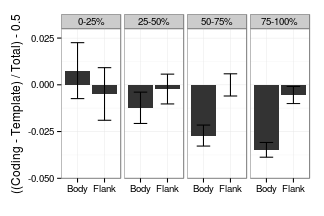

5hmC/5mC/mRNA strand asymmetry
========================================================


Load source files

```r
suppressPackageStartupMessages(source("~/src/seqAnalysis/R/image.R"))
suppressPackageStartupMessages(source("~/src/seqAnalysis/R/strand2.R"))
suppressPackageStartupMessages(source("~/src/seqAnalysis/R/ggplot.R"))
```


Gene profiles
--------------------------------------------------------
### Difference 


```r
suppressPackageStartupMessages(source("~/src/seqAnalysis/R/profiles2.R"))
```


### Top/bottom 2% removed at each position, split by deciles, plot 20% and 100%
```
makeProfile2("gene_whole_W200N50F50_chr", "omp_hmc_120424_rmdup_plus_omp_hmc_120424_rmdup_minus_W100_S25", group2="omp_quartiles", data_type="strand_diff/mean", rm.outliers=0.02)
```
#### OMP 5hmC Coding - Template

```r
plot2("gene_whole_W200N50F50_chr", "omp_hmc_120424_rmdup_plus_omp_hmc_120424_rmdup_minus_W100_S25", 
    group2 = "omp_quartiles_trim0.02", data_type = "strand_diff/mean", cols = col4_mod[c(4)], 
    wsize = 200, fname = "manual", group2_col = c(4), y.vals = c(-0.2, 0.1), 
    lab = c("TSS", "TES"))
```

```
## [1] "omp_hmc_120424_rmdup_plus_omp_hmc_120424_rmdup_minus_W100_S25_omp_quartiles_trim0.02"
## [1] "omp_hmc_120424_rmdup_plus_omp_hmc_120424_rmdup_minus_W100_S25_omp_quartiles_trim0.02_mean"
```

```
## [1] -0.2  0.1
```

```r
abline(h = 0, lty = 2)
```

 


Fraction
--------------

### Quartiles
```
makeProfile2("gene_whole_W200N50F50_chr", "omp_hmc_120424_rmdup_plus_omp_hmc_120424_rmdup_minus_W100_S25", group2="omp_quartiles", data_type="strand_fraction/mean", rm.outliers=0.02)
```

#### OMP 5hmC (Coding - Template)/Total

```r
plot2("gene_whole_W200N50F50_chr", "omp_hmc_120424_rmdup_plus_omp_hmc_120424_rmdup_minus_W100_S25", 
    group2 = "omp_quartiles_trim0.02", data_type = "strand_fraction/mean", cols = col4_mod[c(4)], 
    wsize = 200, fname = "manual", group2_col = c(4), y.vals = c(0.35, 0.6), 
    lab = c("TSS", "TES"))
```

```
## [1] "omp_hmc_120424_rmdup_plus_omp_hmc_120424_rmdup_minus_W100_S25_omp_quartiles_trim0.02"
## [1] "omp_hmc_120424_rmdup_plus_omp_hmc_120424_rmdup_minus_W100_S25_omp_quartiles_trim0.02_mean"
```

```
## [1] 0.35 0.60
```

```r
abline(h = 0.5, lty = 2)
```

 


Quantification by gene flank and body
--------------------------------------------------------

### Difference
Construct position matrices for each cell type divided into expression quartiles
```
positionMatrix.group("gene_whole_W200N50F50_chr", "omp_hmc_120424_rmdup_plus_omp_hmc_120424_rmdup_minus_W100_S25", group2="omp_quartiles", data_type="strand_diff/mean")
positionMatrix.group("gene_whole_W200N50F50_chr", "ngn_hmc_120424_rmdup_plus_ngn_hmc_120424_rmdup_minus_W100_S25", group2="ngn_quartiles", data_type="strand_diff/mean")
positionMatrix.group("gene_whole_W200N50F50_chr", "icam_hmc_120424_rmdup_plus_icam_hmc_120424_rmdup_minus_W100_S25", group2="icam_quartiles", data_type="strand_diff/mean")
```
Load 5hmC matrices and compute mean flank and mid values

```r
suppressPackageStartupMessages(source("~/src/seqAnalysis/R/strand2.R"))
suppressPackageStartupMessages(source("~/src/seqAnalysis/R/ggplot.R"))
hmc.list <- lapply(c("omp", "ngn", "icam"), function(ct) lapply(c(0, 2, 3, 4), 
    function(x) read.delim(paste("~/s2/analysis/profiles/norm/strand_diff/mean/gene_whole_W200N50F50_chr/images/", 
        ct, "_hmc_120424_rmdup_plus_", ct, "_hmc_120424_rmdup_minus_W100_S25_", 
        ct, "_quartiles_", x, sep = ""), header = F, row.names = 1)))
for (i in 1:length(hmc.list)) {
    names(hmc.list[[i]]) <- c("0", "2", "3", "4")
}
hmc.list.df <- lapply(hmc.list, compute_mean_gene_set)
names(hmc.list.df) <- c("omp", "ngn", "icam")
hmc.list.df2 <- ldply(hmc.list.df)

hmc.list.df2[, 2] <- as.factor(hmc.list.df2[, 2])
levels(hmc.list.df2[, 2]) <- c("0-25%", "25-50%", "50-75%", "75-100%")
hmc.fac <- factor(1:3, labels = c("omp", "ngn", "icam"))
hmc.list.df2[, 1] <- hmc.fac[match(as.character(hmc.list.df2[, 1]), as.character(hmc.fac))]
levels(hmc.list.df2[, 1]) <- c("mOSN", "GBC", "HBC")
```


Plot mean value, split by grouping

```r
theme_set(theme_bw())
hmc.list.gg <- ggplot(hmc.list.df2, aes(pos, val, fill = .id, color = .id))
hmc.list.gg <- hmc.list.gg + stat_summary(geom = "bar", fun.y = "mean") + stat_sum_df("mean_cl_normal", 
    geom = "errorbar") + facet_grid(.id ~ group) + scale_fill_grey() + scale_color_grey()
hmc.list.gg <- hmc.list.gg + theme(legend.position = "none") + ylab("Coding - Template 5hmC") + 
    xlab("")
hmc.list.gg
```

```
## Warning: Removed 1 rows containing missing values (stat_summary).
```

```
## Warning: Removed 1 rows containing missing values (stat_summary).
```

```
## Warning: Removed 2 rows containing missing values (stat_summary).
```

```
## Warning: Removed 3 rows containing missing values (stat_summary).
```

```
## Warning: Removed 1 rows containing missing values (stat_summary).
```

```
## Warning: Removed 2 rows containing missing values (stat_summary).
```

```
## Warning: Removed 1 rows containing missing values (stat_summary).
```

```
## Warning: Removed 1 rows containing missing values (stat_summary).
```

```
## Warning: Removed 1 rows containing missing values (stat_summary).
```

```
## Warning: Removed 1 rows containing missing values (stat_summary).
```

```
## Warning: Removed 2 rows containing missing values (stat_summary).
```

```
## Warning: Removed 3 rows containing missing values (stat_summary).
```

```
## Warning: Removed 1 rows containing missing values (stat_summary).
```

```
## Warning: Removed 2 rows containing missing values (stat_summary).
```

```
## Warning: Removed 1 rows containing missing values (stat_summary).
```

```
## Warning: Removed 1 rows containing missing values (stat_summary).
```

 


Just mOSN data

```r
theme_set(theme_bw())
hmc.list.gg <- ggplot(hmc.list.df2[hmc.list.df2$.id == "mOSN", ], aes(pos, val, 
    fill = .id, color = .id))
hmc.list.gg <- hmc.list.gg + stat_summary(geom = "bar", fun.y = "mean") + stat_sum_df("mean_cl_normal", 
    geom = "errorbar") + facet_grid(. ~ group) + scale_fill_grey() + scale_color_grey()
hmc.list.gg <- hmc.list.gg + theme(legend.position = "none") + ylab("Coding - Template 5hmC") + 
    xlab("") + coord_cartesian(ylim = c(-0.1, 0.025))
hmc.list.gg
```

```
## Warning: Removed 1 rows containing missing values (stat_summary).
```

```
## Warning: Removed 1 rows containing missing values (stat_summary).
```

```
## Warning: Removed 2 rows containing missing values (stat_summary).
```

```
## Warning: Removed 1 rows containing missing values (stat_summary).
```

```
## Warning: Removed 1 rows containing missing values (stat_summary).
```

```
## Warning: Removed 2 rows containing missing values (stat_summary).
```

 


Wilcoxon p-values for Body/Flank comparisons

```r
sapply(levels(hmc.list.df2$.id), function(ct) sapply(levels(hmc.list.df2$group), 
    function(x) with(hmc.list.df2[hmc.list.df2$.id == ct & hmc.list.df2$group == 
        x, ], wilcox.test(val[pos == "Body"], val[pos == "Flank"])$p.value)))
```

```
## Warning: cannot compute exact p-value with ties
```

```
##              mOSN       GBC       HBC
## 0-25%   1.414e-01 2.504e-02 5.110e-01
## 25-50%  5.857e-07 6.738e-06 1.797e-32
## 50-75%  1.970e-39 1.610e-42 6.380e-51
## 75-100% 1.541e-81 1.679e-84 1.456e-55
```


### Fraction 
```
positionMatrix.group("gene_whole_W200N50F50_chr", "omp_hmc_120424_rmdup_plus_omp_hmc_120424_rmdup_minus_W100_S25", group2="omp_quartiles", data_type="strand_fraction/mean")
```


```r
hmc.list <- lapply(c(0, 2, 3, 4), function(x) read.delim(paste("~/s2/analysis/profiles/norm/strand_fraction/mean/gene_whole_W200N50F50_chr/images/omp_hmc_120424_rmdup_plus_omp_hmc_120424_rmdup_minus_W100_S25_omp_quartiles_", 
    x, sep = ""), header = F, row.names = 1))
hmc.list <- lapply(hmc.list, function(x) x - 0.5)
names(hmc.list) <- c("0", "2", "3", "4")
hmc.list.df <- compute_mean_gene_set(hmc.list)
# names(hmc.list.df) <- c('omp', 'ngn', 'icam') hmc.list.df2 <-
# ldply(hmc.list.df)

# hmc.list.df2[,2] <- as.factor(hmc.list.df2[,2])
levels(hmc.list.df[, 1]) <- c("0-25%", "25-50%", "50-75%", "75-100%")
# hmc.fac <- factor(1:3, labels=c('omp', 'ngn', 'icam')) hmc.list.df2[,1]
# <- hmc.fac[match(as.character(hmc.list.df2[,1]), as.character(hmc.fac))]
# levels(hmc.list.df2[,1]) <- c('mOSN', 'GBC', 'HBC')
```


Just mOSN data

```r
theme_set(theme_bw())
hmc.list.gg <- ggplot(hmc.list.df, aes(pos, val))
hmc.list.gg <- hmc.list.gg + stat_summary(geom = "bar", fun.y = "mean") + stat_sum_df("mean_cl_normal", 
    geom = "errorbar") + facet_grid(. ~ group) + scale_fill_grey() + scale_color_grey()
hmc.list.gg <- hmc.list.gg + theme(legend.position = "none") + ylab("((Coding - Template) / Total) - 0.5") + 
    xlab("") + coord_cartesian(ylim = c(-0.05, 0.03))
hmc.list.gg
```

```
## Warning: Removed 189 rows containing missing values (stat_summary).
```

```
## Warning: Removed 87 rows containing missing values (stat_summary).
```

```
## Warning: Removed 40 rows containing missing values (stat_summary).
```

```
## Warning: Removed 21 rows containing missing values (stat_summary).
```

```
## Warning: Removed 189 rows containing missing values (stat_summary).
```

```
## Warning: Removed 87 rows containing missing values (stat_summary).
```

```
## Warning: Removed 40 rows containing missing values (stat_summary).
```

```
## Warning: Removed 21 rows containing missing values (stat_summary).
```

 


Wilcoxon p-values for Body/Flank comparisons

```r
sapply(levels(hmc.list.df$group), function(x) with(hmc.list.df[hmc.list.df$group == 
    x, ], wilcox.test(val[pos == "Body"], val[pos == "Flank"])$p.value))
```

```
##                              0-25%                             25-50% 
## 0.49964748627174920825311232874810 0.01449356321351752928394684971636 
##                             50-75%                            75-100% 
## 0.00000000000000036568639304708173 0.00000000000000000000000000001069
```


