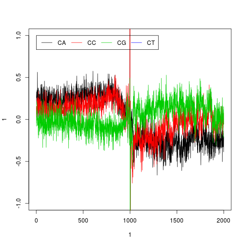
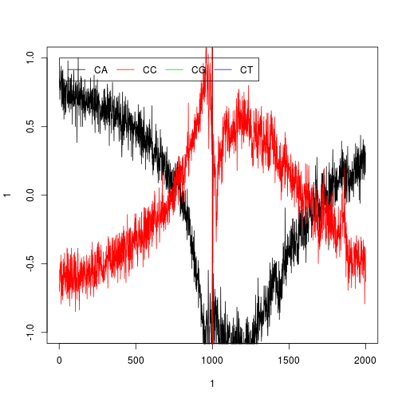

Cytosine strand bias
========================================================


```r
suppressPackageStartupMessages(source("~/src/seqAnalysis/R/seqUtil.R"))
```


### Full TSS set
Load TSS bed (-5kb to +5kb)

```r
tss <- read.delim("~/lib/features_general/refgene_m5kbTSSp5kb.bed", header = F)
```


Extract sequences.

```r
tss.fa <- getSeq.bed(tss)
```


#### Compute cytosine dinucleotide positions
```
tss.fa.c.both <- computeFrequencies(tss.fa, dicyto, fname="refgene_-1kbTSS+1kb_dicyto")
```

Subtract coding - template

```r
tss.fa.c.both <- read.delim("refgene_-1kbTSS+1kb_dicyto")
tss.fa.c.both <- tss.fa.c.both[-3, ]  # Remove CG
tss.fa.c.both.sub <- laply(c(1:3), function(x) tss.fa.c.both[x, ] - tss.fa.c.both[x + 
    3, ])
```


Plot

```r
plot(1, 1, xlim = c(1, 2000), ylim = c(-1, 1), type = "n")
sapply(1:3, function(x) lines(1:2000, tss.fa.c.both.sub[x, ], col = x))
```

```
## [[1]]
## NULL
## 
## [[2]]
## NULL
## 
## [[3]]
## NULL
```

```r
legend(1, 1, legend = c(dicyto[1:4, 1]), col = 1:4, lty = 1, horiz = T)
```

 


#### Compute cytosine positions
```
tss.fa.mono <- computeFrequencies(tss.fa, mononuc, fname="refgene_m5kbTSSp5kb_mono", norm=FALSE)
```

Subtract C from G (Coding - Template)

```r
tss.fa.mono <- read.delim("refgene_-1kbTSS+1kb_mono")
tss.fa.mono.sub <- tss.fa.mono[2, ] - tss.fa.mono[3, ]
```


Plot

```r
plot(1, 1, xlim = c(1, 10000), ylim = c(-0.25, 0.25), type = "n")
lines(1:10001, tss.fa.mono.sub)
abline(h = 0, lty = 2)
```

 


### Top 10% mOSN expressors
Make deciles
```
rna <- readRDS("~/s2/analysis/rna/rdata/omp_ott3_rmrna_masked_uq_1log2.rds")
rownames(rna) <- rna$gene
rna.nz <- rna[rna[,2]>0,]
source("~/src/seqAnalysis/R/features.R")
rna.dec <- splitByQ(rna.nz, 2, q=seq(0, 1, .1), fname="~/storage/analysis/group2/omp_rmrna_gt0_deciles")
tss.10 <- tss[tss[,4] %in% rna.dec[rna.dec[,2]==10,1],]
write.table(tss.10, file="~/lib/features_general/refgene_-1kbTSS+1kb_omp_rmrna_gt0_deciles_10", quote=F, sep="\t", row.names=F, col.names=F)
```
Load TSS bed (-1kb to +1kb)

```r
tss <- read.delim("~/lib/features_general/refgene_-1kbTSS+1kb_omp_rmrna_gt0_deciles_10", 
    header = F)
```


Extract sequences.

```r
tss.fa <- getSeq.bed(tss[1:10, ])
```


#### Compute cytosine dinucleotide positions
```
tss.fa.c.both <- computeFrequencies(tss.fa, dicyto, fname="refgene_-1kbTSS+1kb_omp_rmrna_gt0_deciles_10_dicyto")
```

Subtract coding - template

```r
tss.fa.c.both <- read.delim("refgene_-1kbTSS+1kb_omp_rmrna_gt0_deciles_10_dicyto")
tss.fa.c.both <- tss.fa.c.both[-3, ]  # Remove CG
tss.fa.c.both.sub <- laply(1:4, function(x) tss.fa.c.both[x, ] - tss.fa.c.both[x + 
    4, ])
```


Plot

```r
plot(1, 1, xlim = c(1, 2000), ylim = c(-1, 1), type = "n")
sapply(1:4, function(x) lines(1:2000, tss.fa.c.both.sub[x, ], col = x))
```

```
## [[1]]
## NULL
## 
## [[2]]
## NULL
## 
## [[3]]
## NULL
## 
## [[4]]
## NULL
```

```r
legend(1, 1, legend = c(dicyto[1:4, 1]), col = 1:4, lty = 1, horiz = T)
```

 


#### Compute cytosine positions
```
tss.fa.mono <- computeFrequencies(tss.fa, mononuc, fname="refgene_-1kbTSS+1kb_mono", norm=FALSE)
```

Subtract C from G (Coding - Template)

```r
tss.fa.mono <- read.delim("refgene_-1kbTSS+1kb_mono")
tss.fa.mono.sub <- tss.fa.mono[2, ] - tss.fa.mono[3, ]
```


Plot

```r
plot(1, 1, xlim = c(1, 2000), ylim = c(-1, 1), type = "n")
```

 

```r
lines(1:2000, tss.fa.mono.sub)
```

```
## Error: 'x' and 'y' lengths differ
```

