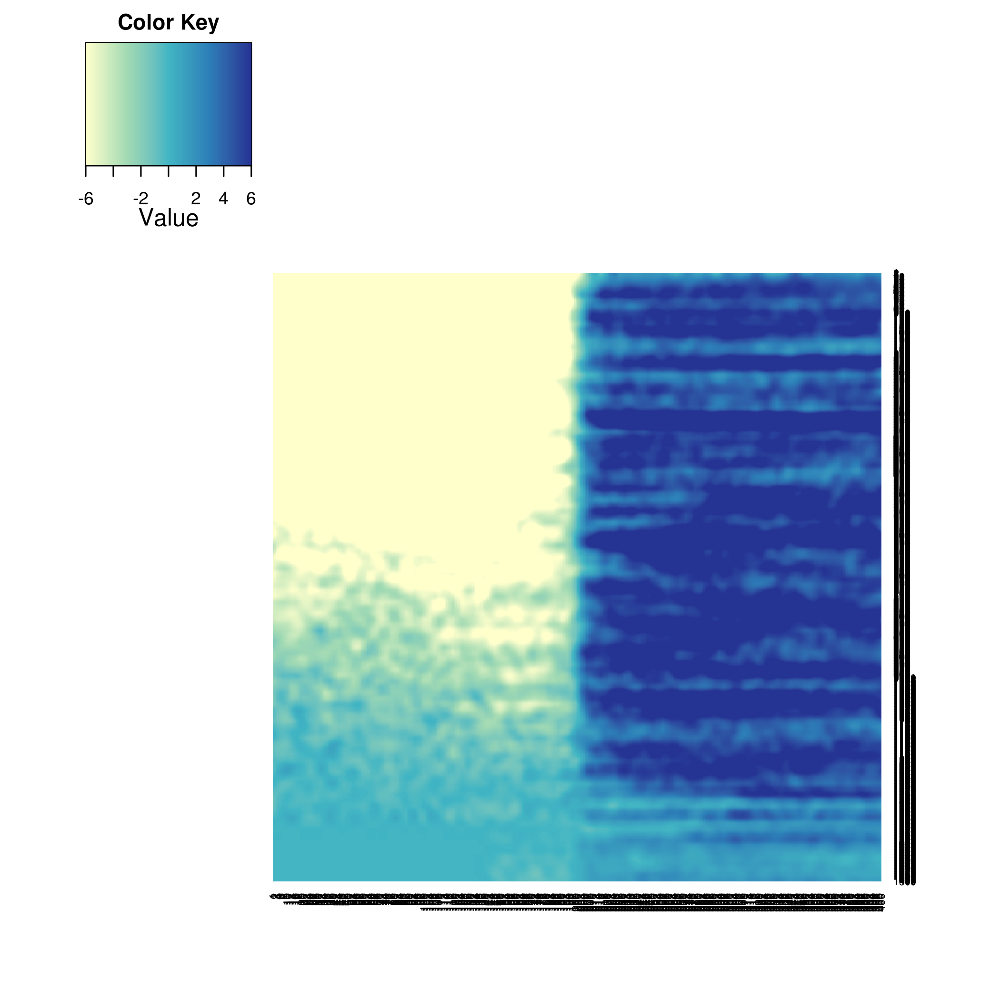
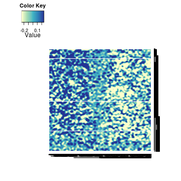
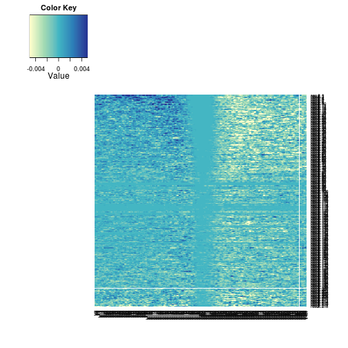
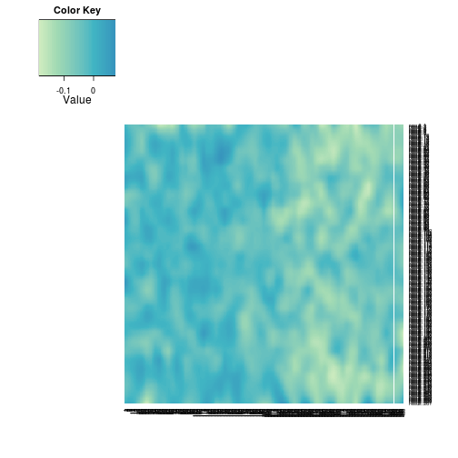

Strand analysis - TSS Heatmaps
========================================================

```r
suppressPackageStartupMessages(source("~/src/seqAnalysis/R/image.R"))
```


Matrix of plus/minus strand differences for a given sample. For genes, plus/minus strand designation adjusted as coding/template strand.
First order MOE Dnmt3a WT polyA-RNA-seq by coding/template difference within the region -5 kb to 1.25 kb upstream of the TSS.

To make TSS RNA difference matrix, In terminal while in omp_rmrna dir,

Method 1
```
$ bamStrand.py -o ~/s2/data/h5/omp_rmrna_strand_25.trk -w 25 --paired-end omp_rmrna.bam
$ bamStrand2.py -o ~/s2/data/h5/omp_rmrna_strand_diff_25.trk -w 100 -f diff omp_rmrna_strand_25.trk 
$ group.py -t omp_rmrna_strand_diff_25.trk -a refGene_noRandom_order_outsides2_tss_W25F200_chr --data_type strand_diff --strand
```

Method 2
```
$ bamStrand.py -o ~/s2/data/h5/omp_rmrna_strand_25.trk -w 25 --paired-end omp_rmrna.bam
$ for f in {plus,minus}; do group.py -a refGene_noRandom_order_outsides2_tss_W25F200_chr -b omp_rmrna_"$f".bam --data_type bam --strand; done
```

### Bidirectional TSSs


```r
positionMatrix.all("refgene_nodup_sort_bidir_mids.bed_W25F200_both_chr", data_type = "bam/mean")
plus <- makeImage("omp_rmrna_plus", "refgene_nodup_sort_bidir_mids.bed_W25F200_both_chr", 
    data_type = "bam/mean", image = FALSE)
```

```
## [1] "/media/storage2/analysis/profiles/norm/bam/mean/refgene_nodup_sort_bidir_mids.bed_W25F200_both_chr/images/omp_rmrna_plus"
```

```r
minus <- makeImage("omp_rmrna_minus", "refgene_nodup_sort_bidir_mids.bed_W25F200_both_chr", 
    data_type = "bam/mean", image = FALSE)
```

```
## [1] "/media/storage2/analysis/profiles/norm/bam/mean/refgene_nodup_sort_bidir_mids.bed_W25F200_both_chr/images/omp_rmrna_minus"
```

```r
bidir <- read.delim("~/lib/annotations_pre/refgene_nodup_sort_bidir_mids.bed", 
    header = FALSE)
```


Pseudocount and log2 transform

```r
plus.minus <- list(plus, minus)
plus.minus.1log2 <- lapply(plus.minus, function(x) log2(x + 1))
plus.sub.minus <- plus.minus.1log2[[1]] - plus.minus.1log2[[2]]
```


```r
plus.sub.minus.up.mean <- apply(plus.sub.minus[, 1:140], 1, mean)
plus.sub.minus.up.mean <- sort(plus.sub.minus.up.mean)
plus.sub.minus.down.mean <- apply(plus.sub.minus[, 241:280], 1, mean)
plus.sub.minus.down.mean <- sort(plus.sub.minus.down.mean)
# up.down.diff <- plus.sub.minus.up.mean - plus.sub.minus.down.mean
plus.sub.minus <- plus.sub.minus[match(names(plus.sub.minus.up.mean), rownames(plus.sub.minus)), 
    ]
```


```r
plus.sub.minus <- apply(t(plus.sub.minus), 1, function(x) predict(loess(x ~ 
    c(1:nrow(plus.sub.minus)), span = 0.05)))
plus.sub.minus <- t(apply(plus.sub.minus, 1, function(x) predict(loess(x ~ c(1:400), 
    span = 0.05))))
```


```r
MP.heat(plus.sub.minus[1:1500, ], range = c(-6, 6))
```

 


```r
positionMatrix.all("refgene_nodup_sort_bidir_mids.bed_W25F200_both_chr", data_type = "strand_diff/mean")
omp.hmc <- makeImage("omp_hmc_120424_rmdup_plus_omp_hmc_120424_rmdup_minus_W100_S25", 
    "refgene_nodup_sort_bidir_mids.bed_W25F200_both_chr", data_type = "strand_diff/mean", 
    image = FALSE)
```

```
## [1] "/media/storage2/analysis/profiles/norm/strand_diff/mean/refgene_nodup_sort_bidir_mids.bed_W25F200_both_chr/images/omp_hmc_120424_rmdup_plus_omp_hmc_120424_rmdup_minus_W100_S25"
```

```r
omp.hmc.ord.omp.rna.up <- omp.hmc[match(names(plus.sub.minus.up.mean[1:1500]), 
    rownames(omp.hmc)), ]
# omp.hmc.ord.omp.rna.up <- foreach(c=isplitRows(omp.hmc.ord.omp.rna.up,
# chunkSize=20), .combine='rbind') %do% mean(c, 1, mean, na.rm=TRUE)
omp.hmc.ord.omp.rna.up <- apply(t(omp.hmc.ord.omp.rna.up), 1, function(x) predict(loess(x ~ 
    c(1:nrow(omp.hmc.ord.omp.rna.up)), span = 0.05)))
omp.hmc.ord.omp.rna.up <- t(apply(omp.hmc.ord.omp.rna.up, 1, function(x) predict(loess(x ~ 
    c(1:400), span = 0.05))))
```


```r
MP.heat(as.matrix(omp.hmc.ord.omp.rna.up), range = c(-0.25, 0.25))
```

 


#### Isolated TSSs


```r
positionMatrix.all("refGene_noRandom_order_outsides2_tss_W25F200_dist10kb_chr", 
    data_type = "bam/mean")
plus <- makeImage("omp_rmrna_plus", "refGene_noRandom_order_outsides2_tss_W25F200_dist10kb_chr", 
    data_type = "bam/mean", image = FALSE)
```

```
## [1] "/media/storage2/analysis/profiles/norm/bam/mean/refGene_noRandom_order_outsides2_tss_W25F200_dist10kb_chr/images/omp_rmrna_plus"
```

```r
minus <- makeImage("omp_rmrna_minus", "refGene_noRandom_order_outsides2_tss_W25F200_dist10kb_chr", 
    data_type = "bam/mean", image = FALSE)
```

```
## [1] "/media/storage2/analysis/profiles/norm/bam/mean/refGene_noRandom_order_outsides2_tss_W25F200_dist10kb_chr/images/omp_rmrna_minus"
```


Pseudocount and log2 transform

```r
plus.minus <- list(plus, minus)
plus.minus.1log2 <- lapply(plus.minus, function(x) log2(x + 1))
plus.sub.minus <- plus.minus.1log2[[1]] - plus.minus.1log2[[2]]
```


```r
plus.sub.minus.up.mean <- apply(plus.sub.minus[, 1:140], 1, mean)
plus.sub.minus.up.mean <- sort(plus.sub.minus.up.mean)
plus.sub.minus.down.mean <- apply(plus.sub.minus[, 241:280], 1, mean)
plus.sub.minus.down.mean <- sort(plus.sub.minus.down.mean)
plus.sub.minus <- plus.sub.minus[match(names(plus.sub.minus.up.mean), rownames(plus.sub.minus)), 
    ]
```


```r
MP.heat(plus.sub.minus, average = 20, range = c(-6, 6))
```

```
## Warning: executing %dopar% sequentially: no parallel backend registered
```

 


```r
positionMatrix.all("refGene_noRandom_order_outsides2_tss_W25F200_dist10kb_chr", 
    data_type = "strand_diff/mean")
omp.hmc <- makeImage("omp_hmc_120424_rmdup_plus_omp_hmc_120424_rmdup_minus_W100_S25", 
    "refGene_noRandom_order_outsides2_tss_W25F200_dist10kb_chr", data_type = "strand_diff/mean", 
    image = FALSE)
```

```
## [1] "/media/storage2/analysis/profiles/norm/strand_diff/mean/refGene_noRandom_order_outsides2_tss_W25F200_dist10kb_chr/images/omp_hmc_120424_rmdup_plus_omp_hmc_120424_rmdup_minus_W100_S25"
```

```r
omp.hmc.ord.omp.rna.up <- omp.hmc[match(names(plus.sub.minus.up.mean), rownames(omp.hmc)), 
    ]
omp.hmc.ord.omp.rna.up <- apply(t(omp.hmc.ord.omp.rna.up), 1, function(x) predict(loess(x ~ 
    c(1:nrow(omp.hmc.ord.omp.rna.up)), span = 0.2)))
omp.hmc.ord.omp.rna.up <- t(apply(omp.hmc.ord.omp.rna.up, 1, function(x) predict(loess(x ~ 
    c(1:400), span = 0.1))))
MP.heat(as.matrix(omp.hmc.ord.omp.rna.up), range = c(-0.25, 0.25), average = 50)
```

 


