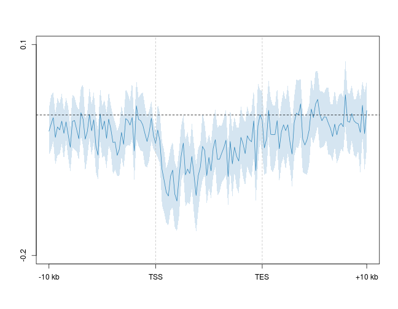
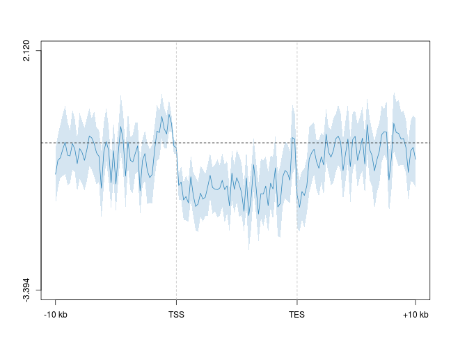
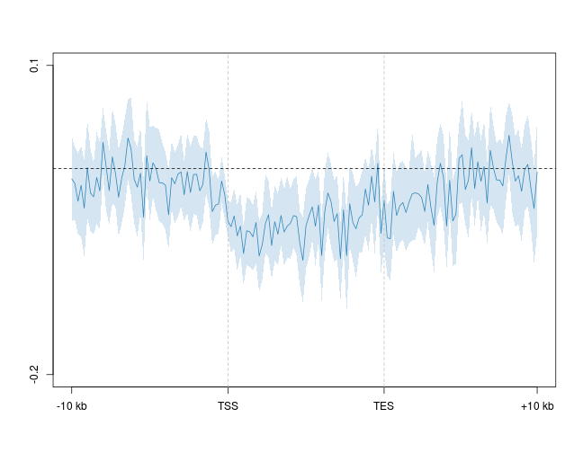
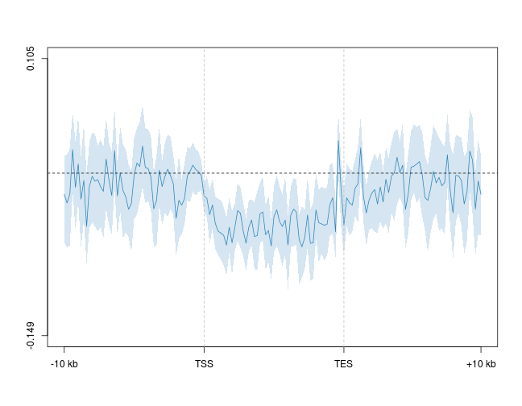

5hmC/5mC/mRNA strand asymmetry - O/Tet3
========================================================

Gene profiles
--------------------------------------------------------
### Difference 


```r
suppressPackageStartupMessages(source("~/src/seqAnalysis/R/profiles2.R"))
```


### Top/bottom 2% removed at each position, split by deciles, plot 20% and 100%
```
makeProfile2("gene_whole_W200N50F50_chr", "o.tt3.1_hmc_rmdup_plus_o.tt3.1_hmc_rmdup_minus_W100_S25", group2="omp_deciles", data_type="strand_diff/mean", rm.outliers=0.02)
makeProfile2("gene_whole_W200N50F50_chr", "o.tt3.1_mc_rmdup_plus_o.tt3.1_mc_rmdup_minus_W100_S25", group2="omp_deciles", data_type="strand_diff/mean", rm.outliers=0.02)
```

#### OMP 5hmC Coding - Template

```r
plot2("gene_whole_W200N50F50_chr", "omp_hmc_120424_rmdup_plus_omp_hmc_120424_rmdup_minus_W100_S25", 
    group2 = "omp_deciles_trim0.02", data_type = "strand_diff/mean", cols = col4_mod[c(4)], 
    wsize = 200, fname = "manual", group2_col = c(8), y.vals = c(-0.2, 0.1), 
    lab = c("TSS", "TES"))
```

```
## [1] "omp_hmc_120424_rmdup_plus_omp_hmc_120424_rmdup_minus_W100_S25_omp_deciles_trim0.02"
```

```
## [1] -0.2  0.1
```

```r
abline(h = 0, lty = 2)
```

 

#### O/TT3 5hmC Coding - Template

```r
plot2("gene_whole_W200N50F50_chr", "o.tt3.1_hmc_rmdup_plus_o.tt3.1_hmc_rmdup_minus_W100_S25", 
    group2 = "omp_deciles_trim0.02", data_type = "strand_diff/mean", cols = col4_mod[c(4)], 
    wsize = 200, fname = "manual", group2_col = c(8), lab = c("TSS", "TES"))
```

```
## [1] "o.tt3.1_hmc_rmdup_plus_o.tt3.1_hmc_rmdup_minus_W100_S25_omp_deciles_trim0.02"
```

```
## [1] -3.394  2.120
```

```r
abline(h = 0, lty = 2)
```

 


#### OMP 5mC Coding - Template

```r
plot2("gene_whole_W200N50F50_chr", "omp_mc_rmdup_plus_omp_mc_rmdup_minus_W100_S25", 
    group2 = "omp_deciles_trim0.02", data_type = "strand_diff/mean", cols = col4_mod[c(4)], 
    wsize = 200, fname = "manual", group2_col = c(8), y.vals = c(-0.2, 0.1), 
    lab = c("TSS", "TES"))
```

```
## [1] "omp_mc_rmdup_plus_omp_mc_rmdup_minus_W100_S25_omp_deciles_trim0.02"
```

```
## [1] -0.2  0.1
```

```r
abline(h = 0, lty = 2)
```

 

#### O/TT3 5mC Coding - Template

```r
plot2("gene_whole_W200N50F50_chr", "o.tt3.1_mc_rmdup_plus_o.tt3.1_mc_rmdup_minus_W100_S25", 
    group2 = "omp_deciles_trim0.02", data_type = "strand_diff/mean", cols = col4_mod[c(4)], 
    wsize = 200, fname = "manual", group2_col = c(8), lab = c("TSS", "TES"))
```

```
## [1] "o.tt3.1_mc_rmdup_plus_o.tt3.1_mc_rmdup_minus_W100_S25_omp_deciles_trim0.02"
```

```
## [1] -0.149  0.105
```

```r
abline(h = 0, lty = 2)
```

 

