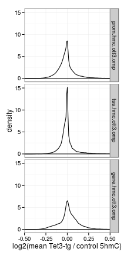
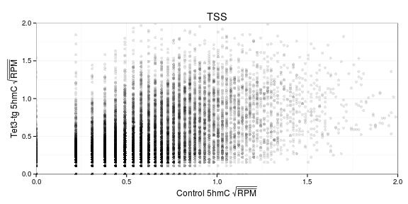
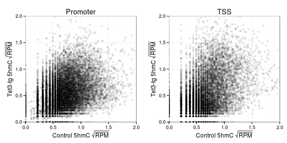
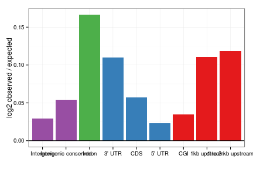
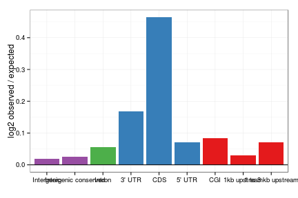
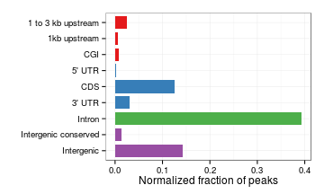
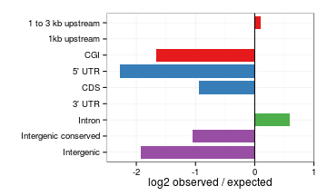
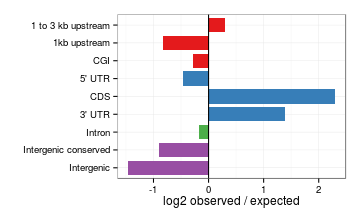
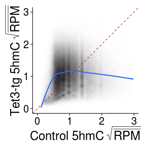
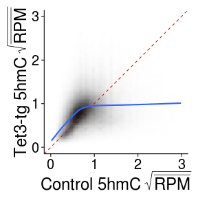

O/Tet3 5hmC analysis part 2
========================================================

Regions
  * Promoter - 1 kb upstream of TSS
  * TSS - -500 bp to +500 bp around TSS
  * Gene body - TSS to TES
  * Exons
  
### Data prep
Promoter
```
prom <- read.delim("~/s2/analysis/features/norm/rpkm/mean/summaries/tt3_min_Refgene_1kb_up_chr_sqrt")
id <- read.delim("/seq/lib/id_name2", header=F)
prom$name2 <- id[match(rownames(prom), id[,1]),2]
prom.2 <- ddply(prom, .(name2), function(d) apply(d[,1:6], 2, mean), .progress="text")
prom.2n <- na.omit(prom.2)
prom.hmc <- with(prom.2n, data.frame(hmc.omp=omp_hmc_120424_rpkm, hmc.ott3=ott3_1_hmc_rpkm, hmc.ott3.omp = computeScoreRatios(ott3_1_hmc_rpkm, omp_hmc_120424_rpkm)))
rownames(prom.hmc) <- prom.2n[,1]

m <- match(rownames(prom.hmc), rna.1log2$gene)
prom.hmc <- cbind(prom.hmc, data.frame(rmrna.omp=rna.1log2[m,2], rmrna.ott3=rna.1log2[m,3], rmrna.ott3.omp=rna.1log2[m,4]))
prom.hmc.n <- na.omit(prom.hmc)
saveRDS(prom.hmc.n, file="~/s2/analysis/features/norm/rpkm/mean/rdata/omp_ott3_hmc_rpkm_Refgene_1kb_up_chr_sqrt_omp_ott3_rmrna.rds")
```

TSS
```
tss.val <- read.delim("~/s2/analysis/features/norm/rpkm/mean/summaries/tt3_min_refgene_-500bpTSS+500bp_chr_sqrt")
tss.val.hmc <- with(tss.val, data.frame(hmc.omp=omp_hmc_120424_rpkm, hmc.ott3=ott3_1_hmc_rpkm, hmc.ott3.omp = computeScoreRatios(ott3_1_hmc_rpkm, omp_hmc_120424_rpkm)))
rownames(tss.val.hmc) <- rownames(tss.val)
m <- match(rownames(tss.val.hmc), rna.1log2$gene)
tss.val.hmc <- cbind(tss.val.hmc, data.frame(rmrna.omp=rna.1log2[m,2], rmrna.ott3=rna.1log2[m,3], rmrna.ott3.omp=rna.1log2[m,4]))
tss.val.hmc.na <- na.omit(tss.val.hmc)
saveRDS(tss.val.hmc.na, file="~/s2/analysis/features/norm/rpkm/mean/rdata/omp_ott3_hmc_rpkm_refgene_m500bpTSSp500bp_omp_ott3_rmrna.rds")
```

Gene body
```
gene <- read.delim("~/s2/analysis/features/norm/rpkm/mean/summaries/tt3_min_refgene_chr_sqrt")
gene.val.hmc <- with(rg, data.frame(hmc.omp=omp_hmc_120424_rpkm, hmc.ott3=ott3_1_hmc_rpkm, hmc.ott3.omp = computeScoreRatios(ott3_1_hmc_rpkm, omp_hmc_120424_rpkm)))
rownames(gene.val.hmc) <- rownames(rg)
m <- match(rownames(gene.val.hmc), rna.1log2$gene)
gene.val.hmc <- cbind(gene.val.hmc, data.frame(rmrna.omp=rna.1log2[m,2], rmrna.ott3=rna.1log2[m,3], rmrna.ott3.omop=rna.1log2[m,4]))
gene.val.hmc.n <- na.omit(gene.val.hmc)
saveRDS(gene.val.hmc.n, file="~/s2/analysis/features/norm/rpkm/mean/rdata/omp_ott3_hmc_rpkm_refgene_chr_sqrt_omp_ott3_rmrna.rds")
```


Combined data
```
prom <- readRDS("~/s2/analysis/features/norm/rpkm/mean/rdata/omp_ott3_hmc_rpkm_Refgene_1kb_up_chr_sqrt_omp_ott3_rmrna.rds")
tss <- readRDS("~/s2/analysis/features/norm/rpkm/mean/rdata/omp_ott3_hmc_rpkm_refgene_m500bpTSSp500bp_omp_ott3_rmrna.rds")
gene <- readRDS("~/s2/analysis/features/norm/rpkm/mean/rdata/omp_ott3_hmc_rpkm_refgene_chr_sqrt_omp_ott3_rmrna.rds")

m <- match(rownames(prom), rownames(tss))

comb <- data.frame(prom.hmc.omp=prom[,1], prom.hmc.ott3=prom[,2], prom.hmc.ott3.omp=prom[,3], tss.hmc.omp=tss[m,1], tss.hmc.ott3=tss[m,2], tss.hmc.ott3.omp=tss[m,3])
rownames(comb) <- rownames(prom)
comb <- na.omit(comb)

m <- match(rownames(comb), rownames(gene))
comb <- cbind(comb, data.frame(gene.hmc.omp=gene[m,1], gene.hmc.ott3=gene[m,2], gene.hmc.ott3.omp=gene[m,3]))
comb <- na.omit(comb)
```

Combine with RNA
```
rna.1log2 <- readRDS("~/s2/analysis/rna/rdata/omp_ott3_rmrna_masked_uq_1log2.rds")

m <- match(rownames(comb), rna.1log2$gene)
comb <- cbind(comb, data.frame(rmrna.omp = rna.1log2[m,2]), rmrna.ott3=rna.1log2[m,3], rmrna.ott3.omp=rna.1log2[m,4])
comb <- na.omit(comb)
saveRDS(comb, file="~/s2/analysis/features/norm/rpkm/mean/rdata/omp_ott3_hmc_rpkm_prom_tss_body_sqrt_omp_ott3_rmrna.rds")
```


```r
library(reshape2)
comb <- readRDS("~/s2/analysis/features/norm/rpkm/mean/rdata/omp_ott3_hmc_rpkm_prom_tss_body_sqrt_omp_ott3_rmrna.rds")
comb.m <- melt(comb)
```

```
## Using as id variables
```

```r
comb.m$id <- rownames(comb)
```


### Densities


```r
library(ggplot2)
library(gridExtra)
```

```
## Loading required package: grid
```


```r
theme_set(theme_bw())
tss <- ggplot(comb, aes(tss.hmc.ott3.omp)) + geom_density() + coord_cartesian(xlim = c(-0.5, 
    0.5)) + xlab("")
prom <- ggplot(comb, aes(prom.hmc.ott3.omp)) + geom_density() + coord_cartesian(xlim = c(-0.5, 
    0.5))
gene <- ggplot(comb, aes(gene.hmc.ott3.omp)) + geom_density() + coord_cartesian(xlim = c(-0.5, 
    0.5))
grid.arrange(prom, tss, gene, nrow = 3)
```

 


```r
comb.m$position <- rep(factor(1:4, labels = c("Promoter", "TSS", "Body", "RNA")), 
    each = 3 * nrow(comb))
comb.m$geno <- rep(factor(1:3, labels = c("Cntrl", "Tet-tg", "Tet3-tg / Cntrl")), 
    each = nrow(comb))
```


```r
comb.m.hmc <- comb.m[grep("hmc", comb.m$variable), ]
group.names <- list(prom.hmc.ott3.omp = "Promoter", TSS = "tss", gene.hmc.ott3.omp = "Body", 
    rmrna.ott3.omp = "RNA")
label <- function(variable, value) {
    return(group.names[value])
}
gg <- ggplot(comb.m.hmc[grep("ott3.omp", comb.m.hmc$variable), ], aes(value)) + 
    geom_density() + facet_grid(variable ~ .) + coord_cartesian(xlim = c(-0.5, 
    0.5)) + xlab("log2(mean Tet3-tg / control 5hmC)")
gg
```

 


### Scatter


```r
tss <- ggplot(comb, aes(tss.hmc.omp, tss.hmc.ott3)) + geom_point(alpha = I(1/10)) + 
    coord_cartesian(xlim = c(0, 2), ylim = c(0, 2)) + xlab(bquote(.("Control 5hmC" ~ 
    sqrt(bar(RPM))))) + ylab(bquote(.("Tet3-tg 5hmC" ~ sqrt(bar(RPM))))) + labs(title = "TSS")
tss
```

 

```r
prom <- ggplot(comb, aes(prom.hmc.omp, prom.hmc.ott3)) + geom_point(alpha = I(1/10)) + 
    coord_cartesian(xlim = c(0, 2), ylim = c(0, 2)) + xlab(bquote(.("Control 5hmC" ~ 
    sqrt(bar(RPM))))) + ylab(bquote(.("Tet3-tg 5hmC" ~ sqrt(bar(RPM))))) + labs(title = "Promoter")
gene <- ggplot(comb, aes(gene.hmc.omp, gene.hmc.ott3)) + geom_point(alpha = I(1/10)) + 
    coord_cartesian(xlim = c(0, 2), ylim = c(0, 2))

grid.arrange(prom, tss, ncol = 2)
```

 


### Box

```r

gg <- ggplot(comb.m.hmc[-grep("ott3.omp", comb.m.hmc$variable), ], aes(geno, 
    value, fill = geno)) + geom_boxplot() + facet_grid(. ~ position) + coord_cartesian(ylim = c(0, 
    3))
gg <- gg + scale_fill_brewer(palette = "Set1") + theme(legend.position = "none") + 
    xlab("") + ylab(bquote(.("5hmC" ~ sqrt(bar(RPM)))))
gg <- gg + theme(axis.text.x = element_text(size = 12), strip.text.x = element_text(size = 12, 
    face = "bold"))
gg
```

 


```r
wilcox.test(comb[, 1], comb[, 2])$p.value
```

```
## [1] 0
```

```r
wilcox.test(comb[, 4], comb[, 5])$p.value
```

```
## [1] 0
```

```r
wilcox.test(comb[, 7], comb[, 8])$p.value
```

```
## [1] 0.0001623
```


```r
rg.gene.bf <- read.delim("~/s2/analysis/features/norm/rpkm/mean/bf/omp_hmc_120424_rpkm_ott3_1_hmc_rpkm_refgene_sqrt_bf", 
    header = F)
rg.gene.bf.ge20 <- rg.gene.bf[rg.gene.bf[, 2] >= 20, ]
rg.gene.bf.le20 <- rg.gene.bf[rg.gene.bf[, 2] <= -20, ]
comb.gene.bf.ge20 <- comb[rownames(comb) %in% rg.gene.bf.ge20[, 1], ]
comb.gene.bf.le20 <- comb[rownames(comb) %in% rg.gene.bf.le20[, 1], ]
```


```r
boxplot(comb.gene.bf.ge20 <- comb[rownames(comb) %in% rg.gene.bf.ge20[, 1], 
    ])
```

 

```r
boxplot(comb.gene.bf.le20 <- comb[rownames(comb) %in% rg.gene.bf.le20[, 1], 
    ])
```

 


```r
with(comb.gene.bf.ge20, wilcox.test(rmrna.omp, rmrna.ott3))
```

```
## 
## 	Wilcoxon rank sum test with continuity correction
## 
## data:  rmrna.omp and rmrna.ott3 
## W = 10811, p-value = 0.5284
## alternative hypothesis: true location shift is not equal to 0
```

```r
with(comb.gene.bf.le20, wilcox.test(rmrna.omp, rmrna.ott3))
```

```
## 
## 	Wilcoxon rank sum test with continuity correction
## 
## data:  rmrna.omp and rmrna.ott3 
## W = 20338, p-value = 0.5024
## alternative hypothesis: true location shift is not equal to 0
```


Peak intersections
-------------------


```r
suppressPackageStartupMessages(source("~/src/seqAnalysis/R/features.R"))
opts_knit$set(progress = TRUE, verbose = TRUE)
```


```r

omp.ott3.feat <- processIntersectSummary("~/s2/data/homer/peaks/intersections/tt3/omp_hmc_gc_input_ott3_1_hmc_gc_F3.bed/summary")
omp.ott3.feat <- omp.ott3.feat[-grep("mOSN enhancer", omp.ott3.feat$feature.pretty), 
    ]
```


```r
ott3.omp.feat <- processIntersectSummary("~/s2/data/homer/peaks/intersections/tt3/ott3_1_hmc_gc_input_omp_hmc_gc_F3.bed_run2/summary")
ott3.omp.feat <- ott3.omp.feat[-grep("mOSN enhancer", ott3.omp.feat$feature.pretty), 
    ]
```


```r
omp.ott3.feat$feature.pretty <- factor(omp.ott3.feat$feature.pretty, levels = levels(omp.ott3.feat$feature.pretty)[length(levels(omp.ott3.feat$feature.pretty)):1])
```


```r
ott3.omp.feat$feature.pretty <- factor(ott3.omp.feat$feature.pretty, levels = levels(ott3.omp.feat$feature.pretty)[length(levels(ott3.omp.feat$feature.pretty)):1])
```


```r
theme_set(theme_bw())
gg <- ggplot(omp.ott3.feat, aes(feature.pretty, internal_norm, fill = class))
gg + geom_bar() + scale_fill_brewer(palette = "Set1") + theme(legend.position = "none") + 
    xlab("") + ylab("log2 observed / expected") + geom_hline(yintercept = 0)
```

```
## Mapping a variable to y and also using stat="bin".  With stat="bin", it
## will attempt to set the y value to the count of cases in each group.  This
## can result in unexpected behavior and will not be allowed in a future
## version of ggplot2.  If you want y to represent counts of cases, use
## stat="bin" and don't map a variable to y.  If you want y to represent
## values in the data, use stat="identity".  See ?geom_bar for examples.
## (Deprecated; last used in version 0.9.2)
```

 


```r
gg <- ggplot(ott3.omp.feat, aes(feature.pretty, internal_norm, fill = class))
gg + geom_bar() + scale_fill_brewer(palette = "Set1") + theme(legend.position = "none") + 
    xlab("") + ylab("log2 observed / expected") + geom_hline(yintercept = 0)
```

```
## Mapping a variable to y and also using stat="bin".  With stat="bin", it
## will attempt to set the y value to the count of cases in each group.  This
## can result in unexpected behavior and will not be allowed in a future
## version of ggplot2.  If you want y to represent counts of cases, use
## stat="bin" and don't map a variable to y.  If you want y to represent
## values in the data, use stat="identity".  See ?geom_bar for examples.
## (Deprecated; last used in version 0.9.2)
```

 


Non-length normalized

```r
theme_set(theme_bw())

gg <- ggplot(omp.ott3.feat, aes(feature.pretty, fraction, fill = class))
gg + geom_bar(width = 0.8) + scale_fill_brewer(palette = "Set1") + theme(legend.position = "none") + 
    xlab("") + ylab("Normalized fraction of peaks") + coord_flip()
```

```
## Mapping a variable to y and also using stat="bin".  With stat="bin", it
## will attempt to set the y value to the count of cases in each group.  This
## can result in unexpected behavior and will not be allowed in a future
## version of ggplot2.  If you want y to represent counts of cases, use
## stat="bin" and don't map a variable to y.  If you want y to represent
## values in the data, use stat="identity".  See ?geom_bar for examples.
## (Deprecated; last used in version 0.9.2)
```

 


```r
gg <- ggplot(ott3.omp.feat, aes(feature.pretty, fraction, fill = class))
gg + geom_bar(width = 0.8) + scale_fill_brewer(palette = "Set1") + theme(legend.position = "none") + 
    xlab("") + ylab("Normalized fraction of peaks") + coord_flip()
```

```
## Mapping a variable to y and also using stat="bin".  With stat="bin", it
## will attempt to set the y value to the count of cases in each group.  This
## can result in unexpected behavior and will not be allowed in a future
## version of ggplot2.  If you want y to represent counts of cases, use
## stat="bin" and don't map a variable to y.  If you want y to represent
## values in the data, use stat="identity".  See ?geom_bar for examples.
## (Deprecated; last used in version 0.9.2)
```

 


log2 Obs/Exp

```r
theme_set(theme_bw())

gg <- ggplot(omp.ott3.feat, aes(feature.pretty, log2.obs.exp, fill = class))
gg + geom_bar(width = 0.8) + scale_fill_brewer(palette = "Set1") + theme(legend.position = "none") + 
    xlab("") + coord_flip(ylim = c(-2.5, 1)) + ylab("log2 observed / expected") + 
    geom_hline(yintercept = 0)
```

```
## Mapping a variable to y and also using stat="bin".  With stat="bin", it
## will attempt to set the y value to the count of cases in each group.  This
## can result in unexpected behavior and will not be allowed in a future
## version of ggplot2.  If you want y to represent counts of cases, use
## stat="bin" and don't map a variable to y.  If you want y to represent
## values in the data, use stat="identity".  See ?geom_bar for examples.
## (Deprecated; last used in version 0.9.2)
```

```
## Warning: Stacking not well defined when ymin != 0
```

 


```r
gg <- ggplot(ott3.omp.feat, aes(feature.pretty, log2.obs.exp, fill = class))
gg + geom_bar(width = 0.8) + scale_fill_brewer(palette = "Set1") + theme(legend.position = "none") + 
    xlab("") + coord_flip() + ylab("log2 observed / expected") + geom_hline(yintercept = 0)
```

```
## Mapping a variable to y and also using stat="bin".  With stat="bin", it
## will attempt to set the y value to the count of cases in each group.  This
## can result in unexpected behavior and will not be allowed in a future
## version of ggplot2.  If you want y to represent counts of cases, use
## stat="bin" and don't map a variable to y.  If you want y to represent
## values in the data, use stat="identity".  See ?geom_bar for examples.
## (Deprecated; last used in version 0.9.2)
```

```
## Warning: Stacking not well defined when ymin != 0
```

 


#### Exons

```r
exons <- read.delim("~/s2/analysis/features/norm/rpkm/mean/summaries/tt3_min_Refgene_exons_split2_chr_sqrt")
exons <- exons[apply(exons[, 1:2], 1, prod) > 0, ]
```


```r
theme_set(theme_classic())
# exons.gg <- ggplot(exons, aes(omp_hmc_120424_rpkm, ott3_1_hmc_rpkm)) +
# geom_point(alpha=I(1/5), data=exons[sample(1:nrow(exons), 20000),]) +
# coord_cartesian(xlim=c(0,3), ylim=c(0,3))
exons.gg <- ggplot(exons, aes(omp_hmc_120424_rpkm, ott3_1_hmc_rpkm)) + xlim(0, 
    3) + ylim(0, 3) + stat_density2d(geom = "tile", aes(fill = ..density..), 
    contour = F) + scale_fill_gradient(low = "white", high = "black", limits = c(0, 
    1))
exons.gg <- exons.gg + geom_abline(intercept = 0, slope = 1, color = "red", 
    linetype = 2) + stat_smooth(data = exons[apply(exons[, 1:2], 1, prod) > 
    0, ], se = FALSE, size = 1)
exons.gg <- exons.gg + xlab(bquote(.("Control 5hmC" ~ sqrt(bar(RPM))))) + ylab(bquote(.("Tet3-tg 5hmC" ~ 
    sqrt(bar(RPM)))))
exons.gg <- exons.gg + theme(axis.text.x = element_text(size = 20, color = "black"), 
    axis.text.y = element_text(size = 20, color = "black"), axis.title.x = element_text(size = 24), 
    axis.title.y = element_text(size = 24), legend.position = "none")
exons.gg
```

```
## Warning: Removed 153 rows containing non-finite values (stat_density2d).
```

```
## geom_smooth: method="auto" and size of largest group is >=1000, so using
## gam with formula: y ~ s(x, bs = "cs"). Use 'method = x' to change the
## smoothing method.
```

```
## Warning: Removed 153 rows containing missing values (stat_smooth).
```

 


Mid 50%

```r
q <- quantile(exons[, 1], probs = c(0.45, 0.55))
exons.q50 <- exons[exons[, 1] >= q[1] & exons[, 1] <= q[2], ]
exons.q50.ratio <- exons.q50[, 2]/exons.q50[, 1]
mean(exons.q50.ratio)
```

```
## [1] 1.222
```

```r
sd(exons.q50.ratio)
```

```
## [1] 0.5076
```

```r
wilcox.test(exons.q50[, 1], exons.q50[, 2])$p.value
```

```
## [1] 0
```


Top 90%

```r
q <- quantile(exons[, 1], probs = c(0.9, 1))
exons.q90 <- exons[exons[, 1] >= q[1] & exons[, 1] <= q[2], ]
exons.q90.ratio <- exons.q90[, 2]/exons.q90[, 1]
mean(exons.q90.ratio)
```

```
## [1] 0.5452
```

```r
sd(exons.q90.ratio)
```

```
## [1] 0.2456
```

```r
wilcox.test(exons.q90[, 1], exons.q90[, 2])$p.value
```

```
## [1] 0
```


### Introns

```r
introns <- read.delim("~/s2/analysis/features/norm/rpkm/mean/summaries/tt3_min_Refgene_intron_chr_sqrt")
introns <- introns[apply(introns[, 1:2], 1, prod) > 0, ]
```


```r
theme_set(theme_classic())
## introns.gg <- ggplot(introns, aes(omp_hmc_120424_rpkm,
## ott3_1_hmc_rpkm)) + geom_point(alpha=I(1/10),
## data=introns[sample(1:nrow(introns), 20000),]) +
## coord_cartesian(xlim=c(0,3), ylim=c(0,3))
introns.gg <- ggplot(introns, aes(omp_hmc_120424_rpkm, ott3_1_hmc_rpkm)) + xlim(0, 
    3) + ylim(0, 3) + stat_density2d(geom = "tile", aes(fill = ..density..), 
    contour = F) + scale_fill_gradient(low = "white", high = "black", limits = c(0, 
    2.2))
introns.gg <- introns.gg + geom_abline(intercept = 0, slope = 1, color = "red", 
    linetype = 2) + stat_smooth(data = introns[apply(introns[, 1:2], 1, prod) > 
    0, ], se = FALSE, size = 1, formula = y ~ s(x, bs = "cs"))
introns.gg <- introns.gg + xlab(bquote(.("Control 5hmC" ~ sqrt(bar(RPM))))) + 
    ylab(bquote(.("Tet3-tg 5hmC" ~ sqrt(bar(RPM)))))
introns.gg <- introns.gg + theme(axis.text.x = element_text(size = 20, color = "black"), 
    axis.text.y = element_text(size = 20, color = "black"), axis.title.x = element_text(size = 24), 
    axis.title.y = element_text(size = 24), legend.position = "none")
introns.gg
```

```
## Warning: Removed 99 rows containing non-finite values (stat_density2d).
```

```
## geom_smooth: method="auto" and size of largest group is >=1000, so using
## gam with formula: y ~ s(x, bs = "cs"). Use 'method = x' to change the
## smoothing method.
```

```
## Warning: Removed 99 rows containing missing values (stat_smooth).
```

 


Mid 50%

```r
q <- quantile(introns[, 1], probs = c(0.45, 0.55))
introns.q50 <- introns[introns[, 1] >= q[1] & introns[, 1] <= q[2], ]
introns.q50.ratio <- introns.q50[, 2]/introns.q50[, 1]
mean(introns.q50.ratio)
```

```
## [1] 1.163
```

```r
sd(introns.q50.ratio)
```

```
## [1] 0.3761
```

```r
wilcox.test(introns.q50[, 1], introns.q50[, 2])$p.value
```

```
## [1] 0
```


Top 90%

```r
q <- quantile(introns[, 1], probs = c(0.9, 1))
introns.q90 <- introns[introns[, 1] >= q[1] & introns[, 1] <= q[2], ]
introns.q90.ratio <- introns.q90[, 2]/introns.q90[, 1]
mean(introns.q90.ratio)
```

```
## [1] 0.6101
```

```r
sd(introns.q90.ratio)
```

```
## [1] 0.2745
```

```r
wilcox.test(introns.q90[, 1], introns.q90[, 2])
```

```
## 
## 	Wilcoxon rank sum test with continuity correction
## 
## data:  introns.q90[, 1] and introns.q90[, 2] 
## W = 411444126, p-value < 0.00000000000000022
## alternative hypothesis: true location shift is not equal to 0
```


