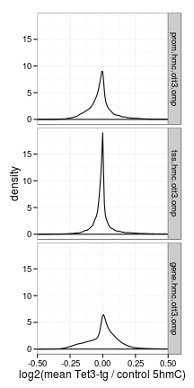
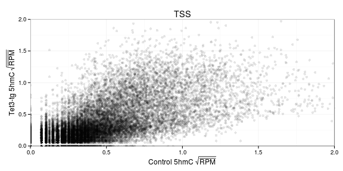
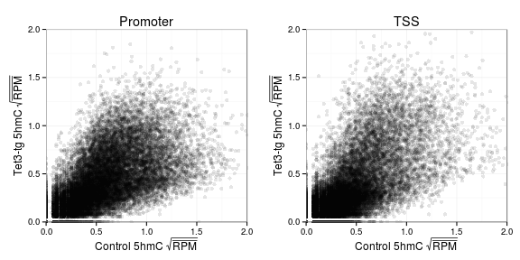
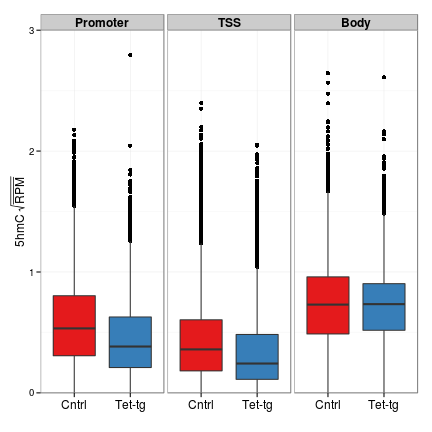
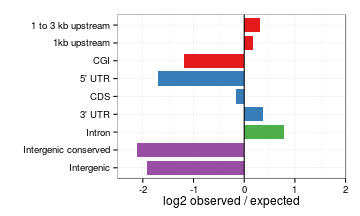
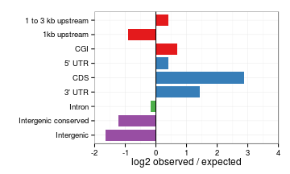
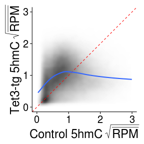
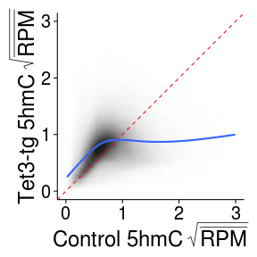

O/Tet3 5hmC replicates
========================================================

Regions
  * Promoter - 1 kb upstream of TSS
  * TSS - -500 bp to +500 bp around TSS
  * Gene body - TSS to TES
  * Exons
  
### Data prep

RNA
```
rna.1log2 <- readRDS("~/s2/analysis/rna/rdata/omp_ott3_rmrna_rep12_masked_comp_js_1log2.rds")
```
Promoter
```
prom <- read.delim("~/s2/analysis/features/norm/rpkm_rep/mean/summaries/tt3_rep_Refgene_1kb_up_chr_sqrt")
id <- read.delim("/seq/lib/id_name2", header=F)
prom$name2 <- id[match(rownames(prom), id[,1]),2]
prom.2 <- ddply(prom, .(name2), function(d) apply(d[,1:2], 2, mean), .progress="text")
prom.2n <- na.omit(prom.2)
prom.hmc <- with(prom.2n, data.frame(hmc.omp=omp_hmc, hmc.ott3=ott3_hmc, hmc.ott3.omp = computeScoreRatios(ott3_hmc, omp_hmc)))
rownames(prom.hmc) <- prom.2n[,1]

m <- match(rownames(prom.hmc), rownames(rna.1log2))
prom.hmc <- cbind(prom.hmc, data.frame(rmrna.omp=rna.1log2[m,1], rmrna.ott3=rna.1log2[m,2], rmrna.ott3.omp=rna.1log2[m,3]))
prom.hmc.n <- na.omit(prom.hmc)
saveRDS(prom.hmc.n, file="~/s2/analysis/features/norm/rpkm_rep/mean/rdata/omp_ott3_hmc_rep12_Refgene_1kb_up_chr_sqrt_omp_ott3_rmrna.rds")
```

TSS
```
tss.val <- read.delim("~/s2/analysis/features/norm/rpkm_rep/mean/summaries/tt3_rep_refgene_-500bpTSS+500bp_chr_sqrt")
tss.val.hmc <- with(tss.val, data.frame(hmc.omp=omp_hmc, hmc.ott3=ott3_hmc, hmc.ott3.omp = computeScoreRatios(ott3_hmc, omp_hmc)))
rownames(tss.val.hmc) <- rownames(tss.val)
m <- match(rownames(tss.val.hmc), rownames(rna.1log2))
tss.val.hmc <- cbind(tss.val.hmc, data.frame(rmrna.omp=rna.1log2[m,1], rmrna.ott3=rna.1log2[m,2], rmrna.ott3.omp=rna.1log2[m,3]))
tss.val.hmc.na <- na.omit(tss.val.hmc)
saveRDS(tss.val.hmc.na, file="~/s2/analysis/features/norm/rpkm_rep/mean/rdata/omp_ott3_hmc_rep12_refgene_m500bpTSSp500bp_omp_ott3_rmrna.rds")
```

Gene body
```
gene <- read.delim("~/s2/analysis/features/norm/rpkm_rep/mean/summaries/tt3_rep_refgene_chr_sqrt")
gene.val.hmc <- with(rg, data.frame(hmc.omp=omp_hmc, hmc.ott3=ott3_hmc, hmc.ott3.omp = computeScoreRatios(ott3_hmc, omp_hmc)))
rownames(gene.val.hmc) <- rownames(rg)
m <- match(rownames(gene.val.hmc), rownames(rna.1log2))
gene.val.hmc <- cbind(gene.val.hmc, data.frame(rmrna.omp=rna.1log2[m,1], rmrna.ott3=rna.1log2[m,2], rmrna.ott3.omop=rna.1log2[m,3]))
gene.val.hmc.n <- na.omit(gene.val.hmc)
saveRDS(gene.val.hmc.n, file="~/s2/analysis/features/norm/rpkm_rep/mean/rdata/omp_ott3_hmc_rep12_refgene_chr_sqrt_omp_ott3_rmrna.rds")
```


Combined data
```
prom <- readRDS("~/s2/analysis/features/norm/rpkm_rep/mean/rdata/omp_ott3_hmc_rep12_Refgene_1kb_up_chr_sqrt_omp_ott3_rmrna.rds")
tss <- readRDS("~/s2/analysis/features/norm/rpkm_rep/mean/rdata/omp_ott3_hmc_rep12_refgene_m500bpTSSp500bp_omp_ott3_rmrna.rds")
gene <- readRDS("~/s2/analysis/features/norm/rpkm_rep/mean/rdata/omp_ott3_hmc_rep12_refgene_chr_sqrt_omp_ott3_rmrna.rds")

m <- match(rownames(prom), rownames(tss))

comb <- data.frame(prom.hmc.omp=prom[,1], prom.hmc.ott3=prom[,2], prom.hmc.ott3.omp=prom[,3], tss.hmc.omp=tss[m,1], tss.hmc.ott3=tss[m,2], tss.hmc.ott3.omp=tss[m,3])
rownames(comb) <- rownames(prom)
comb <- na.omit(comb)

m <- match(rownames(comb), rownames(gene))
comb <- cbind(comb, data.frame(gene.hmc.omp=gene[m,1], gene.hmc.ott3=gene[m,2], gene.hmc.ott3.omp=gene[m,3]))
comb <- na.omit(comb)
```

Combine with RNA
```
m <- match(rownames(comb), rownames(rna.1log2))
comb <- cbind(comb, data.frame(rmrna.omp = rna.1log2[m,1]), rmrna.ott3=rna.1log2[m,2], rmrna.ott3.omp=rna.1log2[m,3])
comb <- na.omit(comb)
saveRDS(comb, file="~/s2/analysis/features/norm/rpkm_rep/mean/rdata/omp_ott3_hmc_rpkm_rep_prom_tss_body_sqrt_omp_ott3_rmrna_rep.rds")
```


```r
library(reshape2)
comb <- readRDS("~/s2/analysis/features/norm/rpkm_rep/mean/rdata/omp_ott3_hmc_rpkm_rep_prom_tss_body_sqrt_omp_ott3_rmrna_rep.rds")
comb.m <- melt(comb)
```

```
## Using as id variables
```

```r
comb.m$id <- rownames(comb)
```


### Densities


```r
library(ggplot2)
library(gridExtra)
```

```
## Loading required package: grid
```


```r
theme_set(theme_bw())
tss <- ggplot(comb, aes(tss.hmc.ott3.omp)) + geom_density() + coord_cartesian(xlim = c(-0.5, 
    0.5)) + xlab("")
prom <- ggplot(comb, aes(prom.hmc.ott3.omp)) + geom_density() + coord_cartesian(xlim = c(-0.5, 
    0.5))
gene <- ggplot(comb, aes(gene.hmc.ott3.omp)) + geom_density() + coord_cartesian(xlim = c(-0.5, 
    0.5))
grid.arrange(prom, tss, gene, nrow = 3)
```

 


```r
comb.m$position <- rep(factor(1:4, labels = c("Promoter", "TSS", "Body", "RNA")), 
    each = 3 * nrow(comb))
comb.m$geno <- rep(factor(1:3, labels = c("Cntrl", "Tet-tg", "Tet3-tg / Cntrl")), 
    each = nrow(comb))
```


```r
comb.m.hmc <- comb.m[grep("hmc", comb.m$variable), ]
group.names <- list(prom.hmc.ott3.omp = "Promoter", TSS = "tss", gene.hmc.ott3.omp = "Body", 
    rmrna.ott3.omp = "RNA")
label <- function(variable, value) {
    return(group.names[value])
}
gg <- ggplot(comb.m.hmc[grep("ott3.omp", comb.m.hmc$variable), ], aes(value)) + 
    geom_density() + facet_grid(variable ~ .) + coord_cartesian(xlim = c(-0.5, 
    0.5)) + xlab("log2(mean Tet3-tg / control 5hmC)")
gg
```

 


### Scatter


```r
tss <- ggplot(comb, aes(tss.hmc.omp, tss.hmc.ott3)) + geom_point(alpha = I(1/10)) + 
    coord_cartesian(xlim = c(0, 2), ylim = c(0, 2)) + xlab(bquote(.("Control 5hmC" ~ 
    sqrt(bar(RPM))))) + ylab(bquote(.("Tet3-tg 5hmC" ~ sqrt(bar(RPM))))) + labs(title = "TSS")
tss
```

 

```r
prom <- ggplot(comb, aes(prom.hmc.omp, prom.hmc.ott3)) + geom_point(alpha = I(1/10)) + 
    coord_cartesian(xlim = c(0, 2), ylim = c(0, 2)) + xlab(bquote(.("Control 5hmC" ~ 
    sqrt(bar(RPM))))) + ylab(bquote(.("Tet3-tg 5hmC" ~ sqrt(bar(RPM))))) + labs(title = "Promoter")
gene <- ggplot(comb, aes(gene.hmc.omp, gene.hmc.ott3)) + geom_point(alpha = I(1/10)) + 
    coord_cartesian(xlim = c(0, 2), ylim = c(0, 2))

grid.arrange(prom, tss, ncol = 2)
```

 


### Box

```r

gg <- ggplot(comb.m.hmc[-grep("ott3.omp", comb.m.hmc$variable), ], aes(geno, 
    value, fill = geno)) + geom_boxplot() + facet_grid(. ~ position) + coord_cartesian(ylim = c(0, 
    3))
gg <- gg + scale_fill_brewer(palette = "Set1") + theme(legend.position = "none") + 
    xlab("") + ylab(bquote(.("5hmC" ~ sqrt(bar(RPM)))))
gg <- gg + theme(axis.text.x = element_text(size = 12), strip.text.x = element_text(size = 12, 
    face = "bold"))
gg
```

 


```r
wilcox.test(comb[, 1], comb[, 2])$p.value
```

```
## [1] 0
```

```r
wilcox.test(comb[, 4], comb[, 5])$p.value
```

```
## [1] 2.617e-290
```

```r
wilcox.test(comb[, 7], comb[, 8])$p.value
```

```
## [1] 0.0000001415
```


Peak intersections
-------------------


```r
suppressPackageStartupMessages(source("~/src/seqAnalysis/R/features.R"))
opts_knit$set(progress = TRUE, verbose = TRUE)
options(scipen = 3)
```


```r

omp.ott3.feat <- processIntersectSummary("~/s2/data/homer/peaks/intersections/tt3/omp_hmc_gc_input_ott3_1_hmc_gc_size500_F3_inter50_omp_hmc_rep2_r1_gc_input_ott3_hmc_rep2_r1_gc_size500_F3.bed/summary")
omp.ott3.feat <- omp.ott3.feat[-grep("mOSN enhancer", omp.ott3.feat$feature.pretty), 
    ]
```


```r
ott3.omp.feat <- processIntersectSummary("~/s2/data/homer/peaks/intersections/tt3/ott3_hmc_rep1_r1_gc_input_omp_hmc_gc_size500_F3_inter50_ott3_hmc_rep2_r1_gc_input_omp_hmc_rep2_r1_gc_size500_F3.bed/summary")
ott3.omp.feat <- ott3.omp.feat[-grep("mOSN enhancer", ott3.omp.feat$feature.pretty), 
    ]
```


```r
omp.ott3.feat$feature.pretty <- factor(omp.ott3.feat$feature.pretty, levels = levels(omp.ott3.feat$feature.pretty)[length(levels(omp.ott3.feat$feature.pretty)):1])
omp.ott3.feat
```

```
##                                                feature reference_num
## 1  phastCons30way_intergenic_merge500_thresh500_merged         20738
## 3                                   Refgene_CDS_merged         20738
## 4                                 Refgene_5_UTR_merged         20738
## 5                                 Refgene_3_UTR_merged         20738
## 6                                Refgene_intron_merged         20738
## 7                             refgene_1to3kb_up_merged         20738
## 8                           intergenic_sub_rmsk_merged         20738
## 9                                Refgene_1kb_up_merged         20738
## 10                                          cgi_merged         20738
##    feature_num feature_span count  fraction fraction_norm internal_norm
## 1        58869     64778958   155 0.0074742     0.0001154       0.02247
## 3       189961     33521649   313 0.0150931     0.0004502       0.08770
## 4        31208      5041097    16 0.0007715     0.0001530       0.02981
## 5        21921     22959114   309 0.0149002     0.0006490       0.12641
## 6       177062    881598741 15743 0.7591378     0.0008611       0.16772
## 7        21900     44931696   580 0.0279680     0.0006225       0.12124
## 8      2437128    905159578  2487 0.1199248     0.0001325       0.02581
## 9        21334     22385987   262 0.0126338     0.0005644       0.10992
## 10       16026     10496250    48 0.0023146     0.0002205       0.04295
##    expected log2.obs.exp   fisher.p fisher.fdr
## 1       673      -2.1183  1.000e+00  1.000e+00
## 3       348      -0.1529  9.177e-01  1.000e+00
## 4        52      -1.7004  1.000e+00  1.000e+00
## 5       239       0.3706  1.688e-03  4.221e-03
## 6      9163       0.7808 1.136e-242 1.136e-241
## 7       467       0.3126  3.122e-04  1.041e-03
## 8      9408      -1.9195  1.000e+00  1.000e+00
## 9       233       0.1692  1.055e-01  2.111e-01
## 10      109      -1.1832  1.000e+00  1.000e+00
##                                         feature.factor
## 1  phastCons30way_intergenic_merge500_thresh500_merged
## 3                                   Refgene_CDS_merged
## 4                                 Refgene_5_UTR_merged
## 5                                 Refgene_3_UTR_merged
## 6                                Refgene_intron_merged
## 7                             refgene_1to3kb_up_merged
## 8                           intergenic_sub_rmsk_merged
## 9                                Refgene_1kb_up_merged
## 10                                          cgi_merged
##          feature.pretty      class
## 1  Intergenic conserved Intergenic
## 3                   CDS      Exons
## 4                5' UTR      Exons
## 5                3' UTR      Exons
## 6                Intron Transcript
## 7    1 to 3 kb upstream   Upstream
## 8            Intergenic Intergenic
## 9          1kb upstream   Upstream
## 10                  CGI   Upstream
```


```r
ott3.omp.feat$feature.pretty <- factor(ott3.omp.feat$feature.pretty, levels = levels(ott3.omp.feat$feature.pretty)[length(levels(ott3.omp.feat$feature.pretty)):1])
ott3.omp.feat
```

```
##                                                feature reference_num
## 1  phastCons30way_intergenic_merge500_thresh500_merged          2531
## 3                                   Refgene_CDS_merged          2531
## 4                                 Refgene_5_UTR_merged          2531
## 5                                 Refgene_3_UTR_merged          2531
## 6                                Refgene_intron_merged          2531
## 7                             refgene_1to3kb_up_merged          2531
## 8                           intergenic_sub_rmsk_merged          2531
## 9                                Refgene_1kb_up_merged          2531
## 10                                          cgi_merged          2531
##    feature_num feature_span count fraction fraction_norm internal_norm
## 1        58869     64778958    35 0.013829     0.0002135       0.02569
## 3       189961     33521649   314 0.124062     0.0037009       0.44541
## 4        31208      5041097     8 0.003161     0.0006270       0.07546
## 5        21921     22959114    79 0.031213     0.0013595       0.16362
## 6       177062    881598741   989 0.390755     0.0004432       0.05334
## 7        21900     44931696    75 0.029633     0.0006595       0.07937
## 8      2437128    905159578   368 0.145397     0.0001606       0.01933
## 9        21334     22385987    15 0.005927     0.0002647       0.03186
## 10       16026     10496250    21 0.008297     0.0007905       0.09514
##    expected log2.obs.exp  fisher.p fisher.fdr
## 1        82      -1.2283 1.000e+00  1.000e+00
## 3        43       2.8684 2.470e-49  2.470e-48
## 4         6       0.4150 3.957e-01  7.914e-01
## 5        29       1.4458 1.027e-06  5.136e-06
## 6      1118      -0.1769 9.915e-01  1.000e+00
## 7        57       0.3959 7.220e-02  2.407e-01
## 8      1148      -1.6413 1.000e+00  1.000e+00
## 9        28      -0.9005 9.839e-01  1.000e+00
## 10       13       0.6919 1.157e-01  2.894e-01
##                                         feature.factor
## 1  phastCons30way_intergenic_merge500_thresh500_merged
## 3                                   Refgene_CDS_merged
## 4                                 Refgene_5_UTR_merged
## 5                                 Refgene_3_UTR_merged
## 6                                Refgene_intron_merged
## 7                             refgene_1to3kb_up_merged
## 8                           intergenic_sub_rmsk_merged
## 9                                Refgene_1kb_up_merged
## 10                                          cgi_merged
##          feature.pretty      class
## 1  Intergenic conserved Intergenic
## 3                   CDS      Exons
## 4                5' UTR      Exons
## 5                3' UTR      Exons
## 6                Intron Transcript
## 7    1 to 3 kb upstream   Upstream
## 8            Intergenic Intergenic
## 9          1kb upstream   Upstream
## 10                  CGI   Upstream
```


log2 Obs/Exp

```r
theme_set(theme_bw())

gg <- ggplot(omp.ott3.feat, aes(feature.pretty, log2.obs.exp, fill = class))
gg + geom_bar(width = 0.8) + scale_fill_brewer(palette = "Set1") + theme(legend.position = "none") + 
    xlab("") + coord_flip(ylim = c(-2.5, 2)) + ylab("log2 observed / expected") + 
    geom_hline(yintercept = 0)
```

```
## Mapping a variable to y and also using stat="bin".  With stat="bin", it
## will attempt to set the y value to the count of cases in each group.  This
## can result in unexpected behavior and will not be allowed in a future
## version of ggplot2.  If you want y to represent counts of cases, use
## stat="bin" and don't map a variable to y.  If you want y to represent
## values in the data, use stat="identity".  See ?geom_bar for examples.
## (Deprecated; last used in version 0.9.2)
```

```
## Warning: Stacking not well defined when ymin != 0
```

 


```r
gg <- ggplot(ott3.omp.feat, aes(feature.pretty, log2.obs.exp, fill = class))
gg + geom_bar(width = 0.8) + scale_fill_brewer(palette = "Set1") + theme(legend.position = "none") + 
    xlab("") + coord_flip(ylim = c(-2, 4)) + ylab("log2 observed / expected") + 
    geom_hline(yintercept = 0)
```

```
## Mapping a variable to y and also using stat="bin".  With stat="bin", it
## will attempt to set the y value to the count of cases in each group.  This
## can result in unexpected behavior and will not be allowed in a future
## version of ggplot2.  If you want y to represent counts of cases, use
## stat="bin" and don't map a variable to y.  If you want y to represent
## values in the data, use stat="identity".  See ?geom_bar for examples.
## (Deprecated; last used in version 0.9.2)
```

```
## Warning: Stacking not well defined when ymin != 0
```

 


#### Exons

```r
exons <- read.delim("~/s2/analysis/features/norm/rpkm_rep/mean/summaries/tt3_rep_Refgene_exons_split2_chr_sqrt")
exons <- exons[apply(exons[, 1:2], 1, prod) > 0, ]
```


```r
theme_set(theme_classic())
exons.gg <- ggplot(exons, aes(omp_hmc, ott3_hmc)) + xlim(0, 3) + ylim(0, 3) + 
    stat_density2d(geom = "tile", aes(fill = ..density..), contour = F) + scale_fill_gradient(low = "white", 
    high = "black", limits = c(0, 1))
exons.gg <- exons.gg + geom_abline(intercept = 0, slope = 1, color = "red", 
    linetype = 2) + stat_smooth(data = exons[apply(exons[, 1:2], 1, prod) > 
    0, ], se = FALSE, size = 1, full_range = F)
exons.gg <- exons.gg + xlab(bquote(.("Control 5hmC" ~ sqrt(bar(RPM))))) + ylab(bquote(.("Tet3-tg 5hmC" ~ 
    sqrt(bar(RPM)))))
exons.gg <- exons.gg + theme(axis.text.x = element_text(size = 20, color = "black"), 
    axis.text.y = element_text(size = 20, color = "black"), axis.title.x = element_text(size = 24), 
    axis.title.y = element_text(size = 24), legend.position = "none")
exons.gg
```

```
## Warning: Removed 150 rows containing non-finite values (stat_density2d).
```

```
## geom_smooth: method="auto" and size of largest group is >=1000, so using
## gam with formula: y ~ s(x, bs = "cs"). Use 'method = x' to change the
## smoothing method.
```

```
## Warning: Removed 150 rows containing missing values (stat_smooth).
```

 


Mid 50%

```r
q <- quantile(exons[, 1], probs = c(0.45, 0.55))
exons.q50 <- exons[exons[, 1] >= q[1] & exons[, 1] <= q[2], ]
exons.q50.ratio <- exons.q50[, 2]/exons.q50[, 1]
mean(exons.q50.ratio)
```

```
## [1] 1.379
```

```r
sd(exons.q50.ratio)
```

```
## [1] 0.5729
```

```r
wilcox.test(exons.q50[, 1], exons.q50[, 2])$p.value
```

```
## [1] 0
```


Top 90%

```r
q <- quantile(exons[, 1], probs = c(0.9, 1))
exons.q90 <- exons[exons[, 1] >= q[1] & exons[, 1] <= q[2], ]
exons.q90.ratio <- exons.q90[, 2]/exons.q90[, 1]
mean(exons.q90.ratio)
```

```
## [1] 0.4859
```

```r
sd(exons.q90.ratio)
```

```
## [1] 0.2253
```

```r
wilcox.test(exons.q90[, 1], exons.q90[, 2])$p.value
```

```
## [1] 0
```


### Introns

```r
introns <- read.delim("~/s2/analysis/features/norm/rpkm_rep/mean/summaries/tt3_rep_Refgene_intron_chr_sqrt")
introns <- introns[apply(introns[, 1:2], 1, prod) > 0, ]
```


```r
theme_set(theme_classic())
introns.gg <- ggplot(introns, aes(omp_hmc, ott3_hmc)) + xlim(0, 3) + ylim(0, 
    3) + stat_density2d(geom = "tile", aes(fill = ..density..), contour = F) + 
    scale_fill_gradient(low = "white", high = "black", limits = c(0, 2.2))
introns.gg <- introns.gg + geom_abline(intercept = 0, slope = 1, color = "red", 
    linetype = 2) + stat_smooth(data = introns[apply(introns[, 1:2], 1, prod) > 
    0, ], se = FALSE, size = 1, formula = y ~ s(x, bs = "cs"))
introns.gg <- introns.gg + xlab(bquote(.("Control 5hmC" ~ sqrt(bar(RPM))))) + 
    ylab(bquote(.("Tet3-tg 5hmC" ~ sqrt(bar(RPM)))))
introns.gg <- introns.gg + theme(axis.text.x = element_text(size = 20, color = "black"), 
    axis.text.y = element_text(size = 20, color = "black"), axis.title.x = element_text(size = 24), 
    axis.title.y = element_text(size = 24), legend.position = "none")
introns.gg
```

```
## Warning: Removed 41 rows containing non-finite values (stat_density2d).
```

```
## geom_smooth: method="auto" and size of largest group is >=1000, so using
## gam with formula: y ~ s(x, bs = "cs"). Use 'method = x' to change the
## smoothing method.
```

```
## Warning: Removed 41 rows containing missing values (stat_smooth).
```

 


Mid 50%

```r
q <- quantile(introns[, 1], probs = c(0.45, 0.55))
introns.q50 <- introns[introns[, 1] >= q[1] & introns[, 1] <= q[2], ]
introns.q50.ratio <- introns.q50[, 2]/introns.q50[, 1]
mean(introns.q50.ratio)
```

```
## [1] 1.233
```

```r
sd(introns.q50.ratio)
```

```
## [1] 0.4169
```

```r
wilcox.test(introns.q50[, 1], introns.q50[, 2])$p.value
```

```
## [1] 0
```


Top 90%

```r
q <- quantile(introns[, 1], probs = c(0.9, 1))
introns.q90 <- introns[introns[, 1] >= q[1] & introns[, 1] <= q[2], ]
introns.q90.ratio <- introns.q90[, 2]/introns.q90[, 1]
mean(introns.q90.ratio)
```

```
## [1] 0.5585
```

```r
sd(introns.q90.ratio)
```

```
## [1] 0.2464
```

```r
wilcox.test(introns.q90[, 1], introns.q90[, 2])$p.value
```

```
## [1] 0
```


