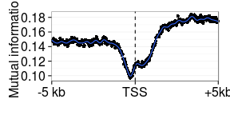

O/Tet3 entropy analysis
========================================================

Mutual information is a measure of the dependency between two random variables. Under normal conditions, closely related to Pearson correlation. However the relationships between 5hmC at different gene regions and expression are not linear/normal.

Analysis framework from the `entropy` package and 

Hausser, J., & Strimmer, K. (2009). Entropy inference and the James-Stein estimator, with application to nonlinear gene association networks. The Journal of Machine Learning Research, 10, 1469–1484.

Mutual information general formula:

$$MI(X,Y) = E(log(f(x,y)/f(x)f(y)))$$

or in terms of entropy

$$ MI(X,Y) = H(X,Y) - H(X) - H(Y) $$
$$ H = - \sum\limits_{k=1}^p \theta_{k} log(\theta_{k}) $$

1. Discretize data
2. Estimate $p = K^2$ cell frequencies of X (5hmC column) and Y (RNA) contingency table using `entropy` shrinkage approach (don't really understand this)
3. Calculate MI from entropies

#### Data input


```r
source("~/src/seqAnalysis/R/entropy.R")
library(entropy)
library(foreach)
library(plyr)
library(ggplot2)
library(itertools)
```

```
## Loading required package: iterators
```


Load in O/Tet3 and OMP gene position data

```r
suppressPackageStartupMessages(source("~/src/seqAnalysis/R/image.R"))
gene.omp <- makeImage("omp_hmc_120424_rpkm", "gene_whole_W200N50F50_chr", data_type = "rpkm/mean", 
    image = FALSE)
```

```
## [1] "/media/storage2/analysis/profiles/norm/rpkm/mean/gene_whole_W200N50F50_chr/images/omp_hmc_120424_rpkm"
```

```r
gene.ott3 <- makeImage("ott3_1_hmc_rpkm", "gene_whole_W200N50F50_chr", data_type = "rpkm/mean", 
    image = FALSE)
```

```
## [1] "/media/storage2/analysis/profiles/norm/rpkm/mean/gene_whole_W200N50F50_chr/images/ott3_1_hmc_rpkm"
```

```r

gene.omp.0 <- which(is.na(gene.omp), arr.ind = T)
gene.omp[gene.omp.0] <- 0

gene.ott3.0 <- which(is.na(gene.ott3), arr.ind = T)
gene.ott3[gene.ott3.0] <- 0

gene.ott3.omp <- log2((gene.ott3 + 1)/(gene.omp + 1))
```


Load in RNA data

```r
rna.1log2 <- readRDS("~/s2/analysis/rna/rdata/omp_ott3_rmrna_masked_uq_1log2.rds")
```


Make data compatible

```r
# Zero NAs

gene.ott3.omp.rna <- gene.ott3.omp[match(rna.1log2$gene, rownames(gene.ott3.omp)), 
    ]
gene.ott3.omp.rna <- na.omit(gene.ott3.omp.rna)

rna.1log2.dna <- rna.1log2[match(rownames(gene.ott3.omp), rna.1log2$gene), ]
rna.1log2.dna <- na.omit(rna.1log2.dna)
```


#### 1. Discretize data


```r
breaks.dna <- hist(gene.ott3.omp.rna, breaks = "FD", plot = F)$breaks
gene.ott3.omp.rna.dis <- foreach(x = isplitCols(gene.ott3.omp.rna, chunkSize = 1), 
    .combine = "cbind") %do% discretize(x, breaks)
```

```
## Error: task 1 failed - "object 'breaks' not found"
```

```r

# breaks.rna <- hist(rna.1log2.dna[,4], breaks='FD', plot=F)$breaks
breaks.rna <- seq(min(rna.1log2.dna[, 4]), max(rna.1log2.dna[, 4]), length.out = length(breaks.dna))
rna.1log2.dna.dis <- discretize(rna.1log2.dna[, 4], breaks.rna)
```


#### 2. Construct contingency table


```r
ott3.omp.rna <- factor(rna.1log2.dna.dis, levels = 1:length(breaks.rna))
tab <- alply(gene.ott3.omp.rna.dis, 2, function(x) table(factor(x, levels = 1:length(breaks.dna)), 
    ott3.omp.rna))
```

```
## Error: object 'gene.ott3.omp.rna.dis' not found
```


#### 3. Calculate MI


```r
mi <- lapply(tab, mi.shrink, verbose = F)
```

```
## Error: object 'tab' not found
```

```r
mi.val <- unlist(lapply(mi, function(x) x[1]))
```

```
## Error: object 'mi' not found
```


Plot

```r
theme_set(theme_bw())
gg <- ggplot(data.frame(x = 1:150, y = mi.val), aes(x, y))
```

```
## Error: object 'mi.val' not found
```

```r
gg <- gg + geom_point() + stat_smooth(method = "loess", se = F, span = 0.07) + 
    geom_vline(xintercept = c(51, 100), linetype = 2)
```

```
## Error: object 'gg' not found
```

```r
gg <- gg + scale_x_discrete(breaks = c(1, 51, 100, 150), labels = c("-10 kb", 
    "TSS", "TES", "+10kb")) + xlab("") + ylab("Mutual information")
```

```
## Error: object 'gg' not found
```

```r
gg <- gg + theme(axis.text.x = element_text(size = 16), axis.text.y = element_text(size = 16), 
    axis.title.y = element_text(size = 16))
```

```
## Error: object 'gg' not found
```

```r
gg
```

```
## Error: object 'gg' not found
```


### TSS data

```r
tss.omp <- makeImage("omp_hmc_120424_rpkm", "refGene_noRandom_order_outsides2_tss_W25F200_chr", 
    data_type = "rpkm/mean", image = F)
```

```
## [1] "/media/storage2/analysis/profiles/norm/rpkm/mean/refGene_noRandom_order_outsides2_tss_W25F200_chr/images/omp_hmc_120424_rpkm"
```

```r
tss.ott3 <- makeImage("o.tt3.1_hmc_rpkm", "refGene_noRandom_order_outsides2_tss_W25F200_chr", 
    data_type = "rpkm/mean", image = F)
```

```
## [1] "/media/storage2/analysis/profiles/norm/rpkm/mean/refGene_noRandom_order_outsides2_tss_W25F200_chr/images/o.tt3.1_hmc_rpkm"
```

```r
tss.omp <- na.omit(tss.omp[match(rownames(tss.ott3), rownames(tss.omp)), ])
tss.ott3 <- na.omit(tss.ott3[match(rownames(tss.omp), rownames(tss.ott3)), ])

tss.omp.0 <- which(is.na(tss.omp), arr.ind = T)
tss.omp[tss.omp.0] <- 0
# tss.omp <- apply(tss.omp, 2, range01)

tss.ott3.0 <- which(is.na(tss.ott3), arr.ind = T)
tss.ott3[tss.ott3.0] <- 0
# tss.ott3 <- apply(tss.ott3, 2, range01)

tss.ott3.omp <- log2((tss.ott3 + 1)/(tss.omp + 1))
```


Make data compatible

```r
tss.ott3.omp.rna <- tss.ott3.omp[match(rna.1log2$gene, rownames(tss.ott3.omp)), 
    ]
tss.ott3.omp.rna <- na.omit(tss.ott3.omp.rna)

rna.1log2.dna <- rna.1log2[match(rownames(tss.ott3.omp.rna), rna.1log2$gene), 
    ]
rna.1log2.dna <- na.omit(rna.1log2.dna)
```


```r
breaks.dna <- hist(tss.ott3.omp.rna, breaks = "FD", plot = F)$breaks
# breaks.dna <- seq(min(tss.ott3.omp.rna), max(tss.ott3.omp.rna),
# length.out=75)
tss.ott3.omp.rna.dis <- foreach(x = isplitCols(tss.ott3.omp.rna, chunkSize = 1), 
    .combine = "cbind") %do% discretize(x, breaks.dna)

breaks.rna <- hist(rna.1log2.dna[, 4], breaks = "FD", plot = F)$breaks
# breaks.rna <- seq(min(rna.1log2.dna[,4]), max(rna.1log2.dna[,4]),
# length.out=length(breaks.dna))
rna.1log2.dna.dis <- discretize(rna.1log2.dna[, 4])
```


#### 2. Construct contingency table


```r
ott3.omp.rna <- factor(rna.1log2.dna.dis, levels = 1:length(breaks.rna))
tab <- alply(tss.ott3.omp.rna.dis, 2, function(x) table(factor(x, levels = 1:length(breaks.dna)), 
    ott3.omp.rna))
```


#### 3. Calculate MI


```r
mi <- lapply(tab, mi.shrink, verbose = FALSE)
mi.val <- mi.val <- unlist(lapply(mi, function(x) x[1]))
```


Plot

```r
library(ggplot2)
theme_set(theme_bw())
gg <- ggplot(data.frame(x = 1:400, y = mi.val), aes(x, y))
gg <- gg + geom_point() + stat_smooth(method = "loess", se = F, span = 0.07) + 
    geom_vline(xintercept = 201, linetype = 2)
gg <- gg + scale_x_discrete(breaks = c(1, 201, 400), labels = c("-5 kb", "TSS", 
    "+5kb")) + xlab("") + ylab("Mutual information")
gg <- gg + theme(axis.text.x = element_text(size = 16), axis.text.y = element_text(size = 16), 
    axis.title.y = element_text(size = 16))
gg
```

 


### Developmental cell expression comparison


```r

cells.rna.1log2 <- read.delim("~/s2/analysis/rna/summaries/omp_ngn_icam_mrna_dup_biasCorrect_plus1_log2")
rna.1log2 <- readRDS("~/s2/analysis/rna/rdata/omp_ott3_rmrna_masked_uq_1log2.rds")
m <- match(rownames(cells.rna.1log2), rna.1log2$gene)
cells.rna.1log2 <- cbind(cells.rna.1log2, data.frame(rmrna.omp = rna.1log2[m, 
    2], rmrna.ott3 = rna.1log2[m, 3]))
cells.rna.1log2 <- na.omit(cells.rna.1log2)

breaks.rna <- hist(as.matrix(cells.rna.1log2), breaks = "FD", plot = F)$breaks
cells.rna.1log2.dis <- foreach(x = isplitCols(as.matrix(cells.rna.1log2), chunkSize = 1), 
    .combine = "cbind") %do% discretize(x, breaks.rna)

colnames(cells.rna.1log2.dis) <- colnames(cells.rna.1log2)
co <- combn(colnames(cells.rna.1log2.n), 2)
```

```
## Error: object 'cells.rna.1log2.n' not found
```

```r
tab <- alply(co, 2, function(x) table(factor(cells.rna.1log2.n.dis[, x[1]], 
    levels = 1:length(breaks.rna)), factor(cells.rna.1log2.n.dis[, x[2]], levels = 1:length(breaks.rna))))
```

```
## Error: object 'co' not found
```

```r
mi <- lapply(tab, mi.shrink, verbose = F)
mi.val <- unlist(lapply(mi, function(x) x[1]))
```

