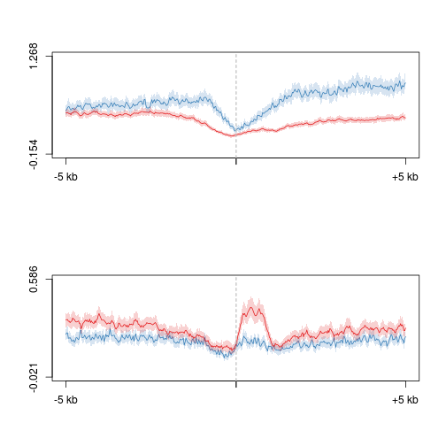
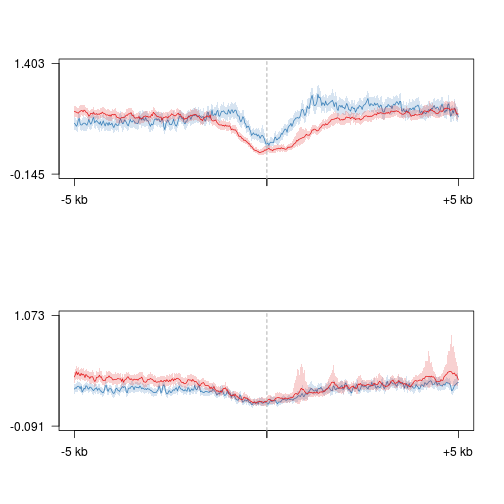
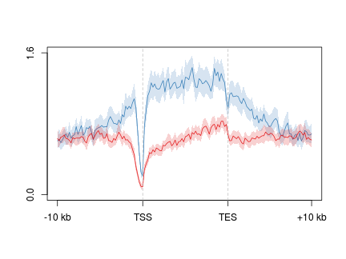
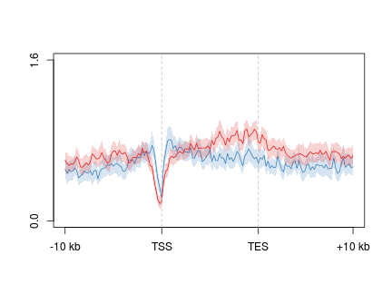
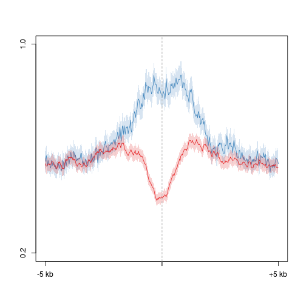
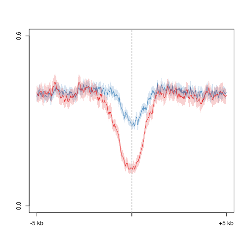

O/Tet3 5hmC/5mC analysis
========================================================

TSS
-------------
Load refgene 5hm5/5mC summary file

```r
suppressPackageStartupMessages(source("~/src/seqAnalysis/R/features.R"))
tt3.tss <- read.delim("~/s2/analysis/features/norm/rpkm/mean/summaries/tt3_min_refgene_-500bpTSS+500bp_chr_sqrt")
tt3.tss$hmc.ott3.omp <- with(tt3.tss, computeScoreRatios(ott3_1_hmc_rpkm, omp_hmc_120424_rpkm))
tt3.tss$mc.ott3.omp <- with(tt3.tss, computeScoreRatios(ott3_1_mc_rpkm, omp_mc_rpkm))
hist(tt3.tss$hmc.ott3.omp, breaks = 500, xlim = c(-0.5, 0.5))
```

 


```r
rna.1log2 <- readRDS("~/s2/analysis/rna/rdata/omp_ott3_rmrna_1log2.rds")
tt3.tss$rna.ott3.omp <- rna.1log2[match(rownames(tt3.tss), rownames(rna.1log2)), 
    3]
tt3.tss <- na.omit(tt3.tss)
cor(tt3.tss[, "hmc.ott3.omp"], tt3.tss[, "rna.ott3.omp"], method = "pe")
```

```
## [1] -0.01731
```

```r
cor.test(tt3.tss[, "hmc.ott3.omp"], tt3.tss[, "rna.ott3.omp"], method = "pe")$p.value
```

```
## [1] 0.01234
```


### Profiles

```r
suppressPackageStartupMessages(source("~/src/seqAnalysis/R/profiles2.R"))
makeProfile2.allSamp("refGene_noRandom_order_outsides2_tss_W25F200_ott3_omp_rmrna_bf_ge20_chr", 
    data_type = "rpkm/mean")
```

```
## [1] "/media/storage2/analysis/profiles/norm/rpkm/mean/refGene_noRandom_order_outsides2_tss_W25F200_ott3_omp_rmrna_bf_ge20_chr"
## Note: next may be used in wrong context: no loop is visible
```

```
## Error: task 1 failed - "no loop for break/next, jumping to top level"
```

```r
makeProfile2.allSamp("refGene_noRandom_order_outsides2_tss_W25F200_ott3_omp_rmrna_bf_le20_chr", 
    data_type = "rpkm/mean")
```

```
## [1] "/media/storage2/analysis/profiles/norm/rpkm/mean/refGene_noRandom_order_outsides2_tss_W25F200_ott3_omp_rmrna_bf_le20_chr"
## Note: next may be used in wrong context: no loop is visible
```

```
## Error: task 1 failed - "no loop for break/next, jumping to top level"
```


```r
plot2.several("refGene_noRandom_order_outsides2_tss_W25F200_ott3_omp_rmrna_bf_ge20_chr", 
    "tt3_3", data_type = "rpkm/mean", cols = col2, fname = "manual")
```

```
## [1] "omp_hmc_120424_rpkm_mean"
## [1] "ott3_1_hmc_rpkm_mean"
## [1] "omp_mc_rpkm_mean"
## [1] "ott3_1_mc_rpkm_mean"
```

```
## [1] -0.154  1.268
```

```
## [1] -0.021  0.586
```

 

```r
plot2.several("refGene_noRandom_order_outsides2_tss_W25F200_ott3_omp_rmrna_bf_le20_chr", 
    "tt3_3", data_type = "rpkm/mean", cols = col2, fname = "manual")
```

```
## [1] "omp_hmc_120424_rpkm_mean"
## [1] "ott3_1_hmc_rpkm_mean"
## [1] "omp_mc_rpkm_mean"
## [1] "ott3_1_mc_rpkm_mean"
```

```
## [1] -0.145  1.403
```

```
## [1] -0.091  1.073
```

 


### Scatter

```r
gg <- ggplot(tt3.tss, aes(omp_hmc_120424_rpkm, ott3_1_hmc_rpkm))
gg <- gg + geom_point(alpha = I(1/5)) + coord_cartesian(xlim = c(0, 2), ylim = c(0, 
    2))
gg <- gg + geom_abline(slope = 1, intercept = 0, linetype = 2, color = "red")
gg <- gg + xlab(bquote(.("OMP 5hmC" ~ sqrt(bar(RPM))))) + ylab(bquote(.("O/Tet3 5hmC" ~ 
    sqrt(bar(RPM)))))
gg <- gg + theme(axis.text.x = element_text(size = 20, color = "black"), axis.text.y = element_text(size = 20, 
    color = "black"), axis.title.x = element_text(size = 24), axis.title.y = element_text(size = 24))
gg
```

 


Gene body 
-------------

```r
tt3.body <- read.delim("~/s2/analysis/features/norm/rpkm/mean/summaries/tt3_min_refgene_chr_sqrt")
tt3.body$hmc.ott3.omp <- with(tt3.body, computeScoreRatios(ott3_1_hmc_rpkm, 
    omp_hmc_120424_rpkm))
tt3.body$mc.ott3.omp <- with(tt3.body, computeScoreRatios(ott3_1_mc_rpkm, omp_mc_rpkm))
cor(tt3.body)
```

```
##                     omp_hmc_120424_rpkm ott3_1_hmc_rpkm ott3_2_hmc_rpkm
## omp_hmc_120424_rpkm              1.0000          0.6218         0.87704
## ott3_1_hmc_rpkm                  0.6218          1.0000         0.79268
## ott3_2_hmc_rpkm                  0.8770          0.7927         1.00000
## omp_mc_rpkm                      0.5846          0.7506         0.68899
## ott3_1_mc_rpkm                   0.2361          0.5944         0.41538
## ott3_2_mc_rpkm                   0.5209          0.7953         0.70086
## hmc.ott3.omp                    -0.4055          0.3937        -0.07381
## mc.ott3.omp                     -0.1902          0.1235        -0.02686
##                     omp_mc_rpkm ott3_1_mc_rpkm ott3_2_mc_rpkm hmc.ott3.omp
## omp_hmc_120424_rpkm      0.5846         0.2361         0.5209     -0.40553
## ott3_1_hmc_rpkm          0.7506         0.5944         0.7953      0.39371
## ott3_2_hmc_rpkm          0.6890         0.4154         0.7009     -0.07381
## omp_mc_rpkm              1.0000         0.7452         0.8789      0.17654
## ott3_1_mc_rpkm           0.7452         1.0000         0.8478      0.38770
## ott3_2_mc_rpkm           0.8789         0.8478         1.0000      0.30016
## hmc.ott3.omp             0.1765         0.3877         0.3002      1.00000
## mc.ott3.omp              0.1866         0.7276         0.4150      0.38193
##                     mc.ott3.omp
## omp_hmc_120424_rpkm    -0.19017
## ott3_1_hmc_rpkm         0.12352
## ott3_2_hmc_rpkm        -0.02686
## omp_mc_rpkm             0.18659
## ott3_1_mc_rpkm          0.72759
## ott3_2_mc_rpkm          0.41497
## hmc.ott3.omp            0.38193
## mc.ott3.omp             1.00000
```

```r
hist(tt3.body$hmc.ott3.omp, breaks = 1000, xlim = c(-0.5, 0.5))
```

 


Combine with RNA data

```r
m <- match(rownames(tt3.body), rownames(rna.1log2))
tt3.body$rna.ott3.omp <- rna.1log2[m, 3]
tt3.body$rna.omp <- rna.1log2[m, 1]
tt3.body$rna.ott3 <- rna.1log2[m, 2]
tt3.body <- na.omit(tt3.body)
cor(tt3.body)
```

```
##                     omp_hmc_120424_rpkm ott3_1_hmc_rpkm ott3_2_hmc_rpkm
## omp_hmc_120424_rpkm             1.00000         0.61811         0.87977
## ott3_1_hmc_rpkm                 0.61811         1.00000         0.79026
## ott3_2_hmc_rpkm                 0.87977         0.79026         1.00000
## omp_mc_rpkm                     0.58860         0.76045         0.68580
## ott3_1_mc_rpkm                  0.22631         0.60090         0.39893
## ott3_2_mc_rpkm                  0.52319         0.80552         0.69786
## hmc.ott3.omp                   -0.40758         0.39525        -0.07881
## mc.ott3.omp                    -0.22295         0.10457        -0.07018
## rna.ott3.omp                    0.02389         0.14765         0.06472
## rna.omp                         0.34708         0.08994         0.28049
## rna.ott3                        0.33791         0.14660         0.29203
##                     omp_mc_rpkm ott3_1_mc_rpkm ott3_2_mc_rpkm hmc.ott3.omp
## omp_hmc_120424_rpkm     0.58860         0.2263        0.52319     -0.40758
## ott3_1_hmc_rpkm         0.76045         0.6009        0.80552      0.39525
## ott3_2_hmc_rpkm         0.68580         0.3989        0.69786     -0.07881
## omp_mc_rpkm             1.00000         0.7238        0.87161      0.18250
## ott3_1_mc_rpkm          0.72384         1.0000        0.83622      0.40407
## ott3_2_mc_rpkm          0.87161         0.8362        1.00000      0.30775
## hmc.ott3.omp            0.18250         0.4041        0.30775      1.00000
## mc.ott3.omp             0.11299         0.6992        0.36401      0.39891
## rna.ott3.omp            0.03948        -0.0276        0.04933      0.12021
## rna.omp                -0.04285        -0.2758       -0.08004     -0.26419
## rna.ott3               -0.02400        -0.2721       -0.05503     -0.19944
##                     mc.ott3.omp rna.ott3.omp  rna.omp rna.ott3
## omp_hmc_120424_rpkm    -0.22295      0.02389  0.34708  0.33791
## ott3_1_hmc_rpkm         0.10457      0.14765  0.08994  0.14660
## ott3_2_hmc_rpkm        -0.07018      0.06472  0.28049  0.29203
## omp_mc_rpkm             0.11299      0.03948 -0.04285 -0.02400
## ott3_1_mc_rpkm          0.69922     -0.02760 -0.27582 -0.27212
## ott3_2_mc_rpkm          0.36401      0.04933 -0.08004 -0.05503
## hmc.ott3.omp            0.39891      0.12021 -0.26419 -0.19944
## mc.ott3.omp             1.00000     -0.08285 -0.33380 -0.34997
## rna.ott3.omp           -0.08285      1.00000 -0.08486  0.33724
## rna.omp                -0.33380     -0.08486  1.00000  0.90941
## rna.ott3               -0.34997      0.33724  0.90941  1.00000
```

```r
cor(tt3.body[, "hmc.ott3.omp"], tt3.body[, "rna.ott3.omp"], method = "pe")
```

```
## [1] 0.1202
```

```r
cor.test(tt3.body[, "hmc.ott3.omp"], tt3.body[, "rna.ott3.omp"], method = "pe")$p.value
```

```
## [1] 0
```


```r
gg <- ggplot(tt3.body, aes(hmc.ott3.omp, rna.ott3.omp))
gg <- gg + geom_point(alpha = I(1/10)) + coord_cartesian(xlim = c(-0.5, 0.5), 
    ylim = c(-5, 5)) + xlab("OTT3 / OMP 5hmC ratio") + ylab("OTT3 / OMP RNA ratio")
gg + stat_smooth(method = "lm", fullrange = F) + annotate("text", x = 1.5, y = 4, 
    label = "Pearson R = 0.13")
```

 


### Scatter

```r
gg <- ggplot(tt3.body, aes(omp_hmc_120424_rpkm, ott3_1_hmc_rpkm))
gg <- gg + geom_point(alpha = I(1/5)) + coord_cartesian(xlim = c(0, 2), ylim = c(0, 
    2))
gg <- gg + geom_abline(slope = 1, intercept = 0, linetype = 2, color = "red")
gg <- gg + xlab(bquote(.("Control 5hmC" ~ sqrt(bar(RPM))))) + ylab(bquote(.("Tet3-tg 5hmC" ~ 
    sqrt(bar(RPM)))))
gg <- gg + theme(axis.text.x = element_text(size = 20, color = "black"), axis.text.y = element_text(size = 20, 
    color = "black"), axis.title.x = element_text(size = 24), axis.title.y = element_text(size = 24))
gg
```

 


```r
gg <- ggplot(tt3.body, aes(omp_hmc_120424_rpkm, mc.ott3.omp))
gg <- gg + geom_point(alpha = I(1/5)) + coord_cartesian(xlim = c(0, 2), ylim = c(-0.5, 
    0.5))
gg <- gg + geom_abline(slope = 1, intercept = 0, linetype = 2, color = "red")
gg <- gg + xlab(bquote(.("OMP 5hmC" ~ sqrt(bar(RPM))))) + ylab(bquote(.("O/Tet3 5mC" ~ 
    sqrt(bar(RPM)))))
gg <- gg + theme(axis.text.x = element_text(size = 20, color = "black"), axis.text.y = element_text(size = 20, 
    color = "black"), axis.title.x = element_text(size = 24), axis.title.y = element_text(size = 24))
gg
```

 

### Features


```r
bf.ge20 <- read.delim("~/s2/analysis/rna/summaries/omp_ott3_rmrna_bf_ge20.txt", 
    header = F)
tt3.body.ge20 <- tt3.body[rownames(tt3.body) %in% bf.ge20[, 1], ]
apply(tt3.body.ge20[, 1:2], 2, mean)
```

```
## omp_hmc_120424_rpkm     ott3_1_hmc_rpkm 
##              0.7620              0.5772
```

```r
apply(tt3.body.ge20[, 1:2], 2, sd)
```

```
## omp_hmc_120424_rpkm     ott3_1_hmc_rpkm 
##              0.4709              0.3099
```

```r
with(tt3.body.ge20, wilcox.test(omp_hmc_120424_rpkm, ott3_1_hmc_rpkm))$p.value
```

```
## [1] 0.000000000000000005746
```

```r

bf.le20 <- read.delim("~/s2/analysis/rna/summaries/omp_ott3_rmrna_bf_le20.txt", 
    header = F)
tt3.body.le20 <- tt3.body[rownames(tt3.body) %in% bf.le20[, 1], ]
apply(tt3.body.le20[, 1:2], 2, mean)
```

```
## omp_hmc_120424_rpkm     ott3_1_hmc_rpkm 
##              0.7828              0.7688
```

```r
apply(tt3.body.le20[, 1:2], 2, sd)
```

```
## omp_hmc_120424_rpkm     ott3_1_hmc_rpkm 
##              0.2856              0.2729
```

```r
with(tt3.body.le20, wilcox.test(omp_hmc_120424_rpkm, ott3_1_hmc_rpkm))$p.value
```

```
## [1] 0.9584
```


### Profiles

```r
suppressPackageStartupMessages(source("~/src/seqAnalysis/R/profiles2.R"))
makeProfile2.allSamp("gene_whole_W200N50F50_ott3_omp_rmrna_bf_ge20_chr", data_type = "rpkm/mean")
```

```
## [1] "/media/storage2/analysis/profiles/norm/rpkm/mean/gene_whole_W200N50F50_ott3_omp_rmrna_bf_ge20_chr"
## Note: next may be used in wrong context: no loop is visible
```

```
## Error: task 1 failed - "no loop for break/next, jumping to top level"
```

```r
makeProfile2.allSamp("gene_whole_W200N50F50_ott3_omp_rmrna_bf_le20_chr", data_type = "rpkm/mean")
```

```
## [1] "/media/storage2/analysis/profiles/norm/rpkm/mean/gene_whole_W200N50F50_ott3_omp_rmrna_bf_le20_chr"
## Note: next may be used in wrong context: no loop is visible
```

```
## Error: task 1 failed - "no loop for break/next, jumping to top level"
```


```r
plot2.several("gene_whole_W200N50F50_ott3_omp_rmrna_bf_ge20_chr", "tt3_3_hmc", 
    data_type = "rpkm/mean", cols = col2, fname = "manual", wsize = 200, lab = c("TSS", 
        "TES"), y.vals = c(0, 1.6))
```

```
## [1] "omp_hmc_120424_rpkm_mean"
## [1] "ott3_1_hmc_rpkm_mean"
```

```
## [1] 0.0 1.6
```

 


```r
plot2.several("gene_whole_W200N50F50_ott3_omp_rmrna_bf_le20_chr", "tt3_3_hmc", 
    data_type = "rpkm/mean", cols = col2, fname = "manual", wsize = 200, lab = c("TSS", 
        "TES"), y.vals = c(0, 1.6))
```

```
## [1] "omp_hmc_120424_rpkm_mean"
## [1] "ott3_1_hmc_rpkm_mean"
```

```
## [1] 0.0 1.6
```

 


### Quantiles

```r
tt3.body.omp.q90 <- tt3.body[tt3.body[, 1] >= quantile(tt3.body[, 1], 0.9), 
    ]
summary(tt3.body.omp.q90)
```

```
##  omp_hmc_120424_rpkm ott3_1_hmc_rpkm ott3_2_hmc_rpkm  omp_mc_rpkm   
##  Min.   :1.15        Min.   :0.000   Min.   :0.00    Min.   :0.000  
##  1st Qu.:1.20        1st Qu.:0.672   1st Qu.:1.06    1st Qu.:0.569  
##  Median :1.27        Median :0.808   Median :1.15    Median :0.648  
##  Mean   :1.32        Mean   :0.836   Mean   :1.17    Mean   :0.655  
##  3rd Qu.:1.39        3rd Qu.:0.986   3rd Qu.:1.26    3rd Qu.:0.735  
##  Max.   :2.50        Max.   :2.615   Max.   :2.23    Max.   :2.539  
##  ott3_1_mc_rpkm  ott3_2_mc_rpkm   hmc.ott3.omp     mc.ott3.omp     
##  Min.   :0.000   Min.   :0.000   Min.   :-0.556   Min.   :-0.2602  
##  1st Qu.:0.468   1st Qu.:0.679   1st Qu.:-0.221   1st Qu.:-0.0422  
##  Median :0.549   Median :0.814   Median :-0.182   Median :-0.0264  
##  Mean   :0.581   Mean   :0.824   Mean   :-0.167   Mean   :-0.0151  
##  3rd Qu.:0.661   3rd Qu.:0.960   3rd Qu.:-0.126   3rd Qu.:-0.0075  
##  Max.   :3.611   Max.   :3.126   Max.   : 0.840   Max.   : 2.6322  
##   rna.ott3.omp       rna.omp         rna.ott3    
##  Min.   :-3.963   Min.   :0.000   Min.   : 0.00  
##  1st Qu.:-0.639   1st Qu.:0.773   1st Qu.: 0.71  
##  Median :-0.045   Median :2.201   Median : 2.03  
##  Mean   :-0.167   Mean   :2.362   Mean   : 2.19  
##  3rd Qu.: 0.278   3rd Qu.:3.566   3rd Qu.: 3.31  
##  Max.   : 6.548   Max.   :9.556   Max.   :11.14
```

```r
apply(tt3.body.omp.q90, 2, mean)
```

```
## omp_hmc_120424_rpkm     ott3_1_hmc_rpkm     ott3_2_hmc_rpkm 
##             1.31732             0.83637             1.17354 
##         omp_mc_rpkm      ott3_1_mc_rpkm      ott3_2_mc_rpkm 
##             0.65464             0.58056             0.82420 
##        hmc.ott3.omp         mc.ott3.omp        rna.ott3.omp 
##            -0.16723            -0.01508            -0.16732 
##             rna.omp            rna.ott3 
##             2.36221             2.19490
```

```r
apply(tt3.body.omp.q90, 2, sd)
```

```
## omp_hmc_120424_rpkm     ott3_1_hmc_rpkm     ott3_2_hmc_rpkm 
##             0.15986             0.24283             0.18662 
##         omp_mc_rpkm      ott3_1_mc_rpkm      ott3_2_mc_rpkm 
##             0.16026             0.21970             0.24377 
##        hmc.ott3.omp         mc.ott3.omp        rna.ott3.omp 
##             0.09363             0.09181             0.88810 
##             rna.omp            rna.ott3 
##             1.81896             1.71857
```

```r
with(tt3.body.omp.q90, wilcox.test(omp_hmc_120424_rpkm, ott3_1_hmc_rpkm))$p.value
```

```
## [1] 0
```


```r
tt3.body.omp.q50 <- tt3.body[tt3.body[, 1] >= quantile(tt3.body[, 1], 0.45) & 
    tt3.body[, 1] <= quantile(tt3.body[, 1], 0.55), ]
summary(tt3.body.omp.q50)
```

```
##  omp_hmc_120424_rpkm ott3_1_hmc_rpkm ott3_2_hmc_rpkm  omp_mc_rpkm   
##  Min.   :0.694       Min.   :0.000   Min.   :0.000   Min.   :0.000  
##  1st Qu.:0.710       1st Qu.:0.741   1st Qu.:0.704   1st Qu.:0.493  
##  Median :0.730       Median :0.840   Median :0.760   Median :0.581  
##  Mean   :0.729       Mean   :0.845   Mean   :0.763   Mean   :0.572  
##  3rd Qu.:0.749       3rd Qu.:0.954   3rd Qu.:0.827   3rd Qu.:0.649  
##  Max.   :0.769       Max.   :2.029   Max.   :1.618   Max.   :2.066  
##  ott3_1_mc_rpkm  ott3_2_mc_rpkm   hmc.ott3.omp      mc.ott3.omp     
##  Min.   :0.000   Min.   :0.000   Min.   :-0.0934   Min.   :-0.2149  
##  1st Qu.:0.512   1st Qu.:0.624   1st Qu.: 0.0054   1st Qu.: 0.0056  
##  Median :0.667   Median :0.754   Median : 0.0516   Median : 0.0315  
##  Mean   :0.681   Mean   :0.749   Mean   : 0.0745   Mean   : 0.0627  
##  3rd Qu.:0.833   3rd Qu.:0.868   3rd Qu.: 0.1151   3rd Qu.: 0.0975  
##  Max.   :2.492   Max.   :2.113   Max.   : 1.1791   Max.   : 3.1158  
##   rna.ott3.omp       rna.omp         rna.ott3    
##  Min.   :-5.714   Min.   :0.000   Min.   :0.000  
##  1st Qu.:-0.032   1st Qu.:0.022   1st Qu.:0.017  
##  Median : 0.024   Median :0.822   Median :1.160  
##  Mean   : 0.201   Mean   :1.484   Mean   :1.685  
##  3rd Qu.: 0.469   3rd Qu.:2.678   3rd Qu.:3.063  
##  Max.   : 4.436   Max.   :9.646   Max.   :8.954
```

```r
apply(tt3.body.omp.q50, 2, mean)
```

```
## omp_hmc_120424_rpkm     ott3_1_hmc_rpkm     ott3_2_hmc_rpkm 
##             0.72943             0.84498             0.76288 
##         omp_mc_rpkm      ott3_1_mc_rpkm      ott3_2_mc_rpkm 
##             0.57174             0.68119             0.74930 
##        hmc.ott3.omp         mc.ott3.omp        rna.ott3.omp 
##             0.07448             0.06272             0.20068 
##             rna.omp            rna.ott3 
##             1.48397             1.68465
```

```r
apply(tt3.body.omp.q50, 2, sd)
```

```
## omp_hmc_120424_rpkm     ott3_1_hmc_rpkm     ott3_2_hmc_rpkm 
##             0.02244             0.21594             0.14343 
##         omp_mc_rpkm      ott3_1_mc_rpkm      ott3_2_mc_rpkm 
##             0.16454             0.25741             0.23463 
##        hmc.ott3.omp         mc.ott3.omp        rna.ott3.omp 
##             0.11555             0.11749             0.64304 
##             rna.omp            rna.ott3 
##             1.64612             1.76504
```

```r
with(tt3.body.omp.q50, wilcox.test(omp_hmc_120424_rpkm, ott3_1_hmc_rpkm))$p.value
```

```
## [1] 1.656e-190
```


Enhancers
-------------------

```r
plot2.several("phastCons30way_intergenic_sorted_merge500_thresh500_inter_omp_h3k4me1_gc_sub_refgene_extend5kb.bed_W25F200_both_chr", 
    "tt3_3_hmc", data_type = "rpkm/mean", fname = "manual", cols = col2, y.vals = c(0.2, 
        1))
```

```
## [1] "omp_hmc_120424_rpkm_mean"
## [1] "ott3_1_hmc_rpkm_mean"
```

```
## [1] 0.2 1.0
```

 


```r
plot2.several("phastCons30way_intergenic_sorted_merge500_thresh500_inter_omp_h3k4me1_gc_sub_refgene_extend5kb.bed_W25F200_both_chr", 
    "tt3_3_mc", data_type = "rpkm/mean", fname = "manual", cols = col2, baseline = T, 
    y.vals = c(0, 0.6))
```

```
## [1] "omp_mc_rpkm_mean"
## [1] "ott3_1_mc_rpkm_mean"
```

```
## [1] 0.0 0.6
```

 

