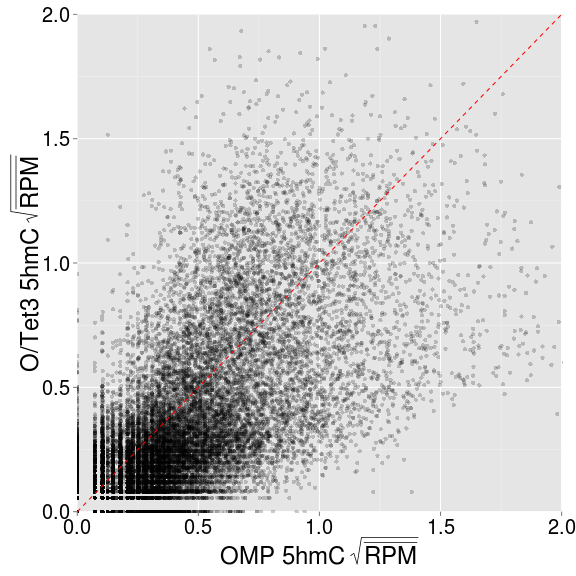
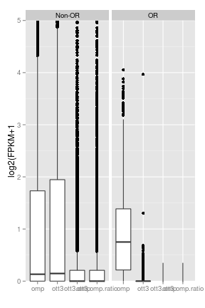
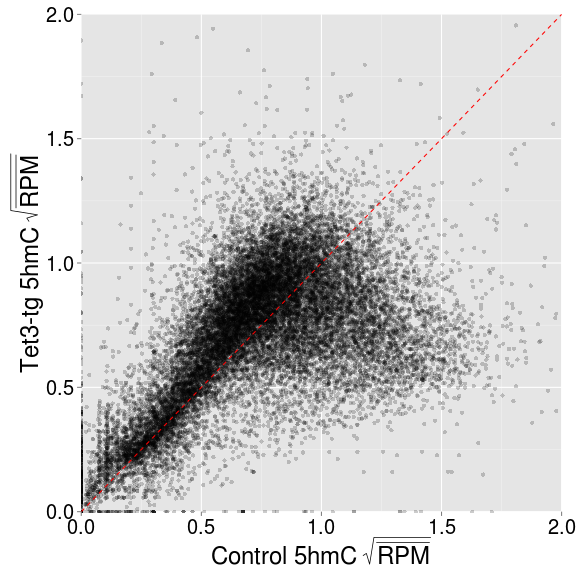

O/Tet3 5hmC/5mC analysis - replicates 
========================================================

TSS
-------------
Load refgene 5hm5/5mC summary file

```r
suppressPackageStartupMessages(source("~/src/seqAnalysis/R/features.R"))
tt3.tss <- read.delim("~/s2/analysis/features/norm/rpkm_rep/mean/summaries/tt3_rep_refgene_-500bpTSS+500bp_chr_sqrt")
tt3.tss$hmc.ott3.omp <- with(tt3.tss, computeScoreRatios(ott3_hmc, omp_hmc))
hist(tt3.tss$hmc.ott3.omp, breaks = 500, xlim = c(-0.5, 0.5))
```

 


```r
rna.1log2 <- readRDS(file = "~/s2/analysis/rna/rdata/omp_ott3_rmrna_rep12_masked_comp_js_1log2.rds")
tt3.tss$rna.ott3.omp <- rna.1log2[match(rownames(tt3.tss), rownames(rna.1log2)), 
    3]
tt3.tss <- na.omit(tt3.tss)
cor(tt3.tss[, "hmc.ott3.omp"], tt3.tss[, "rna.ott3.omp"], method = "pe")
```

```
## [1] -0.03557
```

```r
cor.test(tt3.tss[, "hmc.ott3.omp"], tt3.tss[, "rna.ott3.omp"], method = "pe")$p.value
```

```
## [1] 0.00000027
```


### Profiles

```r
suppressPackageStartupMessages(source("~/src/seqAnalysis/R/profiles2.R"))
makeProfile2.allSamp("refGene_noRandom_order_outsides2_tss_W25F200_ott3_omp_rmrna_bf_ge20_chr", 
    data_type = "rpkm_rep_rep/mean")
```

```
## [1] "/media/storage2/analysis/profiles/norm/rpkm_rep_rep/mean/refGene_noRandom_order_outsides2_tss_W25F200_ott3_omp_rmrna_bf_ge20_chr"
## Note: next may be used in wrong context: no loop is visible
```

```r
makeProfile2.allSamp("refGene_noRandom_order_outsides2_tss_W25F200_ott3_omp_rmrna_bf_le20_chr", 
    data_type = "rpkm_rep_rep/mean")
```

```
## [1] "/media/storage2/analysis/profiles/norm/rpkm_rep_rep/mean/refGene_noRandom_order_outsides2_tss_W25F200_ott3_omp_rmrna_bf_le20_chr"
## Note: next may be used in wrong context: no loop is visible
```


```r
plot2.several("refGene_noRandom_order_outsides2_tss_W25F200_ott3_omp_rmrna_bf_ge20_chr", 
    "tt3_3", data_type = "rpkm_rep_rep/mean", cols = col2, fname = "manual")
```

```
## Error: Annotation file not found
```

```r
plot2.several("refGene_noRandom_order_outsides2_tss_W25F200_ott3_omp_rmrna_bf_le20_chr", 
    "tt3_3", data_type = "rpkm_rep/mean", cols = col2, fname = "manual")
```

```
## Error: Annotation file not found
```


### Scatter

```r
gg <- ggplot(tt3.tss, aes(omp_hmc, ott3_hmc))
gg <- gg + geom_point(alpha = I(1/5)) + coord_cartesian(xlim = c(0, 2), ylim = c(0, 
    2))
gg <- gg + geom_abline(slope = 1, intercept = 0, linetype = 2, color = "red")
gg <- gg + xlab(bquote(.("OMP 5hmC" ~ sqrt(bar(RPM))))) + ylab(bquote(.("O/Tet3 5hmC" ~ 
    sqrt(bar(RPM)))))
gg <- gg + theme(axis.text.x = element_text(size = 20, color = "black"), axis.text.y = element_text(size = 20, 
    color = "black"), axis.title.x = element_text(size = 24), axis.title.y = element_text(size = 24))
gg
```

 


Gene body 
-------------

```r
tt3.body <- read.delim("~/s2/analysis/features/norm/rpkm_rep/mean/summaries/tt3_rep_refgene_chr_sqrt")
tt3.body$hmc.ott3.omp <- with(tt3.body, computeScoreRatios(ott3_hmc, omp_hmc))
cor(tt3.body)
```

```
##              omp_hmc ott3_hmc hmc.ott3.omp
## omp_hmc       1.0000   0.5794      -0.5136
## ott3_hmc      0.5794   1.0000       0.3411
## hmc.ott3.omp -0.5136   0.3411       1.0000
```

```r
hist(tt3.body$hmc.ott3.omp, breaks = 1000, xlim = c(-0.5, 0.5))
```

 


Combine with RNA data

```r
m <- match(rownames(tt3.body), rownames(rna.1log2))
tt3.body$rna.ott3.omp <- rna.1log2[m, 3]
tt3.body$rna.omp <- rna.1log2[m, 1]
tt3.body$rna.ott3 <- rna.1log2[m, 2]
tt3.body <- na.omit(tt3.body)
cor(tt3.body)
```

```
##               omp_hmc ott3_hmc hmc.ott3.omp rna.ott3.omp  rna.omp rna.ott3
## omp_hmc       1.00000  0.57487     -0.52079      0.09701  0.42139   0.4648
## ott3_hmc      0.57487  1.00000      0.33838      0.19045  0.06211   0.1432
## hmc.ott3.omp -0.52079  0.33838      1.00000      0.07914 -0.38670  -0.3552
## rna.ott3.omp  0.09701  0.19045      0.07914      1.00000 -0.22356   0.1995
## rna.omp       0.42139  0.06211     -0.38670     -0.22356  1.00000   0.9105
## rna.ott3      0.46480  0.14324     -0.35520      0.19949  0.91050   1.0000
```

```r
cor(tt3.body[, "hmc.ott3.omp"], tt3.body[, "rna.ott3.omp"], method = "pe")
```

```
## [1] 0.07914
```

```r
cor.test(tt3.body[, "hmc.ott3.omp"], tt3.body[, "rna.ott3.omp"], method = "pe")$p.value
```

```
## [1] 0
```


```r
gg <- ggplot(tt3.body, aes(hmc.ott3.omp, rna.ott3.omp))
gg <- gg + geom_point(alpha = I(1/10)) + coord_cartesian(xlim = c(-0.5, 0.5), 
    ylim = c(-5, 5)) + xlab("OTT3 / OMP 5hmC ratio") + ylab("OTT3 / OMP RNA ratio")
gg + stat_smooth(method = "lm", fullrange = F) + annotate("text", x = 1.5, y = 4, 
    label = "Pearson R = 0.13")
```

 


### Scatter

```r
gg <- ggplot(tt3.body, aes(omp_hmc, ott3_hmc))
gg <- gg + geom_point(alpha = I(1/5)) + coord_cartesian(xlim = c(0, 2), ylim = c(0, 
    2))
gg <- gg + geom_abline(slope = 1, intercept = 0, linetype = 2, color = "red")
gg <- gg + xlab(bquote(.("Control 5hmC" ~ sqrt(bar(RPM))))) + ylab(bquote(.("Tet3-tg 5hmC" ~ 
    sqrt(bar(RPM)))))
gg <- gg + theme(axis.text.x = element_text(size = 20, color = "black"), axis.text.y = element_text(size = 20, 
    color = "black"), axis.title.x = element_text(size = 24), axis.title.y = element_text(size = 24))
gg
```

 


