Omp-tTA X tetO-Tet3 ribominus-RNA analysis
========================================================

Extract FPKM values from Cuffdiff output
```
cd <- read.delim("~/s2/data/rna/cuffdiff/omp_ott3_rmrna/gene_exp.diff")
rna <- cd[,c("value_1", "value_2")]
```

Average entries with common gene names
```
library(plyr)
rna[,3] <- cd$gene
colnames(rna) <- c("omp", "ott3", "gene")
rna.s <- ddply(rna, .(gene), summarize, omp=mean(omp), ott3=mean(ott3), .progress="text")
rownames(rna.s) <- rna.s$gene
rna.s <- rna.s[,c(2,3)]
rna.1log2 <- colwise(function(x) log2(x+1))(rna.s)
rownames(rna.1log2) <- rownames(rna.s)
rna.1log2$ott3.omp <- with(rna.1log2, ott3-omp)
saveRDS(rna.1log2, file="~/s2/analysis/rna/rdata/omp_ott3_rmrna_1log2.rds")
```

Above prep performed with repeat masked, upper quartile compatible normed
```
cd3 <- read.delim("~/s2/data/rna/cuffdiff/omp_ott3_rmrna_masked_uq_comp_js/gene_exp.diff")
```

Slight reduction in the FPKM of more lowly transcribed genes

```r
rna.1log2 <- readRDS("~/s2/analysis/rna/rdata/omp_ott3_rmrna_masked_uq_1log2.rds")
rownames(rna.1log2) <- rna.1log2[, 1]
rna.1log2 <- rna.1log2[, 2:4]
# rna4 <- data.frame(omp1=rna.1log2$omp, ott31=rna.1log2$ott3,
# omp3=rna3.1log2$omp[match(rna.1log2$id, rna3.1log2$gene)],
# ott33=rna3.1log2$ott3[match(rna.1log2$id, rna3.1log2$gene)]) gg <-
# ggplot(rna4, aes(omp1, omp3)) gg + geom_point(alpha=I(1/5)) gg <-
# ggplot(rna4, aes(ott31, ott33)) gg + geom_point(alpha=I(1/5))
```


```r
# rna.1log2 <-readRDS('~/s2/analysis/rna/rdata/omp_ott3_rmrna_1log2.rds')
# par(mfrow=c(1,3)) a <- apply(rna.1log2, 2, function(x) plot(density(x)))

# cor(rna.1log2)
```


Scatter OMP and O/TT3 log2(FPKM+1).

```r
library(ggplot2)
gg <- ggplot(rna.1log2, aes(omp, ott3))
gg + geom_point(alpha = I(1/10)) + geom_abline(slope = 1, intercept = 0, linetype = 2)
```

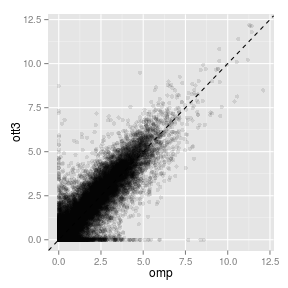 


Import DNA modification levels, calculated from 2 to 7 kb downstream of TSS.

```r
dna <- readRDS("~/s2/analysis/features/norm/rpkm/mean/rdata/tt3_min_refgene_nodup_TSS2to7kb_hmc_mc_scores_rm_outliers_clean.rds")
```


Combine with RNA data

```r
comb <- dna
comb$rmrna.omp <- rna.1log2[match(rownames(comb), rownames(rna.1log2)), 1]
comb$rmrna.tt3 <- rna.1log2[match(rownames(comb), rownames(rna.1log2)), 2]
comb <- na.omit(comb)
dim(comb)
```

```
## [1] 11288     6
```


Pearson and Spearman correlations

```r
cor(comb)
```

```
##           hmc.omp  hmc.tt3  mc.omp   mc.tt3 rmrna.omp rmrna.tt3
## hmc.omp   1.00000  0.16106  0.3857  0.03544    0.2070   0.17774
## hmc.tt3   0.16106  1.00000  0.7939  0.75604   -0.1919  -0.05661
## mc.omp    0.38573  0.79391  1.0000  0.71232   -0.2071  -0.10648
## mc.tt3    0.03544  0.75604  0.7123  1.00000   -0.3119  -0.25826
## rmrna.omp 0.20703 -0.19191 -0.2071 -0.31192    1.0000   0.85265
## rmrna.tt3 0.17774 -0.05661 -0.1065 -0.25826    0.8526   1.00000
```

```r
cor(comb, method = "spearman")
```

```
##           hmc.omp  hmc.tt3   mc.omp   mc.tt3 rmrna.omp rmrna.tt3
## hmc.omp   1.00000  0.26713  0.45458  0.08064    0.2422   0.23001
## hmc.tt3   0.26713  1.00000  0.79555  0.73843   -0.1611  -0.01484
## mc.omp    0.45458  0.79555  1.00000  0.73527   -0.1942  -0.08802
## mc.tt3    0.08064  0.73843  0.73527  1.00000   -0.3377  -0.27132
## rmrna.omp 0.24217 -0.16110 -0.19417 -0.33769    1.0000   0.84733
## rmrna.tt3 0.23001 -0.01484 -0.08802 -0.27132    0.8473   1.00000
```


Compute ratio scores

```r
suppressPackageStartupMessages(source("~/src/seqAnalysis/R/features.R"))
comb <- transform(comb, hmc.tt3.omp = computeScoreRatios(hmc.tt3, hmc.omp), 
    mc.tt3.omp = computeScoreRatios(mc.tt3, mc.omp), rmrna.tt3.omp = rmrna.tt3 - 
        rmrna.omp)
cor(comb)
```

```
##                hmc.omp  hmc.tt3    mc.omp   mc.tt3 rmrna.omp rmrna.tt3
## hmc.omp        1.00000  0.16106  0.385726  0.03544    0.2070   0.17774
## hmc.tt3        0.16106  1.00000  0.793906  0.75604   -0.1919  -0.05661
## mc.omp         0.38573  0.79391  1.000000  0.71232   -0.2071  -0.10648
## mc.tt3         0.03544  0.75604  0.712319  1.00000   -0.3119  -0.25826
## rmrna.omp      0.20703 -0.19191 -0.207061 -0.31192    1.0000   0.85265
## rmrna.tt3      0.17774 -0.05661 -0.106481 -0.25826    0.8526   1.00000
## hmc.tt3.omp   -0.54123  0.59270  0.270628  0.53616   -0.2072  -0.11689
## mc.tt3.omp    -0.23257  0.20301 -0.002075  0.63303   -0.1780  -0.19687
## rmrna.tt3.omp -0.02181  0.22580  0.157328  0.05099   -0.1166   0.41953
##               hmc.tt3.omp mc.tt3.omp rmrna.tt3.omp
## hmc.omp           -0.5412  -0.232567      -0.02181
## hmc.tt3            0.5927   0.203011       0.22580
## mc.omp             0.2706  -0.002075       0.15733
## mc.tt3             0.5362   0.633033       0.05099
## rmrna.omp         -0.2072  -0.177987      -0.11657
## rmrna.tt3         -0.1169  -0.196872       0.41953
## hmc.tt3.omp        1.0000   0.392644       0.13775
## mc.tt3.omp         0.3926   1.000000      -0.06500
## rmrna.tt3.omp      0.1378  -0.065005       1.00000
```

```r
cor(comb, method = "spearman")
```

```
##                 hmc.omp  hmc.tt3   mc.omp   mc.tt3 rmrna.omp rmrna.tt3
## hmc.omp        1.000000  0.26713  0.45458  0.08064   0.24217   0.23001
## hmc.tt3        0.267126  1.00000  0.79555  0.73843  -0.16110  -0.01484
## mc.omp         0.454578  0.79555  1.00000  0.73527  -0.19417  -0.08802
## mc.tt3         0.080640  0.73843  0.73527  1.00000  -0.33769  -0.27132
## rmrna.omp      0.242175 -0.16110 -0.19417 -0.33769   1.00000   0.84733
## rmrna.tt3      0.230015 -0.01484 -0.08802 -0.27132   0.84733   1.00000
## hmc.tt3.omp   -0.710933  0.35664  0.07358  0.36808  -0.27478  -0.17844
## mc.tt3.omp    -0.471111 -0.03820 -0.31416  0.30282  -0.18014  -0.21356
## rmrna.tt3.omp  0.002174  0.27067  0.17800  0.07454  -0.04503   0.43840
##               hmc.tt3.omp mc.tt3.omp rmrna.tt3.omp
## hmc.omp          -0.71093    -0.4711      0.002174
## hmc.tt3           0.35664    -0.0382      0.270666
## mc.omp            0.07358    -0.3142      0.178000
## mc.tt3            0.36808     0.3028      0.074543
## rmrna.omp        -0.27478    -0.1801     -0.045031
## rmrna.tt3        -0.17844    -0.2136      0.438403
## hmc.tt3.omp       1.00000     0.4410      0.152033
## mc.tt3.omp        0.44102     1.0000     -0.107964
## rmrna.tt3.omp     0.15203    -0.1080      1.000000
```


Plot rmRNA ratio versus 5hmC score 

```r
gg <- ggplot(comb, aes(hmc.tt3.omp, rmrna.tt3.omp))
gg <- gg + geom_point(alpha = I(1/10)) + coord_cartesian(ylim = c(-5, 5)) + 
    xlab("OTT3 / OMP 5hmC ratio") + ylab("OTT3 / OMP RNA ratio")
gg + stat_smooth(method = "lm") + annotate("text", x = 1.5, y = 4, label = "Pearson R = 0.13")
```

 


Split genes by gain or loss of 5hmC, and plot boxplot of rmRNA ratio
#```{r, fig.width=4, fig.height=6}
#rna.1log2.m$hmc <- "No change"
#rna.1log2.m$hmc[rna.1log2.m$id %in% rownames(comb[comb$hmc.tt3.omp>0.2,])] <- "Increased"
#rna.1log2.m$hmc[rna.1log2.m$id %in% rownames(comb[comb$hmc.tt3.omp<0.2,])] <- "Decreased"
#hmc.levels <- factor(1:3, labels=c("Decreased", "No change", "Increased"))
#rna.1log2.m$hmc <- hmc.levels[match(rna.1log2.m$hmc, as.character(hmc.levels))]
#levels(rna.1log2.m$variable) <- c("OMP", "O/TT3", "O/TT3 vs OMP")
#gg <- ggplot(rna.1log2.m[rna.1log2.m$variable!="O/TT3 vs OMP",], aes(hmc, value, fill=variable))
#gg <- gg + geom_boxplot(outlier.size=0) + coord_cartesian(ylim=c(0,8)) + scale_fill_grey(name="", start=.4, end=.8) + xlab("O/TT3 vs. OMP 5hmC") + #ylab("log2(FPKM + 1)")
#gg

#gg <- ggplot(rna.1log2.m[rna.1log2.m$variable=="O/TT3 vs OMP",], aes(hmc, value, fill=variable))
#gg <- gg + geom_boxplot(outlier.size=0) + coord_cartesian(ylim=c(0,2)) + scale_fill_grey(name="", start=.4, end=.8) + xlab("O/TT3 vs. OMP 5hmC") + #ylab("log2(FPKM + 1)")
#gg
#```

### 5hmC heatmaps 
Load omp, o/tt3 hmc gene position matrices

```r
suppressPackageStartupMessages(source("~/src/seqAnalysis/R/image.R"))
omp.hmc.pos <- makeImage("omp_hmc_120424_rpkm", "gene_whole_W200N50F50_chr", 
    data_type = "rpkm/mean", image = FALSE)
```

```
## [1] "/media/storage2/analysis/profiles/norm/rpkm/mean/gene_whole_W200N50F50_chr/images/omp_hmc_120424_rpkm"
```

```r
ott3.hmc.pos <- makeImage("ott3_1_hmc_rpkm", "gene_whole_W200N50F50_chr", data_type = "rpkm/mean", 
    image = FALSE)
```

```
## [1] "/media/storage2/analysis/profiles/norm/rpkm/mean/gene_whole_W200N50F50_chr/images/ott3_1_hmc_rpkm"
```

```r
ott3.omp.hmc.pos <- ott3.hmc.pos - omp.hmc.pos
```


Principal components analysis on gene body to order

```r
omp.hmc.pos.pc <- prcomp(omp.hmc.pos[, 51:100])
ott3.hmc.pos.pc <- prcomp(ott3.hmc.pos[, 51:100])
omp.hmc.pos.pred <- predict(omp.hmc.pos.pc, omp.hmc.pos[, 51:100])
ott3.hmc.pos.pred <- predict(ott3.hmc.pos.pc, ott3.hmc.pos[, 51:100])

omp.hmc.pos.pc1 <- omp.hmc.pos[match(rownames(omp.hmc.pos.pred[order(omp.hmc.pos.pred[, 
    1]), ]), rownames(omp.hmc.pos)), ]
ott3.hmc.pos.pc1 <- ott3.hmc.pos[match(rownames(ott3.hmc.pos.pred[order(ott3.hmc.pos.pred[, 
    1]), ]), rownames(ott3.hmc.pos)), ]
omp.hmc.pos.ott3.pc1 <- omp.hmc.pos[match(rownames(ott3.hmc.pos.pred[order(ott3.hmc.pos.pred[, 
    1]), ]), rownames(omp.hmc.pos)), ]
ott3.hmc.pos.omp.pc1 <- ott3.hmc.pos[match(rownames(omp.hmc.pos.pred[order(omp.hmc.pos.pred[, 
    1]), ]), rownames(ott3.hmc.pos)), ]

omp.hmc.pos.pc2 <- omp.hmc.pos[match(rownames(omp.hmc.pos.pred[order(omp.hmc.pos.pred[, 
    2]), ]), rownames(omp.hmc.pos)), ]
ott3.hmc.pos.pc2 <- ott3.hmc.pos[match(rownames(ott3.hmc.pos.pred[order(ott3.hmc.pos.pred[, 
    2]), ]), rownames(ott3.hmc.pos)), ]
omp.hmc.pos.ott3.pc2 <- omp.hmc.pos[match(rownames(ott3.hmc.pos.pred[order(ott3.hmc.pos.pred[, 
    2]), ]), rownames(omp.hmc.pos)), ]
ott3.hmc.pos.omp.pc2 <- ott3.hmc.pos[match(rownames(omp.hmc.pos.pred[order(omp.hmc.pos.pred[, 
    2]), ]), rownames(ott3.hmc.pos)), ]
```


Order difference matrix

```r
ott3.omp.hmc.pos.omp.pc1 <- na.omit(ott3.omp.hmc.pos[match(rownames(omp.hmc.pos.pc1), 
    rownames(ott3.omp.hmc.pos)), ])
ott3.omp.hmc.pos.ott3.pc1 <- na.omit(ott3.omp.hmc.pos[match(rownames(ott3.hmc.pos.pc1), 
    rownames(ott3.omp.hmc.pos)), ])
```


Compare orders with RNA

```r
rna.1log2.omp.pc1 <- na.omit(rna.1log2[match(rownames(omp.hmc.pos.pc1), rownames(rna.1log2)), 
    ])
rna.1log2.ott3.pc1 <- na.omit(rna.1log2[match(rownames(ott3.hmc.pos.pc1), rownames(rna.1log2)), 
    ])
```


Group in 100 chunks

```r
source("~/src/seqAnalysis/R/boot.R")
ott3.omp.hmc.pos.omp.pc1.c100 <- foreach(c = isplitRows(ott3.omp.hmc.pos.omp.pc1[, 
    51:100], chunks = 100), .combine = "rbind") %do% mean(c, na.rm = TRUE)
ott3.omp.hmc.pos.omp.pc1.c100 <- as.data.frame(ott3.omp.hmc.pos.omp.pc1.c100)
ott3.omp.hmc.pos.omp.pc1.c100$index <- 100:1
ott3.omp.hmc.pos.ott3.pc1.c100 <- foreach(c = isplitRows(ott3.omp.hmc.pos.ott3.pc1[, 
    51:100], chunks = 100), .combine = "rbind") %do% mean(c, na.rm = TRUE)
ott3.omp.hmc.pos.ott3.pc1.c100 <- as.data.frame(ott3.omp.hmc.pos.ott3.pc1.c100)
ott3.omp.hmc.pos.ott3.pc1.c100$index <- 100:1

rna.1log2.omp.pc1.c100 <- foreach(c = isplitRows(rna.1log2.omp.pc1[, c(1:3)], 
    chunks = 100), .combine = "rbind") %do% apply(c, 2, mean, na.rm = TRUE)
rna.1log2.omp.pc1.c100 <- as.data.frame(rna.1log2.omp.pc1.c100)
rna.1log2.omp.pc1.c100$index <- 100:1
rna.1log2.omp.pc1.c100.boot <- foreach(c = isplitRows(rna.1log2.omp.pc1[, c(1:3)], 
    chunks = 100), .combine = "rbind") %do% apply(c, 2, bootCI)
rna.1log2.omp.pc1.c100 <- cbind(rna.1log2.omp.pc1.c100, rna.1log2.omp.pc1.c100.boot[seq(1, 
    nrow(rna.1log2.omp.pc1.c100.boot), 2), ], rna.1log2.omp.pc1.c100.boot[seq(2, 
    nrow(rna.1log2.omp.pc1.c100.boot), 2), ])
colnames(rna.1log2.omp.pc1.c100)[5:10] <- c("omp.lower", "ott3.lower", "ott3.omp.lower", 
    "omp.upper", "ott3.upper", "ott3.omp.upper")

rna.1log2.ott3.pc1.c100 <- foreach(c = isplitRows(rna.1log2.ott3.pc1[, c(1:3)], 
    chunks = 100), .combine = "rbind") %do% apply(c, 2, mean, na.rm = TRUE)
rna.1log2.ott3.pc1.c100 <- as.data.frame(rna.1log2.ott3.pc1.c100)
rna.1log2.ott3.pc1.c100$index <- 100:1
rna.1log2.ott3.pc1.c100.boot <- foreach(c = isplitRows(rna.1log2.ott3.pc1[, 
    c(1:3)], chunks = 100), .combine = "rbind") %do% apply(c, 2, bootCI)
rna.1log2.ott3.pc1.c100 <- cbind(rna.1log2.ott3.pc1.c100, rna.1log2.ott3.pc1.c100.boot[seq(1, 
    nrow(rna.1log2.ott3.pc1.c100.boot), 2), ], rna.1log2.ott3.pc1.c100.boot[seq(2, 
    nrow(rna.1log2.ott3.pc1.c100.boot), 2), ])
colnames(rna.1log2.ott3.pc1.c100)[5:10] <- c("omp.lower", "ott3.lower", "ott3.omp.lower", 
    "omp.upper", "ott3.upper", "ott3.omp.upper")
```


```r
rna.1log2.omp.pc1.c100$wilcox.FDR <- p.adjust(foreach(c = isplitRows(rna.1log2.omp.pc1[, 
    1:3], chunks = 100), .combine = "rbind") %do% wilcox.test(c[, 3])$p.value, 
    method = "fdr")
rna.1log2.omp.pc1.c100$wilcox.FDR.05 <- cut(rna.1log2.omp.pc1.c100$wilcox.FDR, 
    breaks = c(0, 0.05, 1))
rna.1log2.ott3.pc1.c100$wilcox.FDR <- p.adjust(foreach(c = isplitRows(rna.1log2.ott3.pc1[, 
    1:3], chunks = 100), .combine = "rbind") %do% wilcox.test(c[, 3])$p.value, 
    method = "fdr")
```

```
## Warning: cannot compute exact p-value with zeroes
```

```r
rna.1log2.ott3.pc1.c100$wilcox.FDR.05 <- cut(rna.1log2.ott3.pc1.c100$wilcox.FDR, 
    breaks = c(0, 0.05, 1))
```


#### Plot heatmaps - PC1

```r
MP.heat(omp.hmc.pos.pc1, range = c(0, 1.5), average = 50)
```

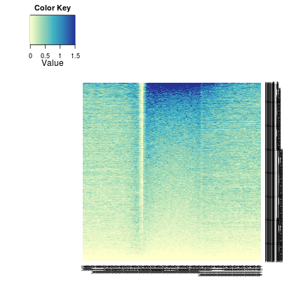 


```r
MP.heat(ott3.hmc.pos.omp.pc1, range = c(0, 1.5), average = 50)
```

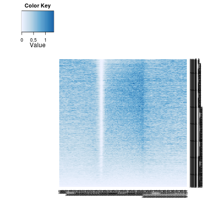 


O/TT3 - OMP gene body 5hmC ordered by OMP 5hmC PC1

```r
gg <- ggplot(ott3.omp.hmc.pos.omp.pc1.c100, aes(V1, index))
gg + geom_point() + xlab("RPM") + ylab("") + theme(axis.text.y = element_blank()) + 
    coord_cartesian(xlim = c(-2, 0.5))
```

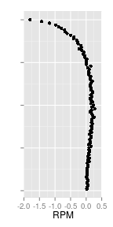 


OMP rmRNA ordered by OMP 5hmC PC1

```r
gg <- ggplot(rna.1log2.omp.pc1.c100, aes(omp, index))
gg + geom_point() + xlab("log2(FPKM + 1)") + ylab("") + theme(axis.text.y = element_blank()) + 
    coord_cartesian(xlim = c(0, 4))
```

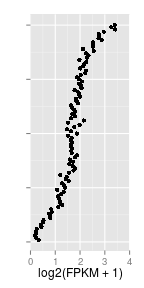 


O/TT3 rmRNA ordered by OMP 5hmC PC1

```r
gg <- ggplot(rna.1log2.omp.pc1.c100, aes(ott3, index))
gg <- gg + geom_point() + xlab("log2(FPKM + 1)") + ylab("") + theme(axis.text.y = element_blank()) + 
    coord_cartesian(xlim = c(0, 4))
gg
```

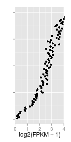 


O/TT3 - OMP rmRNA ratio ordered by OMP 5hmC PC1

```r
theme_set(theme_gray())
gg <- ggplot(rna.1log2.omp.pc1.c100, aes(ott3.omp, index))
gg <- gg + geom_vline(xintercept = 0, color = "red")
gg <- gg + geom_errorbarh(aes(xmin = ott3.omp.lower, xmax = ott3.omp.upper), 
    height = 0, size = 0.1) + geom_point(size = 2) + xlab("log2(FPKM + 1)") + 
    ylab("") + theme(legend.position = "none", axis.text.y = element_blank()) + 
    labs(title = c("O/Tet3-OMP ratio RNA by OMP PC1")) + scale_color_manual(values = c("red", 
    "black"))
gg
```

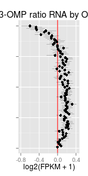 


```r
MP.heat(omp.hmc.pos.ott3.pc1, range = c(0, 1.5), average = 50)
```

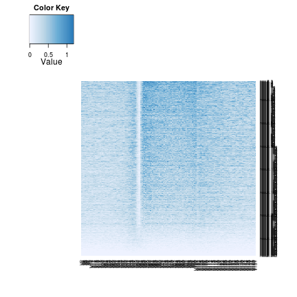 


```r
MP.heat(ott3.hmc.pos.pc1, range = c(0, 1.5), average = 50)
```

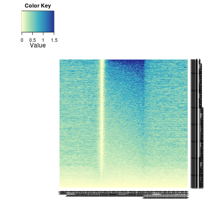 


O/TT3 - OMP gene body 5hmC ordered by O/TT3 5hmC PC1

```r
gg <- ggplot(ott3.omp.hmc.pos.ott3.pc1.c100, aes(V1, index))
gg + geom_point() + xlab("RPM") + ylab("") + theme(axis.text.y = element_blank()) + 
    coord_cartesian(xlim = c(-0.5, 1))
```

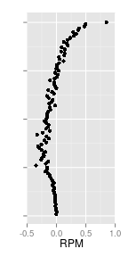 


OMP rmRNA ordered by O/TT3 5hmC PC1

```r
gg <- ggplot(rna.1log2.ott3.pc1.c100, aes(omp, index))
gg + geom_point() + xlab("log2(FPKM + 1)") + ylab("") + theme(axis.text.y = element_blank()) + 
    coord_cartesian(xlim = c(0, 4)) + labs(title = c("OMP RNA by O/Tet3 PC1"))
```

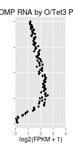 


O/TT3 rmRNA ordered by O/TT3 5hmC PC1

```r
gg <- ggplot(rna.1log2.ott3.pc1.c100, aes(ott3, index))
gg + geom_point() + xlab("log2(FPKM + 1)") + ylab("") + theme(axis.text.y = element_blank()) + 
    coord_cartesian(xlim = c(0, 4)) + labs(title = c("O/Tet3 RNA by O/Tet3 PC1"))
```

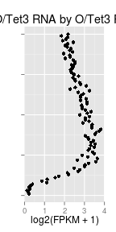 


Plot O/TT3 - OMP rmRNA ratio ordered by O/TT3 5hmC PC1

```r
gg <- ggplot(rna.1log2.ott3.pc1.c100, aes(ott3.omp, index))
gg <- gg + geom_vline(xintercept = 0, color = "red")
gg <- gg + geom_errorbarh(aes(xmin = ott3.omp.lower, xmax = ott3.omp.upper), 
    height = 0, size = 0.1) + geom_point(size = 2) + xlab("log2(FPKM + 1)") + 
    ylab("") + theme(legend.position = "none", axis.text.y = element_blank()) + 
    labs(title = c("O/Tet3-OMP ratio RNA by O/Tet3 PC1")) + scale_color_manual(values = c("red", 
    "black"))
gg
```

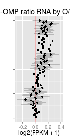 


#### Prep RNA - PC2


```r
rna.1log2.omp.pc2 <- na.omit(rna.1log2[match(rownames(omp.hmc.pos.pc2), rownames(rna.1log2)), 
    ])
rna.1log2.ott3.pc2 <- na.omit(rna.1log2[match(rownames(ott3.hmc.pos.pc2), rownames(rna.1log2)), 
    ])
rna.1log2.omp.pc2.c100 <- foreach(c = isplitRows(rna.1log2.omp.pc2[, c(1:3)], 
    chunks = 100), .combine = "rbind") %do% apply(c, 2, mean, na.rm = TRUE)
rna.1log2.omp.pc2.c100 <- as.data.frame(rna.1log2.omp.pc2.c100)
rna.1log2.omp.pc2.c100$index <- 100:1
rna.1log2.omp.pc2.c100.boot <- foreach(c = isplitRows(rna.1log2.omp.pc2[, c(1:3)], 
    chunks = 100), .combine = "rbind") %do% apply(c, 2, bootCI)
rna.1log2.omp.pc2.c100 <- cbind(rna.1log2.omp.pc2.c100, rna.1log2.omp.pc2.c100.boot[seq(1, 
    nrow(rna.1log2.omp.pc2.c100.boot), 2), ], rna.1log2.omp.pc2.c100.boot[seq(2, 
    nrow(rna.1log2.omp.pc2.c100.boot), 2), ])
colnames(rna.1log2.omp.pc2.c100)[5:10] <- c("omp.lower", "ott3.lower", "ott3.omp.lower", 
    "omp.upper", "ott3.upper", "ott3.omp.upper")

rna.1log2.ott3.pc2.c100 <- foreach(c = isplitRows(rna.1log2.ott3.pc2[, c(1:3)], 
    chunks = 100), .combine = "rbind") %do% apply(c, 2, mean, na.rm = TRUE)
rna.1log2.ott3.pc2.c100 <- as.data.frame(rna.1log2.ott3.pc2.c100)
rna.1log2.ott3.pc2.c100$index <- 100:1
rna.1log2.ott3.pc2.c100.boot <- foreach(c = isplitRows(rna.1log2.ott3.pc2[, 
    c(1:3)], chunks = 100), .combine = "rbind") %do% apply(c, 2, bootCI)
rna.1log2.ott3.pc2.c100 <- cbind(rna.1log2.ott3.pc2.c100, rna.1log2.ott3.pc2.c100.boot[seq(1, 
    nrow(rna.1log2.ott3.pc2.c100.boot), 2), ], rna.1log2.ott3.pc2.c100.boot[seq(2, 
    nrow(rna.1log2.ott3.pc2.c100.boot), 2), ])
colnames(rna.1log2.ott3.pc2.c100)[5:10] <- c("omp.lower", "ott3.lower", "ott3.omp.lower", 
    "omp.upper", "ott3.upper", "ott3.omp.upper")
```


#### Plot heatmaps - PC2


```r
MP.heat(omp.hmc.pos.pc2, range = c(0, 1.5), average = 50)
```

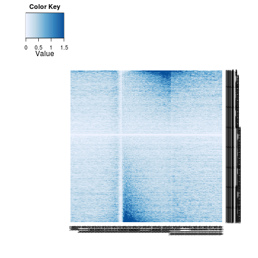 


```r
MP.heat(ott3.hmc.pos.omp.pc2, range = c(0, 1.5), average = 50)
```

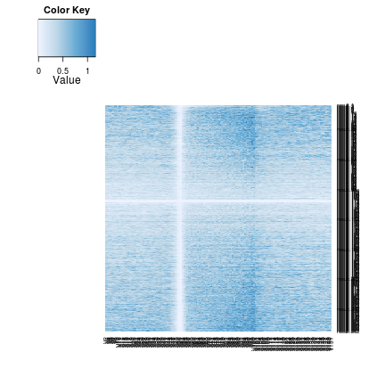 


O/TT3 - OMP gene body 5hmC ordered by OMP 5hmC pc2

```r
gg <- ggplot(ott3.omp.hmc.pos.omp.pc2.c100, aes(V1, index))
```

```
## Error: object 'ott3.omp.hmc.pos.omp.pc2.c100' not found
```

```r
gg + geom_point() + xlab("RPM") + ylab("") + theme(axis.text.y = element_blank()) + 
    coord_cartesian(xlim = c(-2, 0.5))
```

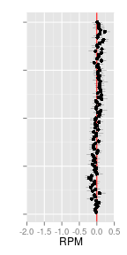 


OMP rmRNA ordered by OMP 5hmC pc2

```r
gg <- ggplot(rna.1log2.omp.pc2.c100, aes(omp, index))
gg + geom_point() + xlab("log2(FPKM + 1)") + ylab("") + theme(axis.text.y = element_blank()) + 
    coord_cartesian(xlim = c(0, 4))
```

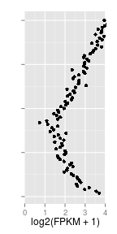 


O/TT3 rmRNA ordered by OMP 5hmC pc2

```r
gg <- ggplot(rna.1log2.omp.pc2.c100, aes(ott3, index))
gg <- gg + geom_point() + xlab("log2(FPKM + 1)") + ylab("") + theme(axis.text.y = element_blank()) + 
    coord_cartesian(xlim = c(0, 4))
gg
```

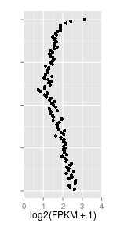 


O/TT3 - OMP rmRNA ratio ordered by OMP 5hmC pc2
#```{r "ott3_omp_rmrna_1log2_ordered_by_omp_hmc_gene_body_pc2_mean_chunks100", fig.height=4, fig.width=2, dev=c('png', 'pdf')}
theme_set(theme_gray())
gg <- ggplot(rna.1log2.omp.pc2.c100, aes(ott3.omp, index))
gg <- gg + geom_vline(xintercept=0, color="red")
gg <- gg + geom_errorbarh(aes(xmin=ott3.omp.lower, xmax=ott3.omp.upper), height=0, size=.1) + geom_point(aes(color=wilcox.FDR.05), size=2)  + xlab("log2(FPKM + 1)") + ylab("") + theme(legend.position="none", axis.text.y=element_blank()) + labs(title=c("O/Tet3-OMP ratio RNA by OMP pc2")) + scale_color_manual(values=c("red", "black"))
gg
#```


```r
MP.heat(omp.hmc.pos.ott3.pc2, range = c(0, 1.5), average = 50)
```

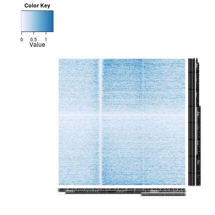 


```r
MP.heat(ott3.hmc.pos.pc2, range = c(0, 1.5), average = 50)
```

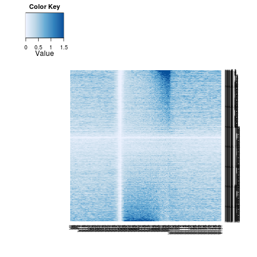 


O/TT3 - OMP gene body 5hmC ordered by O/TT3 5hmC pc2

```r
gg <- ggplot(ott3.omp.hmc.pos.ott3.pc2.c100, aes(V1, index))
```

```
## Error: object 'ott3.omp.hmc.pos.ott3.pc2.c100' not found
```

```r
gg + geom_point() + xlab("RPM") + ylab("") + theme(axis.text.y = element_blank()) + 
    coord_cartesian(xlim = c(-0.5, 1))
```

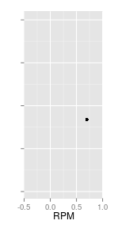 


OMP rmRNA ordered by O/TT3 5hmC pc2

```r
gg <- ggplot(rna.1log2.ott3.pc2.c100, aes(omp, index))
gg + geom_point() + xlab("log2(FPKM + 1)") + ylab("") + theme(axis.text.y = element_blank()) + 
    coord_cartesian(xlim = c(0, 4)) + labs(title = c("OMP RNA by O/Tet3 pc2"))
```

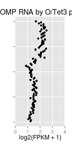 


O/TT3 rmRNA ordered by O/TT3 5hmC pc2

```r
gg <- ggplot(rna.1log2.ott3.pc2.c100, aes(ott3, index))
gg + geom_point() + xlab("log2(FPKM + 1)") + ylab("") + theme(axis.text.y = element_blank()) + 
    coord_cartesian(xlim = c(0, 4)) + labs(title = c("O/Tet3 RNA by O/Tet3 pc2"))
```

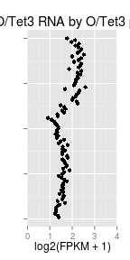 


Plot O/TT3 - OMP rmRNA ratio ordered by O/TT3 5hmC pc2
#```{r "ott3_omp_rmrna_1log2_ordered_by_ott3_hmc_gene_body_pc2_mean_chunks100", fig.height=4, fig.width=2, dev=c('png', 'pdf')}
gg <- ggplot(rna.1log2.ott3.pc2.c100, aes(ott3.omp, index))
gg <- gg + geom_vline(xintercept=0, color="red")
gg <- gg + geom_errorbarh(aes(xmin=ott3.omp.lower, xmax=ott3.omp.upper), height=0, size=.1) + geom_point(aes(color=wilcox.FDR.05), size=2) + xlab("log2(FPKM + 1)") + ylab("") + theme(legend.position="none", axis.text.y=element_blank()) + labs(title=c("O/Tet3-OMP ratio RNA by O/Tet3 pc2")) + scale_color_manual(values=c("red", "black"))
gg
#```

### 5mC heatmaps 
Load omp, o/tt3 mc gene position matrices

```r
suppressPackageStartupMessages(source("~/src/seqAnalysis/R/image.R"))
omp.mc.pos <- makeImage("omp_mc_rpkm", "gene_whole_W200N50F50_chr", data_type = "rpkm/mean", 
    image = FALSE)
```

```
## [1] "/media/storage2/analysis/profiles/norm/rpkm/mean/gene_whole_W200N50F50_chr/images/omp_mc_rpkm"
```

```r
ott3.mc.pos <- makeImage("ott3_1_mc_rpkm", "gene_whole_W200N50F50_chr", data_type = "rpkm/mean", 
    image = FALSE)
```

```
## [1] "/media/storage2/analysis/profiles/norm/rpkm/mean/gene_whole_W200N50F50_chr/images/ott3_1_mc_rpkm"
```

```r

# Matrix means
omp.mean <- mean(omp.mc.pos, na.rm = TRUE)
ott3.mean <- mean(ott3.mc.pos, na.rm = TRUE)

# Scale
omp.mc.pos <- omp.mc.pos - omp.mean
ott3.mc.pos <- ott3.mc.pos - ott3.mean

ott3.omp.mc.pos <- ott3.mc.pos - omp.mc.pos
```


Principal components analysis on gene body to order

```r
omp.mc.pos.pc <- prcomp(omp.mc.pos[, 51:100])
ott3.mc.pos.pc <- prcomp(ott3.mc.pos[, 51:100])
omp.mc.pos.pred <- predict(omp.mc.pos.pc, omp.mc.pos[, 51:100])
ott3.mc.pos.pred <- predict(ott3.mc.pos.pc, ott3.mc.pos[, 51:100])

omp.mc.pos.pc1 <- omp.mc.pos[match(rownames(omp.mc.pos.pred[order(omp.mc.pos.pred[, 
    1]), ]), rownames(omp.mc.pos)), ]
ott3.mc.pos.pc1 <- ott3.mc.pos[match(rownames(ott3.mc.pos.pred[order(ott3.mc.pos.pred[, 
    1]), ]), rownames(ott3.mc.pos)), ]
ott3.mc.pos.omp.pc1 <- ott3.mc.pos[match(rownames(omp.mc.pos.pred[order(omp.mc.pos.pred[, 
    1]), ]), rownames(ott3.mc.pos)), ]
```


Ordering

```r
omp.mc.pos.omp.hmc.pc1 <- omp.mc.pos[match(rownames(omp.hmc.pos.pred[order(omp.hmc.pos.pred[, 
    1]), ]), rownames(omp.mc.pos)), ]
ott3.mc.pos.omp.hmc.pc1 <- ott3.mc.pos[match(rownames(omp.hmc.pos.pred[order(omp.hmc.pos.pred[, 
    1]), ]), rownames(ott3.mc.pos)), ]
ott3.omp.mc.pos.omp.hmc.pc1 <- ott3.omp.mc.pos[match(rownames(omp.hmc.pos.pred[order(omp.hmc.pos.pred[, 
    1]), ]), rownames(ott3.omp.mc.pos)), ]
omp.mc.pos.ott3.hmc.pc1 <- omp.mc.pos[match(rownames(ott3.hmc.pos.pred[order(ott3.hmc.pos.pred[, 
    1]), ]), rownames(omp.mc.pos)), ]
ott3.mc.pos.ott3.hmc.pc1 <- ott3.mc.pos[match(rownames(ott3.hmc.pos.pred[order(ott3.hmc.pos.pred[, 
    1]), ]), rownames(ott3.mc.pos)), ]
ott3.omp.mc.pos.ott3.hmc.pc1 <- ott3.omp.mc.pos[match(rownames(omp.hmc.pos.pred[order(omp.hmc.pos.pred[, 
    1]), ]), rownames(ott3.omp.mc.pos)), ]
```


Compare orders with RNA

```r
rna.1log2.omp.pc1 <- na.omit(rna.1log2[match(rownames(omp.mc.pos.pc1), rownames(rna.1log2)), 
    ])
rna.1log2.ott3.pc1 <- na.omit(rna.1log2[match(rownames(ott3.mc.pos.pc1), rownames(rna.1log2)), 
    ])
```


Group in 100 chunks

```r
ott3.omp.mc.pos.omp.hmc.pc1.c100 <- foreach(c = isplitRows(ott3.omp.mc.pos.omp.hmc.pc1[, 
    51:100], chunks = 100), .combine = "rbind") %do% mean(c, na.rm = TRUE)
ott3.omp.mc.pos.omp.hmc.pc1.c100 <- as.data.frame(ott3.omp.mc.pos.omp.hmc.pc1.c100)
ott3.omp.mc.pos.omp.hmc.pc1.c100$index <- 100:1
ott3.omp.mc.pos.ott3.hmc.pc1.c100 <- foreach(c = isplitRows(ott3.omp.mc.pos.ott3.hmc.pc1[, 
    51:100], chunks = 100), .combine = "rbind") %do% mean(c, na.rm = TRUE)
ott3.omp.mc.pos.ott3.hmc.pc1.c100 <- as.data.frame(ott3.omp.mc.pos.ott3.hmc.pc1.c100)
ott3.omp.mc.pos.ott3.hmc.pc1.c100$index <- 100:1
rna.1log2.omp.pc1.c100 <- foreach(c = isplitRows(rna.1log2.omp.pc1[, 1:2], chunks = 100), 
    .combine = "rbind") %do% apply(c, 2, mean, na.rm = TRUE)
rna.1log2.omp.pc1.c100 <- as.data.frame(rna.1log2.omp.pc1.c100)
rna.1log2.omp.pc1.c100$index <- 100:1
rna.1log2.ott3.pc1.c100 <- foreach(c = isplitRows(rna.1log2.ott3.pc1[, 1:2], 
    chunks = 100), .combine = "rbind") %do% apply(c, 2, mean, na.rm = TRUE)
rna.1log2.ott3.pc1.c100 <- as.data.frame(rna.1log2.ott3.pc1.c100)
rna.1log2.ott3.pc1.c100$index <- 100:1
```


#### Plot heatmaps


```r
MP.heat(omp.mc.pos.omp.hmc.pc1, range = c(-0.5, 0.5), average = 50, density = "density")
```

```
## Warning: no non-missing arguments to max; returning -Inf
```

```
## Warning: no non-missing arguments to max; returning -Inf
```

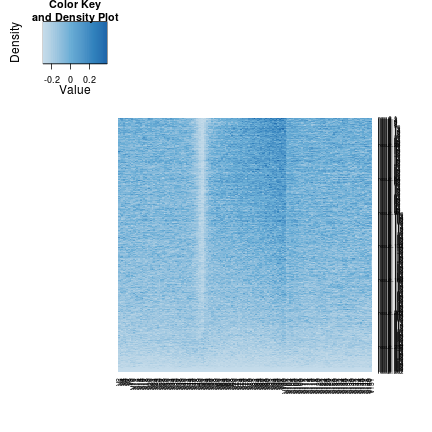 


```r
MP.heat(ott3.mc.pos.omp.hmc.pc1, range = c(-0.5, 0.5), average = 50)
```

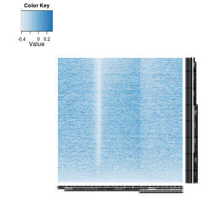 


O/TT3 - OMP gene body 5mC ordered by OMP 5hmC PC1

```r
gg <- ggplot(ott3.omp.mc.pos.omp.hmc.pc1.c100, aes(V1, index))
gg + geom_point() + xlab("RPM") + ylab("") + theme(axis.text.y = element_blank())
```

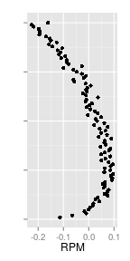 


Combine 5hmC and 5mC indices

```r
ott3.hmc.mc.pos.omp.hmc.pc1.c100 <- data.frame(hmc = ott3.hmc.pos.omp.pc1.c100[, 
    1], mc = ott3.mc.pos.omp.hmc.pc1.c100[, 1], index = ott3.mc.pos.omp.hmc.pc1.c100[, 
    2])
```

```
## Error: object 'ott3.hmc.pos.omp.pc1.c100' not found
```

```r
ott3.hmc.mc.pos.omp.hmc.pc1.c100.m <- melt(ott3.hmc.mc.pos.omp.hmc.pc1.c100, 
    id.vars = c("index"), measure.vars = c("hmc", "mc"))
```

```
## Error: object 'ott3.hmc.mc.pos.omp.hmc.pc1.c100' not found
```

```r
ott3.omp.hmc.mc.pos.omp.hmc.pc1.c100 <- data.frame(hmc = ott3.omp.hmc.pos.omp.pc1.c100[, 
    1], mc = ott3.omp.mc.pos.omp.hmc.pc1.c100[, 1], index = ott3.omp.mc.pos.omp.hmc.pc1.c100[, 
    2])
ott3.omp.hmc.mc.pos.omp.hmc.pc1.c100.m <- melt(ott3.omp.hmc.mc.pos.omp.hmc.pc1.c100, 
    id.vars = c("index"), measure.vars = c("hmc", "mc"))
```


Plot together

```r
gg <- ggplot(ott3.omp.hmc.mc.pos.omp.hmc.pc1.c100.m, aes(value, index, color = variable))
gg + geom_point() + facet_grid(. ~ variable)
```

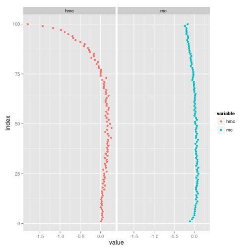 


```r
MP.heat(omp.mc.pos.ott3.hmc.pc1, range = c(0, 1), average = 50)
```

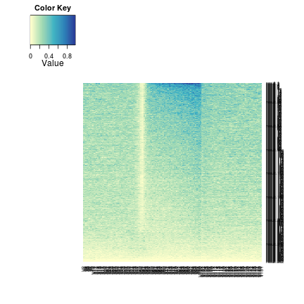 


```r
MP.heat(ott3.mc.pos.ott3.hmc.pc1, range = c(0, 1), average = 50)
```

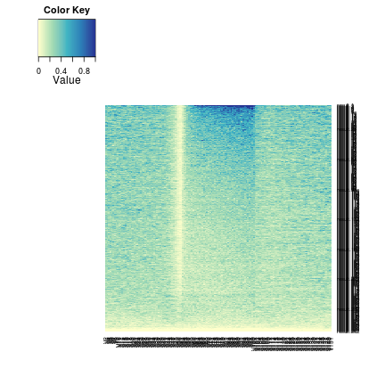 


O/TT3 - OMP gene body 5hmC ordered by O/TT3 5hmC PC1

```r
gg <- ggplot(ott3.omp.mc.pos.ott3.hmc.pc1.c100, aes(V1, index))
gg + geom_point() + xlab("RPM") + ylab("") + theme(axis.text.y = element_blank()) + 
    coord_cartesian(xlim = c(-0.5, 0.5))
```

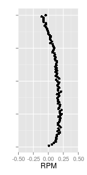 


Plot OMP

```r
gg <- ggplot(rna.1log2.omp.pc1.c100, aes(omp, index))
gg + geom_point() + xlab("log2(FPKM + 1)") + ylab("") + theme(axis.text.y = element_blank())
```

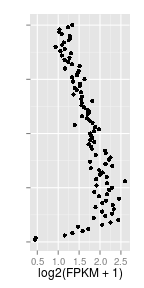 


Plot O/TT3

```r
gg <- ggplot(rna.1log2.ott3.pc1.c100, aes(ott3, index))
gg + geom_point() + xlab("log2(FPKM + 1)") + ylab("") + theme(axis.text.y = element_blank())
```

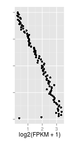 


Order by 5hmC PC1

```r
omp.mc.pos.hmc.pc1 <- omp.mc.pos[match(rownames(omp.hmc.pos.pred[order(omp.hmc.pos.pred[, 
    1]), ]), rownames(omp.mc.pos)), ]
ott3.mc.pos.hmc.pc1 <- ott3.mc.pos[match(rownames(ott3.hmc.pos.pred[order(ott3.hmc.pos.pred[, 
    1]), ]), rownames(ott3.mc.pos)), ]
```

Plot heatmaps

```r
MP.heat(omp.mc.pos.hmc.pc1, range = c(0, 1), average = 50)
```

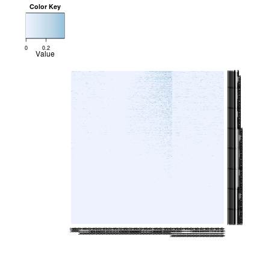 


```r
MP.heat(ott3.mc.pos.hmc.pc1, range = c(0, 1), average = 50)
```

 


#### Order by rmRNA levels


```r
comb.omp <- comb[order(-comb$rmrna.omp), ]
comb.ott3 <- comb[order(-comb$rmrna.tt3), ]
omp.hmc.pos.omp.rmrna <- omp.hmc.pos[match(rownames(comb.omp), rownames(omp.hmc.pos)), 
    ]
ott3.hmc.pos.ott3.rmrna <- ott3.hmc.pos[match(rownames(comb.ott3), rownames(ott3.hmc.pos)), 
    ]
omp.mc.pos.omp.rmrna <- omp.mc.pos[match(rownames(comb.omp), rownames(omp.mc.pos)), 
    ]
ott3.mc.pos.ott3.rmrna <- ott3.mc.pos[match(rownames(comb.ott3), rownames(ott3.mc.pos)), 
    ]
```


Plot heatmaps

```r
MP.heat(omp.hmc.pos.omp.rmrna, range = c(0, 1), average = 50)
```

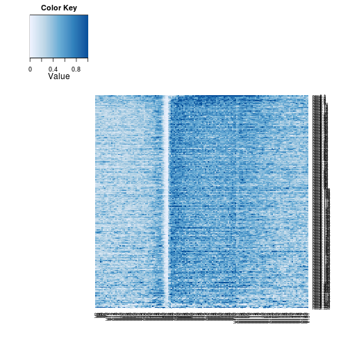 


```r
MP.heat(ott3.hmc.pos.ott3.rmrna, range = c(0, 1), average = 50)
```

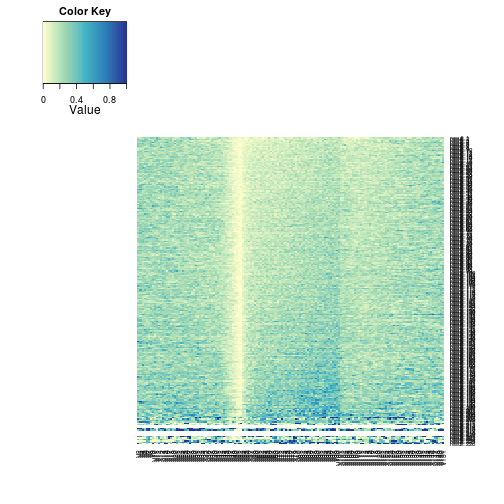 


```r
MP.heat(omp.mc.pos.omp.rmrna, range = c(0, 1), average = 50)
```

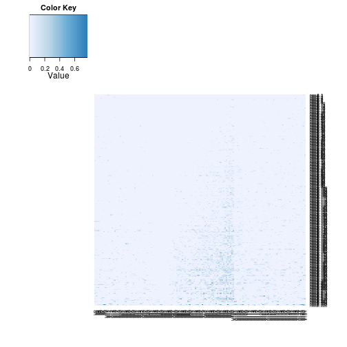 


```r
MP.heat(ott3.mc.pos.ott3.rmrna, range = c(0, 1), average = 50)
```

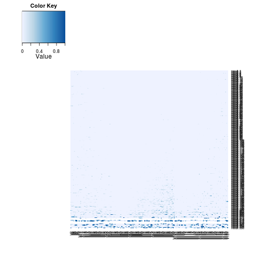 


### TSS levels

Read in 5mC/5hmC levels for -500 bp to +500 bp around TSS

```r
tss <- read.delim("~/s2/analysis/features/norm/rpkm/mean/summaries/tt3_min_refgene_-500bpTSS+500bp_chr_sqrt")
comb$hmc.omp.tss <- tss[match(rownames(comb), rownames(tss)), 1]
comb$hmc.ott3.tss <- tss[match(rownames(comb), rownames(tss)), 2]
comb <- na.omit(comb)
cor(comb[, c("rmrna.omp", "rmrna.tt3", "hmc.omp.tss", "hmc.ott3.tss")], method = "spearman")
```

```
##              rmrna.omp rmrna.tt3 hmc.omp.tss hmc.ott3.tss
## rmrna.omp       1.0000   0.84703    -0.11240      -0.1943
## rmrna.tt3       0.8470   1.00000    -0.09232      -0.2098
## hmc.omp.tss    -0.1124  -0.09232     1.00000       0.4605
## hmc.ott3.tss   -0.1943  -0.20983     0.46051       1.0000
```


