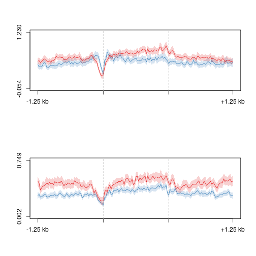

Omp-tTA X tetO-Tet3 ribominus-RNA analysis
========================================================

Extract FPKM values from Cuffdiff output

```r
cd <- read.delim("~/s2/data/rna/cuffdiff/omp_ott3_rmrna/gene_exp.diff")
cd.fc2 <- cd[abs(cd$log2.fold_change.) >= 2, ]
cd.fc2.fpkm1 <- cd.fc2[cd.fc2$value_1 >= 1 | cd.fc2$value_2 >= 1, ]
```


Write differential beds

```r
bed <- read.delim("/seq/lib/roi/refgene_nodup.bed", header = FALSE)
write.table(bed[bed[, 4] %in% cd.fc2.fpkm1$gene[cd.fc2.fpkm1$log2.fold_change. > 
    0], ], file = "omp_ott3_rmrna_cuffdiff_log2fc_ge2_fpkm1.bed", quote = FALSE, 
    sep = "\t", row.names = FALSE, col.names = F)
write.table(bed[bed[, 4] %in% cd.fc2.fpkm1$gene[cd.fc2.fpkm1$log2.fold_change. < 
    0], ], file = "omp_ott3_rmrna_cuffdiff_log2fc_ltm2_fpkm1.bed", quote = FALSE, 
    sep = "\t", row.names = FALSE, col.names = F)
```


Write differential gene annotation files
```
rg.anno <- read.delim("~/lib/annotations/gene_whole_W200N50F50", header=F)
rg.anno.up <- rg.anno[rg.anno[,4] %in% cd.fc2.fpkm1$gene[cd.fc2.fpkm1$log2.fold_change.>0],]
rg.anno.down <- rg.anno[rg.anno[,4] %in% cd.fc2.fpkm1$gene[cd.fc2.fpkm1$log2.fold_change.<0],]
write.table(rg.anno.up, file="~/lib/annotations_hires/gene_whole_W200N50F50_omp_ott3_rmrna_log2fc_ge2_fpkm1.bed", quote=F, sep="\t", row.names=F, col.names=F)
write.table(rg.anno.down, file="~/lib/annotations_hires/gene_whole_W200N50F50_omp_ott3_rmrna_log2fc_lem2_fpkm1.bed", quote=F, sep="\t", row.names=F, col.names=F)

```

Group with OMP and O/TT3 5hmC, 5mC. In terminal,
```
group.py
```

Make profiles

```r
suppressPackageStartupMessages(source("~/src/seqAnalysis/R/profiles2.R"))
makeProfile2.allSamp("gene_whole_W200N50F50_omp_ott3_rmrna_log2fc_ge2_fpkm1.bed_chr", 
    data_type = "rpkm/mean")
```

```
## [1] "/media/storage2/analysis/profiles/norm/rpkm/mean/gene_whole_W200N50F50_omp_ott3_rmrna_log2fc_ge2_fpkm1.bed_chr"
## Note: next may be used in wrong context: no loop is visible
```

```
## Error: task 1 failed - "no loop for break/next, jumping to top level"
```

```r
makeProfile2.allSamp("gene_whole_W200N50F50_omp_ott3_rmrna_log2fc_lem2_fpkm1.bed_chr", 
    data_type = "rpkm/mean")
```

```
## [1] "/media/storage2/analysis/profiles/norm/rpkm/mean/gene_whole_W200N50F50_omp_ott3_rmrna_log2fc_lem2_fpkm1.bed_chr"
## Note: next may be used in wrong context: no loop is visible
```

```
## Error: task 1 failed - "no loop for break/next, jumping to top level"
```


Plot

```r
plot2.several(annotation = "gene_whole_W200N50F50_omp_ott3_rmrna_log2fc_ge2_fpkm1.bed_chr", 
    set = "tt3_3", data_type = "rpkm/mean", cols = col2, fname = "manual")
```

```
## [1] -0.054  1.230
```

```
## [1] 0.002 0.749
```

 


```r
plot2.several(annotation = "gene_whole_W200N50F50_omp_ott3_rmrna_log2fc_lem2_fpkm1.bed_chr", 
    set = "tt3_3", data_type = "rpkm/mean", cols = col2, fname = "manual")
```

```
## [1] -0.285  1.867
```

```
## [1] -0.048  0.737
```

 


