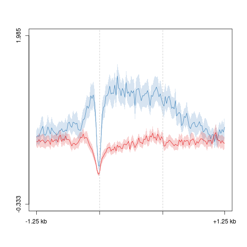
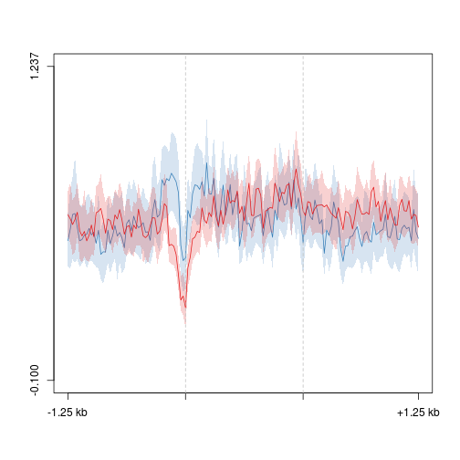
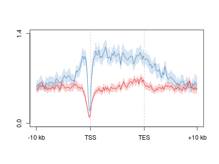
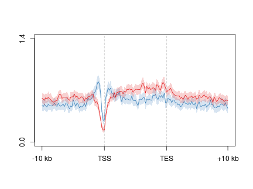

Omp-tTA X tetO-Tet3 ribominus-RNA analysis - replicates
========================================================

### Extract cuffdiff significant genes and write BEDs

```
gene <- read.delim("~/s2/data/rna/cuffdiff/omp_ott3_rmrna_rep12_masked_uq_comp_js/gene_exp.diff")
gene.sig <- gene[gene$significant=="yes",]
gene.sig.up <- gene.sig[gene.sig$log2.fold_change.>0,]
gene.sig.down <- gene.sig[gene.sig$log2.fold_change.<0,]

gene.anno <- read.delim("~/lib/annotations_hires/gene_whole_W200N50F50", header=F)
gene.anno.down <- gene.anno[gene.anno[,4] %in% gene.sig.down$gene,]
gene.anno.up <- gene.anno[gene.anno[,4] %in% gene.sig.up$gene,]
write.table(gene.anno.up, file="~/lib/annotations_hires/gene_whole_W200N50F50_omp_ott3_rmrna_rep12_sig_up", quote=F, sep="\t", row.names=F,col.names=F)
write.table(gene.anno.down, file="~/lib/annotations_hires/gene_whole_W200N50F50_omp_ott3_rmrna_rep12_sig_down", quote=F, sep="\t", row.names=F,col.names=F)
```

#### Profiles

```r
suppressPackageStartupMessages(source("~/src/seqAnalysis/R/profiles2.R"))
```


```r
makeProfile2.allSamp("gene_whole_W200N50F50_omp_ott3_rmrna_rep12_sig_up_chr", 
    data_type = "rpkm_rep/mean", rm.outliers = 0.01, rep = T)
```

```
## [1] "/media/storage2/analysis/profiles/norm/rpkm_rep/mean/gene_whole_W200N50F50_omp_ott3_rmrna_rep12_sig_up_chr"
## Note: next may be used in wrong context: no loop is visible
```

```
## Error: task 2 failed - "no loop for break/next, jumping to top level"
```

```r
makeProfile2.allSamp("gene_whole_W200N50F50_omp_ott3_rmrna_rep12_sig_down_chr", 
    data_type = "rpkm_rep/mean", rm.outliers = 0.01, rep = T)
```

```
## [1] "/media/storage2/analysis/profiles/norm/rpkm_rep/mean/gene_whole_W200N50F50_omp_ott3_rmrna_rep12_sig_down_chr"
## Note: next may be used in wrong context: no loop is visible
```

```
## Error: task 2 failed - "no loop for break/next, jumping to top level"
```


```r
plot2.several("gene_whole_W200N50F50_omp_ott3_rmrna_rep12_sig_down_chr", "tt3_rep", 
    data_type = "rpkm_rep/mean", group2 = "trim0.01", cols = col2)
```

```
## [1] "omp_hmc_rep1_mean_omp_hmc_rep2_trim0.01"
## [1] "omp_hmc_rep1_mean_omp_hmc_rep2_trim0.01_mean"
## [1] "ott3_hmc_rep1_mean_ott3_hmc_rep2_trim0.01"
## [1] "ott3_hmc_rep1_mean_ott3_hmc_rep2_trim0.01_mean"
```

 

```
## [1] -0.333  1.985
```


```r
plot2.several("gene_whole_W200N50F50_omp_ott3_rmrna_rep12_sig_up_chr", "tt3_rep", 
    data_type = "rpkm_rep/mean", group2 = "trim0.01", cols = col2)
```

```
## [1] "omp_hmc_rep1_mean_omp_hmc_rep2_trim0.01"
## [1] "omp_hmc_rep1_mean_omp_hmc_rep2_trim0.01_mean"
## [1] "ott3_hmc_rep1_mean_ott3_hmc_rep2_trim0.01"
## [1] "ott3_hmc_rep1_mean_ott3_hmc_rep2_trim0.01_mean"
```

 

```
## [1] -0.100  1.237
```


#### Bayes factor based

```r
gene.bf <- read.delim("~/s2/analysis/rna/summaries/omp_ott3_rmrna_rep12_masked_comp_js_1log2_bf.txt", 
    header = F)
gene.bf.ge20 <- gene.bf[gene.bf[, 2] >= 20, ]
dim(gene.bf.ge20)
```

```
## [1] 1621    2
```

```r
gene.bf.le20 <- gene.bf[gene.bf[, 2] <= (-20), ]
dim(gene.bf.le20)
```

```
## [1] 938   2
```

```r
write.table(gene.anno[gene.anno[, 4] %in% gene.bf.ge20[, 1], ], file = "~/lib/annotations_hires/gene_whole_W200N50F50_omp_ott3_rmrna_rep12_bf_ge20", 
    quote = F, sep = "\t", row.names = F, col.names = F)
```

```
## Error: object 'gene.anno' not found
```

```r
write.table(gene.anno[gene.anno[, 4] %in% gene.bf.le20[, 1], ], file = "~/lib/annotations_hires/gene_whole_W200N50F50_omp_ott3_rmrna_rep12_bf_le20", 
    quote = F, sep = "\t", row.names = F, col.names = F)
```

```
## Error: object 'gene.anno' not found
```


```r
makeProfile2.allSamp("gene_whole_W200N50F50_omp_ott3_rmrna_rep12_bf_ge20_chr", 
    data_type = "rpkm/mean", rm.outliers = 0.01, rep = T)
```

```
## [1] "/media/storage2/analysis/profiles/norm/rpkm/mean/gene_whole_W200N50F50_omp_ott3_rmrna_rep12_bf_ge20_chr"
## Note: next may be used in wrong context: no loop is visible
```

```
## Error: task 1 failed - "no loop for break/next, jumping to top level"
```

```r
makeProfile2.allSamp("gene_whole_W200N50F50_omp_ott3_rmrna_rep12_bf_le20_chr", 
    data_type = "rpkm/mean", rm.outliers = 0.01, rep = T)
```

```
## [1] "/media/storage2/analysis/profiles/norm/rpkm/mean/gene_whole_W200N50F50_omp_ott3_rmrna_rep12_bf_le20_chr"
## Note: next may be used in wrong context: no loop is visible
```

```
## Error: task 1 failed - "no loop for break/next, jumping to top level"
```


```r
plot2.several("gene_whole_W200N50F50_omp_ott3_rmrna_rep12_bf_ge20_chr", "tt3_rep", 
    data_type = "rpkm/mean", group2 = "trim0.01", cols = col2, y.vals = c(0, 
        1.4), wsize = 200, lab = c("TSS", "TES"))
```

```
## [1] "omp_hmc_rep1_mean_omp_hmc_rep2_trim0.01"
## [1] "omp_hmc_rep1_mean_omp_hmc_rep2_trim0.01_mean"
## [1] "ott3_hmc_rep1_mean_ott3_hmc_rep2_trim0.01"
## [1] "ott3_hmc_rep1_mean_ott3_hmc_rep2_trim0.01_mean"
```

 

```
## [1] 0.0 1.4
```


```r
plot2.several("gene_whole_W200N50F50_omp_ott3_rmrna_rep12_bf_le20_chr", "tt3_rep", 
    data_type = "rpkm/mean", group2 = "trim0.01", cols = col2, y.vals = c(0, 
        1.4), wsize = 200, lab = c("TSS", "TES"))
```

```
## [1] "omp_hmc_rep1_mean_omp_hmc_rep2_trim0.01"
## [1] "omp_hmc_rep1_mean_omp_hmc_rep2_trim0.01_mean"
## [1] "ott3_hmc_rep1_mean_ott3_hmc_rep2_trim0.01"
## [1] "ott3_hmc_rep1_mean_ott3_hmc_rep2_trim0.01_mean"
```

 

```
## [1] 0.0 1.4
```

