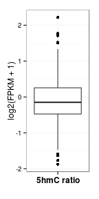
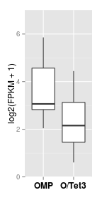

OMP-tTA x TetO-Tet3 rmRNA analysis - olfactory receptors
========================================================


```r
rna.1log2 <- readRDS("~/s2/analysis/rna/rdata/omp_ott3_rmrna_1log2.rds")
par(mfrow = c(1, 3))
a <- apply(rna.1log2, 2, function(x) plot(density(x)))
```

 


Scatter OMP and O/TT3 log2(FPKM+1).


```r
library(ggplot2)
library(reshape)
```

```
## Loading required package: plyr
```

```
## Attaching package: 'reshape'
```

```
## The following object(s) are masked from 'package:plyr':
## 
## rename, round_any
```

```r
gg <- ggplot(rna.1log2, aes(omp, ott3))
gg + geom_point(alpha = I(1/10)) + geom_abline(slope = 1, intercept = 0, linetype = 2)
```

 


#### Scatter with ORs highlighted

```r
rna.1log2$or <- "Non-OR"
rna.1log2$or[grep("Olfr", rownames(rna.1log2))] <- "OR"
rna.1log2$ps <- "Non-pseudo"
rna.1log2$ps[grep("-ps", rownames(rna.1log2))] <- "pseudo"
```


```r
gg <- ggplot(rna.1log2, aes(omp, ott3, color = or))
gg <- gg + geom_point(alpha = I(1/5)) + geom_abline(slope = 1, intercept = 0, 
    linetype = 2) + scale_color_manual(name = "", values = c("black", "red"))
gg + theme(legend.position = c(0.75, 0.25)) + coord_cartesian(xlim = c(0, 15), 
    ylim = c(0, 15)) + ylab("O/TT3 log2(FPKM + 1)") + xlab("OMP log2(FPKM  + 1)")
```

 


#### Scatter, just ORs with pseudo highlighted

```r
gg <- ggplot(rna.1log2[rna.1log2$or == "OR", ], aes(omp, ott3, color = ps))
gg <- gg + geom_point(alpha = I(1/2)) + geom_abline(slope = 1, intercept = 0, 
    linetype = 2) + scale_color_manual(name = "", values = c("black", "red"))
gg + ylab("O/TT3 log2(FPKM + 1)") + xlab("OMP log2(FPKM  + 1") + theme(legend.position = c(0.25, 
    0.75))
```

 


#### ORs that increase expression

```r
rna.1log2[rna.1log2$or == "OR" & rna.1log2$ott3.omp > 0, ]
```

```
##                  omp    ott3 ott3.omp or         ps
## Olfr1027-ps1 0.07420 0.22165  0.14745 OR     pseudo
## Olfr1165-ps  0.03733 0.06980  0.03248 OR     pseudo
## Olfr1267-ps1 0.03827 0.13973  0.10146 OR     pseudo
## Olfr1373     0.00000 0.07107  0.07107 OR Non-pseudo
## Olfr1380     0.18021 0.26463  0.08442 OR Non-pseudo
## Olfr1441     0.00000 0.05970  0.05970 OR Non-pseudo
## Olfr18       0.00000 0.16110  0.16110 OR Non-pseudo
## Olfr282      0.03837 0.20532  0.16696 OR Non-pseudo
## Olfr399      0.03504 0.06554  0.03050 OR Non-pseudo
## Olfr485      0.03761 0.13737  0.09977 OR Non-pseudo
## Olfr507      0.03728 0.13622  0.09894 OR Non-pseudo
## Olfr612      0.17319 0.31173  0.13854 OR Non-pseudo
## Olfr613      3.61569 3.96633  0.35064 OR Non-pseudo
## Olfr682-ps1  0.00000 0.14545  0.14545 OR     pseudo
## Olfr748      0.03856 0.07210  0.03354 OR Non-pseudo
```


Melt data frame, plot OR boxplot
#```{r, fig.width=4, fig.height=6}
#library(reshape2)
#rna.1log2.m <- melt(rna.1log2, id.vars=c("or"))
#rna.1log2.m$id <- rownames(rna.1log2)
#gg <- ggplot(rna.1log2.m[rna.1log2.m$variable!="ott3.omp",], aes(variable, value))
#gg + geom_boxplot() + facet_grid(.~or) + coord_cartesian(ylim=c(0,5)) + ylab("log2(FPKM+1") + xlab("")
#```

Guidance molecule expression
------------------

Construct curated list of guidance molecules containing
  * Ephrins
  * Ephrin receptors
  * Dscam
  * Nephrin
  * Kirrels
  * Neuropilins
  * Semaphorins
  * Protocadherins
  

```r
gm <- c("Eph", "Efn", "Dscam", "Nphs", "Kirrel", "Nrp", "Sema", "Pchda", "Pchdb", 
    "Pchdg")

# Rownames as variable for plyr function
rna.1log2 <- namerows(rna.1log2)
rna.1log2.gm <- ldply(gm, function(x) rna.1log2[grep(x, rna.1log2$id), ])
```


Filter for OMP expressed genes, i.e. log2(FPKM+1) >= 2

```r
rna.1log2.gm.ex <- rna.1log2.gm[rna.1log2.gm$omp >= 2, ]
rna.1log2.gm.ex.m <- melt(rna.1log2.gm.ex)
```

```
## Using or, ps, id as id variables
```

```r
levels(rna.1log2.gm.ex.m$variable) <- c("OMP", "O/Tet3", "O/Tet3 - OMP")
```


Plot boxplot

```r
gg <- ggplot(rna.1log2.gm.ex.m[rna.1log2.gm.ex.m$variable != "O/Tet3 - OMP", 
    ], aes(variable, value))
gg + geom_boxplot() + xlab("") + ylab("log2(FPKM + 1)") + theme(axis.text.x = element_text(size = 12, 
    face = "bold", color = "black"))
```

 

```r
last_plot() + coord_cartesian(ylim = c(0, 7))
```

 


Wilcoxon test

```r
wilcox.test(rna.1log2.gm.ex$omp, rna.1log2.gm.ex$ott3)
```

```
## 
## 	Wilcoxon rank sum test
## 
## data:  rna.1log2.gm.ex$omp and rna.1log2.gm.ex$ott3 
## W = 250, p-value = 0.004645
## alternative hypothesis: true location shift is not equal to 0
```


OR 5hmC/5mC levels
-------------------


```r
feat <- read.delim("~/s2/analysis/features/norm/rpkm/mean/summaries/tt3_min_refgene_chr_sqrt")
feat.or <- feat[grep("Olfr", rownames(feat)), ]
boxplot(feat.or)
```

 


