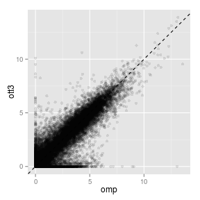
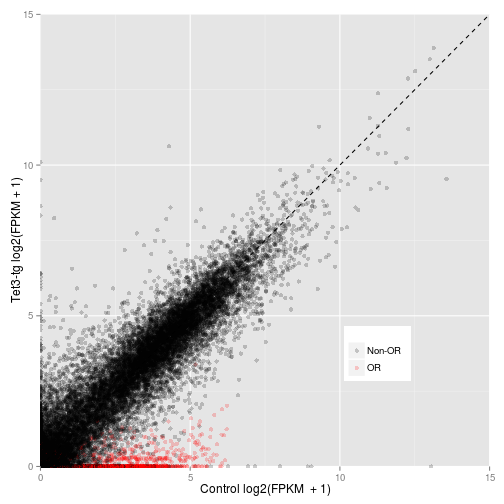
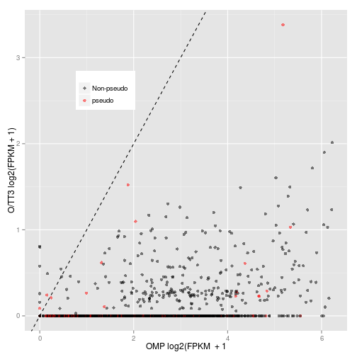
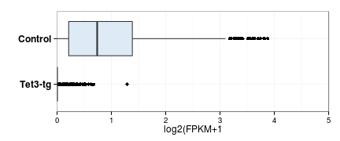
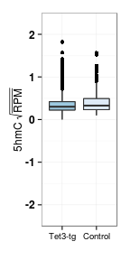
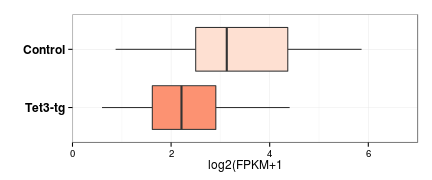
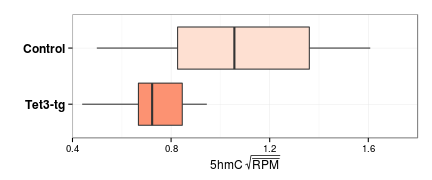
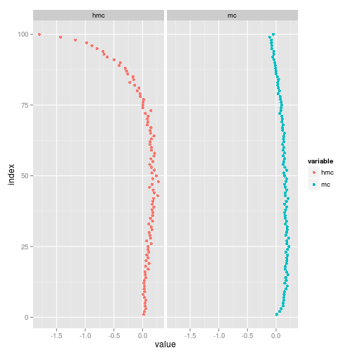

OMP-tTA x TetO-Tet3 rmRNA analysis - olfactory receptors
========================================================


```r
rna.1log2 <- readRDS("~/s2/analysis/rna/rdata/omp_ott3_rmrna_masked_uq_1log2.rds")
par(mfrow = c(1, 3))
a <- apply(rna.1log2[, 2:4], 2, function(x) plot(density(x)))
```

 


Scatter OMP and O/TT3 log2(FPKM+1).


```r
library(ggplot2)
library(reshape)
```

```
## Loading required package: plyr
```

```
## Attaching package: 'reshape'
```

```
## The following object(s) are masked from 'package:plyr':
## 
## rename, round_any
```

```r
gg <- ggplot(rna.1log2, aes(omp, ott3))
gg + geom_point(alpha = I(1/10)) + geom_abline(slope = 1, intercept = 0, linetype = 2)
```

 


#### Scatter with ORs highlighted

```r
rna.1log2$or <- "Non-OR"
rna.1log2$or[grep("Olfr", rna.1log2$gene)] <- "OR"
rna.1log2$ps <- "Non-pseudo"
rna.1log2$ps[grep("-ps", rna.1log2$gene)] <- "pseudo"
```


```r
gg <- ggplot(rna.1log2, aes(omp, ott3, color = or))
gg <- gg + geom_point(alpha = I(1/5)) + geom_abline(slope = 1, intercept = 0, 
    linetype = 2) + scale_color_manual(name = "", values = c("black", "red"))
gg + theme(legend.position = c(0.75, 0.25)) + coord_cartesian(xlim = c(0, 15), 
    ylim = c(0, 15)) + ylab("Tet3-tg log2(FPKM + 1)") + xlab("Control log2(FPKM  + 1)")
```

 


Wilcoxon test

```r
with(rna.1log2[rna.1log2$or == "OR", ], wilcox.test(omp, ott3))$p.value
```

```
## [1] 2.537e-289
```


#### Scatter, just ORs with pseudo highlighted

```r
gg <- ggplot(rna.1log2[rna.1log2$or == "OR", ], aes(omp, ott3, color = ps))
gg <- gg + geom_point(alpha = I(1/2)) + geom_abline(slope = 1, intercept = 0, 
    linetype = 2) + scale_color_manual(name = "", values = c("black", "red"))
gg + ylab("O/TT3 log2(FPKM + 1)") + xlab("OMP log2(FPKM  + 1") + theme(legend.position = c(0.25, 
    0.75))
```

 


#### ORs that increase expression

```r
rna.1log2[rna.1log2$or == "OR" & rna.1log2$ott3.omp > 0, ]
```

```
##               gene     omp    ott3 ott3.omp or         ps
## 25253      Olfr399 0.03501 0.06449  0.02948 OR Non-pseudo
## 24701  Olfr1165-ps 0.03730 0.06869  0.03139 OR     pseudo
## 25580      Olfr748 0.03853 0.07095  0.03242 OR Non-pseudo
## 24976     Olfr1441 0.00000 0.05874  0.05874 OR Non-pseudo
## 24916     Olfr1373 0.00000 0.06994  0.06994 OR Non-pseudo
## 24924     Olfr1380 0.18008 0.26067  0.08059 OR Non-pseudo
## 25344      Olfr507 0.03725 0.13409  0.09684 OR Non-pseudo
## 25325      Olfr485 0.03758 0.13523  0.09765 OR Non-pseudo
## 24804 Olfr1267-ps1 0.03824 0.13755  0.09931 OR     pseudo
## 25442      Olfr612 0.17306 0.30713  0.13407 OR Non-pseudo
## 25514  Olfr682-ps1 0.00000 0.14319  0.14319 OR     pseudo
## 25067       Olfr18 0.00000 0.15859  0.15859 OR Non-pseudo
## 25137      Olfr282 0.03834 0.20219  0.16386 OR Non-pseudo
```


### Number of expressed ORs with reduced expression

```r
rna.1log2.olfr <- rna.1log2[grep("Olfr", rna.1log2$gene), ]
rna.1log2.olfr.gt0 <- rna.1log2.olfr[rna.1log2.olfr[, 1] > 0, ]
```

```
## Warning: > not meaningful for factors
```

```r
table(rna.1log2.olfr.gt0[, 3] < 0)
```

```
## character(0)
```


Melt data frame, plot OR boxplot

```r
library(reshape2)
```

```
## Attaching package: 'reshape2'
```

```
## The following object(s) are masked from 'package:reshape':
## 
## colsplit, melt, recast
```

```r
theme_set(theme_bw())
rna.1log2.m <- melt(rna.1log2)
```

```
## Using gene, or, ps as id variables
```

```r
levels(rna.1log2.m$variable) <- c("Control", "Tet3-tg", "Tet3-tg / Control")
gg <- ggplot(rna.1log2.m[rna.1log2.m$variable != "Tet3-tg / Control" & rna.1log2.m$or == 
    "OR", ], aes(variable, value, fill = variable))
gg <- gg + geom_boxplot() + ylab("log2(FPKM+1") + xlab("") + scale_fill_brewer(palette = "Blues")
gg <- gg + theme(legend.position = "none", axis.text.y = element_text(size = 12, 
    face = "bold"))
gg <- gg + coord_flip(ylim = c(0, 5)) + scale_x_discrete(limits = rev(levels(rna.1log2.m$variable))[2:3])
gg
```

 


```r
with(rna.1log2.m[rna.1log2.m$or == "OR", ], wilcox.test(value[variable == "Control"], 
    value[variable == "Tet3-tg"]))$p.value
```

```
## [1] 2.537e-289
```


### 5hmC levels


```r
rg <- read.delim("~/s2/analysis/features/norm/rpkm/mean/summaries/tt3_min_refgene_chr_sqrt")
rg.olfr <- rg[grep("Olfr", rownames(rg)), ]
rg.olfr <- transform(rg.olfr, ott3.omp.hmc = ott3_1_hmc_rpkm/omp_hmc_120424_rpkm)
rg.olfr.dna.nz <- rg.olfr[rg.olfr[, 1] > 0, ]
wilcox.test(rg.olfr.dna.nz[, 1], rg.olfr.dna.nz[, 2])
```

```
## 
## 	Wilcoxon rank sum test with continuity correction
## 
## data:  rg.olfr.dna.nz[, 1] and rg.olfr.dna.nz[, 2] 
## W = 402053, p-value = 0.000000002009
## alternative hypothesis: true location shift is not equal to 0
```


```r
rg.olfr.dna.nz.m <- melt(rg.olfr.dna.nz)
```

```
## Using as id variables
```

```r
rg.olfr.dna.nz.m$id <- rownames(rg.olfr.dna.nz)
levels(rg.olfr.dna.nz.m$variable) <- c("Control", "Tet3-tg", "Tet3-tg 2 5hmC", 
    "Control 5mC", "Tet3-tg 5mC", "Tet3-tg 2 5mC", "5hmC ratio")
rg.olfr.dna.nz.m.hmc <- rg.olfr.dna.nz.m[rg.olfr.dna.nz.m$variable %in% c("Control", 
    "Tet3-tg"), ]
rg.olfr.dna.nz.m.hmc$or <- "OR"
```


```r

gg <- ggplot(rg.olfr.dna.nz.m.hmc, aes(variable, value, fill = variable))
gg <- gg + geom_boxplot(outlier.size = 0) + coord_cartesian(ylim = c(0, 1)) + 
    scale_fill_brewer(palette = "Blues") + xlab("") + ylab(bquote(.("5hmC" ~ 
    sqrt(bar(RPM)))))
gg <- gg + theme(legend.position = "none", axis.text.y = element_text(size = 12, 
    face = "bold"))
gg <- gg + coord_flip(ylim = c(0, 1)) + scale_x_discrete(limits = rev(levels(rg.olfr.dna.nz.m.hmc$variable))[6:7])
gg
```

 


```r

gg <- ggplot(rg.olfr.both.nz.m[rg.olfr.both.nz.m$variable == "5hmC ratio", ], 
    aes(variable, log2(value)))
```

```
## Error: object 'rg.olfr.both.nz.m' not found
```

```r
gg + geom_boxplot() + coord_cartesian(ylim = c(-2.5, 2.5))
```

 


Vomeronasal receptor expression
------------------

```r
rna.1log2.vmn <- rna.1log2[grep("Vmn", rownames(rna.1log2)), ]
boxplot(rna.1log2.vmn[, 1:3])
```

```
## Warning: no non-missing arguments to min; returning Inf
```

```
## Warning: no non-missing arguments to max; returning -Inf
```

```
## Error: need finite 'ylim' values
```


Guidance molecule expression
------------------

Construct curated list of guidance molecules containing
  * Ephrins
  * Ephrin receptors
  * Dscam
  * Nephrin
  * Kirrels
  * Neuropilins
  * Semaphorins
  * Plexin
  * Protocadherins
  * Contactin
  
  

```r
gm <- c("Eph", "Efn", "Dscam", "Nphs", "Kirrel", "Nrp", "Plxn", "Sema", "Pchda", 
    "Pchdb", "Pchdg", "Ctcn", "Robo", "Slit")

# Rownames as variable for plyr function rna.1log2 <- namerows(rna.1log2)
rna.1log2$gm <- "Non-GM"
rna.1log2.gm <- ldply(gm, function(x) rna.1log2[grep(x, rna.1log2$gene), ])
rna.1log2$gm[rna.1log2$gene %in% rna.1log2.gm$gene] <- "Guidance"
```


Filter for OMP or O/Tet3 expressed genes, i.e. log2(FPKM+1) >= 2

```r
rna.1log2.ex <- rna.1log2[rna.1log2$omp >= 2 | rna.1log2$ott3 >= 2, ]
rna.1log2.ex.m <- melt(rna.1log2.ex)
```

```
## Using gene, or, ps, gm as id variables
```

```r
levels(rna.1log2.ex.m$variable) <- c("Control", "Tet3-tg", "O/Tet3 - OMP")
```


Plot boxplot

```r
gg <- ggplot(rna.1log2.ex.m[rna.1log2.ex.m$variable != "O/Tet3 - OMP" & rna.1log2.ex.m$gm == 
    "Guidance", ], aes(variable, value, fill = variable))
gg <- gg + geom_boxplot() + ylab("log2(FPKM+1") + xlab("") + scale_fill_brewer(palette = "Reds") + 
    coord_cartesian(ylim = c(0, 7))
gg <- gg + theme(legend.position = "none", axis.text.y = element_text(size = 12, 
    face = "bold"), strip.text.x = element_text(size = 12, face = "bold"))
gg <- gg + coord_flip(ylim = c(0, 7)) + scale_x_discrete(limits = rev(levels(rna.1log2.ex.m$variable))[2:3])
gg
```

 


Wilcoxon test

```r
with(rna.1log2.ex[rna.1log2.ex$gm == "Guidance", ], wilcox.test(omp, ott3))
```

```
## 
## 	Wilcoxon rank sum test
## 
## data:  omp and ott3 
## W = 576, p-value = 0.002205
## alternative hypothesis: true location shift is not equal to 0
```


#### Guidance molecule increased/decreased counts

```r
table(rna.1log2.gm.ex[, 3] < 0)
```

```
## Error: object 'rna.1log2.gm.ex' not found
```


### Guidance molecule 5hmC levels

```r

feat <- read.delim("~/s2/analysis/features/norm/rpkm/mean/summaries/tt3_min_refgene_chr_sqrt")
feat <- namerows(feat)
feat.gm <- ldply(gm, function(x) feat[grep(x, rownames(feat)), ])
feat.gm.ex <- feat.gm[feat.gm$id %in% rna.1log2.ex$gene[rna.1log2.ex$gm == "Guidance"], 
    ]
```


```r
feat.gm.ex.m <- melt(feat.gm.ex[, c(1, 2, 7)])
```

```
## Using id as id variables
```

```r
levels(feat.gm.ex.m$variable) <- c("Control", "Tet3-tg")
feat.gm.ex.m$gm <- "Guidance"
```


Plot boxplot

```r
gg <- ggplot(feat.gm.ex.m, aes(variable, value, fill = variable))
gg <- gg + geom_boxplot(outlier.size = 0) + scale_fill_brewer(palette = "Reds") + 
    xlab("") + ylab(bquote(.("5hmC" ~ sqrt(bar(RPM)))))
gg <- gg + theme(legend.position = "none", axis.text.y = element_text(size = 12, 
    face = "bold"))
gg <- gg + coord_flip(ylim = c(0.4, 1.8)) + scale_x_discrete(limits = rev(levels(feat.gm.ex.m$variable))[1:2])
gg
```

 


```r
wilcox.test(feat.gm.ex[, 1], feat.gm.ex[, 2])
```

```
## 
## 	Wilcoxon rank sum test
## 
## data:  feat.gm.ex[, 1] and feat.gm.ex[, 2] 
## W = 626, p-value = 0.00007224
## alternative hypothesis: true location shift is not equal to 0
```


OR 5hmC/5mC levels
-------------------


```r
feat <- read.delim("~/s2/analysis/features/norm/rpkm/mean/summaries/tt3_min_refgene_chr_sqrt")
feat.or <- feat[grep("Olfr", rownames(feat)), ]
rna.1log2.or <- rna.1log2[grep("Olfr", rownames(rna.1log2)), ]
comb.or <- na.omit(cbind(feat.or, rna.1log2.or[match(rownames(feat.or), rownames(rna.1log2.or)), 
    ]))
plot(density(rna.1log2.or[, 1]))
```

```
## Error: argument 'x' must be numeric
```

```r
rna.1log2.or.ex <- rna.1log2.or[rna.1log2.or[, 1] >= 1, ]
```

```
## Warning: >= not meaningful for factors
```

```r
feat.or.ex <- feat.or[rownames(feat.or) %in% rownames(rna.1log2.or.ex), ]
boxplot(feat.or.ex)
```

```
## Warning: no non-missing arguments to min; returning Inf
```

```
## Warning: no non-missing arguments to max; returning -Inf
```

```
## Error: need finite 'ylim' values
```


### Profiles

```r
suppressPackageStartupMessages(source("~/src/seqAnalysis/R/profiles2.R"))
makeProfile2.allSamp("refGene_noRandom_order_outsides2_tss_W25F200_olfr_chr", 
    data_type = "rpkm/mean")
```

```
## [1] "/media/storage2/analysis/profiles/norm/rpkm/mean/refGene_noRandom_order_outsides2_tss_W25F200_olfr_chr"
## Note: next may be used in wrong context: no loop is visible
```

```
## Error: task 1 failed - "no loop for break/next, jumping to top level"
```


```r
plot2.several("refGene_noRandom_order_outsides2_tss_W25F200_olfr_chr", "tt3_3", 
    data_type = "rpkm/mean", cols = col2, fname = "manual")
```

```
## [1] "omp_hmc_120424_rpkm_mean"
## [1] "ott3_1_hmc_rpkm_mean"
## [1] "omp_mc_rpkm_mean"
## [1] "ott3_1_mc_rpkm_mean"
```

```
## [1] 0.010 0.266
```

 

```
## [1] -0.127  0.941
```


```r
positionMatrix.all("refGene_noRandom_order_outsides2_tss_W25F200_olfr_chr", 
    data_type = "rpkm/mean")
```

```
## Error: could not find function "positionMatrix.all"
```

```r
omp <- makeImage("omp_hmc_120424_rpkm", "refGene_noRandom_order_outsides2_tss_W25F200_olfr_chr", 
    data_type = "rpkm/mean", image = F)
```

```
## Error: could not find function "makeImage"
```

```r
ott3 <- makeImage("ott3_1_hmc_rpkm", "refGene_noRandom_order_outsides2_tss_W25F200_olfr_chr", 
    data_type = "rpkm/mean", image = F)
```

```
## Error: could not find function "makeImage"
```


#```{r}
#omp.pca <- prcomp(omp[,201:240])
#omp.pred <- predict(omp.pca, omp)
#omp.ord.omp <- omp[match(rownames(omp.pred[order(omp.pred[,1]),]), rownames(omp)),]
#ott3.ord.omp <- ott3[match(rownames(omp.pred[order(omp.pred[,1]),]), rownames(ott3)),]

#omp.mean <- mean(omp, na.rm=TRUE)
#ott3.mean <- mean(ott3, na.rm=TRUE)

omp.scale <- omp - omp.mean
ott3.scale <- ott3 - ott3.mean

omp.scale.ord.omp <- omp.scale[match(rownames(omp.pred[order(omp.pred[,1]),]), rownames(omp.scale)),]
ott3.scale.ord.omp <- ott3.scale[match(rownames(omp.pred[order(omp.pred[,1]),]), rownames(ott3.scale)),]
#```

#```{r}
MP.heat(omp.scale.ord.omp, range=c(-.25, .25))
#```

#```{r}
MP.heat(ott3.ord.omp, range=c(-1, 1))
#```


