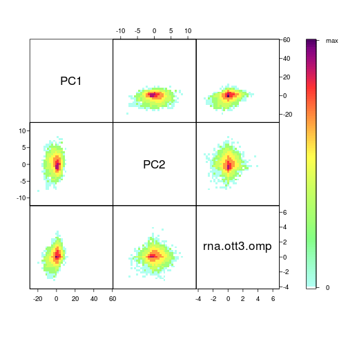

O/Tet3 rmRNA - clustering
========================================================

How general is the positive correlation between 5hmC and expression in Tet3-tg mOSNs?
Do clusters exist on against-trend genes

Cluster genes by gene body 5hmC principal componenets and rmRNA fold change

1. Prcomp on ott3 - omp difference matrix within gene body
2. Predict and extract PC1 and PC2
3. Combine with rmRNA fold change data


```r
suppressPackageStartupMessages(source("~/src/seqAnalysis/R/image.R"))
```


```r
omp.hmc.pos <- makeImage("omp_hmc_120424_rpkm", "gene_whole_W200N50F50_chr", 
    data_type = "rpkm/mean", image = FALSE)
```

```
## [1] "/media/storage2/analysis/profiles/norm/rpkm/mean/gene_whole_W200N50F50_chr/images/omp_hmc_120424_rpkm"
```

```r
ott3.hmc.pos <- makeImage("ott3_1_hmc_rpkm", "gene_whole_W200N50F50_chr", data_type = "rpkm/mean", 
    image = FALSE)
```

```
## [1] "/media/storage2/analysis/profiles/norm/rpkm/mean/gene_whole_W200N50F50_chr/images/ott3_1_hmc_rpkm"
```

```r
ott3.omp.hmc.pos <- ott3.hmc.pos - omp.hmc.pos
```


```r
ott3.omp.hmc.pos.pc <- prcomp(ott3.omp.hmc.pos[, 51:100])
ott3.omp.hmc.pos.pred <- predict(ott3.omp.hmc.pos.pc, ott3.omp.hmc.pos)
```


```r
rna <- readRDS("~/s2/analysis/rna/rdata/omp_ott3_rmrna_masked_uq_1log2.rds")
```


```r
m <- match(rownames(ott3.omp.hmc.pos.pred), rna$gene)
comb <- na.omit(cbind(ott3.omp.hmc.pos.pred[, 1:2], rna.ott3.omp = rna$ott3.omp[m]))
```


```r
cor(comb)
```

```
##                    PC1       PC2 rna.ott3.omp
## PC1           1.000000 -0.001059     0.267349
## PC2          -0.001059  1.000000     0.009919
## rna.ott3.omp  0.267349  0.009919     1.000000
```


```r
library(IDPmisc)
```

```
## Loading required package: lattice
```

```
## Attaching package: 'lattice'
```

```
## The following object(s) are masked from 'package:multicore':
## 
## parallel
```

```r
ipairs(comb, ztransf = log)
```

 


### Hierarchical clustering

```r
library(cluster)
```


```r
comb.scale <- scale(comb)
```

```
comb.eu <- dist(comb.scale)
comb.ag <- agnes(comb.eu)
saveRDS(comb.ag, file="~/s2/analysis/cluster/hclust/ott3_omp_hmc_gene_whole_body_pc1_2_rmrna_fc_eu_agnes.rds")
```

```
comb.ag.ward <- agnes(comb.eu, method="ward")
saveRDS(comb.ag, file="~/s2/analysis/cluster/hclust/ott3_omp_hmc_gene_whole_body_pc1_2_rmrna_fc_eu_agnes_ward.rds")
```

