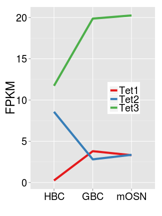
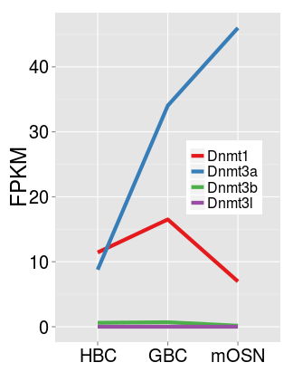

Dnmt / Tet developmental expression
========================================================

```r
library(reshape2)
cells.rna.1log2 <- read.delim("~/s2/analysis/rna/summaries/omp_ngn_icam_mrna_dup_biasCorrect_plus1_log2")
cells.rna.1log2.tet <- cells.rna.1log2[grep("Tet", rownames(cells.rna.1log2)), 
    ]
cells.rna.1log2.tet.m <- melt(cells.rna.1log2.tet)
```

```
## Using as id variables
```

```r
cells.rna.1log2.tet.m$id <- rownames(cells.rna.1log2.tet)
cells.fac <- factor(1:3, labels = c("icam", "ngn", "omp"))
cells.rna.1log2.tet.m$variable <- cells.fac[match(cells.rna.1log2.tet.m$variable, 
    as.character(cells.fac))]
levels(cells.rna.1log2.tet.m$variable) <- c("HBC", "GBC", "mOSN")
```


```r
library(ggplot2)
gg <- ggplot(cells.rna.1log2.tet.m, aes(variable, (2^value) - 1, color = id, 
    group = id))
gg <- gg + geom_line(size = 2) + scale_color_brewer(palette = "Set1")
gg <- gg + xlab("") + ylab("FPKM")
gg <- gg + theme(legend.position = c(0.75, 0.5), legend.title = element_blank(), 
    legend.text = element_text(size = 20), axis.text.x = element_text(size = 20, 
        color = "black"), axis.text.y = element_text(size = 20, color = "black"), 
    axis.title.x = element_text(size = 24), axis.title.y = element_text(size = 24))
gg
```

 


```r
library(reshape2)
cells.rna.1log2 <- read.delim("~/s2/analysis/rna/summaries/omp_ngn_icam_mrna_dup_biasCorrect_plus1_log2")
cells.rna.1log2.tet <- cells.rna.1log2[grep("Dnmt", rownames(cells.rna.1log2)), 
    ]
cells.rna.1log2.tet.m <- melt(cells.rna.1log2.tet)
```

```
## Using as id variables
```

```r
cells.rna.1log2.tet.m$id <- rownames(cells.rna.1log2.tet)
cells.fac <- factor(1:3, labels = c("icam", "ngn", "omp"))
cells.rna.1log2.tet.m$variable <- cells.fac[match(cells.rna.1log2.tet.m$variable, 
    as.character(cells.fac))]
levels(cells.rna.1log2.tet.m$variable) <- c("HBC", "GBC", "mOSN")
```


```r
library(ggplot2)
gg <- ggplot(cells.rna.1log2.tet.m, aes(variable, (2^value) - 1, color = id, 
    group = id))
gg <- gg + geom_line(size = 2) + scale_color_brewer(palette = "Set1")
gg <- gg + xlab("") + ylab("FPKM")
gg <- gg + theme(legend.position = c(0.75, 0.5), legend.title = element_blank(), 
    legend.text = element_text(size = 16), axis.text.x = element_text(size = 20, 
        color = "black"), axis.text.y = element_text(size = 20, color = "black"), 
    axis.title.x = element_text(size = 24), axis.title.y = element_text(size = 24))
gg
```

 

